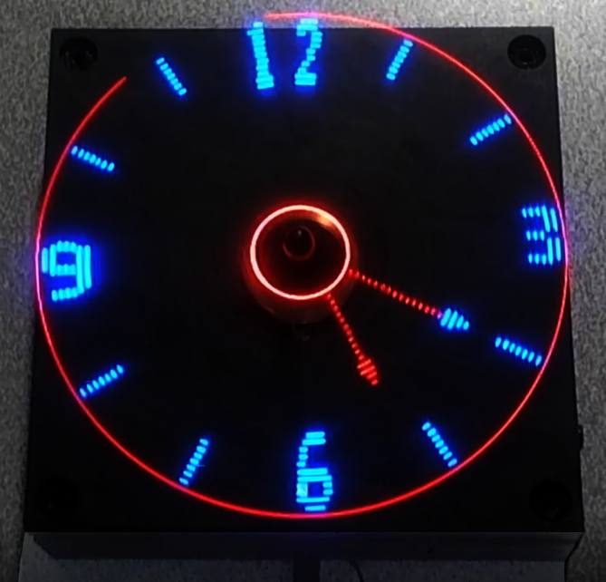
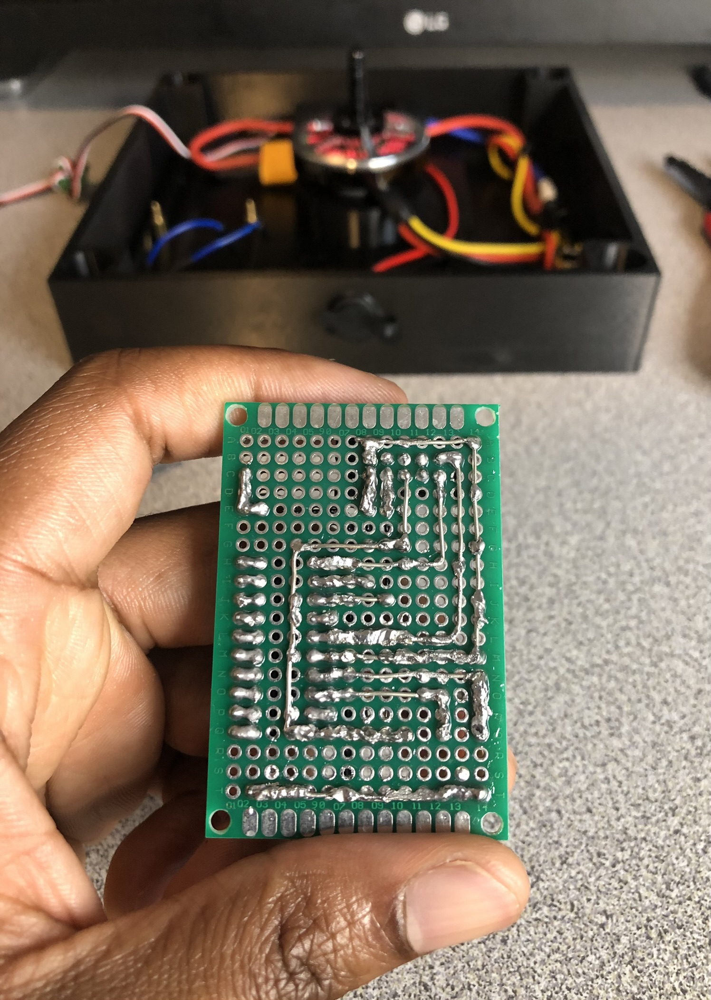
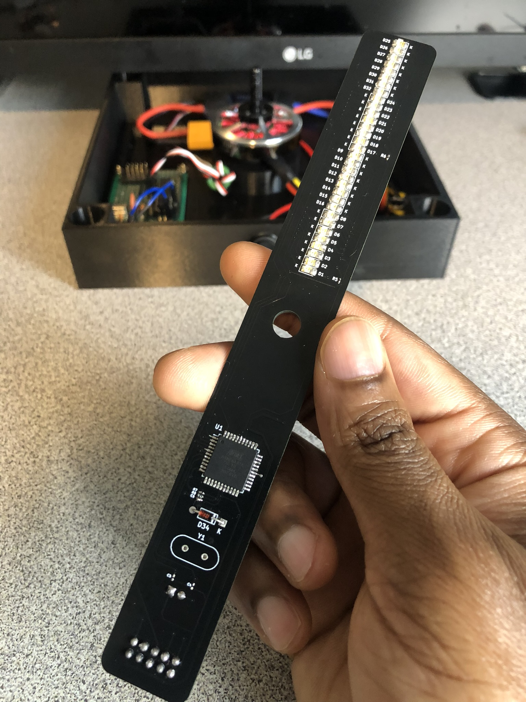
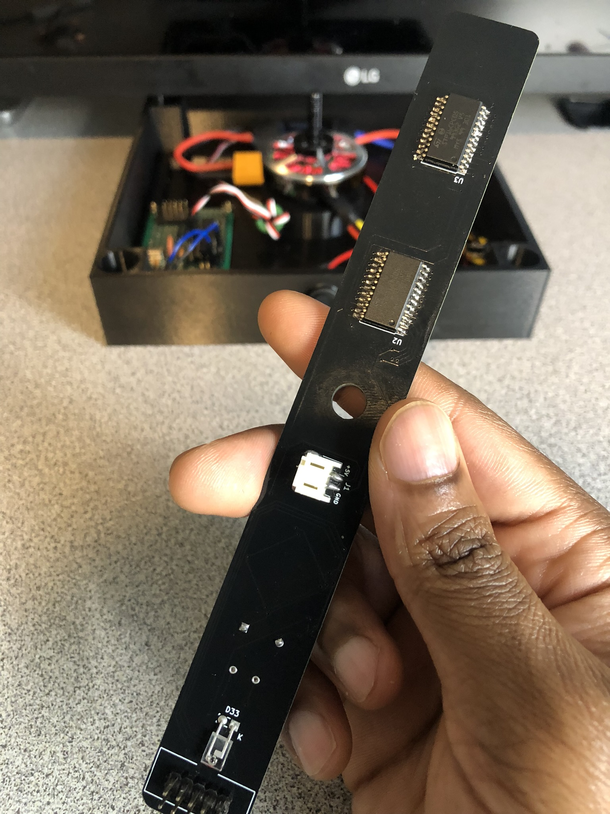
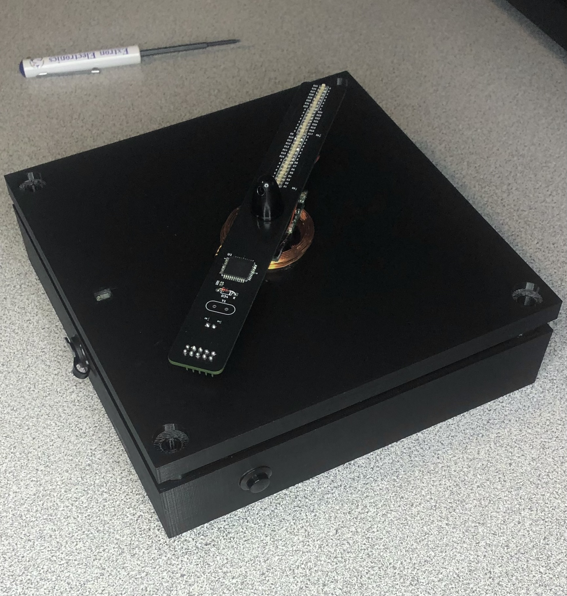
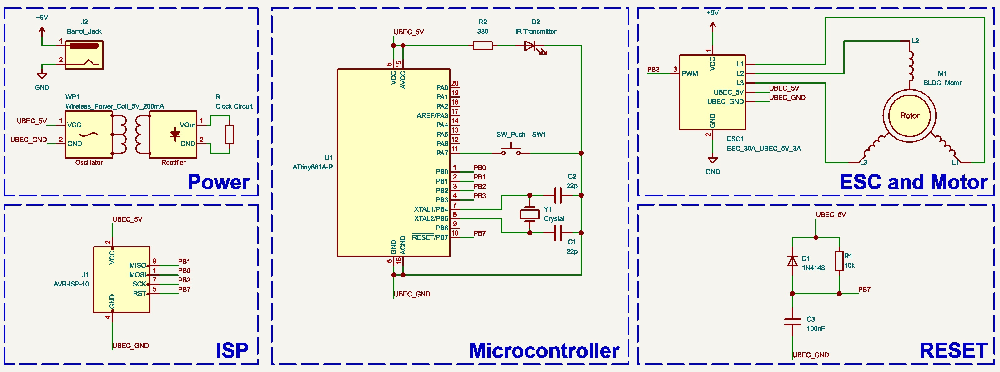
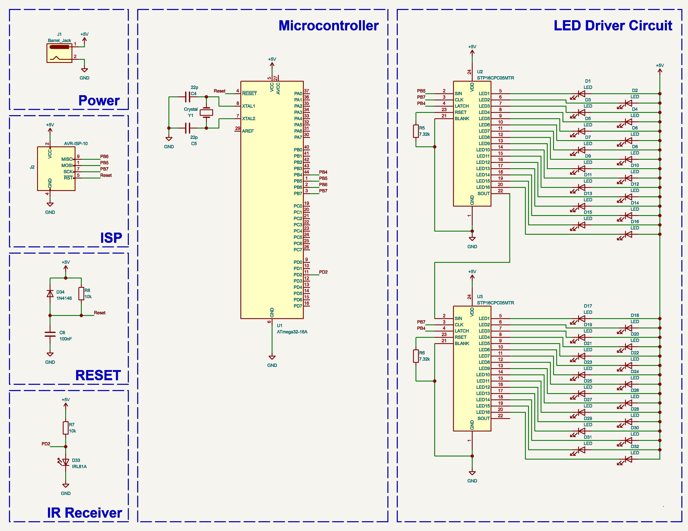
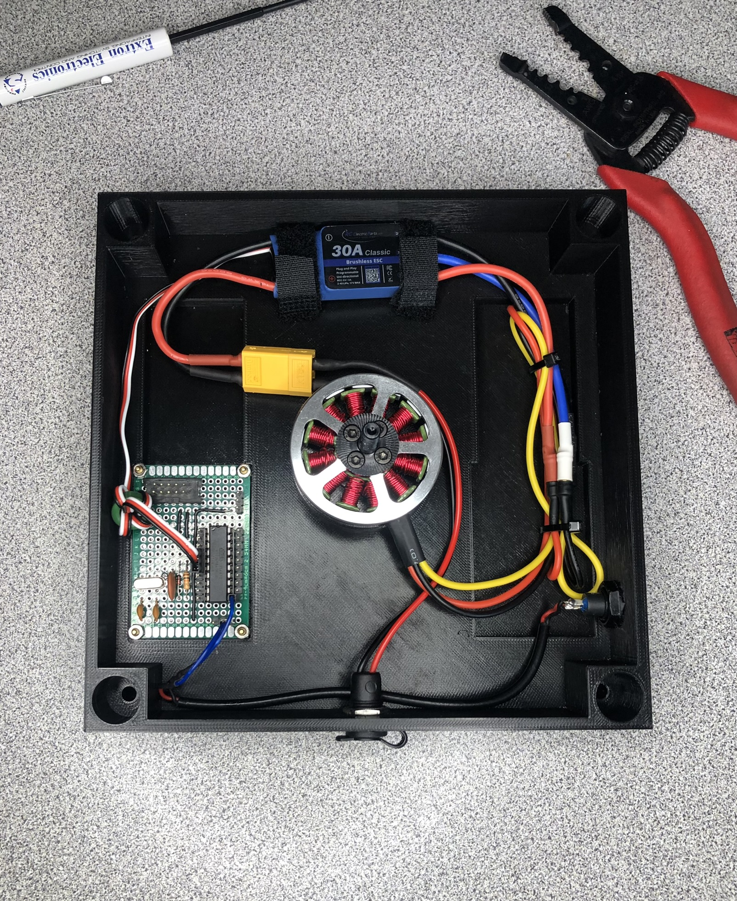

# Persistence of Vision (POV) Clock

A propeller display that is made up of a single row of LEDs and projects an image of an analog clock. The display utilizes an ATmega32 
microcontroller two 16-channel LED drivers, and a brushless DC motor.

- Project Video (YouTube): https://www.youtube.com/watch?v=ZK3UpSKuKRA
- Persistance of Vision: https://en.wikipedia.org/wiki/Persistence_of_vision

 

     <!--    -->
    <!--  -->
    
 

<h2> Table of Contents</h2>

1. [Overview](#overview)
2. [Software Used](#software)
3. [ESC Driver Circuit](#escdriver)
    - [Description](#escdescription) <!-- Description of the circuit. Schematic image.-->
    - [PWM Overview](#escpwm)
    - [Parts List](#escpartslist) <!--Choose a crystal where you can get pwm frequency between 50 - 500hz. Maybe include a small capacitor for button debouncing-->
4. [Clock Circuit](#clockcircuit)
    - [Description](#clockdescription) <!-- Description of the circuit. Schematic. Double sided board for space-->
    - [LED Driver](#leddriver) <!-- Description of how data is transfered to led sinks -->
    - [IR Receiver](#irreceiver) <!-- External interrupt-->
    - [Parts List](#clockpartslist) <!--Leaving out crystal because of balance. Modifying isp header  If you use crystal you will need to update FCPU and timer OCR-->
5. [Hardware](#hardware)
6. [Power Supply](#powersupply)
7. [Schematics](#schematics)
    - [ESC Driver Schematic](#clockschematic)
    - [Clock Schematic](#clockschematic)

## 1. Overview 
Persistence of vision displays are LED displays which project images by displaying a section of an image at a given time in quick rapid succession. The human brain perceives this as a continuous image. I accomplish this by mounting my circuit board to brushless DC motor. A motor with high rpm was chosen so that it will spin fast enough to make the image look complete and not have any stutters. This project was designed, built, and programmed by me.

## 2. Software Used
- VSCode with PlatformIO extension: https://docs.platformio.org/en/latest/what-is-platformio.html
- VRDude (Flash Uploader): https://github.com/avrdudes/avrdude
- KiCad (PCB Design): https://www.kicad.org
- AutoDesk Fusion 360 Personal (Case Design): https://www.autodesk.com/products/fusion-360/personal

## 3. ESC Driver Circuit
### Description
The ATtiny861 produces a PWM output that is used to drive the ESC (Electronic Speed Controller). A push button connected to PINA7 is used to adjust the duty cycle of the PWM signal.
By adjusting the duty cycle of the PWM signal to a value where the time high is less than 1ms we can stop the motor. We can press the button once to start the motor, then press it
again to stop it. Button debouncing is accomplished in software by using a 300ms delay after detecting the first pulse before checking again. The IR transmitter is used to notify
the clock circuit that it has made it rotated back to it's starting position. The inductive transmitter will be mounted to the case while the receiver is mounted to the motor and connected
to the clock circuit. The ESC's UBEC will supply the ATtiny, IR transmitter, and inductive transmitter with power (5V 3A).

 

    
    
    
 

### PWM Overview
I wanted the PWM frequency to be as close to 500Hz as possible. The time high for a 100% duty cycle would be 2ms. Usually a 1ms pulse translates to 0% throttle and a 2ms pulse translates to 100% throttle. 
The duty cycle of the PWM signal can be adjusted by setting Timer1's OCR1B register to a value between 0 and 255. I was able to use every value between 128 and 255 for OCR1B without exceeding 2ms. 
This gave me more wiggle when setting the speed of the motor instead of going from 0% throttle to 100% immediately. 

PWM Frequency Equation for ATtiny861
- PWM Frequency = fck / (prescaler * 255)
   
Variables
- fck = 16000000 Mhz
- Target PWM Frequency = 500 Hz
- prescaler = ?
  
Solve for prescaler
- prescaler = fck / (Target PWM Frequency * 255)
- prescaler = 16000000 Mhz / (500 Hz * 255)
- prescaler = 125.5 round to 128

Solve for Actual PWM Frequency
- Actual PWM Frequency = 16000000 Mhz / (128 * 255)
- Actual PWM Frequency = 490 Hz

### Parts List
|Part Number|Quantity|
|-----|:--------:|
|<a href="https://www.digikey.com/en/products/detail/microchip-technology/ATTINY861-20PU/1245922">ATtiny861-20PU</a>| x1 |
|<a href="https://www.digikey.com/en/products/filter/rectangular-connectors/headers-male-pins/314">ISP Header</a>| x1 |
|<a href="https://www.digikey.com/en/products/filter/ceramic-capacitors/60">22pF Capacitor</a>| x2 |
|<a href="https://www.digikey.com/en/products/filter/ceramic-capacitors/60">100nF Capacitor</a>| x1 |
|<a href="https://www.digikey.com/en/products/filter/oscillators/172">16Mhz Crystal</a>| x1 |
|<a href="https://www.digikey.com/en/products/filter/through-hole-resistors/53">10K resistor</a>| x1 |
|<a href="https://www.digikey.com/en/products/filter/through-hole-resistors/53">330 resistor</a>| x1 |
|<a href="https://www.digikey.com/en/products/filter/diodes/rectifiers/single-diodes/280">1n4148 Diode</a>| x1 |
|<a href="https://www.digikey.com/en/products/detail/e-switch/RP3502ABLK/280446?s=N4IgTCBcDaIKIHECMBOADGgtAOQCIgF0BfIA">Push Button</a>| x1 |
|<a href="https://www.digikey.com/en/products/filter/rectangular-connectors/headers-male-pins/314">Pcb Board 4cm x 6cm</a>| x1 |
|<a href="https://www.amazon.com/gp/product/B08CRTR7CZ/ref=ppx_yo_dt_b_asin_title_o00_s00?ie=UTF8&psc=1">Brushless Motor</a>| x1 |
|<a href="https://www.amazon.com/gp/product/B09H5L3KN5/ref=ppx_yo_dt_b_asin_title_o02_s00?ie=UTF8&psc=1">Barrel Jack</a>| x1 |
|<a href="https://www.sparkfun.com/products/18772">Infrared Emitter</a>| x1 ||
|<a href="https://www.amazon.com/gp/product/B071GRSFBD/ref=ppx_yo_dt_b_asin_title_o03_s00?ie=UTF8&psc=1">ESC 3A UBEC</a>| x1 |
|<a href="https://www.amazon.com/Adapter-Regulated-Switching-Interchangeable-Equipment/dp/B0BFPXZ7S1/ref=sr_1_3_sspa?crid=396GU23EXCZA8&keywords=9v+power+supply&qid=1697854150&sprefix=9v+power%2Caps%2C93&sr=8-3-spons&sp_csd=d2lkZ2V0TmFtZT1zcF9hdGY&psc=1">9V 1A Power Supply</a>| x1 |
|<a href="https://www.adafruit.com/product/1407">5V 200mA Inductive Charging Set </a>| x1 |

## 4. Clock Circuit 
### Description 
 This circuit will project the image of an anolog clock using the idea of POV (Persistence of Vision).
 The circuit is mounted to a brushless motor and will project the image of the clock everytime the
 motor completes a full rotation. An IR Detector connected to External Interrupt 0 is used to notify 
 the circuit that a full rotation of the motor has occured. This will let the circuit know that it is back 
 at its home position. A 2 second CTC timer is used to add one second to the clock on each CTC compare 
 interrupt. This interrupt will be triggered every 1 second. Two 16 channel LED drivers are used to drive
 the LEDs. Communication with the LED drivers is done using the SPI protocol.

    
    
    

### LED Driver 
### IR Receiver 
### Parts List 
|Part Number|Quantity|
|-----|:--------:|
|<a href="https://www.mouser.com/ProductDetail/Microchip-Technology/ATMEGA32A-AU?qs=6WoM%2FY8vMbbFYDtovr%252BQ5Q%3D%3D">ATmega32A-AU</a>| x1 |
|<a href="https://www.digikey.com/en/products/filter/rectangular-connectors/headers-male-pins/314">ISP Header</a>| x1 |
|<a href="https://www.digikey.com/en/products/detail/jst-sales-america-inc/S2B-PH-SM4-TB/926655?s=N4IgTCBcDaICwFYEFoCMB2OBONyByAIiALoC%2BQA">JST Connector</a>| x1 |
|<a href="https://www.digikey.com/en/products/detail/stmicroelectronics/STP16CPC05MTR/2021162">STP16CPC05MTR LED Driver</a>| x2 |
|<a href="https://www.digikey.com/en/products/filter/led-indication-discrete/105">SMD Led 1205 (3216 Metric)</a>| x32 |
|<a href="https://www.digikey.com/en/products/filter/oscillators/172">16Mhz Crystal</a>| x1 |
|<a href="https://www.digikey.com/en/products/filter/ceramic-capacitors/60">22pF Capacitor 0603 (1608 Metric)</a>| x2 |
|<a href="https://www.digikey.com/en/products/filter/ceramic-capacitors/60">100nF Capacitor 0603 (1608 Metric)</a>| x1 |
|<a href="https://www.digikey.com/en/products/filter/through-hole-resistors/53">10K Resistor 0603 (1608 Metric)</a>| x2 |
|<a href="https://www.digikey.com/en/products/filter/through-hole-resistors/53">7.32K Resistor 0603 (1608 Metric)</a>| x2 |
|<a href="https://www.digikey.com/en/products/filter/diodes/rectifiers/single-diodes/280">1n4148 Diode</a>| x1 |
|<a href="https://www.sparkfun.com/products/19018">Infrared Detector</a>| x1 |

## 5. Hardware 

## 6. Power Supply 
## 7. Schematics 
### ESC Driver Schematic

    

### Clock Schematic

    

<!-- power supply
wireless power -->

<!-- <h2>Images</h2>

    
    

    
    
    
    

<h2>LED Clock Schematic</h2>

    

<h2>ESC Driver and Motor Schematic</h2>

    

 -->
