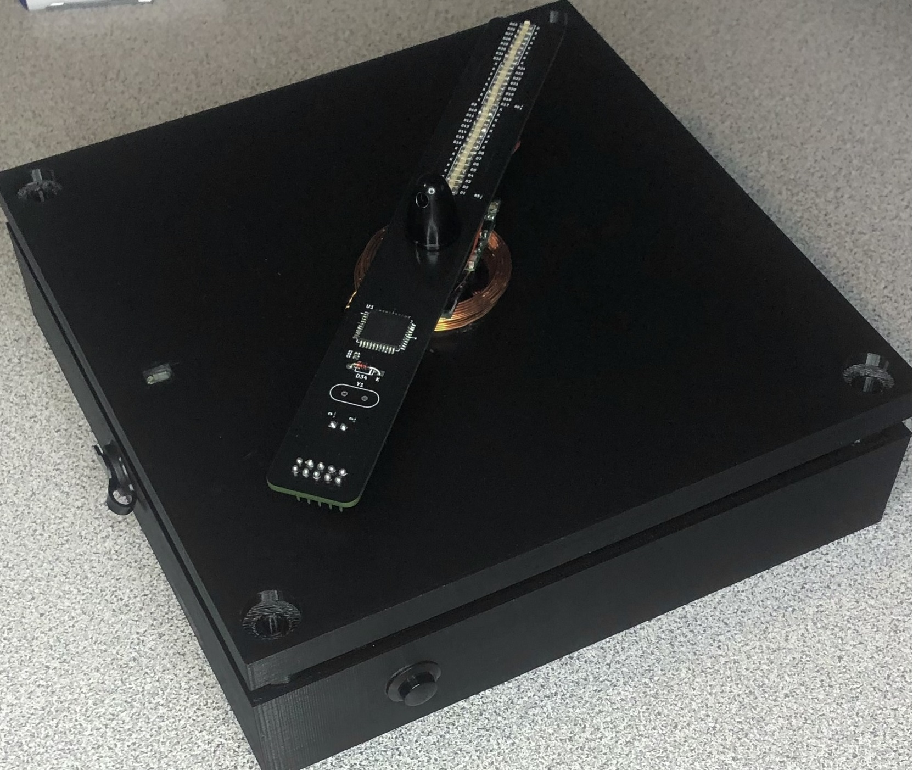

# Persistence of Vision (POV) Clock

A propeller display that projects an image of an analog clock using a single row of LEDs. The display utilizes an ATmega32 microcontroller two 16-channel LED drivers, and a brushless DC motor.

- Project Video (YouTube): https://youtu.be/6KemDWqXEEw?si=eYfT2QDL8WkOBApL
- Persistance of Vision: https://en.wikipedia.org/wiki/Persistence_of_vision

 <div align="center">
     <!--    -->
    <!--  -->
    
 </div>

<h2> Table of Contents</h2>

1. [Software Used](#software)
2. [ESC Driver Circuit](#escdriver)
    - [PWM Overview](#escpwm)
    - [Parts List](#escpartslist) 
3. [Clock Circuit](#clockcircuit)
    - [LED Driver](#leddriver)
    - [Timer Overview](#clocktimer) 
    - [Parts List](#clockpartslist) 
4. [Power Consumption](#powerconsumption)
5. [Schematics](#schematics)
    - [ESC Driver Schematic](#escschematic)
    - [Clock Schematic](#clockschematic)
6. [STL Viewer](#stlviewer)
    - [Case Base](#casebase)
    - [Case Top](#casetop)

## 1. Software Used<a name="software"></a>
- VSCode with PlatformIO extension: https://docs.platformio.org/en/latest/what-is-platformio.html
- AVRDUDE (Flash Uploader): https://github.com/avrdudes/avrdude
- KiCad (PCB Design): https://www.kicad.org
- AutoDesk Fusion 360 Personal (Case Design): https://www.autodesk.com/products/fusion-360/personal

## 2. ESC Driver Circuit<a name="escdriver"></a>
The ATtiny861 produces a PWM output that is used to drive the ESC (Electronic Speed Controller). A push button connected to PINA7 is used to adjust the duty cycle of the PWM signal.
By adjusting the duty cycle of the PWM signal to a percentage where the output is high for 1ms or less, the motor can be stopped. The push button can be pressed once to start the motor. It can be pressed
again to stop the motor. Button debouncing is accomplished in software by using a 300ms delay after detecting the first low output on the pin. The IR transmitter is used to notify
the clock circuit that it has rotated back to it's starting position. The clock circuit will start projecting the image again after it has rotated back to it's starting position. 
The inductive transmitter is  be mounted to the case while the receiver is mounted to the motor. It is connected to the clock circuit. The ESC's UBEC supplies the ATtiny, IR transmitter, 
and inductive transmitter with power (5V 3A).
<div align="center">
 <div>
    
    
    
 </div>
</div>

### PWM Overview<a name="escpwm"></a>
The PWM frequency is configured to be 500 Hz. The time high for a 100% duty cycle will be 2ms. Usually a 1ms pulse translates to 0% throttle and a 2ms pulse translates to 100% throttle. 
The duty cycle of the PWM signal can be adjusted by setting tge Timer's OCRn register to a value between 0 and 255. Every value between 128 and 255 can be used for OCRnB without exceeding 2ms. This allows more wiggle when setting the speed of the motor instead of going from 0% throttle to 100% immediately. Calculation to find the neccessary prescaler value is shown below.

PWM Frequency Equation for ATtiny861
- PWM Frequency = fck / (prescaler * 255)
   
Variables
- fck = 16 Mhz
- Target PWM Frequency = 500 Hz
- prescaler = ?
  
Solve for prescaler
- prescaler = fck / (Target PWM Frequency * 255)
- prescaler = 16 Mhz / (500 Hz * 255)
- prescaler = 125.5 round to 128

Solve for Actual PWM Frequency
- Actual PWM Frequency = 16 Mhz / (128 * 255)
- Actual PWM Frequency = 490 Hz
---
### Parts List<a name="escpartslist"></a>
|_**Part Number**_|_**Quantity**_|
|:-----|:--------:|
|<a href="https://www.digikey.com/en/products/detail/microchip-technology/ATTINY861-20PU/1245922">ATtiny861-20PU</a>| x1 |
|<a href="https://www.digikey.com/en/products/filter/rectangular-connectors/headers-male-pins/314">ISP Header</a>| x1 |
|<a href="https://www.digikey.com/en/products/filter/ceramic-capacitors/60">22pF Capacitor</a>| x2 |
|<a href="https://www.digikey.com/en/products/filter/ceramic-capacitors/60">100nF Capacitor</a>| x1 |
|<a href="https://www.digikey.com/en/products/filter/oscillators/172">16Mhz Crystal</a>| x1 |
|<a href="https://www.digikey.com/en/products/filter/through-hole-resistors/53">10K resistor</a>| x1 |
|<a href="https://www.digikey.com/en/products/filter/through-hole-resistors/53">330 resistor</a>| x1 |
|<a href="https://www.digikey.com/en/products/filter/diodes/rectifiers/single-diodes/280">1n4148 Diode</a>| x1 |
|<a href="https://www.digikey.com/en/products/detail/e-switch/RP3502ABLK/280446?s=N4IgTCBcDaIKIHECMBOADGgtAOQCIgF0BfIA">Push Button</a>| x1 |
|<a href="https://www.digikey.com/en/products/filter/rectangular-connectors/headers-male-pins/314">Pcb Board 4cm x 6cm</a>| x1 |
|<a href="https://www.amazon.com/gp/product/B08CRTR7CZ/ref=ppx_yo_dt_b_asin_title_o00_s00?ie=UTF8&psc=1">Brushless Motor</a>| x1 |
|<a href="https://www.amazon.com/gp/product/B09H5L3KN5/ref=ppx_yo_dt_b_asin_title_o02_s00?ie=UTF8&psc=1">Barrel Jack</a>| x1 |
|<a href="https://www.sparkfun.com/products/18772">Infrared Emitter</a>| x1 ||
|<a href="https://www.amazon.com/gp/product/B071GRSFBD/ref=ppx_yo_dt_b_asin_title_o03_s00?ie=UTF8&psc=1">ESC 3A UBEC</a>| x1 |
|<a href="https://www.amazon.com/Adapter-Regulated-Switching-Interchangeable-Equipment/dp/B0BFPXZ7S1/ref=sr_1_3_sspa?crid=396GU23EXCZA8&keywords=9v+power+supply&qid=1697854150&sprefix=9v+power%2Caps%2C93&sr=8-3-spons&sp_csd=d2lkZ2V0TmFtZT1zcF9hdGY&psc=1">9V 1A Power Supply</a>| x1 |
|<a href="https://www.adafruit.com/product/1407">5V 200mA Inductive Charging Set </a>| x1 |

## 3. Clock Circuit <a name="clockcircuit"></a>
 This circuit projects the image of an anolog clock using of Persistence of Vision.
 The circuit is mounted to a brushless motor and will project the image of the clock everytime the
 motor completes a full rotation. An IR Detector connected to External Interrupt 0 is used to notify 
 the circuit that a full rotation of the motor has occured and that it is back at it's starting position. 
 A 2 second CTC timer is used to add one second to the clock on each CTC compare interrupt. This interrupt is 
 triggered every 1 second. Two 16 channel LED drivers are used to drive the LEDs. Communication with the LED drivers is done using the SPI protocol.
<div align="center">
    
    
    
</div>

### LED Drivers <a name="leddriver"></a>
The LED Drivers are chained together. Each driver must receive two bytes of data to control their 16 output channels. Four bytes of data must be sent to the first driver in order to control all 32 output channels. The LEDs are mounted in order (starting from the center of the PCB) from 1 to 32. The table below shows which output channel each LED is connected to. 

|_**STP16CPC05 1 Outputs**_|LED Number|--|_**STP16CPC05 2 Outputs**_|LED Number|
|:--:|:--:|:--:|:--:|:--:|
|**Byte0**||--|**Byte2**||
|Out0|LED1|--|Out0|LED17|
|Out1|LED2|--|Out1|LED18|
|Out2|LED3|--|Out2|LED19|
|Out3|LED4|--|Out3|LED20|
|Out4|LED5|--|Out4|LED21|
|Out5|LED6|--|Out5|LED22|
|Out6|LED7|--|Out6|LED23|
|Out7|LED8|--|Out7|LED24|
|||--|||
|**Byte1**||--|**Byte3**||
|Out8|LED16|--|Out8|LED32|
|Out9|LED15|--|Out9|LED31|
|Out10|LED14|--|Out10|LED30|
|Out11|LED13|--|Out11|LED29|
|Out12|LED12|--|Out12|LED28|
|Out13|LED11|--|Out13|LED27|
|Out14|LED10|--|Out14|LED26|
|Out15|LED9|--|Out15|LED25|

Because the LED Drivers are daisy chained together, the data must be transmitted in the following order.
* Byte3 (MSB transmitted first) 
* Byte2 (LSB transmitted first) 
* Byte1 (MSB transmitted first) 
* Byte0 (LSB transmitted first) 
---
### Timer Overview <a name="clocktimer"></a>
A one second timer is configured to update the seconds hand of the clock. The timer is configured to operate in Clear Timer on Compare Match Mode (CTC). A CTC frequency of 0.5 Hz (2s) is required. 
This will trigger the compare match interrupt every second. Because the weight of the crystal caused the ciruit to be unbalanced, it was discarded and the ATmega32's internal 8 Mhz 
oscillator is used instead. Calculation to find the appropriate OCRn values is shown below.

CTC Waveform Frequency Equation
- Frequency = fck / (2 * prescaler * (1 + OCRnA)).

Variables
- Frequency = 0.5Hz = 2 seconds
- fck = 8 Mhz
- prescaler = 256
- OCRnA = ?

Rearranged formula to solve for OCRnA:
- OCRnA = (fck / (2 * prescaler * Frequency)) - 1

Solve for OCRnA
- OCRnA = (8 Mhz / (2 * 256 * 0.5Hz)) - 1 
- OCRnA = 31249
---
### Parts List <a name="clockpartslist"></a>
|_**Part Number**_|_**Quantity**_|
|:-----|:--------:|
|<a href="https://www.mouser.com/ProductDetail/Microchip-Technology/ATMEGA32A-AU?qs=6WoM%2FY8vMbbFYDtovr%252BQ5Q%3D%3D">ATmega32A-AU</a>| x1 |
|<a href="https://www.digikey.com/en/products/filter/rectangular-connectors/headers-male-pins/314">ISP Header</a>| x1 |
|<a href="https://www.digikey.com/en/products/detail/jst-sales-america-inc/S2B-PH-SM4-TB/926655?s=N4IgTCBcDaICwFYEFoCMB2OBONyByAIiALoC%2BQA">JST Connector</a>| x1 |
|<a href="https://www.digikey.com/en/products/detail/stmicroelectronics/STP16CPC05MTR/2021162">STP16CPC05MTR LED Driver</a>| x2 |
|<a href="https://www.digikey.com/en/products/filter/led-indication-discrete/105">SMD Led 1205 (3216 Metric)</a>| x32 |
|<a href="https://www.digikey.com/en/products/filter/oscillators/172">16Mhz Crystal</a>| x1 |
|<a href="https://www.digikey.com/en/products/filter/ceramic-capacitors/60">22pF Capacitor 0603 (1608 Metric)</a>| x2 |
|<a href="https://www.digikey.com/en/products/filter/ceramic-capacitors/60">100nF Capacitor 0603 (1608 Metric)</a>| x1 |
|<a href="https://www.digikey.com/en/products/filter/through-hole-resistors/53">10K Resistor 0603 (1608 Metric)</a>| x2 |
|<a href="https://www.digikey.com/en/products/filter/through-hole-resistors/53">7.32K Resistor 0603 (1608 Metric)</a>| x2 |
|<a href="https://www.digikey.com/en/products/filter/diodes/rectifiers/single-diodes/280">1n4148 Diode</a>| x1 |
|<a href="https://www.sparkfun.com/products/19018">Infrared Detector</a>| x1 |

## 4. Power Consumption <a name="powerconsumption"></a>
|_**Test Condition**_|_**Power Consumption**_|
|:--|:--:|
|Clock circuit with all LEDs powered on. LEDs are supplied with 3mA each.|120mA|
|Motor running with the weight of the clock circuit|150mA|
|Inductive charging set|100mA|
|Motor running with all LEDs powered on|380mA|

The ESC's UBEC must be able to supply at least 380mA to supply enough power to all of the components.

## 5. Schematics <a name="schematics"></a>
### ESC Driver Schematic<a name="escschematic"></a>
<div>
    
</div>

---
### Clock Schematic<a name="clockschematic"></a>
<div>
    
</div>

## 6. STL Viewer <a name="stlviewer"></a>
### Case Base <a name="casebase"></a>
```stl
solid ASCII
  facet normal -9.709418e-01 2.393157e-01 0.000000e+00
    outer loop
      vertex   -7.225908e+01 -8.238542e+01 1.600000e+01
      vertex   -7.225908e+01 -8.238542e+01 3.500000e+01
      vertex   -7.140000e+01 -7.890000e+01 1.600000e+01
    endloop
  endfacet
  facet normal -9.709418e-01 2.393157e-01 0.000000e+00
    outer loop
      vertex   -7.140000e+01 -7.890000e+01 1.600000e+01
      vertex   -7.225908e+01 -8.238542e+01 3.500000e+01
      vertex   -7.140000e+01 -7.890000e+01 3.500000e+01
    endloop
  endfacet
  facet normal -9.709418e-01 -2.393157e-01 0.000000e+00
    outer loop
      vertex   -7.140000e+01 -7.890000e+01 1.600000e+01
      vertex   -7.140000e+01 -7.890000e+01 3.500000e+01
      vertex   -7.225908e+01 -7.541458e+01 1.600000e+01
    endloop
  endfacet
  facet normal -9.709418e-01 -2.393157e-01 0.000000e+00
    outer loop
      vertex   -7.225908e+01 -7.541458e+01 1.600000e+01
      vertex   -7.140000e+01 -7.890000e+01 3.500000e+01
      vertex   -7.225908e+01 -7.541458e+01 3.500000e+01
    endloop
  endfacet
  facet normal -7.485107e-01 -6.631227e-01 0.000000e+00
    outer loop
      vertex   -7.225908e+01 -7.541458e+01 1.600000e+01
      vertex   -7.225908e+01 -7.541458e+01 3.500000e+01
      vertex   -7.463951e+01 -7.272762e+01 3.500000e+01
    endloop
  endfacet
  facet normal -7.485107e-01 6.631227e-01 0.000000e+00
    outer loop
      vertex   -7.225908e+01 -8.238542e+01 1.600000e+01
      vertex   -7.463951e+01 -8.507238e+01 1.600000e+01
      vertex   -7.225908e+01 -8.238542e+01 3.500000e+01
    endloop
  endfacet
  facet normal -7.485107e-01 6.631227e-01 0.000000e+00
    outer loop
      vertex   -7.225908e+01 -8.238542e+01 3.500000e+01
      vertex   -7.463951e+01 -8.507238e+01 1.600000e+01
      vertex   -7.463951e+01 -8.507238e+01 3.500000e+01
    endloop
  endfacet
  facet normal -3.546049e-01 9.350162e-01 0.000000e+00
    outer loop
      vertex   -7.463951e+01 -8.507238e+01 3.500000e+01
      vertex   -7.463951e+01 -8.507238e+01 1.600000e+01
      vertex   -7.799597e+01 -8.634532e+01 1.600000e+01
    endloop
  endfacet
  facet normal -3.546049e-01 9.350162e-01 0.000000e+00
    outer loop
      vertex   -7.463951e+01 -8.507238e+01 3.500000e+01
      vertex   -7.799597e+01 -8.634532e+01 1.600000e+01
      vertex   -7.799597e+01 -8.634532e+01 3.500000e+01
    endloop
  endfacet
  facet normal 1.205367e-01 9.927089e-01 0.000000e+00
    outer loop
      vertex   -7.799597e+01 -8.634532e+01 3.500000e+01
      vertex   -7.799597e+01 -8.634532e+01 1.600000e+01
      vertex   -8.155954e+01 -8.591262e+01 1.600000e+01
    endloop
  endfacet
  facet normal 1.205367e-01 9.927089e-01 0.000000e+00
    outer loop
      vertex   -7.799597e+01 -8.634532e+01 3.500000e+01
      vertex   -8.155954e+01 -8.591262e+01 1.600000e+01
      vertex   -8.155954e+01 -8.591262e+01 3.500000e+01
    endloop
  endfacet
  facet normal 5.680647e-01 8.229839e-01 0.000000e+00
    outer loop
      vertex   -8.155954e+01 -8.591262e+01 3.500000e+01
      vertex   -8.155954e+01 -8.591262e+01 1.600000e+01
      vertex   -8.451383e+01 -8.387342e+01 1.600000e+01
    endloop
  endfacet
  facet normal 5.680647e-01 8.229839e-01 -4.297325e-16
    outer loop
      vertex   -8.155954e+01 -8.591262e+01 3.500000e+01
      vertex   -8.451383e+01 -8.387342e+01 1.600000e+01
      vertex   -8.451383e+01 -8.387342e+01 3.500000e+01
    endloop
  endfacet
  facet normal 8.854560e-01 4.647232e-01 -6.622677e-16
    outer loop
      vertex   -8.451383e+01 -8.387342e+01 3.500000e+01
      vertex   -8.451383e+01 -8.387342e+01 1.600000e+01
      vertex   -8.618206e+01 -8.069487e+01 1.600000e+01
    endloop
  endfacet
  facet normal 8.854560e-01 4.647232e-01 0.000000e+00
    outer loop
      vertex   -8.451383e+01 -8.387342e+01 3.500000e+01
      vertex   -8.618206e+01 -8.069487e+01 1.600000e+01
      vertex   -8.618206e+01 -8.069487e+01 3.500000e+01
    endloop
  endfacet
  facet normal 1.000000e+00 0.000000e+00 0.000000e+00
    outer loop
      vertex   -8.618206e+01 -8.069487e+01 3.500000e+01
      vertex   -8.618206e+01 -8.069487e+01 1.600000e+01
      vertex   -8.618206e+01 -7.710513e+01 1.600000e+01
    endloop
  endfacet
  facet normal 1.000000e+00 -0.000000e+00 0.000000e+00
    outer loop
      vertex   -8.618206e+01 -8.069487e+01 3.500000e+01
      vertex   -8.618206e+01 -7.710513e+01 1.600000e+01
      vertex   -8.618206e+01 -7.710513e+01 3.500000e+01
    endloop
  endfacet
  facet normal 8.854560e-01 -4.647232e-01 -3.475849e-16
    outer loop
      vertex   -8.618206e+01 -7.710513e+01 3.500000e+01
      vertex   -8.618206e+01 -7.710513e+01 1.600000e+01
      vertex   -8.451383e+01 -7.392658e+01 1.600000e+01
    endloop
  endfacet
  facet normal 8.854560e-01 -4.647232e-01 3.125327e-16
    outer loop
      vertex   -8.618206e+01 -7.710513e+01 3.500000e+01
      vertex   -8.451383e+01 -7.392658e+01 1.600000e+01
      vertex   -8.451383e+01 -7.392658e+01 3.500000e+01
    endloop
  endfacet
  facet normal 5.680647e-01 -8.229839e-01 -1.906641e-16
    outer loop
      vertex   -8.451383e+01 -7.392658e+01 3.500000e+01
      vertex   -8.451383e+01 -7.392658e+01 1.600000e+01
      vertex   -8.155954e+01 -7.188738e+01 1.600000e+01
    endloop
  endfacet
  facet normal 5.680647e-01 -8.229839e-01 0.000000e+00
    outer loop
      vertex   -8.451383e+01 -7.392658e+01 3.500000e+01
      vertex   -8.155954e+01 -7.188738e+01 1.600000e+01
      vertex   -8.155954e+01 -7.188738e+01 3.500000e+01
    endloop
  endfacet
  facet normal 1.205367e-01 -9.927089e-01 0.000000e+00
    outer loop
      vertex   -8.155954e+01 -7.188738e+01 3.500000e+01
      vertex   -8.155954e+01 -7.188738e+01 1.600000e+01
      vertex   -7.799597e+01 -7.145468e+01 1.600000e+01
    endloop
  endfacet
  facet normal 1.205367e-01 -9.927089e-01 0.000000e+00
    outer loop
      vertex   -8.155954e+01 -7.188738e+01 3.500000e+01
      vertex   -7.799597e+01 -7.145468e+01 1.600000e+01
      vertex   -7.799597e+01 -7.145468e+01 3.500000e+01
    endloop
  endfacet
  facet normal -3.546049e-01 -9.350162e-01 -0.000000e+00
    outer loop
      vertex   -7.799597e+01 -7.145468e+01 3.500000e+01
      vertex   -7.799597e+01 -7.145468e+01 1.600000e+01
      vertex   -7.463951e+01 -7.272762e+01 1.600000e+01
    endloop
  endfacet
  facet normal -3.546049e-01 -9.350162e-01 0.000000e+00
    outer loop
      vertex   -7.799597e+01 -7.145468e+01 3.500000e+01
      vertex   -7.463951e+01 -7.272762e+01 1.600000e+01
      vertex   -7.463951e+01 -7.272762e+01 3.500000e+01
    endloop
  endfacet
  facet normal -7.485107e-01 -6.631227e-01 -0.000000e+00
    outer loop
      vertex   -7.463951e+01 -7.272762e+01 3.500000e+01
      vertex   -7.463951e+01 -7.272762e+01 1.600000e+01
      vertex   -7.225908e+01 -7.541458e+01 1.600000e+01
    endloop
  endfacet
  facet normal -1.000000e+00 0.000000e+00 0.000000e+00
    outer loop
      vertex   -8.890000e+01 -8.890000e+01 3.500000e+01
      vertex   -8.890000e+01 8.890000e+01 3.500000e+01
      vertex   -8.890000e+01 -8.890000e+01 0.000000e+00
    endloop
  endfacet
  facet normal -1.000000e+00 0.000000e+00 0.000000e+00
    outer loop
      vertex   -8.890000e+01 -8.890000e+01 0.000000e+00
      vertex   -8.890000e+01 8.890000e+01 3.500000e+01
      vertex   -8.890000e+01 8.890000e+01 0.000000e+00
    endloop
  endfacet
  facet normal -9.709418e-01 2.393157e-01 0.000000e+00
    outer loop
      vertex   -7.225908e+01 7.541458e+01 1.600000e+01
      vertex   -7.225908e+01 7.541458e+01 3.500000e+01
      vertex   -7.140000e+01 7.890000e+01 1.600000e+01
    endloop
  endfacet
  facet normal -9.709418e-01 2.393157e-01 0.000000e+00
    outer loop
      vertex   -7.140000e+01 7.890000e+01 1.600000e+01
      vertex   -7.225908e+01 7.541458e+01 3.500000e+01
      vertex   -7.140000e+01 7.890000e+01 3.500000e+01
    endloop
  endfacet
  facet normal -9.709418e-01 -2.393157e-01 0.000000e+00
    outer loop
      vertex   -7.140000e+01 7.890000e+01 1.600000e+01
      vertex   -7.140000e+01 7.890000e+01 3.500000e+01
      vertex   -7.225908e+01 8.238542e+01 1.600000e+01
    endloop
  endfacet
  facet normal -9.709418e-01 -2.393157e-01 0.000000e+00
    outer loop
      vertex   -7.225908e+01 8.238542e+01 1.600000e+01
      vertex   -7.140000e+01 7.890000e+01 3.500000e+01
      vertex   -7.225908e+01 8.238542e+01 3.500000e+01
    endloop
  endfacet
  facet normal -7.485107e-01 -6.631227e-01 0.000000e+00
    outer loop
      vertex   -7.225908e+01 8.238542e+01 1.600000e+01
      vertex   -7.225908e+01 8.238542e+01 3.500000e+01
      vertex   -7.463951e+01 8.507238e+01 3.500000e+01
    endloop
  endfacet
  facet normal -7.485107e-01 6.631227e-01 0.000000e+00
    outer loop
      vertex   -7.225908e+01 7.541458e+01 1.600000e+01
      vertex   -7.463951e+01 7.272762e+01 1.600000e+01
      vertex   -7.225908e+01 7.541458e+01 3.500000e+01
    endloop
  endfacet
  facet normal -7.485107e-01 6.631227e-01 0.000000e+00
    outer loop
      vertex   -7.225908e+01 7.541458e+01 3.500000e+01
      vertex   -7.463951e+01 7.272762e+01 1.600000e+01
      vertex   -7.463951e+01 7.272762e+01 3.500000e+01
    endloop
  endfacet
  facet normal -3.546049e-01 9.350162e-01 0.000000e+00
    outer loop
      vertex   -7.463951e+01 7.272762e+01 3.500000e+01
      vertex   -7.463951e+01 7.272762e+01 1.600000e+01
      vertex   -7.799597e+01 7.145468e+01 1.600000e+01
    endloop
  endfacet
  facet normal -3.546049e-01 9.350162e-01 0.000000e+00
    outer loop
      vertex   -7.463951e+01 7.272762e+01 3.500000e+01
      vertex   -7.799597e+01 7.145468e+01 1.600000e+01
      vertex   -7.799597e+01 7.145468e+01 3.500000e+01
    endloop
  endfacet
  facet normal 1.205367e-01 9.927089e-01 0.000000e+00
    outer loop
      vertex   -7.799597e+01 7.145468e+01 3.500000e+01
      vertex   -7.799597e+01 7.145468e+01 1.600000e+01
      vertex   -8.155954e+01 7.188738e+01 1.600000e+01
    endloop
  endfacet
  facet normal 1.205367e-01 9.927089e-01 0.000000e+00
    outer loop
      vertex   -7.799597e+01 7.145468e+01 3.500000e+01
      vertex   -8.155954e+01 7.188738e+01 1.600000e+01
      vertex   -8.155954e+01 7.188738e+01 3.500000e+01
    endloop
  endfacet
  facet normal 5.680647e-01 8.229839e-01 0.000000e+00
    outer loop
      vertex   -8.155954e+01 7.188738e+01 3.500000e+01
      vertex   -8.155954e+01 7.188738e+01 1.600000e+01
      vertex   -8.451383e+01 7.392658e+01 1.600000e+01
    endloop
  endfacet
  facet normal 5.680647e-01 8.229839e-01 1.953329e-16
    outer loop
      vertex   -8.155954e+01 7.188738e+01 3.500000e+01
      vertex   -8.451383e+01 7.392658e+01 1.600000e+01
      vertex   -8.451383e+01 7.392658e+01 3.500000e+01
    endloop
  endfacet
  facet normal 8.854560e-01 4.647232e-01 -3.146828e-16
    outer loop
      vertex   -8.451383e+01 7.392658e+01 3.500000e+01
      vertex   -8.451383e+01 7.392658e+01 1.600000e+01
      vertex   -8.618206e+01 7.710513e+01 1.600000e+01
    endloop
  endfacet
  facet normal 8.854560e-01 4.647232e-01 3.385771e-16
    outer loop
      vertex   -8.451383e+01 7.392658e+01 3.500000e+01
      vertex   -8.618206e+01 7.710513e+01 1.600000e+01
      vertex   -8.618206e+01 7.710513e+01 3.500000e+01
    endloop
  endfacet
  facet normal 1.000000e+00 0.000000e+00 0.000000e+00
    outer loop
      vertex   -8.618206e+01 7.710513e+01 3.500000e+01
      vertex   -8.618206e+01 7.710513e+01 1.600000e+01
      vertex   -8.618206e+01 8.069487e+01 1.600000e+01
    endloop
  endfacet
  facet normal 1.000000e+00 -0.000000e+00 0.000000e+00
    outer loop
      vertex   -8.618206e+01 7.710513e+01 3.500000e+01
      vertex   -8.618206e+01 8.069487e+01 1.600000e+01
      vertex   -8.618206e+01 8.069487e+01 3.500000e+01
    endloop
  endfacet
  facet normal 8.854560e-01 -4.647232e-01 0.000000e+00
    outer loop
      vertex   -8.618206e+01 8.069487e+01 3.500000e+01
      vertex   -8.618206e+01 8.069487e+01 1.600000e+01
      vertex   -8.451383e+01 8.387342e+01 1.600000e+01
    endloop
  endfacet
  facet normal 8.854560e-01 -4.647232e-01 6.641320e-16
    outer loop
      vertex   -8.618206e+01 8.069487e+01 3.500000e+01
      vertex   -8.451383e+01 8.387342e+01 1.600000e+01
      vertex   -8.451383e+01 8.387342e+01 3.500000e+01
    endloop
  endfacet
  facet normal 5.680647e-01 -8.229839e-01 4.248782e-16
    outer loop
      vertex   -8.451383e+01 8.387342e+01 3.500000e+01
      vertex   -8.451383e+01 8.387342e+01 1.600000e+01
      vertex   -8.155954e+01 8.591262e+01 1.600000e+01
    endloop
  endfacet
  facet normal 5.680647e-01 -8.229839e-01 0.000000e+00
    outer loop
      vertex   -8.451383e+01 8.387342e+01 3.500000e+01
      vertex   -8.155954e+01 8.591262e+01 1.600000e+01
      vertex   -8.155954e+01 8.591262e+01 3.500000e+01
    endloop
  endfacet
  facet normal 1.205367e-01 -9.927089e-01 0.000000e+00
    outer loop
      vertex   -8.155954e+01 8.591262e+01 3.500000e+01
      vertex   -8.155954e+01 8.591262e+01 1.600000e+01
      vertex   -7.799597e+01 8.634532e+01 1.600000e+01
    endloop
  endfacet
  facet normal 1.205367e-01 -9.927089e-01 0.000000e+00
    outer loop
      vertex   -8.155954e+01 8.591262e+01 3.500000e+01
      vertex   -7.799597e+01 8.634532e+01 1.600000e+01
      vertex   -7.799597e+01 8.634532e+01 3.500000e+01
    endloop
  endfacet
  facet normal -3.546049e-01 -9.350162e-01 -0.000000e+00
    outer loop
      vertex   -7.799597e+01 8.634532e+01 3.500000e+01
      vertex   -7.799597e+01 8.634532e+01 1.600000e+01
      vertex   -7.463951e+01 8.507238e+01 1.600000e+01
    endloop
  endfacet
  facet normal -3.546049e-01 -9.350162e-01 0.000000e+00
    outer loop
      vertex   -7.799597e+01 8.634532e+01 3.500000e+01
      vertex   -7.463951e+01 8.507238e+01 1.600000e+01
      vertex   -7.463951e+01 8.507238e+01 3.500000e+01
    endloop
  endfacet
  facet normal -7.485107e-01 -6.631227e-01 -0.000000e+00
    outer loop
      vertex   -7.463951e+01 8.507238e+01 3.500000e+01
      vertex   -7.463951e+01 8.507238e+01 1.600000e+01
      vertex   -7.225908e+01 8.238542e+01 1.600000e+01
    endloop
  endfacet
  facet normal -0.000000e+00 1.000000e+00 0.000000e+00
    outer loop
      vertex   -8.890000e+01 8.890000e+01 3.500000e+01
      vertex   8.890000e+01 8.890000e+01 3.500000e+01
      vertex   -8.890000e+01 8.890000e+01 0.000000e+00
    endloop
  endfacet
  facet normal 0.000000e+00 1.000000e+00 0.000000e+00
    outer loop
      vertex   -8.890000e+01 8.890000e+01 0.000000e+00
      vertex   8.890000e+01 8.890000e+01 3.500000e+01
      vertex   8.890000e+01 8.890000e+01 0.000000e+00
    endloop
  endfacet
  facet normal -9.709418e-01 2.393157e-01 0.000000e+00
    outer loop
      vertex   8.554092e+01 -8.238542e+01 1.600000e+01
      vertex   8.554092e+01 -8.238542e+01 3.500000e+01
      vertex   8.640000e+01 -7.890000e+01 1.600000e+01
    endloop
  endfacet
  facet normal -9.709418e-01 2.393157e-01 0.000000e+00
    outer loop
      vertex   8.640000e+01 -7.890000e+01 1.600000e+01
      vertex   8.554092e+01 -8.238542e+01 3.500000e+01
      vertex   8.640000e+01 -7.890000e+01 3.500000e+01
    endloop
  endfacet
  facet normal -9.709418e-01 -2.393157e-01 0.000000e+00
    outer loop
      vertex   8.640000e+01 -7.890000e+01 1.600000e+01
      vertex   8.640000e+01 -7.890000e+01 3.500000e+01
      vertex   8.554092e+01 -7.541458e+01 1.600000e+01
    endloop
  endfacet
  facet normal -9.709418e-01 -2.393157e-01 0.000000e+00
    outer loop
      vertex   8.554092e+01 -7.541458e+01 1.600000e+01
      vertex   8.640000e+01 -7.890000e+01 3.500000e+01
      vertex   8.554092e+01 -7.541458e+01 3.500000e+01
    endloop
  endfacet
  facet normal -7.485107e-01 -6.631227e-01 0.000000e+00
    outer loop
      vertex   8.554092e+01 -7.541458e+01 1.600000e+01
      vertex   8.554092e+01 -7.541458e+01 3.500000e+01
      vertex   8.316049e+01 -7.272762e+01 3.500000e+01
    endloop
  endfacet
  facet normal -7.485107e-01 6.631227e-01 0.000000e+00
    outer loop
      vertex   8.554092e+01 -8.238542e+01 1.600000e+01
      vertex   8.316049e+01 -8.507238e+01 1.600000e+01
      vertex   8.554092e+01 -8.238542e+01 3.500000e+01
    endloop
  endfacet
  facet normal -7.485107e-01 6.631227e-01 0.000000e+00
    outer loop
      vertex   8.554092e+01 -8.238542e+01 3.500000e+01
      vertex   8.316049e+01 -8.507238e+01 1.600000e+01
      vertex   8.316049e+01 -8.507238e+01 3.500000e+01
    endloop
  endfacet
  facet normal -3.546049e-01 9.350162e-01 0.000000e+00
    outer loop
      vertex   8.316049e+01 -8.507238e+01 3.500000e+01
      vertex   8.316049e+01 -8.507238e+01 1.600000e+01
      vertex   7.980403e+01 -8.634532e+01 1.600000e+01
    endloop
  endfacet
  facet normal -3.546049e-01 9.350162e-01 0.000000e+00
    outer loop
      vertex   8.316049e+01 -8.507238e+01 3.500000e+01
      vertex   7.980403e+01 -8.634532e+01 1.600000e+01
      vertex   7.980403e+01 -8.634532e+01 3.500000e+01
    endloop
  endfacet
  facet normal 1.205367e-01 9.927089e-01 0.000000e+00
    outer loop
      vertex   7.980403e+01 -8.634532e+01 3.500000e+01
      vertex   7.980403e+01 -8.634532e+01 1.600000e+01
      vertex   7.624046e+01 -8.591262e+01 1.600000e+01
    endloop
  endfacet
  facet normal 1.205367e-01 9.927089e-01 0.000000e+00
    outer loop
      vertex   7.980403e+01 -8.634532e+01 3.500000e+01
      vertex   7.624046e+01 -8.591262e+01 1.600000e+01
      vertex   7.624046e+01 -8.591262e+01 3.500000e+01
    endloop
  endfacet
  facet normal 5.680647e-01 8.229839e-01 0.000000e+00
    outer loop
      vertex   7.624046e+01 -8.591262e+01 3.500000e+01
      vertex   7.624046e+01 -8.591262e+01 1.600000e+01
      vertex   7.328617e+01 -8.387342e+01 1.600000e+01
    endloop
  endfacet
  facet normal 5.680647e-01 8.229839e-01 0.000000e+00
    outer loop
      vertex   7.624046e+01 -8.591262e+01 3.500000e+01
      vertex   7.328617e+01 -8.387342e+01 1.600000e+01
      vertex   7.328617e+01 -8.387342e+01 3.500000e+01
    endloop
  endfacet
  facet normal 8.854560e-01 4.647232e-01 0.000000e+00
    outer loop
      vertex   7.328617e+01 -8.387342e+01 3.500000e+01
      vertex   7.328617e+01 -8.387342e+01 1.600000e+01
      vertex   7.161794e+01 -8.069487e+01 1.600000e+01
    endloop
  endfacet
  facet normal 8.854560e-01 4.647232e-01 0.000000e+00
    outer loop
      vertex   7.328617e+01 -8.387342e+01 3.500000e+01
      vertex   7.161794e+01 -8.069487e+01 1.600000e+01
      vertex   7.161794e+01 -8.069487e+01 3.500000e+01
    endloop
  endfacet
  facet normal 1.000000e+00 0.000000e+00 0.000000e+00
    outer loop
      vertex   7.161794e+01 -8.069487e+01 3.500000e+01
      vertex   7.161794e+01 -8.069487e+01 1.600000e+01
      vertex   7.161794e+01 -7.710513e+01 1.600000e+01
    endloop
  endfacet
  facet normal 1.000000e+00 -0.000000e+00 0.000000e+00
    outer loop
      vertex   7.161794e+01 -8.069487e+01 3.500000e+01
      vertex   7.161794e+01 -7.710513e+01 1.600000e+01
      vertex   7.161794e+01 -7.710513e+01 3.500000e+01
    endloop
  endfacet
  facet normal 8.854560e-01 -4.647232e-01 -3.475849e-16
    outer loop
      vertex   7.161794e+01 -7.710513e+01 3.500000e+01
      vertex   7.161794e+01 -7.710513e+01 1.600000e+01
      vertex   7.328617e+01 -7.392658e+01 1.600000e+01
    endloop
  endfacet
  facet normal 8.854560e-01 -4.647232e-01 -3.515993e-16
    outer loop
      vertex   7.161794e+01 -7.710513e+01 3.500000e+01
      vertex   7.328617e+01 -7.392658e+01 1.600000e+01
      vertex   7.328617e+01 -7.392658e+01 3.500000e+01
    endloop
  endfacet
  facet normal 5.680647e-01 -8.229839e-01 -6.155423e-16
    outer loop
      vertex   7.328617e+01 -7.392658e+01 3.500000e+01
      vertex   7.328617e+01 -7.392658e+01 1.600000e+01
      vertex   7.624046e+01 -7.188738e+01 1.600000e+01
    endloop
  endfacet
  facet normal 5.680647e-01 -8.229839e-01 0.000000e+00
    outer loop
      vertex   7.328617e+01 -7.392658e+01 3.500000e+01
      vertex   7.624046e+01 -7.188738e+01 1.600000e+01
      vertex   7.624046e+01 -7.188738e+01 3.500000e+01
    endloop
  endfacet
  facet normal 1.205367e-01 -9.927089e-01 0.000000e+00
    outer loop
      vertex   7.624046e+01 -7.188738e+01 3.500000e+01
      vertex   7.624046e+01 -7.188738e+01 1.600000e+01
      vertex   7.980403e+01 -7.145468e+01 1.600000e+01
    endloop
  endfacet
  facet normal 1.205367e-01 -9.927089e-01 0.000000e+00
    outer loop
      vertex   7.624046e+01 -7.188738e+01 3.500000e+01
      vertex   7.980403e+01 -7.145468e+01 1.600000e+01
      vertex   7.980403e+01 -7.145468e+01 3.500000e+01
    endloop
  endfacet
  facet normal -3.546049e-01 -9.350162e-01 -0.000000e+00
    outer loop
      vertex   7.980403e+01 -7.145468e+01 3.500000e+01
      vertex   7.980403e+01 -7.145468e+01 1.600000e+01
      vertex   8.316049e+01 -7.272762e+01 1.600000e+01
    endloop
  endfacet
  facet normal -3.546049e-01 -9.350162e-01 0.000000e+00
    outer loop
      vertex   7.980403e+01 -7.145468e+01 3.500000e+01
      vertex   8.316049e+01 -7.272762e+01 1.600000e+01
      vertex   8.316049e+01 -7.272762e+01 3.500000e+01
    endloop
  endfacet
  facet normal -7.485107e-01 -6.631227e-01 -0.000000e+00
    outer loop
      vertex   8.316049e+01 -7.272762e+01 3.500000e+01
      vertex   8.316049e+01 -7.272762e+01 1.600000e+01
      vertex   8.554092e+01 -7.541458e+01 1.600000e+01
    endloop
  endfacet
  facet normal -0.000000e+00 0.000000e+00 -1.000000e+00
    outer loop
      vertex   -8.554092e+01 -8.238542e+01 0.000000e+00
      vertex   -8.890000e+01 -8.890000e+01 0.000000e+00
      vertex   -8.640000e+01 -7.890000e+01 0.000000e+00
    endloop
  endfacet
  facet normal -0.000000e+00 0.000000e+00 -1.000000e+00
    outer loop
      vertex   -8.640000e+01 -7.890000e+01 0.000000e+00
      vertex   -8.890000e+01 -8.890000e+01 0.000000e+00
      vertex   -8.640000e+01 7.890000e+01 0.000000e+00
    endloop
  endfacet
  facet normal 0.000000e+00 0.000000e+00 -1.000000e+00
    outer loop
      vertex   -8.640000e+01 -7.890000e+01 0.000000e+00
      vertex   -8.640000e+01 7.890000e+01 0.000000e+00
      vertex   -8.554092e+01 -7.541458e+01 0.000000e+00
    endloop
  endfacet
  facet normal 0.000000e+00 0.000000e+00 -1.000000e+00
    outer loop
      vertex   -8.554092e+01 -7.541458e+01 0.000000e+00
      vertex   -8.640000e+01 7.890000e+01 0.000000e+00
      vertex   -8.554092e+01 7.541458e+01 0.000000e+00
    endloop
  endfacet
  facet normal 0.000000e+00 0.000000e+00 -1.000000e+00
    outer loop
      vertex   -8.554092e+01 -7.541458e+01 0.000000e+00
      vertex   -8.554092e+01 7.541458e+01 0.000000e+00
      vertex   -8.316049e+01 7.272762e+01 0.000000e+00
    endloop
  endfacet
  facet normal 0.000000e+00 -0.000000e+00 -1.000000e+00
    outer loop
      vertex   -8.554092e+01 -8.238542e+01 0.000000e+00
      vertex   -8.316049e+01 -8.507238e+01 0.000000e+00
      vertex   -8.890000e+01 -8.890000e+01 0.000000e+00
    endloop
  endfacet
  facet normal 0.000000e+00 0.000000e+00 -1.000000e+00
    outer loop
      vertex   -8.890000e+01 -8.890000e+01 0.000000e+00
      vertex   -8.316049e+01 -8.507238e+01 0.000000e+00
      vertex   -7.980403e+01 -8.634532e+01 0.000000e+00
    endloop
  endfacet
  facet normal 0.000000e+00 0.000000e+00 -1.000000e+00
    outer loop
      vertex   -8.890000e+01 -8.890000e+01 0.000000e+00
      vertex   -7.980403e+01 -8.634532e+01 0.000000e+00
      vertex   -7.624046e+01 -8.591262e+01 0.000000e+00
    endloop
  endfacet
  facet normal 0.000000e+00 -0.000000e+00 -1.000000e+00
    outer loop
      vertex   -7.328617e+01 -8.387342e+01 0.000000e+00
      vertex   7.463951e+01 -8.507238e+01 0.000000e+00
      vertex   -7.624046e+01 -8.591262e+01 0.000000e+00
    endloop
  endfacet
  facet normal 0.000000e+00 0.000000e+00 -1.000000e+00
    outer loop
      vertex   -7.624046e+01 -8.591262e+01 0.000000e+00
      vertex   7.463951e+01 -8.507238e+01 0.000000e+00
      vertex   7.799597e+01 -8.634532e+01 0.000000e+00
    endloop
  endfacet
  facet normal 0.000000e+00 -0.000000e+00 -1.000000e+00
    outer loop
      vertex   -7.624046e+01 -8.591262e+01 0.000000e+00
      vertex   7.799597e+01 -8.634532e+01 0.000000e+00
      vertex   -8.890000e+01 -8.890000e+01 0.000000e+00
    endloop
  endfacet
  facet normal 0.000000e+00 0.000000e+00 -1.000000e+00
    outer loop
      vertex   -8.890000e+01 -8.890000e+01 0.000000e+00
      vertex   7.799597e+01 -8.634532e+01 0.000000e+00
      vertex   8.890000e+01 -8.890000e+01 0.000000e+00
    endloop
  endfacet
  facet normal 0.000000e+00 0.000000e+00 -1.000000e+00
    outer loop
      vertex   8.890000e+01 -8.890000e+01 0.000000e+00
      vertex   7.799597e+01 -8.634532e+01 0.000000e+00
      vertex   8.155954e+01 -8.591262e+01 0.000000e+00
    endloop
  endfacet
  facet normal 0.000000e+00 0.000000e+00 -1.000000e+00
    outer loop
      vertex   8.890000e+01 -8.890000e+01 0.000000e+00
      vertex   8.155954e+01 -8.591262e+01 0.000000e+00
      vertex   8.451383e+01 -8.387342e+01 0.000000e+00
    endloop
  endfacet
  facet normal 0.000000e+00 0.000000e+00 -1.000000e+00
    outer loop
      vertex   7.463951e+01 -8.507238e+01 0.000000e+00
      vertex   -7.328617e+01 -8.387342e+01 0.000000e+00
      vertex   7.225908e+01 -8.238542e+01 0.000000e+00
    endloop
  endfacet
  facet normal -0.000000e+00 0.000000e+00 -1.000000e+00
    outer loop
      vertex   7.225908e+01 -8.238542e+01 0.000000e+00
      vertex   -7.328617e+01 -8.387342e+01 0.000000e+00
      vertex   -7.161794e+01 -8.069487e+01 0.000000e+00
    endloop
  endfacet
  facet normal 0.000000e+00 0.000000e+00 -1.000000e+00
    outer loop
      vertex   7.225908e+01 -8.238542e+01 0.000000e+00
      vertex   -7.161794e+01 -8.069487e+01 0.000000e+00
      vertex   7.140000e+01 -7.890000e+01 0.000000e+00
    endloop
  endfacet
  facet normal -0.000000e+00 0.000000e+00 -1.000000e+00
    outer loop
      vertex   7.140000e+01 -7.890000e+01 0.000000e+00
      vertex   -7.161794e+01 -8.069487e+01 0.000000e+00
      vertex   -1.291757e+00 -1.394028e+01 0.000000e+00
    endloop
  endfacet
  facet normal 0.000000e+00 0.000000e+00 -1.000000e+00
    outer loop
      vertex   7.140000e+01 -7.890000e+01 0.000000e+00
      vertex   -1.291757e+00 -1.394028e+01 0.000000e+00
      vertex   3.831282e+00 -1.346556e+01 0.000000e+00
    endloop
  endfacet
  facet normal 0.000000e+00 0.000000e+00 -1.000000e+00
    outer loop
      vertex   -7.161794e+01 -8.069487e+01 0.000000e+00
      vertex   -7.161794e+01 -7.710513e+01 0.000000e+00
      vertex   -1.291757e+00 -1.394028e+01 0.000000e+00
    endloop
  endfacet
  facet normal -0.000000e+00 0.000000e+00 -1.000000e+00
    outer loop
      vertex   -1.291757e+00 -1.394028e+01 0.000000e+00
      vertex   -7.161794e+01 -7.710513e+01 0.000000e+00
      vertex   -6.240337e+00 -1.253229e+01 0.000000e+00
    endloop
  endfacet
  facet normal 0.000000e+00 0.000000e+00 -1.000000e+00
    outer loop
      vertex   -6.240337e+00 -1.253229e+01 0.000000e+00
      vertex   -7.161794e+01 -7.710513e+01 0.000000e+00
      vertex   -7.328617e+01 -7.392658e+01 0.000000e+00
    endloop
  endfacet
  facet normal -0.000000e+00 0.000000e+00 -1.000000e+00
    outer loop
      vertex   -6.240337e+00 -1.253229e+01 0.000000e+00
      vertex   -7.328617e+01 -7.392658e+01 0.000000e+00
      vertex   -1.034612e+01 -9.431739e+00 0.000000e+00
    endloop
  endfacet
  facet normal 0.000000e+00 0.000000e+00 -1.000000e+00
    outer loop
      vertex   -1.034612e+01 -9.431739e+00 0.000000e+00
      vertex   -7.328617e+01 -7.392658e+01 0.000000e+00
      vertex   -7.624046e+01 -7.188738e+01 0.000000e+00
    endloop
  endfacet
  facet normal -0.000000e+00 0.000000e+00 -1.000000e+00
    outer loop
      vertex   -1.034612e+01 -9.431739e+00 0.000000e+00
      vertex   -7.624046e+01 -7.188738e+01 0.000000e+00
      vertex   -1.305461e+01 -5.057383e+00 0.000000e+00
    endloop
  endfacet
  facet normal 0.000000e+00 0.000000e+00 -1.000000e+00
    outer loop
      vertex   -1.305461e+01 -5.057383e+00 0.000000e+00
      vertex   -7.624046e+01 -7.188738e+01 0.000000e+00
      vertex   -7.980403e+01 -7.145468e+01 0.000000e+00
    endloop
  endfacet
  facet normal -0.000000e+00 0.000000e+00 -1.000000e+00
    outer loop
      vertex   -1.305461e+01 -5.057383e+00 0.000000e+00
      vertex   -7.980403e+01 -7.145468e+01 0.000000e+00
      vertex   -1.400000e+01 1.714506e-15 0.000000e+00
    endloop
  endfacet
  facet normal -0.000000e+00 0.000000e+00 -1.000000e+00
    outer loop
      vertex   -1.400000e+01 1.714506e-15 0.000000e+00
      vertex   -7.980403e+01 -7.145468e+01 0.000000e+00
      vertex   -7.980403e+01 7.145468e+01 0.000000e+00
    endloop
  endfacet
  facet normal 0.000000e+00 0.000000e+00 -1.000000e+00
    outer loop
      vertex   -1.400000e+01 1.714506e-15 0.000000e+00
      vertex   -7.980403e+01 7.145468e+01 0.000000e+00
      vertex   -1.305461e+01 5.057383e+00 0.000000e+00
    endloop
  endfacet
  facet normal 0.000000e+00 0.000000e+00 -1.000000e+00
    outer loop
      vertex   -1.305461e+01 5.057383e+00 0.000000e+00
      vertex   -7.980403e+01 7.145468e+01 0.000000e+00
      vertex   -7.624046e+01 7.188738e+01 0.000000e+00
    endloop
  endfacet
  facet normal 0.000000e+00 0.000000e+00 -1.000000e+00
    outer loop
      vertex   -1.305461e+01 5.057383e+00 0.000000e+00
      vertex   -7.624046e+01 7.188738e+01 0.000000e+00
      vertex   -1.034612e+01 9.431739e+00 0.000000e+00
    endloop
  endfacet
  facet normal 0.000000e+00 0.000000e+00 -1.000000e+00
    outer loop
      vertex   -1.034612e+01 9.431739e+00 0.000000e+00
      vertex   -7.624046e+01 7.188738e+01 0.000000e+00
      vertex   -7.328617e+01 7.392658e+01 0.000000e+00
    endloop
  endfacet
  facet normal 0.000000e+00 0.000000e+00 -1.000000e+00
    outer loop
      vertex   -1.034612e+01 9.431739e+00 0.000000e+00
      vertex   -7.328617e+01 7.392658e+01 0.000000e+00
      vertex   -6.240337e+00 1.253229e+01 0.000000e+00
    endloop
  endfacet
  facet normal 0.000000e+00 0.000000e+00 -1.000000e+00
    outer loop
      vertex   -6.240337e+00 1.253229e+01 0.000000e+00
      vertex   -7.328617e+01 7.392658e+01 0.000000e+00
      vertex   -7.161794e+01 7.710513e+01 0.000000e+00
    endloop
  endfacet
  facet normal 0.000000e+00 0.000000e+00 -1.000000e+00
    outer loop
      vertex   -6.240337e+00 1.253229e+01 0.000000e+00
      vertex   -7.161794e+01 7.710513e+01 0.000000e+00
      vertex   -1.291757e+00 1.394028e+01 0.000000e+00
    endloop
  endfacet
  facet normal 0.000000e+00 0.000000e+00 -1.000000e+00
    outer loop
      vertex   -1.291757e+00 1.394028e+01 0.000000e+00
      vertex   -7.161794e+01 7.710513e+01 0.000000e+00
      vertex   -7.161794e+01 8.069487e+01 0.000000e+00
    endloop
  endfacet
  facet normal 0.000000e+00 0.000000e+00 -1.000000e+00
    outer loop
      vertex   -1.291757e+00 1.394028e+01 0.000000e+00
      vertex   -7.161794e+01 8.069487e+01 0.000000e+00
      vertex   7.140000e+01 7.890000e+01 0.000000e+00
    endloop
  endfacet
  facet normal 0.000000e+00 0.000000e+00 -1.000000e+00
    outer loop
      vertex   7.140000e+01 7.890000e+01 0.000000e+00
      vertex   -7.161794e+01 8.069487e+01 0.000000e+00
      vertex   7.225908e+01 8.238542e+01 0.000000e+00
    endloop
  endfacet
  facet normal -0.000000e+00 0.000000e+00 -1.000000e+00
    outer loop
      vertex   7.225908e+01 8.238542e+01 0.000000e+00
      vertex   -7.161794e+01 8.069487e+01 0.000000e+00
      vertex   -7.328617e+01 8.387342e+01 0.000000e+00
    endloop
  endfacet
  facet normal 0.000000e+00 0.000000e+00 -1.000000e+00
    outer loop
      vertex   7.225908e+01 8.238542e+01 0.000000e+00
      vertex   -7.328617e+01 8.387342e+01 0.000000e+00
      vertex   7.463951e+01 8.507238e+01 0.000000e+00
    endloop
  endfacet
  facet normal -0.000000e+00 0.000000e+00 -1.000000e+00
    outer loop
      vertex   7.463951e+01 8.507238e+01 0.000000e+00
      vertex   -7.328617e+01 8.387342e+01 0.000000e+00
      vertex   -7.624046e+01 8.591262e+01 0.000000e+00
    endloop
  endfacet
  facet normal 0.000000e+00 0.000000e+00 -1.000000e+00
    outer loop
      vertex   7.463951e+01 8.507238e+01 0.000000e+00
      vertex   -7.624046e+01 8.591262e+01 0.000000e+00
      vertex   7.799597e+01 8.634532e+01 0.000000e+00
    endloop
  endfacet
  facet normal -0.000000e+00 0.000000e+00 -1.000000e+00
    outer loop
      vertex   7.799597e+01 8.634532e+01 0.000000e+00
      vertex   -7.624046e+01 8.591262e+01 0.000000e+00
      vertex   -8.890000e+01 8.890000e+01 0.000000e+00
    endloop
  endfacet
  facet normal 0.000000e+00 0.000000e+00 -1.000000e+00
    outer loop
      vertex   7.799597e+01 8.634532e+01 0.000000e+00
      vertex   -8.890000e+01 8.890000e+01 0.000000e+00
      vertex   8.890000e+01 8.890000e+01 0.000000e+00
    endloop
  endfacet
  facet normal -0.000000e+00 0.000000e+00 -1.000000e+00
    outer loop
      vertex   -7.980403e+01 -7.145468e+01 0.000000e+00
      vertex   -8.316049e+01 -7.272762e+01 0.000000e+00
      vertex   -7.980403e+01 7.145468e+01 0.000000e+00
    endloop
  endfacet
  facet normal -0.000000e+00 0.000000e+00 -1.000000e+00
    outer loop
      vertex   -7.980403e+01 7.145468e+01 0.000000e+00
      vertex   -8.316049e+01 -7.272762e+01 0.000000e+00
      vertex   -8.316049e+01 7.272762e+01 0.000000e+00
    endloop
  endfacet
  facet normal 0.000000e+00 -0.000000e+00 -1.000000e+00
    outer loop
      vertex   -8.316049e+01 7.272762e+01 0.000000e+00
      vertex   -8.316049e+01 -7.272762e+01 0.000000e+00
      vertex   -8.554092e+01 -7.541458e+01 0.000000e+00
    endloop
  endfacet
  facet normal 0.000000e+00 0.000000e+00 -1.000000e+00
    outer loop
      vertex   -8.890000e+01 -8.890000e+01 0.000000e+00
      vertex   -8.890000e+01 8.890000e+01 0.000000e+00
      vertex   -8.640000e+01 7.890000e+01 0.000000e+00
    endloop
  endfacet
  facet normal 0.000000e+00 0.000000e+00 -1.000000e+00
    outer loop
      vertex   -8.640000e+01 7.890000e+01 0.000000e+00
      vertex   -8.890000e+01 8.890000e+01 0.000000e+00
      vertex   -8.554092e+01 8.238542e+01 0.000000e+00
    endloop
  endfacet
  facet normal 0.000000e+00 0.000000e+00 -1.000000e+00
    outer loop
      vertex   -8.554092e+01 8.238542e+01 0.000000e+00
      vertex   -8.890000e+01 8.890000e+01 0.000000e+00
      vertex   -8.316049e+01 8.507238e+01 0.000000e+00
    endloop
  endfacet
  facet normal 0.000000e+00 0.000000e+00 -1.000000e+00
    outer loop
      vertex   -8.316049e+01 8.507238e+01 0.000000e+00
      vertex   -8.890000e+01 8.890000e+01 0.000000e+00
      vertex   -7.980403e+01 8.634532e+01 0.000000e+00
    endloop
  endfacet
  facet normal 0.000000e+00 0.000000e+00 -1.000000e+00
    outer loop
      vertex   -7.980403e+01 8.634532e+01 0.000000e+00
      vertex   -8.890000e+01 8.890000e+01 0.000000e+00
      vertex   -7.624046e+01 8.591262e+01 0.000000e+00
    endloop
  endfacet
  facet normal 0.000000e+00 0.000000e+00 -1.000000e+00
    outer loop
      vertex   8.890000e+01 -8.890000e+01 0.000000e+00
      vertex   8.618206e+01 7.710513e+01 0.000000e+00
      vertex   8.890000e+01 8.890000e+01 0.000000e+00
    endloop
  endfacet
  facet normal 0.000000e+00 0.000000e+00 -1.000000e+00
    outer loop
      vertex   8.890000e+01 8.890000e+01 0.000000e+00
      vertex   8.618206e+01 7.710513e+01 0.000000e+00
      vertex   8.618206e+01 8.069487e+01 0.000000e+00
    endloop
  endfacet
  facet normal 0.000000e+00 0.000000e+00 -1.000000e+00
    outer loop
      vertex   8.890000e+01 8.890000e+01 0.000000e+00
      vertex   8.618206e+01 8.069487e+01 0.000000e+00
      vertex   8.451383e+01 8.387342e+01 0.000000e+00
    endloop
  endfacet
  facet normal 0.000000e+00 0.000000e+00 -1.000000e+00
    outer loop
      vertex   8.451383e+01 -8.387342e+01 0.000000e+00
      vertex   8.618206e+01 -8.069487e+01 0.000000e+00
      vertex   8.890000e+01 -8.890000e+01 0.000000e+00
    endloop
  endfacet
  facet normal 0.000000e+00 0.000000e+00 -1.000000e+00
    outer loop
      vertex   8.890000e+01 -8.890000e+01 0.000000e+00
      vertex   8.618206e+01 -8.069487e+01 0.000000e+00
      vertex   8.618206e+01 -7.710513e+01 0.000000e+00
    endloop
  endfacet
  facet normal 0.000000e+00 0.000000e+00 -1.000000e+00
    outer loop
      vertex   8.890000e+01 -8.890000e+01 0.000000e+00
      vertex   8.618206e+01 -7.710513e+01 0.000000e+00
      vertex   8.618206e+01 7.710513e+01 0.000000e+00
    endloop
  endfacet
  facet normal 0.000000e+00 -0.000000e+00 -1.000000e+00
    outer loop
      vertex   8.618206e+01 7.710513e+01 0.000000e+00
      vertex   8.618206e+01 -7.710513e+01 0.000000e+00
      vertex   8.451383e+01 7.392658e+01 0.000000e+00
    endloop
  endfacet
  facet normal 0.000000e+00 0.000000e+00 -1.000000e+00
    outer loop
      vertex   8.451383e+01 7.392658e+01 0.000000e+00
      vertex   8.618206e+01 -7.710513e+01 0.000000e+00
      vertex   8.451383e+01 -7.392658e+01 0.000000e+00
    endloop
  endfacet
  facet normal 0.000000e+00 -0.000000e+00 -1.000000e+00
    outer loop
      vertex   8.451383e+01 7.392658e+01 0.000000e+00
      vertex   8.451383e+01 -7.392658e+01 0.000000e+00
      vertex   8.155954e+01 7.188738e+01 0.000000e+00
    endloop
  endfacet
  facet normal 0.000000e+00 0.000000e+00 -1.000000e+00
    outer loop
      vertex   8.155954e+01 7.188738e+01 0.000000e+00
      vertex   8.451383e+01 -7.392658e+01 0.000000e+00
      vertex   8.155954e+01 -7.188738e+01 0.000000e+00
    endloop
  endfacet
  facet normal 0.000000e+00 -0.000000e+00 -1.000000e+00
    outer loop
      vertex   8.155954e+01 7.188738e+01 0.000000e+00
      vertex   8.155954e+01 -7.188738e+01 0.000000e+00
      vertex   7.799597e+01 7.145468e+01 0.000000e+00
    endloop
  endfacet
  facet normal 0.000000e+00 0.000000e+00 -1.000000e+00
    outer loop
      vertex   7.799597e+01 7.145468e+01 0.000000e+00
      vertex   8.155954e+01 -7.188738e+01 0.000000e+00
      vertex   7.799597e+01 -7.145468e+01 0.000000e+00
    endloop
  endfacet
  facet normal 0.000000e+00 -0.000000e+00 -1.000000e+00
    outer loop
      vertex   7.799597e+01 7.145468e+01 0.000000e+00
      vertex   7.799597e+01 -7.145468e+01 0.000000e+00
      vertex   1.376162e+01 -2.572493e+00 0.000000e+00
    endloop
  endfacet
  facet normal 0.000000e+00 -0.000000e+00 -1.000000e+00
    outer loop
      vertex   1.376162e+01 -2.572493e+00 0.000000e+00
      vertex   7.799597e+01 -7.145468e+01 0.000000e+00
      vertex   1.190304e+01 -7.370050e+00 0.000000e+00
    endloop
  endfacet
  facet normal 0.000000e+00 0.000000e+00 -1.000000e+00
    outer loop
      vertex   1.190304e+01 -7.370050e+00 0.000000e+00
      vertex   7.799597e+01 -7.145468e+01 0.000000e+00
      vertex   7.463951e+01 -7.272762e+01 0.000000e+00
    endloop
  endfacet
  facet normal 0.000000e+00 -0.000000e+00 -1.000000e+00
    outer loop
      vertex   1.190304e+01 -7.370050e+00 0.000000e+00
      vertex   7.463951e+01 -7.272762e+01 0.000000e+00
      vertex   8.436885e+00 -1.117224e+01 0.000000e+00
    endloop
  endfacet
  facet normal 0.000000e+00 0.000000e+00 -1.000000e+00
    outer loop
      vertex   8.436885e+00 -1.117224e+01 0.000000e+00
      vertex   7.463951e+01 -7.272762e+01 0.000000e+00
      vertex   7.225908e+01 -7.541458e+01 0.000000e+00
    endloop
  endfacet
  facet normal 0.000000e+00 -0.000000e+00 -1.000000e+00
    outer loop
      vertex   8.436885e+00 -1.117224e+01 0.000000e+00
      vertex   7.225908e+01 -7.541458e+01 0.000000e+00
      vertex   3.831282e+00 -1.346556e+01 0.000000e+00
    endloop
  endfacet
  facet normal 0.000000e+00 0.000000e+00 -1.000000e+00
    outer loop
      vertex   3.831282e+00 -1.346556e+01 0.000000e+00
      vertex   7.225908e+01 -7.541458e+01 0.000000e+00
      vertex   7.140000e+01 -7.890000e+01 0.000000e+00
    endloop
  endfacet
  facet normal 0.000000e+00 0.000000e+00 -1.000000e+00
    outer loop
      vertex   1.376162e+01 -2.572493e+00 0.000000e+00
      vertex   1.376162e+01 2.572493e+00 0.000000e+00
      vertex   7.799597e+01 7.145468e+01 0.000000e+00
    endloop
  endfacet
  facet normal 0.000000e+00 0.000000e+00 -1.000000e+00
    outer loop
      vertex   7.799597e+01 7.145468e+01 0.000000e+00
      vertex   1.376162e+01 2.572493e+00 0.000000e+00
      vertex   1.190304e+01 7.370050e+00 0.000000e+00
    endloop
  endfacet
  facet normal -0.000000e+00 0.000000e+00 -1.000000e+00
    outer loop
      vertex   7.799597e+01 7.145468e+01 0.000000e+00
      vertex   1.190304e+01 7.370050e+00 0.000000e+00
      vertex   7.463951e+01 7.272762e+01 0.000000e+00
    endloop
  endfacet
  facet normal 0.000000e+00 0.000000e+00 -1.000000e+00
    outer loop
      vertex   7.463951e+01 7.272762e+01 0.000000e+00
      vertex   1.190304e+01 7.370050e+00 0.000000e+00
      vertex   8.436885e+00 1.117224e+01 0.000000e+00
    endloop
  endfacet
  facet normal -0.000000e+00 0.000000e+00 -1.000000e+00
    outer loop
      vertex   7.463951e+01 7.272762e+01 0.000000e+00
      vertex   8.436885e+00 1.117224e+01 0.000000e+00
      vertex   7.225908e+01 7.541458e+01 0.000000e+00
    endloop
  endfacet
  facet normal 0.000000e+00 0.000000e+00 -1.000000e+00
    outer loop
      vertex   7.225908e+01 7.541458e+01 0.000000e+00
      vertex   8.436885e+00 1.117224e+01 0.000000e+00
      vertex   3.831282e+00 1.346556e+01 0.000000e+00
    endloop
  endfacet
  facet normal -0.000000e+00 0.000000e+00 -1.000000e+00
    outer loop
      vertex   7.225908e+01 7.541458e+01 0.000000e+00
      vertex   3.831282e+00 1.346556e+01 0.000000e+00
      vertex   7.140000e+01 7.890000e+01 0.000000e+00
    endloop
  endfacet
  facet normal 0.000000e+00 0.000000e+00 -1.000000e+00
    outer loop
      vertex   7.140000e+01 7.890000e+01 0.000000e+00
      vertex   3.831282e+00 1.346556e+01 0.000000e+00
      vertex   -1.291757e+00 1.394028e+01 0.000000e+00
    endloop
  endfacet
  facet normal 0.000000e+00 0.000000e+00 -1.000000e+00
    outer loop
      vertex   8.451383e+01 8.387342e+01 0.000000e+00
      vertex   8.155954e+01 8.591262e+01 0.000000e+00
      vertex   8.890000e+01 8.890000e+01 0.000000e+00
    endloop
  endfacet
  facet normal 0.000000e+00 0.000000e+00 -1.000000e+00
    outer loop
      vertex   8.890000e+01 8.890000e+01 0.000000e+00
      vertex   8.155954e+01 8.591262e+01 0.000000e+00
      vertex   7.799597e+01 8.634532e+01 0.000000e+00
    endloop
  endfacet
  facet normal 0.000000e+00 -1.000000e+00 0.000000e+00
    outer loop
      vertex   -8.890000e+01 -8.890000e+01 0.000000e+00
      vertex   8.890000e+01 -8.890000e+01 0.000000e+00
      vertex   -8.890000e+01 -8.890000e+01 3.500000e+01
    endloop
  endfacet
  facet normal 0.000000e+00 -1.000000e+00 0.000000e+00
    outer loop
      vertex   -8.890000e+01 -8.890000e+01 3.500000e+01
      vertex   8.890000e+01 -8.890000e+01 0.000000e+00
      vertex   8.890000e+01 -8.890000e+01 3.500000e+01
    endloop
  endfacet
  facet normal 2.713711e-16 -4.427661e-16 1.000000e+00
    outer loop
      vertex   -7.225908e+01 8.238542e+01 1.600000e+01
      vertex   -7.655077e+01 7.975505e+01 1.600000e+01
      vertex   -7.140000e+01 7.890000e+01 1.600000e+01
    endloop
  endfacet
  facet normal 3.448722e-16 0.000000e+00 1.000000e+00
    outer loop
      vertex   -7.140000e+01 7.890000e+01 1.600000e+01
      vertex   -7.655077e+01 7.975505e+01 1.600000e+01
      vertex   -7.655077e+01 7.804495e+01 1.600000e+01
    endloop
  endfacet
  facet normal 2.713711e-16 4.427661e-16 1.000000e+00
    outer loop
      vertex   -7.140000e+01 7.890000e+01 1.600000e+01
      vertex   -7.655077e+01 7.804495e+01 1.600000e+01
      vertex   -7.225908e+01 7.541458e+01 1.600000e+01
    endloop
  endfacet
  facet normal 0.000000e+00 0.000000e+00 1.000000e+00
    outer loop
      vertex   -7.225908e+01 7.541458e+01 1.600000e+01
      vertex   -7.655077e+01 7.804495e+01 1.600000e+01
      vertex   -7.765000e+01 7.673494e+01 1.600000e+01
    endloop
  endfacet
  facet normal 0.000000e+00 0.000000e+00 1.000000e+00
    outer loop
      vertex   -7.225908e+01 7.541458e+01 1.600000e+01
      vertex   -7.765000e+01 7.673494e+01 1.600000e+01
      vertex   -7.463951e+01 7.272762e+01 1.600000e+01
    endloop
  endfacet
  facet normal 0.000000e+00 0.000000e+00 1.000000e+00
    outer loop
      vertex   -7.463951e+01 7.272762e+01 1.600000e+01
      vertex   -7.765000e+01 7.673494e+01 1.600000e+01
      vertex   -7.799597e+01 7.145468e+01 1.600000e+01
    endloop
  endfacet
  facet normal 0.000000e+00 -0.000000e+00 1.000000e+00
    outer loop
      vertex   -7.799597e+01 7.145468e+01 1.600000e+01
      vertex   -7.765000e+01 7.673494e+01 1.600000e+01
      vertex   -7.933412e+01 7.643798e+01 1.600000e+01
    endloop
  endfacet
  facet normal 0.000000e+00 0.000000e+00 1.000000e+00
    outer loop
      vertex   -7.799597e+01 7.145468e+01 1.600000e+01
      vertex   -7.933412e+01 7.643798e+01 1.600000e+01
      vertex   -8.155954e+01 7.188738e+01 1.600000e+01
    endloop
  endfacet
  facet normal 0.000000e+00 0.000000e+00 1.000000e+00
    outer loop
      vertex   -8.155954e+01 7.188738e+01 1.600000e+01
      vertex   -7.933412e+01 7.643798e+01 1.600000e+01
      vertex   -8.081511e+01 7.729303e+01 1.600000e+01
    endloop
  endfacet
  facet normal 0.000000e+00 -0.000000e+00 1.000000e+00
    outer loop
      vertex   -8.155954e+01 7.188738e+01 1.600000e+01
      vertex   -8.081511e+01 7.729303e+01 1.600000e+01
      vertex   -8.451383e+01 7.392658e+01 1.600000e+01
    endloop
  endfacet
  facet normal 0.000000e+00 -0.000000e+00 1.000000e+00
    outer loop
      vertex   -8.451383e+01 7.392658e+01 1.600000e+01
      vertex   -8.081511e+01 7.729303e+01 1.600000e+01
      vertex   -8.618206e+01 7.710513e+01 1.600000e+01
    endloop
  endfacet
  facet normal 0.000000e+00 0.000000e+00 1.000000e+00
    outer loop
      vertex   -8.618206e+01 7.710513e+01 1.600000e+01
      vertex   -8.081511e+01 7.729303e+01 1.600000e+01
      vertex   -8.140000e+01 7.890000e+01 1.600000e+01
    endloop
  endfacet
  facet normal 0.000000e+00 0.000000e+00 1.000000e+00
    outer loop
      vertex   -8.618206e+01 7.710513e+01 1.600000e+01
      vertex   -8.140000e+01 7.890000e+01 1.600000e+01
      vertex   -8.618206e+01 8.069487e+01 1.600000e+01
    endloop
  endfacet
  facet normal 0.000000e+00 0.000000e+00 1.000000e+00
    outer loop
      vertex   -8.618206e+01 8.069487e+01 1.600000e+01
      vertex   -8.140000e+01 7.890000e+01 1.600000e+01
      vertex   -8.081511e+01 8.050697e+01 1.600000e+01
    endloop
  endfacet
  facet normal -0.000000e+00 0.000000e+00 1.000000e+00
    outer loop
      vertex   -8.618206e+01 8.069487e+01 1.600000e+01
      vertex   -8.081511e+01 8.050697e+01 1.600000e+01
      vertex   -8.451383e+01 8.387342e+01 1.600000e+01
    endloop
  endfacet
  facet normal -0.000000e+00 0.000000e+00 1.000000e+00
    outer loop
      vertex   -8.451383e+01 8.387342e+01 1.600000e+01
      vertex   -8.081511e+01 8.050697e+01 1.600000e+01
      vertex   -8.155954e+01 8.591262e+01 1.600000e+01
    endloop
  endfacet
  facet normal 0.000000e+00 0.000000e+00 1.000000e+00
    outer loop
      vertex   -8.155954e+01 8.591262e+01 1.600000e+01
      vertex   -8.081511e+01 8.050697e+01 1.600000e+01
      vertex   -7.933412e+01 8.136202e+01 1.600000e+01
    endloop
  endfacet
  facet normal -0.000000e+00 0.000000e+00 1.000000e+00
    outer loop
      vertex   -8.155954e+01 8.591262e+01 1.600000e+01
      vertex   -7.933412e+01 8.136202e+01 1.600000e+01
      vertex   -7.799597e+01 8.634532e+01 1.600000e+01
    endloop
  endfacet
  facet normal 0.000000e+00 0.000000e+00 1.000000e+00
    outer loop
      vertex   -7.799597e+01 8.634532e+01 1.600000e+01
      vertex   -7.933412e+01 8.136202e+01 1.600000e+01
      vertex   -7.765000e+01 8.106506e+01 1.600000e+01
    endloop
  endfacet
  facet normal 0.000000e+00 0.000000e+00 1.000000e+00
    outer loop
      vertex   -7.799597e+01 8.634532e+01 1.600000e+01
      vertex   -7.765000e+01 8.106506e+01 1.600000e+01
      vertex   -7.463951e+01 8.507238e+01 1.600000e+01
    endloop
  endfacet
  facet normal 0.000000e+00 0.000000e+00 1.000000e+00
    outer loop
      vertex   -7.463951e+01 8.507238e+01 1.600000e+01
      vertex   -7.765000e+01 8.106506e+01 1.600000e+01
      vertex   -7.225908e+01 8.238542e+01 1.600000e+01
    endloop
  endfacet
  facet normal 0.000000e+00 0.000000e+00 1.000000e+00
    outer loop
      vertex   -7.225908e+01 8.238542e+01 1.600000e+01
      vertex   -7.765000e+01 8.106506e+01 1.600000e+01
      vertex   -7.655077e+01 7.975505e+01 1.600000e+01
    endloop
  endfacet
  facet normal 2.713711e-16 -4.427661e-16 1.000000e+00
    outer loop
      vertex   -7.225908e+01 -7.541458e+01 1.600000e+01
      vertex   -7.655077e+01 -7.804495e+01 1.600000e+01
      vertex   -7.140000e+01 -7.890000e+01 1.600000e+01
    endloop
  endfacet
  facet normal 3.448722e-16 0.000000e+00 1.000000e+00
    outer loop
      vertex   -7.140000e+01 -7.890000e+01 1.600000e+01
      vertex   -7.655077e+01 -7.804495e+01 1.600000e+01
      vertex   -7.655077e+01 -7.975505e+01 1.600000e+01
    endloop
  endfacet
  facet normal 2.713711e-16 4.427661e-16 1.000000e+00
    outer loop
      vertex   -7.140000e+01 -7.890000e+01 1.600000e+01
      vertex   -7.655077e+01 -7.975505e+01 1.600000e+01
      vertex   -7.225908e+01 -8.238542e+01 1.600000e+01
    endloop
  endfacet
  facet normal 0.000000e+00 0.000000e+00 1.000000e+00
    outer loop
      vertex   -7.225908e+01 -8.238542e+01 1.600000e+01
      vertex   -7.655077e+01 -7.975505e+01 1.600000e+01
      vertex   -7.765000e+01 -8.106506e+01 1.600000e+01
    endloop
  endfacet
  facet normal 0.000000e+00 0.000000e+00 1.000000e+00
    outer loop
      vertex   -7.225908e+01 -8.238542e+01 1.600000e+01
      vertex   -7.765000e+01 -8.106506e+01 1.600000e+01
      vertex   -7.463951e+01 -8.507238e+01 1.600000e+01
    endloop
  endfacet
  facet normal 0.000000e+00 0.000000e+00 1.000000e+00
    outer loop
      vertex   -7.463951e+01 -8.507238e+01 1.600000e+01
      vertex   -7.765000e+01 -8.106506e+01 1.600000e+01
      vertex   -7.799597e+01 -8.634532e+01 1.600000e+01
    endloop
  endfacet
  facet normal 0.000000e+00 -0.000000e+00 1.000000e+00
    outer loop
      vertex   -7.799597e+01 -8.634532e+01 1.600000e+01
      vertex   -7.765000e+01 -8.106506e+01 1.600000e+01
      vertex   -7.933412e+01 -8.136202e+01 1.600000e+01
    endloop
  endfacet
  facet normal 0.000000e+00 0.000000e+00 1.000000e+00
    outer loop
      vertex   -7.799597e+01 -8.634532e+01 1.600000e+01
      vertex   -7.933412e+01 -8.136202e+01 1.600000e+01
      vertex   -8.155954e+01 -8.591262e+01 1.600000e+01
    endloop
  endfacet
  facet normal 0.000000e+00 0.000000e+00 1.000000e+00
    outer loop
      vertex   -8.155954e+01 -8.591262e+01 1.600000e+01
      vertex   -7.933412e+01 -8.136202e+01 1.600000e+01
      vertex   -8.081511e+01 -8.050697e+01 1.600000e+01
    endloop
  endfacet
  facet normal 0.000000e+00 -0.000000e+00 1.000000e+00
    outer loop
      vertex   -8.155954e+01 -8.591262e+01 1.600000e+01
      vertex   -8.081511e+01 -8.050697e+01 1.600000e+01
      vertex   -8.451383e+01 -8.387342e+01 1.600000e+01
    endloop
  endfacet
  facet normal 0.000000e+00 -0.000000e+00 1.000000e+00
    outer loop
      vertex   -8.451383e+01 -8.387342e+01 1.600000e+01
      vertex   -8.081511e+01 -8.050697e+01 1.600000e+01
      vertex   -8.618206e+01 -8.069487e+01 1.600000e+01
    endloop
  endfacet
  facet normal 0.000000e+00 0.000000e+00 1.000000e+00
    outer loop
      vertex   -8.618206e+01 -8.069487e+01 1.600000e+01
      vertex   -8.081511e+01 -8.050697e+01 1.600000e+01
      vertex   -8.140000e+01 -7.890000e+01 1.600000e+01
    endloop
  endfacet
  facet normal 0.000000e+00 0.000000e+00 1.000000e+00
    outer loop
      vertex   -8.618206e+01 -8.069487e+01 1.600000e+01
      vertex   -8.140000e+01 -7.890000e+01 1.600000e+01
      vertex   -8.618206e+01 -7.710513e+01 1.600000e+01
    endloop
  endfacet
  facet normal 0.000000e+00 0.000000e+00 1.000000e+00
    outer loop
      vertex   -8.618206e+01 -7.710513e+01 1.600000e+01
      vertex   -8.140000e+01 -7.890000e+01 1.600000e+01
      vertex   -8.081511e+01 -7.729303e+01 1.600000e+01
    endloop
  endfacet
  facet normal -0.000000e+00 0.000000e+00 1.000000e+00
    outer loop
      vertex   -8.618206e+01 -7.710513e+01 1.600000e+01
      vertex   -8.081511e+01 -7.729303e+01 1.600000e+01
      vertex   -8.451383e+01 -7.392658e+01 1.600000e+01
    endloop
  endfacet
  facet normal -0.000000e+00 0.000000e+00 1.000000e+00
    outer loop
      vertex   -8.451383e+01 -7.392658e+01 1.600000e+01
      vertex   -8.081511e+01 -7.729303e+01 1.600000e+01
      vertex   -8.155954e+01 -7.188738e+01 1.600000e+01
    endloop
  endfacet
  facet normal 0.000000e+00 0.000000e+00 1.000000e+00
    outer loop
      vertex   -8.155954e+01 -7.188738e+01 1.600000e+01
      vertex   -8.081511e+01 -7.729303e+01 1.600000e+01
      vertex   -7.933412e+01 -7.643798e+01 1.600000e+01
    endloop
  endfacet
  facet normal -0.000000e+00 0.000000e+00 1.000000e+00
    outer loop
      vertex   -8.155954e+01 -7.188738e+01 1.600000e+01
      vertex   -7.933412e+01 -7.643798e+01 1.600000e+01
      vertex   -7.799597e+01 -7.145468e+01 1.600000e+01
    endloop
  endfacet
  facet normal 0.000000e+00 0.000000e+00 1.000000e+00
    outer loop
      vertex   -7.799597e+01 -7.145468e+01 1.600000e+01
      vertex   -7.933412e+01 -7.643798e+01 1.600000e+01
      vertex   -7.765000e+01 -7.673494e+01 1.600000e+01
    endloop
  endfacet
  facet normal 0.000000e+00 0.000000e+00 1.000000e+00
    outer loop
      vertex   -7.799597e+01 -7.145468e+01 1.600000e+01
      vertex   -7.765000e+01 -7.673494e+01 1.600000e+01
      vertex   -7.463951e+01 -7.272762e+01 1.600000e+01
    endloop
  endfacet
  facet normal 0.000000e+00 0.000000e+00 1.000000e+00
    outer loop
      vertex   -7.463951e+01 -7.272762e+01 1.600000e+01
      vertex   -7.765000e+01 -7.673494e+01 1.600000e+01
      vertex   -7.225908e+01 -7.541458e+01 1.600000e+01
    endloop
  endfacet
  facet normal 0.000000e+00 0.000000e+00 1.000000e+00
    outer loop
      vertex   -7.225908e+01 -7.541458e+01 1.600000e+01
      vertex   -7.765000e+01 -7.673494e+01 1.600000e+01
      vertex   -7.655077e+01 -7.804495e+01 1.600000e+01
    endloop
  endfacet
  facet normal 2.713711e-16 -4.427661e-16 1.000000e+00
    outer loop
      vertex   8.554092e+01 -7.541458e+01 1.600000e+01
      vertex   8.124923e+01 -7.804495e+01 1.600000e+01
      vertex   8.640000e+01 -7.890000e+01 1.600000e+01
    endloop
  endfacet
  facet normal 3.448722e-16 0.000000e+00 1.000000e+00
    outer loop
      vertex   8.640000e+01 -7.890000e+01 1.600000e+01
      vertex   8.124923e+01 -7.804495e+01 1.600000e+01
      vertex   8.124923e+01 -7.975505e+01 1.600000e+01
    endloop
  endfacet
  facet normal 2.713711e-16 4.427661e-16 1.000000e+00
    outer loop
      vertex   8.640000e+01 -7.890000e+01 1.600000e+01
      vertex   8.124923e+01 -7.975505e+01 1.600000e+01
      vertex   8.554092e+01 -8.238542e+01 1.600000e+01
    endloop
  endfacet
  facet normal 0.000000e+00 0.000000e+00 1.000000e+00
    outer loop
      vertex   8.554092e+01 -8.238542e+01 1.600000e+01
      vertex   8.124923e+01 -7.975505e+01 1.600000e+01
      vertex   8.015000e+01 -8.106506e+01 1.600000e+01
    endloop
  endfacet
  facet normal 0.000000e+00 0.000000e+00 1.000000e+00
    outer loop
      vertex   8.554092e+01 -8.238542e+01 1.600000e+01
      vertex   8.015000e+01 -8.106506e+01 1.600000e+01
      vertex   8.316049e+01 -8.507238e+01 1.600000e+01
    endloop
  endfacet
  facet normal 0.000000e+00 0.000000e+00 1.000000e+00
    outer loop
      vertex   8.316049e+01 -8.507238e+01 1.600000e+01
      vertex   8.015000e+01 -8.106506e+01 1.600000e+01
      vertex   7.980403e+01 -8.634532e+01 1.600000e+01
    endloop
  endfacet
  facet normal 0.000000e+00 -0.000000e+00 1.000000e+00
    outer loop
      vertex   7.980403e+01 -8.634532e+01 1.600000e+01
      vertex   8.015000e+01 -8.106506e+01 1.600000e+01
      vertex   7.846588e+01 -8.136202e+01 1.600000e+01
    endloop
  endfacet
  facet normal 0.000000e+00 0.000000e+00 1.000000e+00
    outer loop
      vertex   7.980403e+01 -8.634532e+01 1.600000e+01
      vertex   7.846588e+01 -8.136202e+01 1.600000e+01
      vertex   7.624046e+01 -8.591262e+01 1.600000e+01
    endloop
  endfacet
  facet normal 0.000000e+00 0.000000e+00 1.000000e+00
    outer loop
      vertex   7.624046e+01 -8.591262e+01 1.600000e+01
      vertex   7.846588e+01 -8.136202e+01 1.600000e+01
      vertex   7.698489e+01 -8.050697e+01 1.600000e+01
    endloop
  endfacet
  facet normal 0.000000e+00 -0.000000e+00 1.000000e+00
    outer loop
      vertex   7.624046e+01 -8.591262e+01 1.600000e+01
      vertex   7.698489e+01 -8.050697e+01 1.600000e+01
      vertex   7.328617e+01 -8.387342e+01 1.600000e+01
    endloop
  endfacet
  facet normal 0.000000e+00 -0.000000e+00 1.000000e+00
    outer loop
      vertex   7.328617e+01 -8.387342e+01 1.600000e+01
      vertex   7.698489e+01 -8.050697e+01 1.600000e+01
      vertex   7.161794e+01 -8.069487e+01 1.600000e+01
    endloop
  endfacet
  facet normal 0.000000e+00 0.000000e+00 1.000000e+00
    outer loop
      vertex   7.161794e+01 -8.069487e+01 1.600000e+01
      vertex   7.698489e+01 -8.050697e+01 1.600000e+01
      vertex   7.640000e+01 -7.890000e+01 1.600000e+01
    endloop
  endfacet
  facet normal 0.000000e+00 0.000000e+00 1.000000e+00
    outer loop
      vertex   7.161794e+01 -8.069487e+01 1.600000e+01
      vertex   7.640000e+01 -7.890000e+01 1.600000e+01
      vertex   7.161794e+01 -7.710513e+01 1.600000e+01
    endloop
  endfacet
  facet normal 0.000000e+00 0.000000e+00 1.000000e+00
    outer loop
      vertex   7.161794e+01 -7.710513e+01 1.600000e+01
      vertex   7.640000e+01 -7.890000e+01 1.600000e+01
      vertex   7.698489e+01 -7.729303e+01 1.600000e+01
    endloop
  endfacet
  facet normal -0.000000e+00 0.000000e+00 1.000000e+00
    outer loop
      vertex   7.161794e+01 -7.710513e+01 1.600000e+01
      vertex   7.698489e+01 -7.729303e+01 1.600000e+01
      vertex   7.328617e+01 -7.392658e+01 1.600000e+01
    endloop
  endfacet
  facet normal -0.000000e+00 0.000000e+00 1.000000e+00
    outer loop
      vertex   7.328617e+01 -7.392658e+01 1.600000e+01
      vertex   7.698489e+01 -7.729303e+01 1.600000e+01
      vertex   7.624046e+01 -7.188738e+01 1.600000e+01
    endloop
  endfacet
  facet normal 0.000000e+00 0.000000e+00 1.000000e+00
    outer loop
      vertex   7.624046e+01 -7.188738e+01 1.600000e+01
      vertex   7.698489e+01 -7.729303e+01 1.600000e+01
      vertex   7.846588e+01 -7.643798e+01 1.600000e+01
    endloop
  endfacet
  facet normal -0.000000e+00 0.000000e+00 1.000000e+00
    outer loop
      vertex   7.624046e+01 -7.188738e+01 1.600000e+01
      vertex   7.846588e+01 -7.643798e+01 1.600000e+01
      vertex   7.980403e+01 -7.145468e+01 1.600000e+01
    endloop
  endfacet
  facet normal 0.000000e+00 0.000000e+00 1.000000e+00
    outer loop
      vertex   7.980403e+01 -7.145468e+01 1.600000e+01
      vertex   7.846588e+01 -7.643798e+01 1.600000e+01
      vertex   8.015000e+01 -7.673494e+01 1.600000e+01
    endloop
  endfacet
  facet normal 0.000000e+00 0.000000e+00 1.000000e+00
    outer loop
      vertex   7.980403e+01 -7.145468e+01 1.600000e+01
      vertex   8.015000e+01 -7.673494e+01 1.600000e+01
      vertex   8.316049e+01 -7.272762e+01 1.600000e+01
    endloop
  endfacet
  facet normal 0.000000e+00 0.000000e+00 1.000000e+00
    outer loop
      vertex   8.316049e+01 -7.272762e+01 1.600000e+01
      vertex   8.015000e+01 -7.673494e+01 1.600000e+01
      vertex   8.554092e+01 -7.541458e+01 1.600000e+01
    endloop
  endfacet
  facet normal 0.000000e+00 0.000000e+00 1.000000e+00
    outer loop
      vertex   8.554092e+01 -7.541458e+01 1.600000e+01
      vertex   8.015000e+01 -7.673494e+01 1.600000e+01
      vertex   8.124923e+01 -7.804495e+01 1.600000e+01
    endloop
  endfacet
  facet normal -0.000000e+00 -1.000000e+00 -0.000000e+00
    outer loop
      vertex   8.000000e+01 6.100000e+01 1.000000e+01
      vertex   3.900000e+01 6.100000e+01 1.000000e+01
      vertex   8.000000e+01 6.100000e+01 4.000000e+00
    endloop
  endfacet
  facet normal 0.000000e+00 -1.000000e+00 0.000000e+00
    outer loop
      vertex   8.000000e+01 6.100000e+01 4.000000e+00
      vertex   3.900000e+01 6.100000e+01 1.000000e+01
      vertex   3.900000e+01 6.100000e+01 4.000000e+00
    endloop
  endfacet
  facet normal 1.000000e+00 0.000000e+00 0.000000e+00
    outer loop
      vertex   3.900000e+01 6.100000e+01 1.000000e+01
      vertex   3.900000e+01 0.000000e+00 1.000000e+01
      vertex   3.900000e+01 6.100000e+01 4.000000e+00
    endloop
  endfacet
  facet normal 1.000000e+00 0.000000e+00 0.000000e+00
    outer loop
      vertex   3.900000e+01 6.100000e+01 4.000000e+00
      vertex   3.900000e+01 0.000000e+00 1.000000e+01
      vertex   3.900000e+01 0.000000e+00 4.000000e+00
    endloop
  endfacet
  facet normal 0.000000e+00 -0.000000e+00 1.000000e+00
    outer loop
      vertex   8.000000e+01 0.000000e+00 4.000000e+00
      vertex   8.000000e+01 6.100000e+01 4.000000e+00
      vertex   7.700000e+01 0.000000e+00 4.000000e+00
    endloop
  endfacet
  facet normal 0.000000e+00 -0.000000e+00 1.000000e+00
    outer loop
      vertex   7.700000e+01 0.000000e+00 4.000000e+00
      vertex   8.000000e+01 6.100000e+01 4.000000e+00
      vertex   3.900000e+01 6.100000e+01 4.000000e+00
    endloop
  endfacet
  facet normal 0.000000e+00 0.000000e+00 1.000000e+00
    outer loop
      vertex   7.700000e+01 0.000000e+00 4.000000e+00
      vertex   3.900000e+01 6.100000e+01 4.000000e+00
      vertex   4.200000e+01 0.000000e+00 4.000000e+00
    endloop
  endfacet
  facet normal 0.000000e+00 0.000000e+00 1.000000e+00
    outer loop
      vertex   4.200000e+01 0.000000e+00 4.000000e+00
      vertex   3.900000e+01 6.100000e+01 4.000000e+00
      vertex   3.900000e+01 0.000000e+00 4.000000e+00
    endloop
  endfacet
  facet normal 0.000000e+00 0.000000e+00 1.000000e+00
    outer loop
      vertex   4.200000e+01 -5.997830e+01 4.000000e+00
      vertex   7.700000e+01 -5.997830e+01 4.000000e+00
      vertex   4.200000e+01 0.000000e+00 4.000000e+00
    endloop
  endfacet
  facet normal -0.000000e+00 0.000000e+00 1.000000e+00
    outer loop
      vertex   4.200000e+01 0.000000e+00 4.000000e+00
      vertex   7.700000e+01 -5.997830e+01 4.000000e+00
      vertex   7.700000e+01 0.000000e+00 4.000000e+00
    endloop
  endfacet
  facet normal -0.000000e+00 0.000000e+00 1.000000e+00
    outer loop
      vertex   1.149067e+00 6.935819e+00 2.340000e+01
      vertex   8.650000e+00 1.299038e+00 2.340000e+01
      vertex   1.500000e+00 7.900000e+00 2.340000e+01
    endloop
  endfacet
  facet normal 0.000000e+00 0.000000e+00 1.000000e+00
    outer loop
      vertex   1.500000e+00 7.900000e+00 2.340000e+01
      vertex   8.650000e+00 1.299038e+00 2.340000e+01
      vertex   9.660472e+00 1.477212e+00 2.340000e+01
    endloop
  endfacet
  facet normal -0.000000e+00 0.000000e+00 1.000000e+00
    outer loop
      vertex   1.500000e+00 7.900000e+00 2.340000e+01
      vertex   9.660472e+00 1.477212e+00 2.340000e+01
      vertex   1.706383e+01 1.827090e+01 2.340000e+01
    endloop
  endfacet
  facet normal 0.000000e+00 0.000000e+00 1.000000e+00
    outer loop
      vertex   1.706383e+01 1.827090e+01 2.340000e+01
      vertex   9.660472e+00 1.477212e+00 2.340000e+01
      vertex   2.136049e+01 1.298960e+01 2.340000e+01
    endloop
  endfacet
  facet normal 0.000000e+00 0.000000e+00 1.000000e+00
    outer loop
      vertex   2.136049e+01 1.298960e+01 2.340000e+01
      vertex   9.660472e+00 1.477212e+00 2.340000e+01
      vertex   1.054907e+01 9.641814e-01 2.340000e+01
    endloop
  endfacet
  facet normal 0.000000e+00 0.000000e+00 1.000000e+00
    outer loop
      vertex   2.136049e+01 1.298960e+01 2.340000e+01
      vertex   1.054907e+01 9.641814e-01 2.340000e+01
      vertex   2.407293e+01 6.744919e+00 2.340000e+01
    endloop
  endfacet
  facet normal 0.000000e+00 0.000000e+00 1.000000e+00
    outer loop
      vertex   2.407293e+01 6.744919e+00 2.340000e+01
      vertex   1.054907e+01 9.641814e-01 2.340000e+01
      vertex   1.090000e+01 0.000000e+00 2.340000e+01
    endloop
  endfacet
  facet normal 0.000000e+00 0.000000e+00 1.000000e+00
    outer loop
      vertex   2.407293e+01 6.744919e+00 2.340000e+01
      vertex   1.090000e+01 0.000000e+00 2.340000e+01
      vertex   2.500000e+01 3.330669e-15 2.340000e+01
    endloop
  endfacet
  facet normal 0.000000e+00 0.000000e+00 1.000000e+00
    outer loop
      vertex   2.500000e+01 3.330669e-15 2.340000e+01
      vertex   1.090000e+01 0.000000e+00 2.340000e+01
      vertex   2.407293e+01 -6.744919e+00 2.340000e+01
    endloop
  endfacet
  facet normal 0.000000e+00 0.000000e+00 1.000000e+00
    outer loop
      vertex   2.407293e+01 -6.744919e+00 2.340000e+01
      vertex   1.090000e+01 0.000000e+00 2.340000e+01
      vertex   1.054907e+01 -9.641814e-01 2.340000e+01
    endloop
  endfacet
  facet normal 0.000000e+00 0.000000e+00 1.000000e+00
    outer loop
      vertex   2.407293e+01 -6.744919e+00 2.340000e+01
      vertex   1.054907e+01 -9.641814e-01 2.340000e+01
      vertex   2.136049e+01 -1.298960e+01 2.340000e+01
    endloop
  endfacet
  facet normal 0.000000e+00 0.000000e+00 1.000000e+00
    outer loop
      vertex   2.136049e+01 -1.298960e+01 2.340000e+01
      vertex   1.054907e+01 -9.641814e-01 2.340000e+01
      vertex   9.660472e+00 -1.477212e+00 2.340000e+01
    endloop
  endfacet
  facet normal 0.000000e+00 0.000000e+00 1.000000e+00
    outer loop
      vertex   2.136049e+01 -1.298960e+01 2.340000e+01
      vertex   9.660472e+00 -1.477212e+00 2.340000e+01
      vertex   1.706383e+01 -1.827090e+01 2.340000e+01
    endloop
  endfacet
  facet normal 0.000000e+00 0.000000e+00 1.000000e+00
    outer loop
      vertex   1.706383e+01 -1.827090e+01 2.340000e+01
      vertex   9.660472e+00 -1.477212e+00 2.340000e+01
      vertex   1.500000e+00 -7.900000e+00 2.340000e+01
    endloop
  endfacet
  facet normal 0.000000e+00 0.000000e+00 1.000000e+00
    outer loop
      vertex   1.706383e+01 -1.827090e+01 2.340000e+01
      vertex   1.500000e+00 -7.900000e+00 2.340000e+01
      vertex   1.149067e+00 -8.864181e+00 2.340000e+01
    endloop
  endfacet
  facet normal -0.000000e+00 0.000000e+00 1.000000e+00
    outer loop
      vertex   2.604723e-01 6.422788e+00 2.340000e+01
      vertex   5.209445e-01 2.954423e+00 2.340000e+01
      vertex   1.149067e+00 6.935819e+00 2.340000e+01
    endloop
  endfacet
  facet normal 0.000000e+00 0.000000e+00 1.000000e+00
    outer loop
      vertex   1.149067e+00 6.935819e+00 2.340000e+01
      vertex   5.209445e-01 2.954423e+00 2.340000e+01
      vertex   2.298133e+00 1.928363e+00 2.340000e+01
    endloop
  endfacet
  facet normal 0.000000e+00 0.000000e+00 1.000000e+00
    outer loop
      vertex   1.149067e+00 6.935819e+00 2.340000e+01
      vertex   2.298133e+00 1.928363e+00 2.340000e+01
      vertex   8.650000e+00 1.299038e+00 2.340000e+01
    endloop
  endfacet
  facet normal 0.000000e+00 0.000000e+00 1.000000e+00
    outer loop
      vertex   8.650000e+00 1.299038e+00 2.340000e+01
      vertex   2.298133e+00 1.928363e+00 2.340000e+01
      vertex   7.990461e+00 5.130302e-01 2.340000e+01
    endloop
  endfacet
  facet normal 0.000000e+00 0.000000e+00 1.000000e+00
    outer loop
      vertex   7.990461e+00 5.130302e-01 2.340000e+01
      vertex   2.298133e+00 1.928363e+00 2.340000e+01
      vertex   3.000000e+00 0.000000e+00 2.340000e+01
    endloop
  endfacet
  facet normal 0.000000e+00 0.000000e+00 1.000000e+00
    outer loop
      vertex   7.990461e+00 5.130302e-01 2.340000e+01
      vertex   3.000000e+00 0.000000e+00 2.340000e+01
      vertex   7.990461e+00 -5.130302e-01 2.340000e+01
    endloop
  endfacet
  facet normal 0.000000e+00 0.000000e+00 1.000000e+00
    outer loop
      vertex   7.990461e+00 -5.130302e-01 2.340000e+01
      vertex   3.000000e+00 0.000000e+00 2.340000e+01
      vertex   2.298133e+00 -1.928363e+00 2.340000e+01
    endloop
  endfacet
  facet normal 0.000000e+00 0.000000e+00 1.000000e+00
    outer loop
      vertex   7.990461e+00 -5.130302e-01 2.340000e+01
      vertex   2.298133e+00 -1.928363e+00 2.340000e+01
      vertex   8.650000e+00 -1.299038e+00 2.340000e+01
    endloop
  endfacet
  facet normal 0.000000e+00 0.000000e+00 1.000000e+00
    outer loop
      vertex   8.650000e+00 -1.299038e+00 2.340000e+01
      vertex   2.298133e+00 -1.928363e+00 2.340000e+01
      vertex   1.149067e+00 -6.935819e+00 2.340000e+01
    endloop
  endfacet
  facet normal 0.000000e+00 0.000000e+00 1.000000e+00
    outer loop
      vertex   8.650000e+00 -1.299038e+00 2.340000e+01
      vertex   1.149067e+00 -6.935819e+00 2.340000e+01
      vertex   1.500000e+00 -7.900000e+00 2.340000e+01
    endloop
  endfacet
  facet normal 0.000000e+00 0.000000e+00 1.000000e+00
    outer loop
      vertex   2.604723e-01 6.422788e+00 2.340000e+01
      vertex   -7.500000e-01 6.600962e+00 2.340000e+01
      vertex   5.209445e-01 2.954423e+00 2.340000e+01
    endloop
  endfacet
  facet normal 0.000000e+00 0.000000e+00 1.000000e+00
    outer loop
      vertex   5.209445e-01 2.954423e+00 2.340000e+01
      vertex   -7.500000e-01 6.600962e+00 2.340000e+01
      vertex   -1.500000e+00 2.598076e+00 2.340000e+01
    endloop
  endfacet
  facet normal 0.000000e+00 0.000000e+00 1.000000e+00
    outer loop
      vertex   -1.500000e+00 2.598076e+00 2.340000e+01
      vertex   -7.500000e-01 6.600962e+00 2.340000e+01
      vertex   -1.409539e+00 7.386970e+00 2.340000e+01
    endloop
  endfacet
  facet normal 0.000000e+00 -0.000000e+00 1.000000e+00
    outer loop
      vertex   -1.500000e+00 2.598076e+00 2.340000e+01
      vertex   -1.409539e+00 7.386970e+00 2.340000e+01
      vertex   -8.250933e+00 9.641814e-01 2.340000e+01
    endloop
  endfacet
  facet normal 0.000000e+00 -0.000000e+00 1.000000e+00
    outer loop
      vertex   -8.250933e+00 9.641814e-01 2.340000e+01
      vertex   -1.409539e+00 7.386970e+00 2.340000e+01
      vertex   -9.139528e+00 1.477212e+00 2.340000e+01
    endloop
  endfacet
  facet normal 0.000000e+00 0.000000e+00 1.000000e+00
    outer loop
      vertex   -9.139528e+00 1.477212e+00 2.340000e+01
      vertex   -1.409539e+00 7.386970e+00 2.340000e+01
      vertex   -1.409539e+00 8.413030e+00 2.340000e+01
    endloop
  endfacet
  facet normal 0.000000e+00 -0.000000e+00 1.000000e+00
    outer loop
      vertex   -9.139528e+00 1.477212e+00 2.340000e+01
      vertex   -1.409539e+00 8.413030e+00 2.340000e+01
      vertex   -1.939278e+01 1.577720e+01 2.340000e+01
    endloop
  endfacet
  facet normal -0.000000e+00 0.000000e+00 1.000000e+00
    outer loop
      vertex   -1.939278e+01 1.577720e+01 2.340000e+01
      vertex   -1.409539e+00 8.413030e+00 2.340000e+01
      vertex   -1.441701e+01 2.042425e+01 2.340000e+01
    endloop
  endfacet
  facet normal 0.000000e+00 0.000000e+00 1.000000e+00
    outer loop
      vertex   -1.441701e+01 2.042425e+01 2.340000e+01
      vertex   -1.409539e+00 8.413030e+00 2.340000e+01
      vertex   -7.500000e-01 9.199038e+00 2.340000e+01
    endloop
  endfacet
  facet normal -0.000000e+00 0.000000e+00 1.000000e+00
    outer loop
      vertex   -1.441701e+01 2.042425e+01 2.340000e+01
      vertex   -7.500000e-01 9.199038e+00 2.340000e+01
      vertex   -8.371990e+00 2.355652e+01 2.340000e+01
    endloop
  endfacet
  facet normal -0.000000e+00 0.000000e+00 1.000000e+00
    outer loop
      vertex   -8.371990e+00 2.355652e+01 2.340000e+01
      vertex   -7.500000e-01 9.199038e+00 2.340000e+01
      vertex   -1.706060e+00 2.494172e+01 2.340000e+01
    endloop
  endfacet
  facet normal 0.000000e+00 0.000000e+00 1.000000e+00
    outer loop
      vertex   -1.706060e+00 2.494172e+01 2.340000e+01
      vertex   -7.500000e-01 9.199038e+00 2.340000e+01
      vertex   2.604723e-01 9.377212e+00 2.340000e+01
    endloop
  endfacet
  facet normal 0.000000e+00 0.000000e+00 1.000000e+00
    outer loop
      vertex   -1.706060e+00 2.494172e+01 2.340000e+01
      vertex   2.604723e-01 9.377212e+00 2.340000e+01
      vertex   5.086400e+00 2.447710e+01 2.340000e+01
    endloop
  endfacet
  facet normal 0.000000e+00 0.000000e+00 1.000000e+00
    outer loop
      vertex   5.086400e+00 2.447710e+01 2.340000e+01
      vertex   2.604723e-01 9.377212e+00 2.340000e+01
      vertex   1.149067e+00 8.864181e+00 2.340000e+01
    endloop
  endfacet
  facet normal 0.000000e+00 0.000000e+00 1.000000e+00
    outer loop
      vertex   5.086400e+00 2.447710e+01 2.340000e+01
      vertex   1.149067e+00 8.864181e+00 2.340000e+01
      vertex   1.150163e+01 2.219713e+01 2.340000e+01
    endloop
  endfacet
  facet normal 0.000000e+00 0.000000e+00 1.000000e+00
    outer loop
      vertex   1.150163e+01 2.219713e+01 2.340000e+01
      vertex   1.149067e+00 8.864181e+00 2.340000e+01
      vertex   1.706383e+01 1.827090e+01 2.340000e+01
    endloop
  endfacet
  facet normal 0.000000e+00 0.000000e+00 1.000000e+00
    outer loop
      vertex   1.706383e+01 1.827090e+01 2.340000e+01
      vertex   1.149067e+00 8.864181e+00 2.340000e+01
      vertex   1.500000e+00 7.900000e+00 2.340000e+01
    endloop
  endfacet
  facet normal 0.000000e+00 0.000000e+00 1.000000e+00
    outer loop
      vertex   9.660472e+00 -1.477212e+00 2.340000e+01
      vertex   8.650000e+00 -1.299038e+00 2.340000e+01
      vertex   1.500000e+00 -7.900000e+00 2.340000e+01
    endloop
  endfacet
  facet normal -0.000000e+00 0.000000e+00 1.000000e+00
    outer loop
      vertex   -8.250933e+00 -9.641814e-01 2.340000e+01
      vertex   -2.819078e+00 -1.026060e+00 2.340000e+01
      vertex   -7.900000e+00 0.000000e+00 2.340000e+01
    endloop
  endfacet
  facet normal -0.000000e+00 0.000000e+00 1.000000e+00
    outer loop
      vertex   -7.900000e+00 0.000000e+00 2.340000e+01
      vertex   -2.819078e+00 -1.026060e+00 2.340000e+01
      vertex   -2.819078e+00 1.026060e+00 2.340000e+01
    endloop
  endfacet
  facet normal 0.000000e+00 -0.000000e+00 1.000000e+00
    outer loop
      vertex   -7.900000e+00 0.000000e+00 2.340000e+01
      vertex   -2.819078e+00 1.026060e+00 2.340000e+01
      vertex   -8.250933e+00 9.641814e-01 2.340000e+01
    endloop
  endfacet
  facet normal 0.000000e+00 0.000000e+00 1.000000e+00
    outer loop
      vertex   -8.250933e+00 9.641814e-01 2.340000e+01
      vertex   -2.819078e+00 1.026060e+00 2.340000e+01
      vertex   -1.500000e+00 2.598076e+00 2.340000e+01
    endloop
  endfacet
  facet normal -0.000000e+00 0.000000e+00 1.000000e+00
    outer loop
      vertex   -9.139528e+00 -1.477212e+00 2.340000e+01
      vertex   -1.409539e+00 -7.386970e+00 2.340000e+01
      vertex   -8.250933e+00 -9.641814e-01 2.340000e+01
    endloop
  endfacet
  facet normal 0.000000e+00 0.000000e+00 1.000000e+00
    outer loop
      vertex   -8.250933e+00 -9.641814e-01 2.340000e+01
      vertex   -1.409539e+00 -7.386970e+00 2.340000e+01
      vertex   -1.500000e+00 -2.598076e+00 2.340000e+01
    endloop
  endfacet
  facet normal 0.000000e+00 0.000000e+00 1.000000e+00
    outer loop
      vertex   -8.250933e+00 -9.641814e-01 2.340000e+01
      vertex   -1.500000e+00 -2.598076e+00 2.340000e+01
      vertex   -2.819078e+00 -1.026060e+00 2.340000e+01
    endloop
  endfacet
  facet normal 0.000000e+00 0.000000e+00 1.000000e+00
    outer loop
      vertex   -1.015000e+01 -1.299038e+00 2.340000e+01
      vertex   -1.939278e+01 -1.577720e+01 2.340000e+01
      vertex   -9.139528e+00 -1.477212e+00 2.340000e+01
    endloop
  endfacet
  facet normal 0.000000e+00 0.000000e+00 1.000000e+00
    outer loop
      vertex   -9.139528e+00 -1.477212e+00 2.340000e+01
      vertex   -1.939278e+01 -1.577720e+01 2.340000e+01
      vertex   -1.409539e+00 -8.413030e+00 2.340000e+01
    endloop
  endfacet
  facet normal 0.000000e+00 0.000000e+00 1.000000e+00
    outer loop
      vertex   -9.139528e+00 -1.477212e+00 2.340000e+01
      vertex   -1.409539e+00 -8.413030e+00 2.340000e+01
      vertex   -1.409539e+00 -7.386970e+00 2.340000e+01
    endloop
  endfacet
  facet normal 0.000000e+00 -0.000000e+00 1.000000e+00
    outer loop
      vertex   -1.939278e+01 -1.577720e+01 2.340000e+01
      vertex   -1.015000e+01 -1.299038e+00 2.340000e+01
      vertex   -2.293028e+01 -9.960027e+00 2.340000e+01
    endloop
  endfacet
  facet normal 0.000000e+00 0.000000e+00 1.000000e+00
    outer loop
      vertex   -2.293028e+01 -9.960027e+00 2.340000e+01
      vertex   -1.015000e+01 -1.299038e+00 2.340000e+01
      vertex   -1.080954e+01 -5.130302e-01 2.340000e+01
    endloop
  endfacet
  facet normal 0.000000e+00 -0.000000e+00 1.000000e+00
    outer loop
      vertex   -2.293028e+01 -9.960027e+00 2.340000e+01
      vertex   -1.080954e+01 -5.130302e-01 2.340000e+01
      vertex   -2.476715e+01 -3.404166e+00 2.340000e+01
    endloop
  endfacet
  facet normal 0.000000e+00 0.000000e+00 1.000000e+00
    outer loop
      vertex   -2.476715e+01 -3.404166e+00 2.340000e+01
      vertex   -1.080954e+01 -5.130302e-01 2.340000e+01
      vertex   -2.476715e+01 3.404166e+00 2.340000e+01
    endloop
  endfacet
  facet normal 0.000000e+00 0.000000e+00 1.000000e+00
    outer loop
      vertex   -2.476715e+01 3.404166e+00 2.340000e+01
      vertex   -1.080954e+01 -5.130302e-01 2.340000e+01
      vertex   -1.080954e+01 5.130302e-01 2.340000e+01
    endloop
  endfacet
  facet normal -0.000000e+00 0.000000e+00 1.000000e+00
    outer loop
      vertex   -2.476715e+01 3.404166e+00 2.340000e+01
      vertex   -1.080954e+01 5.130302e-01 2.340000e+01
      vertex   -2.293028e+01 9.960027e+00 2.340000e+01
    endloop
  endfacet
  facet normal 0.000000e+00 0.000000e+00 1.000000e+00
    outer loop
      vertex   -2.293028e+01 9.960027e+00 2.340000e+01
      vertex   -1.080954e+01 5.130302e-01 2.340000e+01
      vertex   -1.015000e+01 1.299038e+00 2.340000e+01
    endloop
  endfacet
  facet normal -0.000000e+00 0.000000e+00 1.000000e+00
    outer loop
      vertex   -2.293028e+01 9.960027e+00 2.340000e+01
      vertex   -1.015000e+01 1.299038e+00 2.340000e+01
      vertex   -1.939278e+01 1.577720e+01 2.340000e+01
    endloop
  endfacet
  facet normal 0.000000e+00 0.000000e+00 1.000000e+00
    outer loop
      vertex   -1.939278e+01 1.577720e+01 2.340000e+01
      vertex   -1.015000e+01 1.299038e+00 2.340000e+01
      vertex   -9.139528e+00 1.477212e+00 2.340000e+01
    endloop
  endfacet
  facet normal -0.000000e+00 0.000000e+00 1.000000e+00
    outer loop
      vertex   2.604723e-01 -9.377212e+00 2.340000e+01
      vertex   5.086400e+00 -2.447710e+01 2.340000e+01
      vertex   1.149067e+00 -8.864181e+00 2.340000e+01
    endloop
  endfacet
  facet normal 0.000000e+00 0.000000e+00 1.000000e+00
    outer loop
      vertex   1.149067e+00 -8.864181e+00 2.340000e+01
      vertex   5.086400e+00 -2.447710e+01 2.340000e+01
      vertex   1.150163e+01 -2.219713e+01 2.340000e+01
    endloop
  endfacet
  facet normal 0.000000e+00 0.000000e+00 1.000000e+00
    outer loop
      vertex   1.149067e+00 -8.864181e+00 2.340000e+01
      vertex   1.150163e+01 -2.219713e+01 2.340000e+01
      vertex   1.706383e+01 -1.827090e+01 2.340000e+01
    endloop
  endfacet
  facet normal 0.000000e+00 0.000000e+00 1.000000e+00
    outer loop
      vertex   5.086400e+00 -2.447710e+01 2.340000e+01
      vertex   2.604723e-01 -9.377212e+00 2.340000e+01
      vertex   -1.706060e+00 -2.494172e+01 2.340000e+01
    endloop
  endfacet
  facet normal 0.000000e+00 0.000000e+00 1.000000e+00
    outer loop
      vertex   -1.706060e+00 -2.494172e+01 2.340000e+01
      vertex   2.604723e-01 -9.377212e+00 2.340000e+01
      vertex   -7.500000e-01 -9.199038e+00 2.340000e+01
    endloop
  endfacet
  facet normal 0.000000e+00 -0.000000e+00 1.000000e+00
    outer loop
      vertex   -1.706060e+00 -2.494172e+01 2.340000e+01
      vertex   -7.500000e-01 -9.199038e+00 2.340000e+01
      vertex   -8.371990e+00 -2.355652e+01 2.340000e+01
    endloop
  endfacet
  facet normal 0.000000e+00 -0.000000e+00 1.000000e+00
    outer loop
      vertex   -8.371990e+00 -2.355652e+01 2.340000e+01
      vertex   -7.500000e-01 -9.199038e+00 2.340000e+01
      vertex   -1.441701e+01 -2.042425e+01 2.340000e+01
    endloop
  endfacet
  facet normal 0.000000e+00 0.000000e+00 1.000000e+00
    outer loop
      vertex   -1.441701e+01 -2.042425e+01 2.340000e+01
      vertex   -7.500000e-01 -9.199038e+00 2.340000e+01
      vertex   -1.409539e+00 -8.413030e+00 2.340000e+01
    endloop
  endfacet
  facet normal 0.000000e+00 -0.000000e+00 1.000000e+00
    outer loop
      vertex   -1.441701e+01 -2.042425e+01 2.340000e+01
      vertex   -1.409539e+00 -8.413030e+00 2.340000e+01
      vertex   -1.939278e+01 -1.577720e+01 2.340000e+01
    endloop
  endfacet
  facet normal 0.000000e+00 -0.000000e+00 1.000000e+00
    outer loop
      vertex   -1.409539e+00 -7.386970e+00 2.340000e+01
      vertex   -7.500000e-01 -6.600962e+00 2.340000e+01
      vertex   -1.500000e+00 -2.598076e+00 2.340000e+01
    endloop
  endfacet
  facet normal 0.000000e+00 0.000000e+00 1.000000e+00
    outer loop
      vertex   -1.500000e+00 -2.598076e+00 2.340000e+01
      vertex   -7.500000e-01 -6.600962e+00 2.340000e+01
      vertex   5.209445e-01 -2.954423e+00 2.340000e+01
    endloop
  endfacet
  facet normal 0.000000e+00 0.000000e+00 1.000000e+00
    outer loop
      vertex   5.209445e-01 -2.954423e+00 2.340000e+01
      vertex   -7.500000e-01 -6.600962e+00 2.340000e+01
      vertex   2.604723e-01 -6.422788e+00 2.340000e+01
    endloop
  endfacet
  facet normal 0.000000e+00 0.000000e+00 1.000000e+00
    outer loop
      vertex   5.209445e-01 -2.954423e+00 2.340000e+01
      vertex   2.604723e-01 -6.422788e+00 2.340000e+01
      vertex   1.149067e+00 -6.935819e+00 2.340000e+01
    endloop
  endfacet
  facet normal 0.000000e+00 0.000000e+00 1.000000e+00
    outer loop
      vertex   2.298133e+00 -1.928363e+00 2.340000e+01
      vertex   5.209445e-01 -2.954423e+00 2.340000e+01
      vertex   1.149067e+00 -6.935819e+00 2.340000e+01
    endloop
  endfacet
  facet normal 0.000000e+00 0.000000e+00 -1.000000e+00
    outer loop
      vertex   1.149067e+00 8.864181e+00 2.040000e+01
      vertex   8.436885e+00 1.117224e+01 2.040000e+01
      vertex   1.500000e+00 7.900000e+00 2.040000e+01
    endloop
  endfacet
  facet normal 0.000000e+00 0.000000e+00 -1.000000e+00
    outer loop
      vertex   1.500000e+00 7.900000e+00 2.040000e+01
      vertex   8.436885e+00 1.117224e+01 2.040000e+01
      vertex   8.650000e+00 1.299038e+00 2.040000e+01
    endloop
  endfacet
  facet normal 0.000000e+00 -0.000000e+00 -1.000000e+00
    outer loop
      vertex   1.500000e+00 7.900000e+00 2.040000e+01
      vertex   8.650000e+00 1.299038e+00 2.040000e+01
      vertex   1.149067e+00 6.935819e+00 2.040000e+01
    endloop
  endfacet
  facet normal 0.000000e+00 0.000000e+00 -1.000000e+00
    outer loop
      vertex   1.149067e+00 6.935819e+00 2.040000e+01
      vertex   8.650000e+00 1.299038e+00 2.040000e+01
      vertex   1.500000e+00 2.598076e+00 2.040000e+01
    endloop
  endfacet
  facet normal 0.000000e+00 -0.000000e+00 -1.000000e+00
    outer loop
      vertex   1.149067e+00 6.935819e+00 2.040000e+01
      vertex   1.500000e+00 2.598076e+00 2.040000e+01
      vertex   2.604723e-01 6.422788e+00 2.040000e+01
    endloop
  endfacet
  facet normal 0.000000e+00 -0.000000e+00 -1.000000e+00
    outer loop
      vertex   2.604723e-01 6.422788e+00 2.040000e+01
      vertex   1.500000e+00 2.598076e+00 2.040000e+01
      vertex   -5.209445e-01 2.954423e+00 2.040000e+01
    endloop
  endfacet
  facet normal -0.000000e+00 0.000000e+00 -1.000000e+00
    outer loop
      vertex   2.604723e-01 6.422788e+00 2.040000e+01
      vertex   -5.209445e-01 2.954423e+00 2.040000e+01
      vertex   -7.500000e-01 6.600962e+00 2.040000e+01
    endloop
  endfacet
  facet normal 0.000000e+00 -0.000000e+00 -1.000000e+00
    outer loop
      vertex   -7.500000e-01 6.600962e+00 2.040000e+01
      vertex   -5.209445e-01 2.954423e+00 2.040000e+01
      vertex   -2.298133e+00 1.928363e+00 2.040000e+01
    endloop
  endfacet
  facet normal -0.000000e+00 0.000000e+00 -1.000000e+00
    outer loop
      vertex   -7.500000e-01 6.600962e+00 2.040000e+01
      vertex   -2.298133e+00 1.928363e+00 2.040000e+01
      vertex   -1.409539e+00 7.386970e+00 2.040000e+01
    endloop
  endfacet
  facet normal 0.000000e+00 0.000000e+00 -1.000000e+00
    outer loop
      vertex   -1.409539e+00 7.386970e+00 2.040000e+01
      vertex   -2.298133e+00 1.928363e+00 2.040000e+01
      vertex   -8.250933e+00 9.641814e-01 2.040000e+01
    endloop
  endfacet
  facet normal 0.000000e+00 0.000000e+00 -1.000000e+00
    outer loop
      vertex   -1.409539e+00 7.386970e+00 2.040000e+01
      vertex   -8.250933e+00 9.641814e-01 2.040000e+01
      vertex   -9.139528e+00 1.477212e+00 2.040000e+01
    endloop
  endfacet
  facet normal -0.000000e+00 0.000000e+00 -1.000000e+00
    outer loop
      vertex   8.436885e+00 1.117224e+01 2.040000e+01
      vertex   1.149067e+00 8.864181e+00 2.040000e+01
      vertex   3.831282e+00 1.346556e+01 2.040000e+01
    endloop
  endfacet
  facet normal 0.000000e+00 0.000000e+00 -1.000000e+00
    outer loop
      vertex   3.831282e+00 1.346556e+01 2.040000e+01
      vertex   1.149067e+00 8.864181e+00 2.040000e+01
      vertex   2.604723e-01 9.377212e+00 2.040000e+01
    endloop
  endfacet
  facet normal -0.000000e+00 0.000000e+00 -1.000000e+00
    outer loop
      vertex   3.831282e+00 1.346556e+01 2.040000e+01
      vertex   2.604723e-01 9.377212e+00 2.040000e+01
      vertex   -1.291757e+00 1.394028e+01 2.040000e+01
    endloop
  endfacet
  facet normal 0.000000e+00 0.000000e+00 -1.000000e+00
    outer loop
      vertex   -1.291757e+00 1.394028e+01 2.040000e+01
      vertex   2.604723e-01 9.377212e+00 2.040000e+01
      vertex   -7.500000e-01 9.199038e+00 2.040000e+01
    endloop
  endfacet
  facet normal 0.000000e+00 -0.000000e+00 -1.000000e+00
    outer loop
      vertex   -1.291757e+00 1.394028e+01 2.040000e+01
      vertex   -7.500000e-01 9.199038e+00 2.040000e+01
      vertex   -6.240337e+00 1.253229e+01 2.040000e+01
    endloop
  endfacet
  facet normal 0.000000e+00 0.000000e+00 -1.000000e+00
    outer loop
      vertex   -6.240337e+00 1.253229e+01 2.040000e+01
      vertex   -7.500000e-01 9.199038e+00 2.040000e+01
      vertex   -1.409539e+00 8.413030e+00 2.040000e+01
    endloop
  endfacet
  facet normal 0.000000e+00 -0.000000e+00 -1.000000e+00
    outer loop
      vertex   -6.240337e+00 1.253229e+01 2.040000e+01
      vertex   -1.409539e+00 8.413030e+00 2.040000e+01
      vertex   -1.034612e+01 9.431739e+00 2.040000e+01
    endloop
  endfacet
  facet normal 0.000000e+00 0.000000e+00 -1.000000e+00
    outer loop
      vertex   -1.034612e+01 9.431739e+00 2.040000e+01
      vertex   -1.409539e+00 8.413030e+00 2.040000e+01
      vertex   -1.409539e+00 7.386970e+00 2.040000e+01
    endloop
  endfacet
  facet normal 0.000000e+00 0.000000e+00 -1.000000e+00
    outer loop
      vertex   -1.034612e+01 9.431739e+00 2.040000e+01
      vertex   -1.409539e+00 7.386970e+00 2.040000e+01
      vertex   -9.139528e+00 1.477212e+00 2.040000e+01
    endloop
  endfacet
  facet normal 0.000000e+00 0.000000e+00 -1.000000e+00
    outer loop
      vertex   1.054907e+01 9.641814e-01 2.040000e+01
      vertex   1.376162e+01 2.572493e+00 2.040000e+01
      vertex   1.090000e+01 0.000000e+00 2.040000e+01
    endloop
  endfacet
  facet normal 0.000000e+00 0.000000e+00 -1.000000e+00
    outer loop
      vertex   1.090000e+01 0.000000e+00 2.040000e+01
      vertex   1.376162e+01 2.572493e+00 2.040000e+01
      vertex   1.376162e+01 -2.572493e+00 2.040000e+01
    endloop
  endfacet
  facet normal 0.000000e+00 -0.000000e+00 -1.000000e+00
    outer loop
      vertex   1.090000e+01 0.000000e+00 2.040000e+01
      vertex   1.376162e+01 -2.572493e+00 2.040000e+01
      vertex   1.054907e+01 -9.641814e-01 2.040000e+01
    endloop
  endfacet
  facet normal 0.000000e+00 -0.000000e+00 -1.000000e+00
    outer loop
      vertex   1.054907e+01 -9.641814e-01 2.040000e+01
      vertex   1.376162e+01 -2.572493e+00 2.040000e+01
      vertex   9.660472e+00 -1.477212e+00 2.040000e+01
    endloop
  endfacet
  facet normal 0.000000e+00 0.000000e+00 -1.000000e+00
    outer loop
      vertex   9.660472e+00 -1.477212e+00 2.040000e+01
      vertex   1.376162e+01 -2.572493e+00 2.040000e+01
      vertex   1.190304e+01 -7.370050e+00 2.040000e+01
    endloop
  endfacet
  facet normal -0.000000e+00 -0.000000e+00 -1.000000e+00
    outer loop
      vertex   9.660472e+00 -1.477212e+00 2.040000e+01
      vertex   1.190304e+01 -7.370050e+00 2.040000e+01
      vertex   8.650000e+00 -1.299038e+00 2.040000e+01
    endloop
  endfacet
  facet normal 0.000000e+00 -0.000000e+00 -1.000000e+00
    outer loop
      vertex   8.650000e+00 -1.299038e+00 2.040000e+01
      vertex   1.190304e+01 -7.370050e+00 2.040000e+01
      vertex   8.436885e+00 -1.117224e+01 2.040000e+01
    endloop
  endfacet
  facet normal 0.000000e+00 0.000000e+00 -1.000000e+00
    outer loop
      vertex   8.650000e+00 -1.299038e+00 2.040000e+01
      vertex   8.436885e+00 -1.117224e+01 2.040000e+01
      vertex   1.500000e+00 -7.900000e+00 2.040000e+01
    endloop
  endfacet
  facet normal 0.000000e+00 -0.000000e+00 -1.000000e+00
    outer loop
      vertex   1.500000e+00 -7.900000e+00 2.040000e+01
      vertex   8.436885e+00 -1.117224e+01 2.040000e+01
      vertex   1.149067e+00 -8.864181e+00 2.040000e+01
    endloop
  endfacet
  facet normal 0.000000e+00 0.000000e+00 -1.000000e+00
    outer loop
      vertex   1.149067e+00 -8.864181e+00 2.040000e+01
      vertex   8.436885e+00 -1.117224e+01 2.040000e+01
      vertex   3.831282e+00 -1.346556e+01 2.040000e+01
    endloop
  endfacet
  facet normal 0.000000e+00 -0.000000e+00 -1.000000e+00
    outer loop
      vertex   1.149067e+00 -8.864181e+00 2.040000e+01
      vertex   3.831282e+00 -1.346556e+01 2.040000e+01
      vertex   2.604723e-01 -9.377212e+00 2.040000e+01
    endloop
  endfacet
  facet normal 0.000000e+00 -0.000000e+00 -1.000000e+00
    outer loop
      vertex   2.604723e-01 -9.377212e+00 2.040000e+01
      vertex   3.831282e+00 -1.346556e+01 2.040000e+01
      vertex   -1.291757e+00 -1.394028e+01 2.040000e+01
    endloop
  endfacet
  facet normal -0.000000e+00 0.000000e+00 -1.000000e+00
    outer loop
      vertex   2.604723e-01 -9.377212e+00 2.040000e+01
      vertex   -1.291757e+00 -1.394028e+01 2.040000e+01
      vertex   -7.500000e-01 -9.199038e+00 2.040000e+01
    endloop
  endfacet
  facet normal 0.000000e+00 0.000000e+00 -1.000000e+00
    outer loop
      vertex   -7.500000e-01 -9.199038e+00 2.040000e+01
      vertex   -1.291757e+00 -1.394028e+01 2.040000e+01
      vertex   -6.240337e+00 -1.253229e+01 2.040000e+01
    endloop
  endfacet
  facet normal -0.000000e+00 0.000000e+00 -1.000000e+00
    outer loop
      vertex   -7.500000e-01 -9.199038e+00 2.040000e+01
      vertex   -6.240337e+00 -1.253229e+01 2.040000e+01
      vertex   -1.409539e+00 -8.413030e+00 2.040000e+01
    endloop
  endfacet
  facet normal 0.000000e+00 0.000000e+00 -1.000000e+00
    outer loop
      vertex   -1.409539e+00 -8.413030e+00 2.040000e+01
      vertex   -6.240337e+00 -1.253229e+01 2.040000e+01
      vertex   -1.034612e+01 -9.431739e+00 2.040000e+01
    endloop
  endfacet
  facet normal -0.000000e+00 0.000000e+00 -1.000000e+00
    outer loop
      vertex   -1.409539e+00 -8.413030e+00 2.040000e+01
      vertex   -1.034612e+01 -9.431739e+00 2.040000e+01
      vertex   -1.409539e+00 -7.386970e+00 2.040000e+01
    endloop
  endfacet
  facet normal -0.000000e+00 0.000000e+00 -1.000000e+00
    outer loop
      vertex   -1.409539e+00 -7.386970e+00 2.040000e+01
      vertex   -1.034612e+01 -9.431739e+00 2.040000e+01
      vertex   -2.298133e+00 -1.928363e+00 2.040000e+01
    endloop
  endfacet
  facet normal 0.000000e+00 0.000000e+00 -1.000000e+00
    outer loop
      vertex   -1.409539e+00 -7.386970e+00 2.040000e+01
      vertex   -2.298133e+00 -1.928363e+00 2.040000e+01
      vertex   -7.500000e-01 -6.600962e+00 2.040000e+01
    endloop
  endfacet
  facet normal 0.000000e+00 0.000000e+00 -1.000000e+00
    outer loop
      vertex   -7.500000e-01 -6.600962e+00 2.040000e+01
      vertex   -2.298133e+00 -1.928363e+00 2.040000e+01
      vertex   -5.209445e-01 -2.954423e+00 2.040000e+01
    endloop
  endfacet
  facet normal 0.000000e+00 0.000000e+00 -1.000000e+00
    outer loop
      vertex   -7.500000e-01 -6.600962e+00 2.040000e+01
      vertex   -5.209445e-01 -2.954423e+00 2.040000e+01
      vertex   2.604723e-01 -6.422788e+00 2.040000e+01
    endloop
  endfacet
  facet normal 0.000000e+00 0.000000e+00 -1.000000e+00
    outer loop
      vertex   2.604723e-01 -6.422788e+00 2.040000e+01
      vertex   -5.209445e-01 -2.954423e+00 2.040000e+01
      vertex   1.500000e+00 -2.598076e+00 2.040000e+01
    endloop
  endfacet
  facet normal 0.000000e+00 0.000000e+00 -1.000000e+00
    outer loop
      vertex   2.604723e-01 -6.422788e+00 2.040000e+01
      vertex   1.500000e+00 -2.598076e+00 2.040000e+01
      vertex   1.149067e+00 -6.935819e+00 2.040000e+01
    endloop
  endfacet
  facet normal 0.000000e+00 0.000000e+00 -1.000000e+00
    outer loop
      vertex   1.149067e+00 -6.935819e+00 2.040000e+01
      vertex   1.500000e+00 -2.598076e+00 2.040000e+01
      vertex   8.650000e+00 -1.299038e+00 2.040000e+01
    endloop
  endfacet
  facet normal 0.000000e+00 0.000000e+00 -1.000000e+00
    outer loop
      vertex   1.149067e+00 -6.935819e+00 2.040000e+01
      vertex   8.650000e+00 -1.299038e+00 2.040000e+01
      vertex   1.500000e+00 -7.900000e+00 2.040000e+01
    endloop
  endfacet
  facet normal 0.000000e+00 0.000000e+00 -1.000000e+00
    outer loop
      vertex   1.054907e+01 9.641814e-01 2.040000e+01
      vertex   9.660472e+00 1.477212e+00 2.040000e+01
      vertex   1.376162e+01 2.572493e+00 2.040000e+01
    endloop
  endfacet
  facet normal -0.000000e+00 0.000000e+00 -1.000000e+00
    outer loop
      vertex   1.376162e+01 2.572493e+00 2.040000e+01
      vertex   9.660472e+00 1.477212e+00 2.040000e+01
      vertex   1.190304e+01 7.370050e+00 2.040000e+01
    endloop
  endfacet
  facet normal 0.000000e+00 0.000000e+00 -1.000000e+00
    outer loop
      vertex   1.190304e+01 7.370050e+00 2.040000e+01
      vertex   9.660472e+00 1.477212e+00 2.040000e+01
      vertex   8.650000e+00 1.299038e+00 2.040000e+01
    endloop
  endfacet
  facet normal -0.000000e+00 0.000000e+00 -1.000000e+00
    outer loop
      vertex   1.190304e+01 7.370050e+00 2.040000e+01
      vertex   8.650000e+00 1.299038e+00 2.040000e+01
      vertex   8.436885e+00 1.117224e+01 2.040000e+01
    endloop
  endfacet
  facet normal 0.000000e+00 0.000000e+00 -1.000000e+00
    outer loop
      vertex   1.500000e+00 2.598076e+00 2.040000e+01
      vertex   8.650000e+00 1.299038e+00 2.040000e+01
      vertex   2.819078e+00 1.026060e+00 2.040000e+01
    endloop
  endfacet
  facet normal 0.000000e+00 0.000000e+00 -1.000000e+00
    outer loop
      vertex   2.819078e+00 1.026060e+00 2.040000e+01
      vertex   8.650000e+00 1.299038e+00 2.040000e+01
      vertex   7.990461e+00 5.130302e-01 2.040000e+01
    endloop
  endfacet
  facet normal 0.000000e+00 0.000000e+00 -1.000000e+00
    outer loop
      vertex   2.819078e+00 1.026060e+00 2.040000e+01
      vertex   7.990461e+00 5.130302e-01 2.040000e+01
      vertex   2.819078e+00 -1.026060e+00 2.040000e+01
    endloop
  endfacet
  facet normal 0.000000e+00 0.000000e+00 -1.000000e+00
    outer loop
      vertex   2.819078e+00 -1.026060e+00 2.040000e+01
      vertex   7.990461e+00 5.130302e-01 2.040000e+01
      vertex   7.990461e+00 -5.130302e-01 2.040000e+01
    endloop
  endfacet
  facet normal 0.000000e+00 0.000000e+00 -1.000000e+00
    outer loop
      vertex   2.819078e+00 -1.026060e+00 2.040000e+01
      vertex   7.990461e+00 -5.130302e-01 2.040000e+01
      vertex   8.650000e+00 -1.299038e+00 2.040000e+01
    endloop
  endfacet
  facet normal 0.000000e+00 0.000000e+00 -1.000000e+00
    outer loop
      vertex   -8.250933e+00 -9.641814e-01 2.040000e+01
      vertex   -7.900000e+00 0.000000e+00 2.040000e+01
      vertex   -3.000000e+00 0.000000e+00 2.040000e+01
    endloop
  endfacet
  facet normal 0.000000e+00 0.000000e+00 -1.000000e+00
    outer loop
      vertex   -3.000000e+00 0.000000e+00 2.040000e+01
      vertex   -7.900000e+00 0.000000e+00 2.040000e+01
      vertex   -8.250933e+00 9.641814e-01 2.040000e+01
    endloop
  endfacet
  facet normal 0.000000e+00 0.000000e+00 -1.000000e+00
    outer loop
      vertex   -3.000000e+00 0.000000e+00 2.040000e+01
      vertex   -8.250933e+00 9.641814e-01 2.040000e+01
      vertex   -2.298133e+00 1.928363e+00 2.040000e+01
    endloop
  endfacet
  facet normal 0.000000e+00 -0.000000e+00 -1.000000e+00
    outer loop
      vertex   -1.034612e+01 9.431739e+00 2.040000e+01
      vertex   -9.139528e+00 1.477212e+00 2.040000e+01
      vertex   -1.305461e+01 5.057383e+00 2.040000e+01
    endloop
  endfacet
  facet normal 0.000000e+00 0.000000e+00 -1.000000e+00
    outer loop
      vertex   -1.305461e+01 5.057383e+00 2.040000e+01
      vertex   -9.139528e+00 1.477212e+00 2.040000e+01
      vertex   -1.015000e+01 1.299038e+00 2.040000e+01
    endloop
  endfacet
  facet normal 0.000000e+00 0.000000e+00 -1.000000e+00
    outer loop
      vertex   -1.305461e+01 5.057383e+00 2.040000e+01
      vertex   -1.015000e+01 1.299038e+00 2.040000e+01
      vertex   -1.080954e+01 5.130302e-01 2.040000e+01
    endloop
  endfacet
  facet normal 0.000000e+00 -0.000000e+00 -1.000000e+00
    outer loop
      vertex   -1.305461e+01 5.057383e+00 2.040000e+01
      vertex   -1.080954e+01 5.130302e-01 2.040000e+01
      vertex   -1.400000e+01 1.714506e-15 2.040000e+01
    endloop
  endfacet
  facet normal 0.000000e+00 0.000000e+00 -1.000000e+00
    outer loop
      vertex   -1.400000e+01 1.714506e-15 2.040000e+01
      vertex   -1.080954e+01 5.130302e-01 2.040000e+01
      vertex   -1.080954e+01 -5.130302e-01 2.040000e+01
    endloop
  endfacet
  facet normal 0.000000e+00 0.000000e+00 -1.000000e+00
    outer loop
      vertex   -1.400000e+01 1.714506e-15 2.040000e+01
      vertex   -1.080954e+01 -5.130302e-01 2.040000e+01
      vertex   -1.305461e+01 -5.057383e+00 2.040000e+01
    endloop
  endfacet
  facet normal 0.000000e+00 0.000000e+00 -1.000000e+00
    outer loop
      vertex   -1.305461e+01 -5.057383e+00 2.040000e+01
      vertex   -1.080954e+01 -5.130302e-01 2.040000e+01
      vertex   -1.015000e+01 -1.299038e+00 2.040000e+01
    endloop
  endfacet
  facet normal 0.000000e+00 0.000000e+00 -1.000000e+00
    outer loop
      vertex   -1.305461e+01 -5.057383e+00 2.040000e+01
      vertex   -1.015000e+01 -1.299038e+00 2.040000e+01
      vertex   -9.139528e+00 -1.477212e+00 2.040000e+01
    endloop
  endfacet
  facet normal 0.000000e+00 -0.000000e+00 -1.000000e+00
    outer loop
      vertex   -8.250933e+00 -9.641814e-01 2.040000e+01
      vertex   -2.298133e+00 -1.928363e+00 2.040000e+01
      vertex   -9.139528e+00 -1.477212e+00 2.040000e+01
    endloop
  endfacet
  facet normal 0.000000e+00 -0.000000e+00 -1.000000e+00
    outer loop
      vertex   -9.139528e+00 -1.477212e+00 2.040000e+01
      vertex   -2.298133e+00 -1.928363e+00 2.040000e+01
      vertex   -1.034612e+01 -9.431739e+00 2.040000e+01
    endloop
  endfacet
  facet normal 0.000000e+00 0.000000e+00 -1.000000e+00
    outer loop
      vertex   -9.139528e+00 -1.477212e+00 2.040000e+01
      vertex   -1.034612e+01 -9.431739e+00 2.040000e+01
      vertex   -1.305461e+01 -5.057383e+00 2.040000e+01
    endloop
  endfacet
  facet normal 0.000000e+00 0.000000e+00 -1.000000e+00
    outer loop
      vertex   -2.298133e+00 -1.928363e+00 2.040000e+01
      vertex   -8.250933e+00 -9.641814e-01 2.040000e+01
      vertex   -3.000000e+00 0.000000e+00 2.040000e+01
    endloop
  endfacet
  facet normal 0.000000e+00 0.000000e+00 -1.000000e+00
    outer loop
      vertex   1.500000e+00 -2.598076e+00 2.040000e+01
      vertex   2.819078e+00 -1.026060e+00 2.040000e+01
      vertex   8.650000e+00 -1.299038e+00 2.040000e+01
    endloop
  endfacet
  facet normal -1.000000e+00 0.000000e+00 0.000000e+00
    outer loop
      vertex   6.890000e+01 -6.890000e+01 1.000000e+01
      vertex   6.890000e+01 -8.490000e+01 1.000000e+01
      vertex   6.890000e+01 -6.890000e+01 3.500000e+01
    endloop
  endfacet
  facet normal -1.000000e+00 -0.000000e+00 0.000000e+00
    outer loop
      vertex   6.890000e+01 -6.890000e+01 3.500000e+01
      vertex   6.890000e+01 -8.490000e+01 1.000000e+01
      vertex   6.890000e+01 -8.490000e+01 3.500000e+01
    endloop
  endfacet
  facet normal 0.000000e+00 1.000000e+00 -0.000000e+00
    outer loop
      vertex   8.490000e+01 -6.890000e+01 1.000000e+01
      vertex   6.890000e+01 -6.890000e+01 1.000000e+01
      vertex   8.490000e+01 -6.890000e+01 3.500000e+01
    endloop
  endfacet
  facet normal 0.000000e+00 1.000000e+00 0.000000e+00
    outer loop
      vertex   8.490000e+01 -6.890000e+01 3.500000e+01
      vertex   6.890000e+01 -6.890000e+01 1.000000e+01
      vertex   6.890000e+01 -6.890000e+01 3.500000e+01
    endloop
  endfacet
  facet normal 1.000000e+00 -0.000000e+00 5.684342e-16
    outer loop
      vertex   -6.890000e+01 6.890000e+01 1.000000e+01
      vertex   -6.890000e+01 8.490000e+01 1.000000e+01
      vertex   -6.890000e+01 6.890000e+01 3.500000e+01
    endloop
  endfacet
  facet normal 1.000000e+00 -0.000000e+00 5.684342e-16
    outer loop
      vertex   -6.890000e+01 6.890000e+01 3.500000e+01
      vertex   -6.890000e+01 8.490000e+01 1.000000e+01
      vertex   -6.890000e+01 8.490000e+01 3.500000e+01
    endloop
  endfacet
  facet normal 0.000000e+00 -1.000000e+00 0.000000e+00
    outer loop
      vertex   -8.490000e+01 6.890000e+01 1.000000e+01
      vertex   -6.890000e+01 6.890000e+01 1.000000e+01
      vertex   -8.490000e+01 6.890000e+01 3.500000e+01
    endloop
  endfacet
  facet normal 0.000000e+00 -1.000000e+00 0.000000e+00
    outer loop
      vertex   -8.490000e+01 6.890000e+01 3.500000e+01
      vertex   -6.890000e+01 6.890000e+01 1.000000e+01
      vertex   -6.890000e+01 6.890000e+01 3.500000e+01
    endloop
  endfacet
  facet normal 0.000000e+00 1.000000e+00 0.000000e+00
    outer loop
      vertex   -6.890000e+01 -6.890000e+01 1.000000e+01
      vertex   -8.490000e+01 -6.890000e+01 1.000000e+01
      vertex   -6.890000e+01 -6.890000e+01 3.500000e+01
    endloop
  endfacet
  facet normal 0.000000e+00 1.000000e+00 0.000000e+00
    outer loop
      vertex   -6.890000e+01 -6.890000e+01 3.500000e+01
      vertex   -8.490000e+01 -6.890000e+01 1.000000e+01
      vertex   -8.490000e+01 -6.890000e+01 3.500000e+01
    endloop
  endfacet
  facet normal 1.000000e+00 -0.000000e+00 5.684342e-16
    outer loop
      vertex   -6.890000e+01 -8.490000e+01 1.000000e+01
      vertex   -6.890000e+01 -6.890000e+01 1.000000e+01
      vertex   -6.890000e+01 -8.490000e+01 3.500000e+01
    endloop
  endfacet
  facet normal 1.000000e+00 -0.000000e+00 5.684342e-16
    outer loop
      vertex   -6.890000e+01 -8.490000e+01 3.500000e+01
      vertex   -6.890000e+01 -6.890000e+01 1.000000e+01
      vertex   -6.890000e+01 -6.890000e+01 3.500000e+01
    endloop
  endfacet
  facet normal 1.000000e+00 0.000000e+00 0.000000e+00
    outer loop
      vertex   -8.000000e+01 6.100000e+01 1.000000e+01
      vertex   -8.000000e+01 0.000000e+00 1.000000e+01
      vertex   -8.000000e+01 6.100000e+01 4.000000e+00
    endloop
  endfacet
  facet normal 1.000000e+00 0.000000e+00 0.000000e+00
    outer loop
      vertex   -8.000000e+01 6.100000e+01 4.000000e+00
      vertex   -8.000000e+01 0.000000e+00 1.000000e+01
      vertex   -8.000000e+01 0.000000e+00 4.000000e+00
    endloop
  endfacet
  facet normal -0.000000e+00 1.000000e+00 0.000000e+00
    outer loop
      vertex   -8.000000e+01 0.000000e+00 1.000000e+01
      vertex   -7.700000e+01 0.000000e+00 1.000000e+01
      vertex   -8.000000e+01 0.000000e+00 4.000000e+00
    endloop
  endfacet
  facet normal 0.000000e+00 1.000000e+00 0.000000e+00
    outer loop
      vertex   -8.000000e+01 0.000000e+00 4.000000e+00
      vertex   -7.700000e+01 0.000000e+00 1.000000e+01
      vertex   -7.700000e+01 0.000000e+00 4.000000e+00
    endloop
  endfacet
  facet normal 1.000000e+00 0.000000e+00 0.000000e+00
    outer loop
      vertex   -7.700000e+01 0.000000e+00 1.000000e+01
      vertex   -7.700000e+01 -5.997830e+01 1.000000e+01
      vertex   -7.700000e+01 0.000000e+00 4.000000e+00
    endloop
  endfacet
  facet normal 1.000000e+00 0.000000e+00 0.000000e+00
    outer loop
      vertex   -7.700000e+01 0.000000e+00 4.000000e+00
      vertex   -7.700000e+01 -5.997830e+01 1.000000e+01
      vertex   -7.700000e+01 -5.997830e+01 4.000000e+00
    endloop
  endfacet
  facet normal -0.000000e+00 1.000000e+00 0.000000e+00
    outer loop
      vertex   -7.700000e+01 -5.997830e+01 1.000000e+01
      vertex   -4.200000e+01 -5.997830e+01 1.000000e+01
      vertex   -7.700000e+01 -5.997830e+01 4.000000e+00
    endloop
  endfacet
  facet normal 0.000000e+00 1.000000e+00 0.000000e+00
    outer loop
      vertex   -7.700000e+01 -5.997830e+01 4.000000e+00
      vertex   -4.200000e+01 -5.997830e+01 1.000000e+01
      vertex   -4.200000e+01 -5.997830e+01 4.000000e+00
    endloop
  endfacet
  facet normal -0.000000e+00 1.000000e+00 0.000000e+00
    outer loop
      vertex   4.200000e+01 -5.997830e+01 1.000000e+01
      vertex   7.700000e+01 -5.997830e+01 1.000000e+01
      vertex   4.200000e+01 -5.997830e+01 4.000000e+00
    endloop
  endfacet
  facet normal 0.000000e+00 1.000000e+00 0.000000e+00
    outer loop
      vertex   4.200000e+01 -5.997830e+01 4.000000e+00
      vertex   7.700000e+01 -5.997830e+01 1.000000e+01
      vertex   7.700000e+01 -5.997830e+01 4.000000e+00
    endloop
  endfacet
  facet normal -9.396926e-01 -3.420201e-01 -0.000000e+00
    outer loop
      vertex   1.149067e+00 8.864181e+00 2.340000e+01
      vertex   1.149067e+00 8.864181e+00 2.040000e+01
      vertex   1.500000e+00 7.900000e+00 2.340000e+01
    endloop
  endfacet
  facet normal -9.396926e-01 -3.420201e-01 -0.000000e+00
    outer loop
      vertex   1.500000e+00 7.900000e+00 2.340000e+01
      vertex   1.149067e+00 8.864181e+00 2.040000e+01
      vertex   1.500000e+00 7.900000e+00 2.040000e+01
    endloop
  endfacet
  facet normal -9.396926e-01 3.420201e-01 0.000000e+00
    outer loop
      vertex   1.500000e+00 7.900000e+00 2.340000e+01
      vertex   1.500000e+00 7.900000e+00 2.040000e+01
      vertex   1.149067e+00 6.935819e+00 2.340000e+01
    endloop
  endfacet
  facet normal -9.396926e-01 3.420201e-01 0.000000e+00
    outer loop
      vertex   1.149067e+00 6.935819e+00 2.340000e+01
      vertex   1.500000e+00 7.900000e+00 2.040000e+01
      vertex   1.149067e+00 6.935819e+00 2.040000e+01
    endloop
  endfacet
  facet normal -5.000000e-01 8.660254e-01 0.000000e+00
    outer loop
      vertex   1.149067e+00 6.935819e+00 2.340000e+01
      vertex   1.149067e+00 6.935819e+00 2.040000e+01
      vertex   2.604723e-01 6.422788e+00 2.340000e+01
    endloop
  endfacet
  facet normal -5.000000e-01 8.660254e-01 0.000000e+00
    outer loop
      vertex   2.604723e-01 6.422788e+00 2.340000e+01
      vertex   1.149067e+00 6.935819e+00 2.040000e+01
      vertex   2.604723e-01 6.422788e+00 2.040000e+01
    endloop
  endfacet
  facet normal 1.736482e-01 9.848078e-01 0.000000e+00
    outer loop
      vertex   2.604723e-01 6.422788e+00 2.340000e+01
      vertex   2.604723e-01 6.422788e+00 2.040000e+01
      vertex   -7.500000e-01 6.600962e+00 2.340000e+01
    endloop
  endfacet
  facet normal 1.736482e-01 9.848078e-01 0.000000e+00
    outer loop
      vertex   -7.500000e-01 6.600962e+00 2.340000e+01
      vertex   2.604723e-01 6.422788e+00 2.040000e+01
      vertex   -7.500000e-01 6.600962e+00 2.040000e+01
    endloop
  endfacet
  facet normal 7.660444e-01 6.427876e-01 0.000000e+00
    outer loop
      vertex   -7.500000e-01 6.600962e+00 2.340000e+01
      vertex   -7.500000e-01 6.600962e+00 2.040000e+01
      vertex   -1.409539e+00 7.386970e+00 2.340000e+01
    endloop
  endfacet
  facet normal 7.660444e-01 6.427876e-01 0.000000e+00
    outer loop
      vertex   -1.409539e+00 7.386970e+00 2.340000e+01
      vertex   -7.500000e-01 6.600962e+00 2.040000e+01
      vertex   -1.409539e+00 7.386970e+00 2.040000e+01
    endloop
  endfacet
  facet normal 1.000000e+00 -0.000000e+00 0.000000e+00
    outer loop
      vertex   -1.409539e+00 7.386970e+00 2.340000e+01
      vertex   -1.409539e+00 7.386970e+00 2.040000e+01
      vertex   -1.409539e+00 8.413030e+00 2.340000e+01
    endloop
  endfacet
  facet normal 1.000000e+00 0.000000e+00 0.000000e+00
    outer loop
      vertex   -1.409539e+00 8.413030e+00 2.340000e+01
      vertex   -1.409539e+00 7.386970e+00 2.040000e+01
      vertex   -1.409539e+00 8.413030e+00 2.040000e+01
    endloop
  endfacet
  facet normal 7.660444e-01 -6.427876e-01 0.000000e+00
    outer loop
      vertex   -1.409539e+00 8.413030e+00 2.340000e+01
      vertex   -1.409539e+00 8.413030e+00 2.040000e+01
      vertex   -7.500000e-01 9.199038e+00 2.340000e+01
    endloop
  endfacet
  facet normal 7.660444e-01 -6.427876e-01 0.000000e+00
    outer loop
      vertex   -7.500000e-01 9.199038e+00 2.340000e+01
      vertex   -1.409539e+00 8.413030e+00 2.040000e+01
      vertex   -7.500000e-01 9.199038e+00 2.040000e+01
    endloop
  endfacet
  facet normal 1.736482e-01 -9.848078e-01 0.000000e+00
    outer loop
      vertex   -7.500000e-01 9.199038e+00 2.340000e+01
      vertex   -7.500000e-01 9.199038e+00 2.040000e+01
      vertex   2.604723e-01 9.377212e+00 2.340000e+01
    endloop
  endfacet
  facet normal 1.736482e-01 -9.848078e-01 0.000000e+00
    outer loop
      vertex   2.604723e-01 9.377212e+00 2.340000e+01
      vertex   -7.500000e-01 9.199038e+00 2.040000e+01
      vertex   2.604723e-01 9.377212e+00 2.040000e+01
    endloop
  endfacet
  facet normal -5.000000e-01 -8.660254e-01 -0.000000e+00
    outer loop
      vertex   2.604723e-01 9.377212e+00 2.340000e+01
      vertex   2.604723e-01 9.377212e+00 2.040000e+01
      vertex   1.149067e+00 8.864181e+00 2.340000e+01
    endloop
  endfacet
  facet normal -5.000000e-01 -8.660254e-01 -0.000000e+00
    outer loop
      vertex   1.149067e+00 8.864181e+00 2.340000e+01
      vertex   2.604723e-01 9.377212e+00 2.040000e+01
      vertex   1.149067e+00 8.864181e+00 2.040000e+01
    endloop
  endfacet
  facet normal -9.396926e-01 -3.420201e-01 -0.000000e+00
    outer loop
      vertex   1.054907e+01 9.641814e-01 2.340000e+01
      vertex   1.054907e+01 9.641814e-01 2.040000e+01
      vertex   1.090000e+01 0.000000e+00 2.340000e+01
    endloop
  endfacet
  facet normal -9.396926e-01 -3.420201e-01 -0.000000e+00
    outer loop
      vertex   1.090000e+01 0.000000e+00 2.340000e+01
      vertex   1.054907e+01 9.641814e-01 2.040000e+01
      vertex   1.090000e+01 0.000000e+00 2.040000e+01
    endloop
  endfacet
  facet normal -9.396926e-01 3.420201e-01 0.000000e+00
    outer loop
      vertex   1.090000e+01 0.000000e+00 2.340000e+01
      vertex   1.090000e+01 0.000000e+00 2.040000e+01
      vertex   1.054907e+01 -9.641814e-01 2.340000e+01
    endloop
  endfacet
  facet normal -9.396926e-01 3.420201e-01 0.000000e+00
    outer loop
      vertex   1.054907e+01 -9.641814e-01 2.340000e+01
      vertex   1.090000e+01 0.000000e+00 2.040000e+01
      vertex   1.054907e+01 -9.641814e-01 2.040000e+01
    endloop
  endfacet
  facet normal -5.000000e-01 8.660254e-01 0.000000e+00
    outer loop
      vertex   1.054907e+01 -9.641814e-01 2.340000e+01
      vertex   1.054907e+01 -9.641814e-01 2.040000e+01
      vertex   9.660472e+00 -1.477212e+00 2.340000e+01
    endloop
  endfacet
  facet normal -5.000000e-01 8.660254e-01 0.000000e+00
    outer loop
      vertex   9.660472e+00 -1.477212e+00 2.340000e+01
      vertex   1.054907e+01 -9.641814e-01 2.040000e+01
      vertex   9.660472e+00 -1.477212e+00 2.040000e+01
    endloop
  endfacet
  facet normal 1.736482e-01 9.848078e-01 0.000000e+00
    outer loop
      vertex   9.660472e+00 -1.477212e+00 2.340000e+01
      vertex   9.660472e+00 -1.477212e+00 2.040000e+01
      vertex   8.650000e+00 -1.299038e+00 2.340000e+01
    endloop
  endfacet
  facet normal 1.736482e-01 9.848078e-01 0.000000e+00
    outer loop
      vertex   8.650000e+00 -1.299038e+00 2.340000e+01
      vertex   9.660472e+00 -1.477212e+00 2.040000e+01
      vertex   8.650000e+00 -1.299038e+00 2.040000e+01
    endloop
  endfacet
  facet normal 7.660444e-01 6.427876e-01 0.000000e+00
    outer loop
      vertex   8.650000e+00 -1.299038e+00 2.340000e+01
      vertex   8.650000e+00 -1.299038e+00 2.040000e+01
      vertex   7.990461e+00 -5.130302e-01 2.340000e+01
    endloop
  endfacet
  facet normal 7.660444e-01 6.427876e-01 0.000000e+00
    outer loop
      vertex   7.990461e+00 -5.130302e-01 2.340000e+01
      vertex   8.650000e+00 -1.299038e+00 2.040000e+01
      vertex   7.990461e+00 -5.130302e-01 2.040000e+01
    endloop
  endfacet
  facet normal 1.000000e+00 -0.000000e+00 0.000000e+00
    outer loop
      vertex   7.990461e+00 -5.130302e-01 2.340000e+01
      vertex   7.990461e+00 -5.130302e-01 2.040000e+01
      vertex   7.990461e+00 5.130302e-01 2.340000e+01
    endloop
  endfacet
  facet normal 1.000000e+00 0.000000e+00 0.000000e+00
    outer loop
      vertex   7.990461e+00 5.130302e-01 2.340000e+01
      vertex   7.990461e+00 -5.130302e-01 2.040000e+01
      vertex   7.990461e+00 5.130302e-01 2.040000e+01
    endloop
  endfacet
  facet normal 7.660444e-01 -6.427876e-01 0.000000e+00
    outer loop
      vertex   7.990461e+00 5.130302e-01 2.340000e+01
      vertex   7.990461e+00 5.130302e-01 2.040000e+01
      vertex   8.650000e+00 1.299038e+00 2.340000e+01
    endloop
  endfacet
  facet normal 7.660444e-01 -6.427876e-01 0.000000e+00
    outer loop
      vertex   8.650000e+00 1.299038e+00 2.340000e+01
      vertex   7.990461e+00 5.130302e-01 2.040000e+01
      vertex   8.650000e+00 1.299038e+00 2.040000e+01
    endloop
  endfacet
  facet normal 1.736482e-01 -9.848078e-01 0.000000e+00
    outer loop
      vertex   8.650000e+00 1.299038e+00 2.340000e+01
      vertex   8.650000e+00 1.299038e+00 2.040000e+01
      vertex   9.660472e+00 1.477212e+00 2.340000e+01
    endloop
  endfacet
  facet normal 1.736482e-01 -9.848078e-01 0.000000e+00
    outer loop
      vertex   9.660472e+00 1.477212e+00 2.340000e+01
      vertex   8.650000e+00 1.299038e+00 2.040000e+01
      vertex   9.660472e+00 1.477212e+00 2.040000e+01
    endloop
  endfacet
  facet normal -5.000000e-01 -8.660254e-01 -0.000000e+00
    outer loop
      vertex   9.660472e+00 1.477212e+00 2.340000e+01
      vertex   9.660472e+00 1.477212e+00 2.040000e+01
      vertex   1.054907e+01 9.641814e-01 2.340000e+01
    endloop
  endfacet
  facet normal -5.000000e-01 -8.660254e-01 -0.000000e+00
    outer loop
      vertex   1.054907e+01 9.641814e-01 2.340000e+01
      vertex   9.660472e+00 1.477212e+00 2.040000e+01
      vertex   1.054907e+01 9.641814e-01 2.040000e+01
    endloop
  endfacet
  facet normal -9.396926e-01 -3.420201e-01 -0.000000e+00
    outer loop
      vertex   -8.250933e+00 9.641814e-01 2.340000e+01
      vertex   -8.250933e+00 9.641814e-01 2.040000e+01
      vertex   -7.900000e+00 0.000000e+00 2.340000e+01
    endloop
  endfacet
  facet normal -9.396926e-01 -3.420201e-01 -0.000000e+00
    outer loop
      vertex   -7.900000e+00 0.000000e+00 2.340000e+01
      vertex   -8.250933e+00 9.641814e-01 2.040000e+01
      vertex   -7.900000e+00 0.000000e+00 2.040000e+01
    endloop
  endfacet
  facet normal -9.396926e-01 3.420201e-01 0.000000e+00
    outer loop
      vertex   -7.900000e+00 0.000000e+00 2.340000e+01
      vertex   -7.900000e+00 0.000000e+00 2.040000e+01
      vertex   -8.250933e+00 -9.641814e-01 2.340000e+01
    endloop
  endfacet
  facet normal -9.396926e-01 3.420201e-01 0.000000e+00
    outer loop
      vertex   -8.250933e+00 -9.641814e-01 2.340000e+01
      vertex   -7.900000e+00 0.000000e+00 2.040000e+01
      vertex   -8.250933e+00 -9.641814e-01 2.040000e+01
    endloop
  endfacet
  facet normal -5.000000e-01 8.660254e-01 0.000000e+00
    outer loop
      vertex   -8.250933e+00 -9.641814e-01 2.340000e+01
      vertex   -8.250933e+00 -9.641814e-01 2.040000e+01
      vertex   -9.139528e+00 -1.477212e+00 2.340000e+01
    endloop
  endfacet
  facet normal -5.000000e-01 8.660254e-01 0.000000e+00
    outer loop
      vertex   -9.139528e+00 -1.477212e+00 2.340000e+01
      vertex   -8.250933e+00 -9.641814e-01 2.040000e+01
      vertex   -9.139528e+00 -1.477212e+00 2.040000e+01
    endloop
  endfacet
  facet normal 1.736482e-01 9.848078e-01 0.000000e+00
    outer loop
      vertex   -9.139528e+00 -1.477212e+00 2.340000e+01
      vertex   -9.139528e+00 -1.477212e+00 2.040000e+01
      vertex   -1.015000e+01 -1.299038e+00 2.340000e+01
    endloop
  endfacet
  facet normal 1.736482e-01 9.848078e-01 0.000000e+00
    outer loop
      vertex   -1.015000e+01 -1.299038e+00 2.340000e+01
      vertex   -9.139528e+00 -1.477212e+00 2.040000e+01
      vertex   -1.015000e+01 -1.299038e+00 2.040000e+01
    endloop
  endfacet
  facet normal 7.660444e-01 6.427876e-01 0.000000e+00
    outer loop
      vertex   -1.015000e+01 -1.299038e+00 2.340000e+01
      vertex   -1.015000e+01 -1.299038e+00 2.040000e+01
      vertex   -1.080954e+01 -5.130302e-01 2.340000e+01
    endloop
  endfacet
  facet normal 7.660444e-01 6.427876e-01 0.000000e+00
    outer loop
      vertex   -1.080954e+01 -5.130302e-01 2.340000e+01
      vertex   -1.015000e+01 -1.299038e+00 2.040000e+01
      vertex   -1.080954e+01 -5.130302e-01 2.040000e+01
    endloop
  endfacet
  facet normal 1.000000e+00 -0.000000e+00 0.000000e+00
    outer loop
      vertex   -1.080954e+01 -5.130302e-01 2.340000e+01
      vertex   -1.080954e+01 -5.130302e-01 2.040000e+01
      vertex   -1.080954e+01 5.130302e-01 2.340000e+01
    endloop
  endfacet
  facet normal 1.000000e+00 0.000000e+00 0.000000e+00
    outer loop
      vertex   -1.080954e+01 5.130302e-01 2.340000e+01
      vertex   -1.080954e+01 -5.130302e-01 2.040000e+01
      vertex   -1.080954e+01 5.130302e-01 2.040000e+01
    endloop
  endfacet
  facet normal 7.660444e-01 -6.427876e-01 0.000000e+00
    outer loop
      vertex   -1.080954e+01 5.130302e-01 2.340000e+01
      vertex   -1.080954e+01 5.130302e-01 2.040000e+01
      vertex   -1.015000e+01 1.299038e+00 2.340000e+01
    endloop
  endfacet
  facet normal 7.660444e-01 -6.427876e-01 0.000000e+00
    outer loop
      vertex   -1.015000e+01 1.299038e+00 2.340000e+01
      vertex   -1.080954e+01 5.130302e-01 2.040000e+01
      vertex   -1.015000e+01 1.299038e+00 2.040000e+01
    endloop
  endfacet
  facet normal 1.736482e-01 -9.848078e-01 0.000000e+00
    outer loop
      vertex   -1.015000e+01 1.299038e+00 2.340000e+01
      vertex   -1.015000e+01 1.299038e+00 2.040000e+01
      vertex   -9.139528e+00 1.477212e+00 2.340000e+01
    endloop
  endfacet
  facet normal 1.736482e-01 -9.848078e-01 0.000000e+00
    outer loop
      vertex   -9.139528e+00 1.477212e+00 2.340000e+01
      vertex   -1.015000e+01 1.299038e+00 2.040000e+01
      vertex   -9.139528e+00 1.477212e+00 2.040000e+01
    endloop
  endfacet
  facet normal -5.000000e-01 -8.660254e-01 -0.000000e+00
    outer loop
      vertex   -9.139528e+00 1.477212e+00 2.340000e+01
      vertex   -9.139528e+00 1.477212e+00 2.040000e+01
      vertex   -8.250933e+00 9.641814e-01 2.340000e+01
    endloop
  endfacet
  facet normal -5.000000e-01 -8.660254e-01 -0.000000e+00
    outer loop
      vertex   -8.250933e+00 9.641814e-01 2.340000e+01
      vertex   -9.139528e+00 1.477212e+00 2.040000e+01
      vertex   -8.250933e+00 9.641814e-01 2.040000e+01
    endloop
  endfacet
  facet normal -9.396926e-01 -3.420201e-01 -0.000000e+00
    outer loop
      vertex   1.149067e+00 -6.935819e+00 2.340000e+01
      vertex   1.149067e+00 -6.935819e+00 2.040000e+01
      vertex   1.500000e+00 -7.900000e+00 2.340000e+01
    endloop
  endfacet
  facet normal -9.396926e-01 -3.420201e-01 -0.000000e+00
    outer loop
      vertex   1.500000e+00 -7.900000e+00 2.340000e+01
      vertex   1.149067e+00 -6.935819e+00 2.040000e+01
      vertex   1.500000e+00 -7.900000e+00 2.040000e+01
    endloop
  endfacet
  facet normal -9.396926e-01 3.420201e-01 0.000000e+00
    outer loop
      vertex   1.500000e+00 -7.900000e+00 2.340000e+01
      vertex   1.500000e+00 -7.900000e+00 2.040000e+01
      vertex   1.149067e+00 -8.864181e+00 2.340000e+01
    endloop
  endfacet
  facet normal -9.396926e-01 3.420201e-01 0.000000e+00
    outer loop
      vertex   1.149067e+00 -8.864181e+00 2.340000e+01
      vertex   1.500000e+00 -7.900000e+00 2.040000e+01
      vertex   1.149067e+00 -8.864181e+00 2.040000e+01
    endloop
  endfacet
  facet normal -5.000000e-01 8.660254e-01 0.000000e+00
    outer loop
      vertex   1.149067e+00 -8.864181e+00 2.340000e+01
      vertex   1.149067e+00 -8.864181e+00 2.040000e+01
      vertex   2.604723e-01 -9.377212e+00 2.340000e+01
    endloop
  endfacet
  facet normal -5.000000e-01 8.660254e-01 0.000000e+00
    outer loop
      vertex   2.604723e-01 -9.377212e+00 2.340000e+01
      vertex   1.149067e+00 -8.864181e+00 2.040000e+01
      vertex   2.604723e-01 -9.377212e+00 2.040000e+01
    endloop
  endfacet
  facet normal 1.736482e-01 9.848078e-01 0.000000e+00
    outer loop
      vertex   2.604723e-01 -9.377212e+00 2.340000e+01
      vertex   2.604723e-01 -9.377212e+00 2.040000e+01
      vertex   -7.500000e-01 -9.199038e+00 2.340000e+01
    endloop
  endfacet
  facet normal 1.736482e-01 9.848078e-01 0.000000e+00
    outer loop
      vertex   -7.500000e-01 -9.199038e+00 2.340000e+01
      vertex   2.604723e-01 -9.377212e+00 2.040000e+01
      vertex   -7.500000e-01 -9.199038e+00 2.040000e+01
    endloop
  endfacet
  facet normal 7.660444e-01 6.427876e-01 0.000000e+00
    outer loop
      vertex   -7.500000e-01 -9.199038e+00 2.340000e+01
      vertex   -7.500000e-01 -9.199038e+00 2.040000e+01
      vertex   -1.409539e+00 -8.413030e+00 2.340000e+01
    endloop
  endfacet
  facet normal 7.660444e-01 6.427876e-01 0.000000e+00
    outer loop
      vertex   -1.409539e+00 -8.413030e+00 2.340000e+01
      vertex   -7.500000e-01 -9.199038e+00 2.040000e+01
      vertex   -1.409539e+00 -8.413030e+00 2.040000e+01
    endloop
  endfacet
  facet normal 1.000000e+00 -0.000000e+00 0.000000e+00
    outer loop
      vertex   -1.409539e+00 -8.413030e+00 2.340000e+01
      vertex   -1.409539e+00 -8.413030e+00 2.040000e+01
      vertex   -1.409539e+00 -7.386970e+00 2.340000e+01
    endloop
  endfacet
  facet normal 1.000000e+00 0.000000e+00 0.000000e+00
    outer loop
      vertex   -1.409539e+00 -7.386970e+00 2.340000e+01
      vertex   -1.409539e+00 -8.413030e+00 2.040000e+01
      vertex   -1.409539e+00 -7.386970e+00 2.040000e+01
    endloop
  endfacet
  facet normal 7.660444e-01 -6.427876e-01 0.000000e+00
    outer loop
      vertex   -1.409539e+00 -7.386970e+00 2.340000e+01
      vertex   -1.409539e+00 -7.386970e+00 2.040000e+01
      vertex   -7.500000e-01 -6.600962e+00 2.340000e+01
    endloop
  endfacet
  facet normal 7.660444e-01 -6.427876e-01 0.000000e+00
    outer loop
      vertex   -7.500000e-01 -6.600962e+00 2.340000e+01
      vertex   -1.409539e+00 -7.386970e+00 2.040000e+01
      vertex   -7.500000e-01 -6.600962e+00 2.040000e+01
    endloop
  endfacet
  facet normal 1.736482e-01 -9.848078e-01 0.000000e+00
    outer loop
      vertex   -7.500000e-01 -6.600962e+00 2.340000e+01
      vertex   -7.500000e-01 -6.600962e+00 2.040000e+01
      vertex   2.604723e-01 -6.422788e+00 2.340000e+01
    endloop
  endfacet
  facet normal 1.736482e-01 -9.848078e-01 0.000000e+00
    outer loop
      vertex   2.604723e-01 -6.422788e+00 2.340000e+01
      vertex   -7.500000e-01 -6.600962e+00 2.040000e+01
      vertex   2.604723e-01 -6.422788e+00 2.040000e+01
    endloop
  endfacet
  facet normal -5.000000e-01 -8.660254e-01 -0.000000e+00
    outer loop
      vertex   2.604723e-01 -6.422788e+00 2.340000e+01
      vertex   2.604723e-01 -6.422788e+00 2.040000e+01
      vertex   1.149067e+00 -6.935819e+00 2.340000e+01
    endloop
  endfacet
  facet normal -5.000000e-01 -8.660254e-01 -0.000000e+00
    outer loop
      vertex   1.149067e+00 -6.935819e+00 2.340000e+01
      vertex   2.604723e-01 -6.422788e+00 2.040000e+01
      vertex   1.149067e+00 -6.935819e+00 2.040000e+01
    endloop
  endfacet
  facet normal -0.000000e+00 0.000000e+00 -1.000000e+00
    outer loop
      vertex   7.698489e+01 -8.050697e+01 6.000000e+00
      vertex   7.225908e+01 -8.238542e+01 6.000000e+00
      vertex   7.640000e+01 -7.890000e+01 6.000000e+00
    endloop
  endfacet
  facet normal -0.000000e+00 0.000000e+00 -1.000000e+00
    outer loop
      vertex   7.640000e+01 -7.890000e+01 6.000000e+00
      vertex   7.225908e+01 -8.238542e+01 6.000000e+00
      vertex   7.140000e+01 -7.890000e+01 6.000000e+00
    endloop
  endfacet
  facet normal 0.000000e+00 0.000000e+00 -1.000000e+00
    outer loop
      vertex   7.640000e+01 -7.890000e+01 6.000000e+00
      vertex   7.140000e+01 -7.890000e+01 6.000000e+00
      vertex   7.225908e+01 -7.541458e+01 6.000000e+00
    endloop
  endfacet
  facet normal 0.000000e+00 0.000000e+00 -1.000000e+00
    outer loop
      vertex   7.225908e+01 -8.238542e+01 6.000000e+00
      vertex   7.698489e+01 -8.050697e+01 6.000000e+00
      vertex   7.463951e+01 -8.507238e+01 6.000000e+00
    endloop
  endfacet
  facet normal 0.000000e+00 0.000000e+00 -1.000000e+00
    outer loop
      vertex   7.463951e+01 -8.507238e+01 6.000000e+00
      vertex   7.698489e+01 -8.050697e+01 6.000000e+00
      vertex   7.846588e+01 -8.136202e+01 6.000000e+00
    endloop
  endfacet
  facet normal 0.000000e+00 0.000000e+00 -1.000000e+00
    outer loop
      vertex   7.463951e+01 -8.507238e+01 6.000000e+00
      vertex   7.846588e+01 -8.136202e+01 6.000000e+00
      vertex   7.799597e+01 -8.634532e+01 6.000000e+00
    endloop
  endfacet
  facet normal 0.000000e+00 0.000000e+00 -1.000000e+00
    outer loop
      vertex   7.799597e+01 -8.634532e+01 6.000000e+00
      vertex   7.846588e+01 -8.136202e+01 6.000000e+00
      vertex   8.155954e+01 -8.591262e+01 6.000000e+00
    endloop
  endfacet
  facet normal 0.000000e+00 0.000000e+00 -1.000000e+00
    outer loop
      vertex   8.155954e+01 -8.591262e+01 6.000000e+00
      vertex   7.846588e+01 -8.136202e+01 6.000000e+00
      vertex   8.015000e+01 -8.106506e+01 6.000000e+00
    endloop
  endfacet
  facet normal 0.000000e+00 0.000000e+00 -1.000000e+00
    outer loop
      vertex   8.155954e+01 -8.591262e+01 6.000000e+00
      vertex   8.015000e+01 -8.106506e+01 6.000000e+00
      vertex   8.451383e+01 -8.387342e+01 6.000000e+00
    endloop
  endfacet
  facet normal 0.000000e+00 0.000000e+00 -1.000000e+00
    outer loop
      vertex   8.451383e+01 -8.387342e+01 6.000000e+00
      vertex   8.015000e+01 -8.106506e+01 6.000000e+00
      vertex   8.124923e+01 -7.975505e+01 6.000000e+00
    endloop
  endfacet
  facet normal 0.000000e+00 0.000000e+00 -1.000000e+00
    outer loop
      vertex   8.451383e+01 -8.387342e+01 6.000000e+00
      vertex   8.124923e+01 -7.975505e+01 6.000000e+00
      vertex   8.618206e+01 -8.069487e+01 6.000000e+00
    endloop
  endfacet
  facet normal 0.000000e+00 0.000000e+00 -1.000000e+00
    outer loop
      vertex   8.618206e+01 -8.069487e+01 6.000000e+00
      vertex   8.124923e+01 -7.975505e+01 6.000000e+00
      vertex   8.124923e+01 -7.804495e+01 6.000000e+00
    endloop
  endfacet
  facet normal 0.000000e+00 0.000000e+00 -1.000000e+00
    outer loop
      vertex   8.618206e+01 -8.069487e+01 6.000000e+00
      vertex   8.124923e+01 -7.804495e+01 6.000000e+00
      vertex   8.618206e+01 -7.710513e+01 6.000000e+00
    endloop
  endfacet
  facet normal -0.000000e+00 0.000000e+00 -1.000000e+00
    outer loop
      vertex   8.618206e+01 -7.710513e+01 6.000000e+00
      vertex   8.124923e+01 -7.804495e+01 6.000000e+00
      vertex   8.451383e+01 -7.392658e+01 6.000000e+00
    endloop
  endfacet
  facet normal 0.000000e+00 0.000000e+00 -1.000000e+00
    outer loop
      vertex   8.451383e+01 -7.392658e+01 6.000000e+00
      vertex   8.124923e+01 -7.804495e+01 6.000000e+00
      vertex   8.015000e+01 -7.673494e+01 6.000000e+00
    endloop
  endfacet
  facet normal -0.000000e+00 0.000000e+00 -1.000000e+00
    outer loop
      vertex   8.451383e+01 -7.392658e+01 6.000000e+00
      vertex   8.015000e+01 -7.673494e+01 6.000000e+00
      vertex   8.155954e+01 -7.188738e+01 6.000000e+00
    endloop
  endfacet
  facet normal 0.000000e+00 0.000000e+00 -1.000000e+00
    outer loop
      vertex   8.155954e+01 -7.188738e+01 6.000000e+00
      vertex   8.015000e+01 -7.673494e+01 6.000000e+00
      vertex   7.846588e+01 -7.643798e+01 6.000000e+00
    endloop
  endfacet
  facet normal -0.000000e+00 0.000000e+00 -1.000000e+00
    outer loop
      vertex   8.155954e+01 -7.188738e+01 6.000000e+00
      vertex   7.846588e+01 -7.643798e+01 6.000000e+00
      vertex   7.799597e+01 -7.145468e+01 6.000000e+00
    endloop
  endfacet
  facet normal 0.000000e+00 -0.000000e+00 -1.000000e+00
    outer loop
      vertex   7.799597e+01 -7.145468e+01 6.000000e+00
      vertex   7.846588e+01 -7.643798e+01 6.000000e+00
      vertex   7.463951e+01 -7.272762e+01 6.000000e+00
    endloop
  endfacet
  facet normal 0.000000e+00 0.000000e+00 -1.000000e+00
    outer loop
      vertex   7.463951e+01 -7.272762e+01 6.000000e+00
      vertex   7.846588e+01 -7.643798e+01 6.000000e+00
      vertex   7.698489e+01 -7.729303e+01 6.000000e+00
    endloop
  endfacet
  facet normal 0.000000e+00 -0.000000e+00 -1.000000e+00
    outer loop
      vertex   7.463951e+01 -7.272762e+01 6.000000e+00
      vertex   7.698489e+01 -7.729303e+01 6.000000e+00
      vertex   7.225908e+01 -7.541458e+01 6.000000e+00
    endloop
  endfacet
  facet normal 0.000000e+00 0.000000e+00 -1.000000e+00
    outer loop
      vertex   7.225908e+01 -7.541458e+01 6.000000e+00
      vertex   7.698489e+01 -7.729303e+01 6.000000e+00
      vertex   7.640000e+01 -7.890000e+01 6.000000e+00
    endloop
  endfacet
  facet normal 9.709418e-01 2.393157e-01 0.000000e+00
    outer loop
      vertex   7.225908e+01 -8.238542e+01 6.000000e+00
      vertex   7.225908e+01 -8.238542e+01 0.000000e+00
      vertex   7.140000e+01 -7.890000e+01 6.000000e+00
    endloop
  endfacet
  facet normal 9.709418e-01 2.393157e-01 0.000000e+00
    outer loop
      vertex   7.140000e+01 -7.890000e+01 6.000000e+00
      vertex   7.225908e+01 -8.238542e+01 0.000000e+00
      vertex   7.140000e+01 -7.890000e+01 0.000000e+00
    endloop
  endfacet
  facet normal 9.709418e-01 -2.393157e-01 0.000000e+00
    outer loop
      vertex   7.140000e+01 -7.890000e+01 6.000000e+00
      vertex   7.140000e+01 -7.890000e+01 0.000000e+00
      vertex   7.225908e+01 -7.541458e+01 6.000000e+00
    endloop
  endfacet
  facet normal 9.709418e-01 -2.393157e-01 0.000000e+00
    outer loop
      vertex   7.225908e+01 -7.541458e+01 6.000000e+00
      vertex   7.140000e+01 -7.890000e+01 0.000000e+00
      vertex   7.225908e+01 -7.541458e+01 0.000000e+00
    endloop
  endfacet
  facet normal 7.485107e-01 -6.631227e-01 0.000000e+00
    outer loop
      vertex   7.225908e+01 -7.541458e+01 6.000000e+00
      vertex   7.225908e+01 -7.541458e+01 0.000000e+00
      vertex   7.463951e+01 -7.272762e+01 0.000000e+00
    endloop
  endfacet
  facet normal 7.485107e-01 6.631227e-01 0.000000e+00
    outer loop
      vertex   7.225908e+01 -8.238542e+01 6.000000e+00
      vertex   7.463951e+01 -8.507238e+01 6.000000e+00
      vertex   7.225908e+01 -8.238542e+01 0.000000e+00
    endloop
  endfacet
  facet normal 7.485107e-01 6.631227e-01 0.000000e+00
    outer loop
      vertex   7.225908e+01 -8.238542e+01 0.000000e+00
      vertex   7.463951e+01 -8.507238e+01 6.000000e+00
      vertex   7.463951e+01 -8.507238e+01 0.000000e+00
    endloop
  endfacet
  facet normal 3.546049e-01 9.350162e-01 -0.000000e+00
    outer loop
      vertex   7.463951e+01 -8.507238e+01 0.000000e+00
      vertex   7.463951e+01 -8.507238e+01 6.000000e+00
      vertex   7.799597e+01 -8.634532e+01 6.000000e+00
    endloop
  endfacet
  facet normal 3.546049e-01 9.350162e-01 0.000000e+00
    outer loop
      vertex   7.463951e+01 -8.507238e+01 0.000000e+00
      vertex   7.799597e+01 -8.634532e+01 6.000000e+00
      vertex   7.799597e+01 -8.634532e+01 0.000000e+00
    endloop
  endfacet
  facet normal -1.205367e-01 9.927089e-01 0.000000e+00
    outer loop
      vertex   7.799597e+01 -8.634532e+01 0.000000e+00
      vertex   7.799597e+01 -8.634532e+01 6.000000e+00
      vertex   8.155954e+01 -8.591262e+01 6.000000e+00
    endloop
  endfacet
  facet normal -1.205367e-01 9.927089e-01 0.000000e+00
    outer loop
      vertex   7.799597e+01 -8.634532e+01 0.000000e+00
      vertex   8.155954e+01 -8.591262e+01 6.000000e+00
      vertex   8.155954e+01 -8.591262e+01 0.000000e+00
    endloop
  endfacet
  facet normal -5.680647e-01 8.229839e-01 0.000000e+00
    outer loop
      vertex   8.155954e+01 -8.591262e+01 0.000000e+00
      vertex   8.155954e+01 -8.591262e+01 6.000000e+00
      vertex   8.451383e+01 -8.387342e+01 6.000000e+00
    endloop
  endfacet
  facet normal -5.680647e-01 8.229839e-01 0.000000e+00
    outer loop
      vertex   8.155954e+01 -8.591262e+01 0.000000e+00
      vertex   8.451383e+01 -8.387342e+01 6.000000e+00
      vertex   8.451383e+01 -8.387342e+01 0.000000e+00
    endloop
  endfacet
  facet normal -8.854560e-01 4.647232e-01 0.000000e+00
    outer loop
      vertex   8.451383e+01 -8.387342e+01 0.000000e+00
      vertex   8.451383e+01 -8.387342e+01 6.000000e+00
      vertex   8.618206e+01 -8.069487e+01 6.000000e+00
    endloop
  endfacet
  facet normal -8.854560e-01 4.647232e-01 0.000000e+00
    outer loop
      vertex   8.451383e+01 -8.387342e+01 0.000000e+00
      vertex   8.618206e+01 -8.069487e+01 6.000000e+00
      vertex   8.618206e+01 -8.069487e+01 0.000000e+00
    endloop
  endfacet
  facet normal -1.000000e+00 0.000000e+00 0.000000e+00
    outer loop
      vertex   8.618206e+01 -8.069487e+01 0.000000e+00
      vertex   8.618206e+01 -8.069487e+01 6.000000e+00
      vertex   8.618206e+01 -7.710513e+01 6.000000e+00
    endloop
  endfacet
  facet normal -1.000000e+00 0.000000e+00 0.000000e+00
    outer loop
      vertex   8.618206e+01 -8.069487e+01 0.000000e+00
      vertex   8.618206e+01 -7.710513e+01 6.000000e+00
      vertex   8.618206e+01 -7.710513e+01 0.000000e+00
    endloop
  endfacet
  facet normal -8.854560e-01 -4.647232e-01 0.000000e+00
    outer loop
      vertex   8.618206e+01 -7.710513e+01 0.000000e+00
      vertex   8.618206e+01 -7.710513e+01 6.000000e+00
      vertex   8.451383e+01 -7.392658e+01 6.000000e+00
    endloop
  endfacet
  facet normal -8.854560e-01 -4.647232e-01 0.000000e+00
    outer loop
      vertex   8.618206e+01 -7.710513e+01 0.000000e+00
      vertex   8.451383e+01 -7.392658e+01 6.000000e+00
      vertex   8.451383e+01 -7.392658e+01 0.000000e+00
    endloop
  endfacet
  facet normal -5.680647e-01 -8.229839e-01 0.000000e+00
    outer loop
      vertex   8.451383e+01 -7.392658e+01 0.000000e+00
      vertex   8.451383e+01 -7.392658e+01 6.000000e+00
      vertex   8.155954e+01 -7.188738e+01 6.000000e+00
    endloop
  endfacet
  facet normal -5.680647e-01 -8.229839e-01 0.000000e+00
    outer loop
      vertex   8.451383e+01 -7.392658e+01 0.000000e+00
      vertex   8.155954e+01 -7.188738e+01 6.000000e+00
      vertex   8.155954e+01 -7.188738e+01 0.000000e+00
    endloop
  endfacet
  facet normal -1.205367e-01 -9.927089e-01 0.000000e+00
    outer loop
      vertex   8.155954e+01 -7.188738e+01 0.000000e+00
      vertex   8.155954e+01 -7.188738e+01 6.000000e+00
      vertex   7.799597e+01 -7.145468e+01 6.000000e+00
    endloop
  endfacet
  facet normal -1.205367e-01 -9.927089e-01 0.000000e+00
    outer loop
      vertex   8.155954e+01 -7.188738e+01 0.000000e+00
      vertex   7.799597e+01 -7.145468e+01 6.000000e+00
      vertex   7.799597e+01 -7.145468e+01 0.000000e+00
    endloop
  endfacet
  facet normal 3.546049e-01 -9.350162e-01 0.000000e+00
    outer loop
      vertex   7.799597e+01 -7.145468e+01 0.000000e+00
      vertex   7.799597e+01 -7.145468e+01 6.000000e+00
      vertex   7.463951e+01 -7.272762e+01 6.000000e+00
    endloop
  endfacet
  facet normal 3.546049e-01 -9.350162e-01 0.000000e+00
    outer loop
      vertex   7.799597e+01 -7.145468e+01 0.000000e+00
      vertex   7.463951e+01 -7.272762e+01 6.000000e+00
      vertex   7.463951e+01 -7.272762e+01 0.000000e+00
    endloop
  endfacet
  facet normal 7.485107e-01 -6.631227e-01 0.000000e+00
    outer loop
      vertex   7.463951e+01 -7.272762e+01 0.000000e+00
      vertex   7.463951e+01 -7.272762e+01 6.000000e+00
      vertex   7.225908e+01 -7.541458e+01 6.000000e+00
    endloop
  endfacet
  facet normal -0.000000e+00 0.000000e+00 -1.000000e+00
    outer loop
      vertex   -8.081511e+01 7.729303e+01 6.000000e+00
      vertex   -8.554092e+01 7.541458e+01 6.000000e+00
      vertex   -8.140000e+01 7.890000e+01 6.000000e+00
    endloop
  endfacet
  facet normal -0.000000e+00 0.000000e+00 -1.000000e+00
    outer loop
      vertex   -8.140000e+01 7.890000e+01 6.000000e+00
      vertex   -8.554092e+01 7.541458e+01 6.000000e+00
      vertex   -8.640000e+01 7.890000e+01 6.000000e+00
    endloop
  endfacet
  facet normal 0.000000e+00 0.000000e+00 -1.000000e+00
    outer loop
      vertex   -8.140000e+01 7.890000e+01 6.000000e+00
      vertex   -8.640000e+01 7.890000e+01 6.000000e+00
      vertex   -8.554092e+01 8.238542e+01 6.000000e+00
    endloop
  endfacet
  facet normal 0.000000e+00 0.000000e+00 -1.000000e+00
    outer loop
      vertex   -8.554092e+01 7.541458e+01 6.000000e+00
      vertex   -8.081511e+01 7.729303e+01 6.000000e+00
      vertex   -8.316049e+01 7.272762e+01 6.000000e+00
    endloop
  endfacet
  facet normal 0.000000e+00 0.000000e+00 -1.000000e+00
    outer loop
      vertex   -8.316049e+01 7.272762e+01 6.000000e+00
      vertex   -8.081511e+01 7.729303e+01 6.000000e+00
      vertex   -7.933412e+01 7.643798e+01 6.000000e+00
    endloop
  endfacet
  facet normal 0.000000e+00 0.000000e+00 -1.000000e+00
    outer loop
      vertex   -8.316049e+01 7.272762e+01 6.000000e+00
      vertex   -7.933412e+01 7.643798e+01 6.000000e+00
      vertex   -7.980403e+01 7.145468e+01 6.000000e+00
    endloop
  endfacet
  facet normal 0.000000e+00 0.000000e+00 -1.000000e+00
    outer loop
      vertex   -7.980403e+01 7.145468e+01 6.000000e+00
      vertex   -7.933412e+01 7.643798e+01 6.000000e+00
      vertex   -7.624046e+01 7.188738e+01 6.000000e+00
    endloop
  endfacet
  facet normal 0.000000e+00 0.000000e+00 -1.000000e+00
    outer loop
      vertex   -7.624046e+01 7.188738e+01 6.000000e+00
      vertex   -7.933412e+01 7.643798e+01 6.000000e+00
      vertex   -7.765000e+01 7.673494e+01 6.000000e+00
    endloop
  endfacet
  facet normal 0.000000e+00 0.000000e+00 -1.000000e+00
    outer loop
      vertex   -7.624046e+01 7.188738e+01 6.000000e+00
      vertex   -7.765000e+01 7.673494e+01 6.000000e+00
      vertex   -7.328617e+01 7.392658e+01 6.000000e+00
    endloop
  endfacet
  facet normal 0.000000e+00 0.000000e+00 -1.000000e+00
    outer loop
      vertex   -7.328617e+01 7.392658e+01 6.000000e+00
      vertex   -7.765000e+01 7.673494e+01 6.000000e+00
      vertex   -7.655077e+01 7.804495e+01 6.000000e+00
    endloop
  endfacet
  facet normal 0.000000e+00 0.000000e+00 -1.000000e+00
    outer loop
      vertex   -7.328617e+01 7.392658e+01 6.000000e+00
      vertex   -7.655077e+01 7.804495e+01 6.000000e+00
      vertex   -7.161794e+01 7.710513e+01 6.000000e+00
    endloop
  endfacet
  facet normal 0.000000e+00 0.000000e+00 -1.000000e+00
    outer loop
      vertex   -7.161794e+01 7.710513e+01 6.000000e+00
      vertex   -7.655077e+01 7.804495e+01 6.000000e+00
      vertex   -7.655077e+01 7.975505e+01 6.000000e+00
    endloop
  endfacet
  facet normal 0.000000e+00 0.000000e+00 -1.000000e+00
    outer loop
      vertex   -7.161794e+01 7.710513e+01 6.000000e+00
      vertex   -7.655077e+01 7.975505e+01 6.000000e+00
      vertex   -7.161794e+01 8.069487e+01 6.000000e+00
    endloop
  endfacet
  facet normal -0.000000e+00 0.000000e+00 -1.000000e+00
    outer loop
      vertex   -7.161794e+01 8.069487e+01 6.000000e+00
      vertex   -7.655077e+01 7.975505e+01 6.000000e+00
      vertex   -7.328617e+01 8.387342e+01 6.000000e+00
    endloop
  endfacet
  facet normal 0.000000e+00 0.000000e+00 -1.000000e+00
    outer loop
      vertex   -7.328617e+01 8.387342e+01 6.000000e+00
      vertex   -7.655077e+01 7.975505e+01 6.000000e+00
      vertex   -7.765000e+01 8.106506e+01 6.000000e+00
    endloop
  endfacet
  facet normal -0.000000e+00 0.000000e+00 -1.000000e+00
    outer loop
      vertex   -7.328617e+01 8.387342e+01 6.000000e+00
      vertex   -7.765000e+01 8.106506e+01 6.000000e+00
      vertex   -7.624046e+01 8.591262e+01 6.000000e+00
    endloop
  endfacet
  facet normal 0.000000e+00 0.000000e+00 -1.000000e+00
    outer loop
      vertex   -7.624046e+01 8.591262e+01 6.000000e+00
      vertex   -7.765000e+01 8.106506e+01 6.000000e+00
      vertex   -7.933412e+01 8.136202e+01 6.000000e+00
    endloop
  endfacet
  facet normal -0.000000e+00 0.000000e+00 -1.000000e+00
    outer loop
      vertex   -7.624046e+01 8.591262e+01 6.000000e+00
      vertex   -7.933412e+01 8.136202e+01 6.000000e+00
      vertex   -7.980403e+01 8.634532e+01 6.000000e+00
    endloop
  endfacet
  facet normal 0.000000e+00 -0.000000e+00 -1.000000e+00
    outer loop
      vertex   -7.980403e+01 8.634532e+01 6.000000e+00
      vertex   -7.933412e+01 8.136202e+01 6.000000e+00
      vertex   -8.316049e+01 8.507238e+01 6.000000e+00
    endloop
  endfacet
  facet normal 0.000000e+00 0.000000e+00 -1.000000e+00
    outer loop
      vertex   -8.316049e+01 8.507238e+01 6.000000e+00
      vertex   -7.933412e+01 8.136202e+01 6.000000e+00
      vertex   -8.081511e+01 8.050697e+01 6.000000e+00
    endloop
  endfacet
  facet normal 0.000000e+00 -0.000000e+00 -1.000000e+00
    outer loop
      vertex   -8.316049e+01 8.507238e+01 6.000000e+00
      vertex   -8.081511e+01 8.050697e+01 6.000000e+00
      vertex   -8.554092e+01 8.238542e+01 6.000000e+00
    endloop
  endfacet
  facet normal 0.000000e+00 0.000000e+00 -1.000000e+00
    outer loop
      vertex   -8.554092e+01 8.238542e+01 6.000000e+00
      vertex   -8.081511e+01 8.050697e+01 6.000000e+00
      vertex   -8.140000e+01 7.890000e+01 6.000000e+00
    endloop
  endfacet
  facet normal 9.709418e-01 2.393157e-01 0.000000e+00
    outer loop
      vertex   -8.554092e+01 7.541458e+01 6.000000e+00
      vertex   -8.554092e+01 7.541458e+01 0.000000e+00
      vertex   -8.640000e+01 7.890000e+01 6.000000e+00
    endloop
  endfacet
  facet normal 9.709418e-01 2.393157e-01 0.000000e+00
    outer loop
      vertex   -8.640000e+01 7.890000e+01 6.000000e+00
      vertex   -8.554092e+01 7.541458e+01 0.000000e+00
      vertex   -8.640000e+01 7.890000e+01 0.000000e+00
    endloop
  endfacet
  facet normal 9.709418e-01 -2.393157e-01 0.000000e+00
    outer loop
      vertex   -8.640000e+01 7.890000e+01 6.000000e+00
      vertex   -8.640000e+01 7.890000e+01 0.000000e+00
      vertex   -8.554092e+01 8.238542e+01 6.000000e+00
    endloop
  endfacet
  facet normal 9.709418e-01 -2.393157e-01 0.000000e+00
    outer loop
      vertex   -8.554092e+01 8.238542e+01 6.000000e+00
      vertex   -8.640000e+01 7.890000e+01 0.000000e+00
      vertex   -8.554092e+01 8.238542e+01 0.000000e+00
    endloop
  endfacet
  facet normal 7.485107e-01 -6.631227e-01 0.000000e+00
    outer loop
      vertex   -8.554092e+01 8.238542e+01 6.000000e+00
      vertex   -8.554092e+01 8.238542e+01 0.000000e+00
      vertex   -8.316049e+01 8.507238e+01 0.000000e+00
    endloop
  endfacet
  facet normal 7.485107e-01 6.631227e-01 0.000000e+00
    outer loop
      vertex   -8.554092e+01 7.541458e+01 6.000000e+00
      vertex   -8.316049e+01 7.272762e+01 6.000000e+00
      vertex   -8.554092e+01 7.541458e+01 0.000000e+00
    endloop
  endfacet
  facet normal 7.485107e-01 6.631227e-01 0.000000e+00
    outer loop
      vertex   -8.554092e+01 7.541458e+01 0.000000e+00
      vertex   -8.316049e+01 7.272762e+01 6.000000e+00
      vertex   -8.316049e+01 7.272762e+01 0.000000e+00
    endloop
  endfacet
  facet normal 3.546049e-01 9.350162e-01 -0.000000e+00
    outer loop
      vertex   -8.316049e+01 7.272762e+01 0.000000e+00
      vertex   -8.316049e+01 7.272762e+01 6.000000e+00
      vertex   -7.980403e+01 7.145468e+01 6.000000e+00
    endloop
  endfacet
  facet normal 3.546049e-01 9.350162e-01 0.000000e+00
    outer loop
      vertex   -8.316049e+01 7.272762e+01 0.000000e+00
      vertex   -7.980403e+01 7.145468e+01 6.000000e+00
      vertex   -7.980403e+01 7.145468e+01 0.000000e+00
    endloop
  endfacet
  facet normal -1.205367e-01 9.927089e-01 0.000000e+00
    outer loop
      vertex   -7.980403e+01 7.145468e+01 0.000000e+00
      vertex   -7.980403e+01 7.145468e+01 6.000000e+00
      vertex   -7.624046e+01 7.188738e+01 6.000000e+00
    endloop
  endfacet
  facet normal -1.205367e-01 9.927089e-01 0.000000e+00
    outer loop
      vertex   -7.980403e+01 7.145468e+01 0.000000e+00
      vertex   -7.624046e+01 7.188738e+01 6.000000e+00
      vertex   -7.624046e+01 7.188738e+01 0.000000e+00
    endloop
  endfacet
  facet normal -5.680647e-01 8.229839e-01 0.000000e+00
    outer loop
      vertex   -7.624046e+01 7.188738e+01 0.000000e+00
      vertex   -7.624046e+01 7.188738e+01 6.000000e+00
      vertex   -7.328617e+01 7.392658e+01 6.000000e+00
    endloop
  endfacet
  facet normal -5.680647e-01 8.229839e-01 0.000000e+00
    outer loop
      vertex   -7.624046e+01 7.188738e+01 0.000000e+00
      vertex   -7.328617e+01 7.392658e+01 6.000000e+00
      vertex   -7.328617e+01 7.392658e+01 0.000000e+00
    endloop
  endfacet
  facet normal -8.854560e-01 4.647232e-01 0.000000e+00
    outer loop
      vertex   -7.328617e+01 7.392658e+01 0.000000e+00
      vertex   -7.328617e+01 7.392658e+01 6.000000e+00
      vertex   -7.161794e+01 7.710513e+01 6.000000e+00
    endloop
  endfacet
  facet normal -8.854560e-01 4.647232e-01 0.000000e+00
    outer loop
      vertex   -7.328617e+01 7.392658e+01 0.000000e+00
      vertex   -7.161794e+01 7.710513e+01 6.000000e+00
      vertex   -7.161794e+01 7.710513e+01 0.000000e+00
    endloop
  endfacet
  facet normal -1.000000e+00 0.000000e+00 0.000000e+00
    outer loop
      vertex   -7.161794e+01 7.710513e+01 0.000000e+00
      vertex   -7.161794e+01 7.710513e+01 6.000000e+00
      vertex   -7.161794e+01 8.069487e+01 6.000000e+00
    endloop
  endfacet
  facet normal -1.000000e+00 0.000000e+00 0.000000e+00
    outer loop
      vertex   -7.161794e+01 7.710513e+01 0.000000e+00
      vertex   -7.161794e+01 8.069487e+01 6.000000e+00
      vertex   -7.161794e+01 8.069487e+01 0.000000e+00
    endloop
  endfacet
  facet normal -8.854560e-01 -4.647232e-01 0.000000e+00
    outer loop
      vertex   -7.161794e+01 8.069487e+01 0.000000e+00
      vertex   -7.161794e+01 8.069487e+01 6.000000e+00
      vertex   -7.328617e+01 8.387342e+01 6.000000e+00
    endloop
  endfacet
  facet normal -8.854560e-01 -4.647232e-01 0.000000e+00
    outer loop
      vertex   -7.161794e+01 8.069487e+01 0.000000e+00
      vertex   -7.328617e+01 8.387342e+01 6.000000e+00
      vertex   -7.328617e+01 8.387342e+01 0.000000e+00
    endloop
  endfacet
  facet normal -5.680647e-01 -8.229839e-01 0.000000e+00
    outer loop
      vertex   -7.328617e+01 8.387342e+01 0.000000e+00
      vertex   -7.328617e+01 8.387342e+01 6.000000e+00
      vertex   -7.624046e+01 8.591262e+01 6.000000e+00
    endloop
  endfacet
  facet normal -5.680647e-01 -8.229839e-01 0.000000e+00
    outer loop
      vertex   -7.328617e+01 8.387342e+01 0.000000e+00
      vertex   -7.624046e+01 8.591262e+01 6.000000e+00
      vertex   -7.624046e+01 8.591262e+01 0.000000e+00
    endloop
  endfacet
  facet normal -1.205367e-01 -9.927089e-01 0.000000e+00
    outer loop
      vertex   -7.624046e+01 8.591262e+01 0.000000e+00
      vertex   -7.624046e+01 8.591262e+01 6.000000e+00
      vertex   -7.980403e+01 8.634532e+01 6.000000e+00
    endloop
  endfacet
  facet normal -1.205367e-01 -9.927089e-01 0.000000e+00
    outer loop
      vertex   -7.624046e+01 8.591262e+01 0.000000e+00
      vertex   -7.980403e+01 8.634532e+01 6.000000e+00
      vertex   -7.980403e+01 8.634532e+01 0.000000e+00
    endloop
  endfacet
  facet normal 3.546049e-01 -9.350162e-01 0.000000e+00
    outer loop
      vertex   -7.980403e+01 8.634532e+01 0.000000e+00
      vertex   -7.980403e+01 8.634532e+01 6.000000e+00
      vertex   -8.316049e+01 8.507238e+01 6.000000e+00
    endloop
  endfacet
  facet normal 3.546049e-01 -9.350162e-01 0.000000e+00
    outer loop
      vertex   -7.980403e+01 8.634532e+01 0.000000e+00
      vertex   -8.316049e+01 8.507238e+01 6.000000e+00
      vertex   -8.316049e+01 8.507238e+01 0.000000e+00
    endloop
  endfacet
  facet normal 7.485107e-01 -6.631227e-01 0.000000e+00
    outer loop
      vertex   -8.316049e+01 8.507238e+01 0.000000e+00
      vertex   -8.316049e+01 8.507238e+01 6.000000e+00
      vertex   -8.554092e+01 8.238542e+01 6.000000e+00
    endloop
  endfacet
  facet normal -0.000000e+00 0.000000e+00 -1.000000e+00
    outer loop
      vertex   -8.081511e+01 -8.050697e+01 6.000000e+00
      vertex   -8.554092e+01 -8.238542e+01 6.000000e+00
      vertex   -8.140000e+01 -7.890000e+01 6.000000e+00
    endloop
  endfacet
  facet normal -0.000000e+00 0.000000e+00 -1.000000e+00
    outer loop
      vertex   -8.140000e+01 -7.890000e+01 6.000000e+00
      vertex   -8.554092e+01 -8.238542e+01 6.000000e+00
      vertex   -8.640000e+01 -7.890000e+01 6.000000e+00
    endloop
  endfacet
  facet normal 0.000000e+00 0.000000e+00 -1.000000e+00
    outer loop
      vertex   -8.140000e+01 -7.890000e+01 6.000000e+00
      vertex   -8.640000e+01 -7.890000e+01 6.000000e+00
      vertex   -8.554092e+01 -7.541458e+01 6.000000e+00
    endloop
  endfacet
  facet normal 0.000000e+00 0.000000e+00 -1.000000e+00
    outer loop
      vertex   -8.554092e+01 -8.238542e+01 6.000000e+00
      vertex   -8.081511e+01 -8.050697e+01 6.000000e+00
      vertex   -8.316049e+01 -8.507238e+01 6.000000e+00
    endloop
  endfacet
  facet normal 0.000000e+00 0.000000e+00 -1.000000e+00
    outer loop
      vertex   -8.316049e+01 -8.507238e+01 6.000000e+00
      vertex   -8.081511e+01 -8.050697e+01 6.000000e+00
      vertex   -7.933412e+01 -8.136202e+01 6.000000e+00
    endloop
  endfacet
  facet normal 0.000000e+00 0.000000e+00 -1.000000e+00
    outer loop
      vertex   -8.316049e+01 -8.507238e+01 6.000000e+00
      vertex   -7.933412e+01 -8.136202e+01 6.000000e+00
      vertex   -7.980403e+01 -8.634532e+01 6.000000e+00
    endloop
  endfacet
  facet normal 0.000000e+00 0.000000e+00 -1.000000e+00
    outer loop
      vertex   -7.980403e+01 -8.634532e+01 6.000000e+00
      vertex   -7.933412e+01 -8.136202e+01 6.000000e+00
      vertex   -7.624046e+01 -8.591262e+01 6.000000e+00
    endloop
  endfacet
  facet normal 0.000000e+00 0.000000e+00 -1.000000e+00
    outer loop
      vertex   -7.624046e+01 -8.591262e+01 6.000000e+00
      vertex   -7.933412e+01 -8.136202e+01 6.000000e+00
      vertex   -7.765000e+01 -8.106506e+01 6.000000e+00
    endloop
  endfacet
  facet normal 0.000000e+00 0.000000e+00 -1.000000e+00
    outer loop
      vertex   -7.624046e+01 -8.591262e+01 6.000000e+00
      vertex   -7.765000e+01 -8.106506e+01 6.000000e+00
      vertex   -7.328617e+01 -8.387342e+01 6.000000e+00
    endloop
  endfacet
  facet normal 0.000000e+00 0.000000e+00 -1.000000e+00
    outer loop
      vertex   -7.328617e+01 -8.387342e+01 6.000000e+00
      vertex   -7.765000e+01 -8.106506e+01 6.000000e+00
      vertex   -7.655077e+01 -7.975505e+01 6.000000e+00
    endloop
  endfacet
  facet normal 0.000000e+00 0.000000e+00 -1.000000e+00
    outer loop
      vertex   -7.328617e+01 -8.387342e+01 6.000000e+00
      vertex   -7.655077e+01 -7.975505e+01 6.000000e+00
      vertex   -7.161794e+01 -8.069487e+01 6.000000e+00
    endloop
  endfacet
  facet normal 0.000000e+00 0.000000e+00 -1.000000e+00
    outer loop
      vertex   -7.161794e+01 -8.069487e+01 6.000000e+00
      vertex   -7.655077e+01 -7.975505e+01 6.000000e+00
      vertex   -7.655077e+01 -7.804495e+01 6.000000e+00
    endloop
  endfacet
  facet normal 0.000000e+00 0.000000e+00 -1.000000e+00
    outer loop
      vertex   -7.161794e+01 -8.069487e+01 6.000000e+00
      vertex   -7.655077e+01 -7.804495e+01 6.000000e+00
      vertex   -7.161794e+01 -7.710513e+01 6.000000e+00
    endloop
  endfacet
  facet normal -0.000000e+00 0.000000e+00 -1.000000e+00
    outer loop
      vertex   -7.161794e+01 -7.710513e+01 6.000000e+00
      vertex   -7.655077e+01 -7.804495e+01 6.000000e+00
      vertex   -7.328617e+01 -7.392658e+01 6.000000e+00
    endloop
  endfacet
  facet normal 0.000000e+00 0.000000e+00 -1.000000e+00
    outer loop
      vertex   -7.328617e+01 -7.392658e+01 6.000000e+00
      vertex   -7.655077e+01 -7.804495e+01 6.000000e+00
      vertex   -7.765000e+01 -7.673494e+01 6.000000e+00
    endloop
  endfacet
  facet normal -0.000000e+00 0.000000e+00 -1.000000e+00
    outer loop
      vertex   -7.328617e+01 -7.392658e+01 6.000000e+00
      vertex   -7.765000e+01 -7.673494e+01 6.000000e+00
      vertex   -7.624046e+01 -7.188738e+01 6.000000e+00
    endloop
  endfacet
  facet normal 0.000000e+00 0.000000e+00 -1.000000e+00
    outer loop
      vertex   -7.624046e+01 -7.188738e+01 6.000000e+00
      vertex   -7.765000e+01 -7.673494e+01 6.000000e+00
      vertex   -7.933412e+01 -7.643798e+01 6.000000e+00
    endloop
  endfacet
  facet normal -0.000000e+00 0.000000e+00 -1.000000e+00
    outer loop
      vertex   -7.624046e+01 -7.188738e+01 6.000000e+00
      vertex   -7.933412e+01 -7.643798e+01 6.000000e+00
      vertex   -7.980403e+01 -7.145468e+01 6.000000e+00
    endloop
  endfacet
  facet normal 0.000000e+00 -0.000000e+00 -1.000000e+00
    outer loop
      vertex   -7.980403e+01 -7.145468e+01 6.000000e+00
      vertex   -7.933412e+01 -7.643798e+01 6.000000e+00
      vertex   -8.316049e+01 -7.272762e+01 6.000000e+00
    endloop
  endfacet
  facet normal 0.000000e+00 0.000000e+00 -1.000000e+00
    outer loop
      vertex   -8.316049e+01 -7.272762e+01 6.000000e+00
      vertex   -7.933412e+01 -7.643798e+01 6.000000e+00
      vertex   -8.081511e+01 -7.729303e+01 6.000000e+00
    endloop
  endfacet
  facet normal 0.000000e+00 -0.000000e+00 -1.000000e+00
    outer loop
      vertex   -8.316049e+01 -7.272762e+01 6.000000e+00
      vertex   -8.081511e+01 -7.729303e+01 6.000000e+00
      vertex   -8.554092e+01 -7.541458e+01 6.000000e+00
    endloop
  endfacet
  facet normal 0.000000e+00 0.000000e+00 -1.000000e+00
    outer loop
      vertex   -8.554092e+01 -7.541458e+01 6.000000e+00
      vertex   -8.081511e+01 -7.729303e+01 6.000000e+00
      vertex   -8.140000e+01 -7.890000e+01 6.000000e+00
    endloop
  endfacet
  facet normal 9.709418e-01 2.393157e-01 0.000000e+00
    outer loop
      vertex   -8.554092e+01 -8.238542e+01 6.000000e+00
      vertex   -8.554092e+01 -8.238542e+01 0.000000e+00
      vertex   -8.640000e+01 -7.890000e+01 6.000000e+00
    endloop
  endfacet
  facet normal 9.709418e-01 2.393157e-01 0.000000e+00
    outer loop
      vertex   -8.640000e+01 -7.890000e+01 6.000000e+00
      vertex   -8.554092e+01 -8.238542e+01 0.000000e+00
      vertex   -8.640000e+01 -7.890000e+01 0.000000e+00
    endloop
  endfacet
  facet normal 9.709418e-01 -2.393157e-01 0.000000e+00
    outer loop
      vertex   -8.640000e+01 -7.890000e+01 6.000000e+00
      vertex   -8.640000e+01 -7.890000e+01 0.000000e+00
      vertex   -8.554092e+01 -7.541458e+01 6.000000e+00
    endloop
  endfacet
  facet normal 9.709418e-01 -2.393157e-01 0.000000e+00
    outer loop
      vertex   -8.554092e+01 -7.541458e+01 6.000000e+00
      vertex   -8.640000e+01 -7.890000e+01 0.000000e+00
      vertex   -8.554092e+01 -7.541458e+01 0.000000e+00
    endloop
  endfacet
  facet normal 7.485107e-01 -6.631227e-01 0.000000e+00
    outer loop
      vertex   -8.554092e+01 -7.541458e+01 6.000000e+00
      vertex   -8.554092e+01 -7.541458e+01 0.000000e+00
      vertex   -8.316049e+01 -7.272762e+01 0.000000e+00
    endloop
  endfacet
  facet normal 7.485107e-01 6.631227e-01 0.000000e+00
    outer loop
      vertex   -8.554092e+01 -8.238542e+01 6.000000e+00
      vertex   -8.316049e+01 -8.507238e+01 6.000000e+00
      vertex   -8.554092e+01 -8.238542e+01 0.000000e+00
    endloop
  endfacet
  facet normal 7.485107e-01 6.631227e-01 0.000000e+00
    outer loop
      vertex   -8.554092e+01 -8.238542e+01 0.000000e+00
      vertex   -8.316049e+01 -8.507238e+01 6.000000e+00
      vertex   -8.316049e+01 -8.507238e+01 0.000000e+00
    endloop
  endfacet
  facet normal 3.546049e-01 9.350162e-01 -0.000000e+00
    outer loop
      vertex   -8.316049e+01 -8.507238e+01 0.000000e+00
      vertex   -8.316049e+01 -8.507238e+01 6.000000e+00
      vertex   -7.980403e+01 -8.634532e+01 6.000000e+00
    endloop
  endfacet
  facet normal 3.546049e-01 9.350162e-01 0.000000e+00
    outer loop
      vertex   -8.316049e+01 -8.507238e+01 0.000000e+00
      vertex   -7.980403e+01 -8.634532e+01 6.000000e+00
      vertex   -7.980403e+01 -8.634532e+01 0.000000e+00
    endloop
  endfacet
  facet normal -1.205367e-01 9.927089e-01 0.000000e+00
    outer loop
      vertex   -7.980403e+01 -8.634532e+01 0.000000e+00
      vertex   -7.980403e+01 -8.634532e+01 6.000000e+00
      vertex   -7.624046e+01 -8.591262e+01 6.000000e+00
    endloop
  endfacet
  facet normal -1.205367e-01 9.927089e-01 0.000000e+00
    outer loop
      vertex   -7.980403e+01 -8.634532e+01 0.000000e+00
      vertex   -7.624046e+01 -8.591262e+01 6.000000e+00
      vertex   -7.624046e+01 -8.591262e+01 0.000000e+00
    endloop
  endfacet
  facet normal -5.680647e-01 8.229839e-01 0.000000e+00
    outer loop
      vertex   -7.624046e+01 -8.591262e+01 0.000000e+00
      vertex   -7.624046e+01 -8.591262e+01 6.000000e+00
      vertex   -7.328617e+01 -8.387342e+01 6.000000e+00
    endloop
  endfacet
  facet normal -5.680647e-01 8.229839e-01 0.000000e+00
    outer loop
      vertex   -7.624046e+01 -8.591262e+01 0.000000e+00
      vertex   -7.328617e+01 -8.387342e+01 6.000000e+00
      vertex   -7.328617e+01 -8.387342e+01 0.000000e+00
    endloop
  endfacet
  facet normal -8.854560e-01 4.647232e-01 0.000000e+00
    outer loop
      vertex   -7.328617e+01 -8.387342e+01 0.000000e+00
      vertex   -7.328617e+01 -8.387342e+01 6.000000e+00
      vertex   -7.161794e+01 -8.069487e+01 6.000000e+00
    endloop
  endfacet
  facet normal -8.854560e-01 4.647232e-01 0.000000e+00
    outer loop
      vertex   -7.328617e+01 -8.387342e+01 0.000000e+00
      vertex   -7.161794e+01 -8.069487e+01 6.000000e+00
      vertex   -7.161794e+01 -8.069487e+01 0.000000e+00
    endloop
  endfacet
  facet normal -1.000000e+00 0.000000e+00 0.000000e+00
    outer loop
      vertex   -7.161794e+01 -8.069487e+01 0.000000e+00
      vertex   -7.161794e+01 -8.069487e+01 6.000000e+00
      vertex   -7.161794e+01 -7.710513e+01 6.000000e+00
    endloop
  endfacet
  facet normal -1.000000e+00 0.000000e+00 0.000000e+00
    outer loop
      vertex   -7.161794e+01 -8.069487e+01 0.000000e+00
      vertex   -7.161794e+01 -7.710513e+01 6.000000e+00
      vertex   -7.161794e+01 -7.710513e+01 0.000000e+00
    endloop
  endfacet
  facet normal -8.854560e-01 -4.647232e-01 0.000000e+00
    outer loop
      vertex   -7.161794e+01 -7.710513e+01 0.000000e+00
      vertex   -7.161794e+01 -7.710513e+01 6.000000e+00
      vertex   -7.328617e+01 -7.392658e+01 6.000000e+00
    endloop
  endfacet
  facet normal -8.854560e-01 -4.647232e-01 0.000000e+00
    outer loop
      vertex   -7.161794e+01 -7.710513e+01 0.000000e+00
      vertex   -7.328617e+01 -7.392658e+01 6.000000e+00
      vertex   -7.328617e+01 -7.392658e+01 0.000000e+00
    endloop
  endfacet
  facet normal -5.680647e-01 -8.229839e-01 0.000000e+00
    outer loop
      vertex   -7.328617e+01 -7.392658e+01 0.000000e+00
      vertex   -7.328617e+01 -7.392658e+01 6.000000e+00
      vertex   -7.624046e+01 -7.188738e+01 6.000000e+00
    endloop
  endfacet
  facet normal -5.680647e-01 -8.229839e-01 0.000000e+00
    outer loop
      vertex   -7.328617e+01 -7.392658e+01 0.000000e+00
      vertex   -7.624046e+01 -7.188738e+01 6.000000e+00
      vertex   -7.624046e+01 -7.188738e+01 0.000000e+00
    endloop
  endfacet
  facet normal -1.205367e-01 -9.927089e-01 0.000000e+00
    outer loop
      vertex   -7.624046e+01 -7.188738e+01 0.000000e+00
      vertex   -7.624046e+01 -7.188738e+01 6.000000e+00
      vertex   -7.980403e+01 -7.145468e+01 6.000000e+00
    endloop
  endfacet
  facet normal -1.205367e-01 -9.927089e-01 0.000000e+00
    outer loop
      vertex   -7.624046e+01 -7.188738e+01 0.000000e+00
      vertex   -7.980403e+01 -7.145468e+01 6.000000e+00
      vertex   -7.980403e+01 -7.145468e+01 0.000000e+00
    endloop
  endfacet
  facet normal 3.546049e-01 -9.350162e-01 0.000000e+00
    outer loop
      vertex   -7.980403e+01 -7.145468e+01 0.000000e+00
      vertex   -7.980403e+01 -7.145468e+01 6.000000e+00
      vertex   -8.316049e+01 -7.272762e+01 6.000000e+00
    endloop
  endfacet
  facet normal 3.546049e-01 -9.350162e-01 0.000000e+00
    outer loop
      vertex   -7.980403e+01 -7.145468e+01 0.000000e+00
      vertex   -8.316049e+01 -7.272762e+01 6.000000e+00
      vertex   -8.316049e+01 -7.272762e+01 0.000000e+00
    endloop
  endfacet
  facet normal 7.485107e-01 -6.631227e-01 0.000000e+00
    outer loop
      vertex   -8.316049e+01 -7.272762e+01 0.000000e+00
      vertex   -8.316049e+01 -7.272762e+01 6.000000e+00
      vertex   -8.554092e+01 -7.541458e+01 6.000000e+00
    endloop
  endfacet
  facet normal 9.396926e-01 -3.420201e-01 0.000000e+00
    outer loop
      vertex   7.698489e+01 -7.729303e+01 6.000000e+00
      vertex   7.698489e+01 -7.729303e+01 1.600000e+01
      vertex   7.640000e+01 -7.890000e+01 6.000000e+00
    endloop
  endfacet
  facet normal 9.396926e-01 -3.420201e-01 0.000000e+00
    outer loop
      vertex   7.640000e+01 -7.890000e+01 6.000000e+00
      vertex   7.698489e+01 -7.729303e+01 1.600000e+01
      vertex   7.640000e+01 -7.890000e+01 1.600000e+01
    endloop
  endfacet
  facet normal 9.396926e-01 3.420201e-01 -0.000000e+00
    outer loop
      vertex   7.640000e+01 -7.890000e+01 6.000000e+00
      vertex   7.640000e+01 -7.890000e+01 1.600000e+01
      vertex   7.698489e+01 -8.050697e+01 6.000000e+00
    endloop
  endfacet
  facet normal 9.396926e-01 3.420201e-01 -0.000000e+00
    outer loop
      vertex   7.698489e+01 -8.050697e+01 6.000000e+00
      vertex   7.640000e+01 -7.890000e+01 1.600000e+01
      vertex   7.698489e+01 -8.050697e+01 1.600000e+01
    endloop
  endfacet
  facet normal 5.000000e-01 8.660254e-01 -0.000000e+00
    outer loop
      vertex   7.698489e+01 -8.050697e+01 6.000000e+00
      vertex   7.698489e+01 -8.050697e+01 1.600000e+01
      vertex   7.846588e+01 -8.136202e+01 6.000000e+00
    endloop
  endfacet
  facet normal 5.000000e-01 8.660254e-01 -0.000000e+00
    outer loop
      vertex   7.846588e+01 -8.136202e+01 6.000000e+00
      vertex   7.698489e+01 -8.050697e+01 1.600000e+01
      vertex   7.846588e+01 -8.136202e+01 1.600000e+01
    endloop
  endfacet
  facet normal -1.736482e-01 9.848078e-01 0.000000e+00
    outer loop
      vertex   7.846588e+01 -8.136202e+01 6.000000e+00
      vertex   7.846588e+01 -8.136202e+01 1.600000e+01
      vertex   8.015000e+01 -8.106506e+01 6.000000e+00
    endloop
  endfacet
  facet normal -1.736482e-01 9.848078e-01 0.000000e+00
    outer loop
      vertex   8.015000e+01 -8.106506e+01 6.000000e+00
      vertex   7.846588e+01 -8.136202e+01 1.600000e+01
      vertex   8.015000e+01 -8.106506e+01 1.600000e+01
    endloop
  endfacet
  facet normal -7.660444e-01 6.427876e-01 0.000000e+00
    outer loop
      vertex   8.015000e+01 -8.106506e+01 6.000000e+00
      vertex   8.015000e+01 -8.106506e+01 1.600000e+01
      vertex   8.124923e+01 -7.975505e+01 6.000000e+00
    endloop
  endfacet
  facet normal -7.660444e-01 6.427876e-01 0.000000e+00
    outer loop
      vertex   8.124923e+01 -7.975505e+01 6.000000e+00
      vertex   8.015000e+01 -8.106506e+01 1.600000e+01
      vertex   8.124923e+01 -7.975505e+01 1.600000e+01
    endloop
  endfacet
  facet normal -1.000000e+00 0.000000e+00 0.000000e+00
    outer loop
      vertex   8.124923e+01 -7.975505e+01 6.000000e+00
      vertex   8.124923e+01 -7.975505e+01 1.600000e+01
      vertex   8.124923e+01 -7.804495e+01 6.000000e+00
    endloop
  endfacet
  facet normal -1.000000e+00 0.000000e+00 0.000000e+00
    outer loop
      vertex   8.124923e+01 -7.804495e+01 6.000000e+00
      vertex   8.124923e+01 -7.975505e+01 1.600000e+01
      vertex   8.124923e+01 -7.804495e+01 1.600000e+01
    endloop
  endfacet
  facet normal -7.660444e-01 -6.427876e-01 0.000000e+00
    outer loop
      vertex   8.124923e+01 -7.804495e+01 6.000000e+00
      vertex   8.124923e+01 -7.804495e+01 1.600000e+01
      vertex   8.015000e+01 -7.673494e+01 6.000000e+00
    endloop
  endfacet
  facet normal -7.660444e-01 -6.427876e-01 0.000000e+00
    outer loop
      vertex   8.015000e+01 -7.673494e+01 6.000000e+00
      vertex   8.124923e+01 -7.804495e+01 1.600000e+01
      vertex   8.015000e+01 -7.673494e+01 1.600000e+01
    endloop
  endfacet
  facet normal -1.736482e-01 -9.848078e-01 0.000000e+00
    outer loop
      vertex   8.015000e+01 -7.673494e+01 6.000000e+00
      vertex   8.015000e+01 -7.673494e+01 1.600000e+01
      vertex   7.846588e+01 -7.643798e+01 6.000000e+00
    endloop
  endfacet
  facet normal -1.736482e-01 -9.848078e-01 0.000000e+00
    outer loop
      vertex   7.846588e+01 -7.643798e+01 6.000000e+00
      vertex   8.015000e+01 -7.673494e+01 1.600000e+01
      vertex   7.846588e+01 -7.643798e+01 1.600000e+01
    endloop
  endfacet
  facet normal 5.000000e-01 -8.660254e-01 0.000000e+00
    outer loop
      vertex   7.846588e+01 -7.643798e+01 6.000000e+00
      vertex   7.846588e+01 -7.643798e+01 1.600000e+01
      vertex   7.698489e+01 -7.729303e+01 6.000000e+00
    endloop
  endfacet
  facet normal 5.000000e-01 -8.660254e-01 0.000000e+00
    outer loop
      vertex   7.698489e+01 -7.729303e+01 6.000000e+00
      vertex   7.846588e+01 -7.643798e+01 1.600000e+01
      vertex   7.698489e+01 -7.729303e+01 1.600000e+01
    endloop
  endfacet
  facet normal 9.396926e-01 -3.420201e-01 0.000000e+00
    outer loop
      vertex   -8.081511e+01 -7.729303e+01 6.000000e+00
      vertex   -8.081511e+01 -7.729303e+01 1.600000e+01
      vertex   -8.140000e+01 -7.890000e+01 6.000000e+00
    endloop
  endfacet
  facet normal 9.396926e-01 -3.420201e-01 0.000000e+00
    outer loop
      vertex   -8.140000e+01 -7.890000e+01 6.000000e+00
      vertex   -8.081511e+01 -7.729303e+01 1.600000e+01
      vertex   -8.140000e+01 -7.890000e+01 1.600000e+01
    endloop
  endfacet
  facet normal 9.396926e-01 3.420201e-01 -0.000000e+00
    outer loop
      vertex   -8.140000e+01 -7.890000e+01 6.000000e+00
      vertex   -8.140000e+01 -7.890000e+01 1.600000e+01
      vertex   -8.081511e+01 -8.050697e+01 6.000000e+00
    endloop
  endfacet
  facet normal 9.396926e-01 3.420201e-01 -0.000000e+00
    outer loop
      vertex   -8.081511e+01 -8.050697e+01 6.000000e+00
      vertex   -8.140000e+01 -7.890000e+01 1.600000e+01
      vertex   -8.081511e+01 -8.050697e+01 1.600000e+01
    endloop
  endfacet
  facet normal 5.000000e-01 8.660254e-01 -0.000000e+00
    outer loop
      vertex   -8.081511e+01 -8.050697e+01 6.000000e+00
      vertex   -8.081511e+01 -8.050697e+01 1.600000e+01
      vertex   -7.933412e+01 -8.136202e+01 6.000000e+00
    endloop
  endfacet
  facet normal 5.000000e-01 8.660254e-01 -0.000000e+00
    outer loop
      vertex   -7.933412e+01 -8.136202e+01 6.000000e+00
      vertex   -8.081511e+01 -8.050697e+01 1.600000e+01
      vertex   -7.933412e+01 -8.136202e+01 1.600000e+01
    endloop
  endfacet
  facet normal -1.736482e-01 9.848078e-01 0.000000e+00
    outer loop
      vertex   -7.933412e+01 -8.136202e+01 6.000000e+00
      vertex   -7.933412e+01 -8.136202e+01 1.600000e+01
      vertex   -7.765000e+01 -8.106506e+01 6.000000e+00
    endloop
  endfacet
  facet normal -1.736482e-01 9.848078e-01 2.467689e-16
    outer loop
      vertex   -7.765000e+01 -8.106506e+01 6.000000e+00
      vertex   -7.933412e+01 -8.136202e+01 1.600000e+01
      vertex   -7.765000e+01 -8.106506e+01 1.600000e+01
    endloop
  endfacet
  facet normal -7.660444e-01 6.427876e-01 1.088615e-15
    outer loop
      vertex   -7.765000e+01 -8.106506e+01 6.000000e+00
      vertex   -7.765000e+01 -8.106506e+01 1.600000e+01
      vertex   -7.655077e+01 -7.975505e+01 6.000000e+00
    endloop
  endfacet
  facet normal -7.660444e-01 6.427876e-01 0.000000e+00
    outer loop
      vertex   -7.655077e+01 -7.975505e+01 6.000000e+00
      vertex   -7.765000e+01 -8.106506e+01 1.600000e+01
      vertex   -7.655077e+01 -7.975505e+01 1.600000e+01
    endloop
  endfacet
  facet normal -1.000000e+00 0.000000e+00 0.000000e+00
    outer loop
      vertex   -7.655077e+01 -7.975505e+01 6.000000e+00
      vertex   -7.655077e+01 -7.975505e+01 1.600000e+01
      vertex   -7.655077e+01 -7.804495e+01 6.000000e+00
    endloop
  endfacet
  facet normal -1.000000e+00 0.000000e+00 0.000000e+00
    outer loop
      vertex   -7.655077e+01 -7.804495e+01 6.000000e+00
      vertex   -7.655077e+01 -7.975505e+01 1.600000e+01
      vertex   -7.655077e+01 -7.804495e+01 1.600000e+01
    endloop
  endfacet
  facet normal -7.660444e-01 -6.427876e-01 0.000000e+00
    outer loop
      vertex   -7.655077e+01 -7.804495e+01 6.000000e+00
      vertex   -7.655077e+01 -7.804495e+01 1.600000e+01
      vertex   -7.765000e+01 -7.673494e+01 6.000000e+00
    endloop
  endfacet
  facet normal -7.660444e-01 -6.427876e-01 -1.088615e-15
    outer loop
      vertex   -7.765000e+01 -7.673494e+01 6.000000e+00
      vertex   -7.655077e+01 -7.804495e+01 1.600000e+01
      vertex   -7.765000e+01 -7.673494e+01 1.600000e+01
    endloop
  endfacet
  facet normal -1.736482e-01 -9.848078e-01 -2.467689e-16
    outer loop
      vertex   -7.765000e+01 -7.673494e+01 6.000000e+00
      vertex   -7.765000e+01 -7.673494e+01 1.600000e+01
      vertex   -7.933412e+01 -7.643798e+01 6.000000e+00
    endloop
  endfacet
  facet normal -1.736482e-01 -9.848078e-01 0.000000e+00
    outer loop
      vertex   -7.933412e+01 -7.643798e+01 6.000000e+00
      vertex   -7.765000e+01 -7.673494e+01 1.600000e+01
      vertex   -7.933412e+01 -7.643798e+01 1.600000e+01
    endloop
  endfacet
  facet normal 5.000000e-01 -8.660254e-01 0.000000e+00
    outer loop
      vertex   -7.933412e+01 -7.643798e+01 6.000000e+00
      vertex   -7.933412e+01 -7.643798e+01 1.600000e+01
      vertex   -8.081511e+01 -7.729303e+01 6.000000e+00
    endloop
  endfacet
  facet normal 5.000000e-01 -8.660254e-01 0.000000e+00
    outer loop
      vertex   -8.081511e+01 -7.729303e+01 6.000000e+00
      vertex   -7.933412e+01 -7.643798e+01 1.600000e+01
      vertex   -8.081511e+01 -7.729303e+01 1.600000e+01
    endloop
  endfacet
  facet normal 9.396926e-01 -3.420201e-01 0.000000e+00
    outer loop
      vertex   -8.081511e+01 8.050697e+01 6.000000e+00
      vertex   -8.081511e+01 8.050697e+01 1.600000e+01
      vertex   -8.140000e+01 7.890000e+01 6.000000e+00
    endloop
  endfacet
  facet normal 9.396926e-01 -3.420201e-01 0.000000e+00
    outer loop
      vertex   -8.140000e+01 7.890000e+01 6.000000e+00
      vertex   -8.081511e+01 8.050697e+01 1.600000e+01
      vertex   -8.140000e+01 7.890000e+01 1.600000e+01
    endloop
  endfacet
  facet normal 9.396926e-01 3.420201e-01 -0.000000e+00
    outer loop
      vertex   -8.140000e+01 7.890000e+01 6.000000e+00
      vertex   -8.140000e+01 7.890000e+01 1.600000e+01
      vertex   -8.081511e+01 7.729303e+01 6.000000e+00
    endloop
  endfacet
  facet normal 9.396926e-01 3.420201e-01 -0.000000e+00
    outer loop
      vertex   -8.081511e+01 7.729303e+01 6.000000e+00
      vertex   -8.140000e+01 7.890000e+01 1.600000e+01
      vertex   -8.081511e+01 7.729303e+01 1.600000e+01
    endloop
  endfacet
  facet normal 5.000000e-01 8.660254e-01 -0.000000e+00
    outer loop
      vertex   -8.081511e+01 7.729303e+01 6.000000e+00
      vertex   -8.081511e+01 7.729303e+01 1.600000e+01
      vertex   -7.933412e+01 7.643798e+01 6.000000e+00
    endloop
  endfacet
  facet normal 5.000000e-01 8.660254e-01 -0.000000e+00
    outer loop
      vertex   -7.933412e+01 7.643798e+01 6.000000e+00
      vertex   -8.081511e+01 7.729303e+01 1.600000e+01
      vertex   -7.933412e+01 7.643798e+01 1.600000e+01
    endloop
  endfacet
  facet normal -1.736482e-01 9.848078e-01 0.000000e+00
    outer loop
      vertex   -7.933412e+01 7.643798e+01 6.000000e+00
      vertex   -7.933412e+01 7.643798e+01 1.600000e+01
      vertex   -7.765000e+01 7.673494e+01 6.000000e+00
    endloop
  endfacet
  facet normal -1.736482e-01 9.848078e-01 0.000000e+00
    outer loop
      vertex   -7.765000e+01 7.673494e+01 6.000000e+00
      vertex   -7.933412e+01 7.643798e+01 1.600000e+01
      vertex   -7.765000e+01 7.673494e+01 1.600000e+01
    endloop
  endfacet
  facet normal -7.660444e-01 6.427876e-01 0.000000e+00
    outer loop
      vertex   -7.765000e+01 7.673494e+01 6.000000e+00
      vertex   -7.765000e+01 7.673494e+01 1.600000e+01
      vertex   -7.655077e+01 7.804495e+01 6.000000e+00
    endloop
  endfacet
  facet normal -7.660444e-01 6.427876e-01 0.000000e+00
    outer loop
      vertex   -7.655077e+01 7.804495e+01 6.000000e+00
      vertex   -7.765000e+01 7.673494e+01 1.600000e+01
      vertex   -7.655077e+01 7.804495e+01 1.600000e+01
    endloop
  endfacet
  facet normal -1.000000e+00 0.000000e+00 0.000000e+00
    outer loop
      vertex   -7.655077e+01 7.804495e+01 6.000000e+00
      vertex   -7.655077e+01 7.804495e+01 1.600000e+01
      vertex   -7.655077e+01 7.975505e+01 6.000000e+00
    endloop
  endfacet
  facet normal -1.000000e+00 0.000000e+00 0.000000e+00
    outer loop
      vertex   -7.655077e+01 7.975505e+01 6.000000e+00
      vertex   -7.655077e+01 7.804495e+01 1.600000e+01
      vertex   -7.655077e+01 7.975505e+01 1.600000e+01
    endloop
  endfacet
  facet normal -7.660444e-01 -6.427876e-01 0.000000e+00
    outer loop
      vertex   -7.655077e+01 7.975505e+01 6.000000e+00
      vertex   -7.655077e+01 7.975505e+01 1.600000e+01
      vertex   -7.765000e+01 8.106506e+01 6.000000e+00
    endloop
  endfacet
  facet normal -7.660444e-01 -6.427876e-01 0.000000e+00
    outer loop
      vertex   -7.765000e+01 8.106506e+01 6.000000e+00
      vertex   -7.655077e+01 7.975505e+01 1.600000e+01
      vertex   -7.765000e+01 8.106506e+01 1.600000e+01
    endloop
  endfacet
  facet normal -1.736482e-01 -9.848078e-01 0.000000e+00
    outer loop
      vertex   -7.765000e+01 8.106506e+01 6.000000e+00
      vertex   -7.765000e+01 8.106506e+01 1.600000e+01
      vertex   -7.933412e+01 8.136202e+01 6.000000e+00
    endloop
  endfacet
  facet normal -1.736482e-01 -9.848078e-01 0.000000e+00
    outer loop
      vertex   -7.933412e+01 8.136202e+01 6.000000e+00
      vertex   -7.765000e+01 8.106506e+01 1.600000e+01
      vertex   -7.933412e+01 8.136202e+01 1.600000e+01
    endloop
  endfacet
  facet normal 5.000000e-01 -8.660254e-01 0.000000e+00
    outer loop
      vertex   -7.933412e+01 8.136202e+01 6.000000e+00
      vertex   -7.933412e+01 8.136202e+01 1.600000e+01
      vertex   -8.081511e+01 8.050697e+01 6.000000e+00
    endloop
  endfacet
  facet normal 5.000000e-01 -8.660254e-01 0.000000e+00
    outer loop
      vertex   -8.081511e+01 8.050697e+01 6.000000e+00
      vertex   -7.933412e+01 8.136202e+01 1.600000e+01
      vertex   -8.081511e+01 8.050697e+01 1.600000e+01
    endloop
  endfacet
  facet normal 0.000000e+00 -0.000000e+00 1.000000e+00
    outer loop
      vertex   -3.900000e+01 0.000000e+00 4.000000e+00
      vertex   -3.900000e+01 6.100000e+01 4.000000e+00
      vertex   -4.200000e+01 0.000000e+00 4.000000e+00
    endloop
  endfacet
  facet normal 0.000000e+00 -0.000000e+00 1.000000e+00
    outer loop
      vertex   -4.200000e+01 0.000000e+00 4.000000e+00
      vertex   -3.900000e+01 6.100000e+01 4.000000e+00
      vertex   -8.000000e+01 6.100000e+01 4.000000e+00
    endloop
  endfacet
  facet normal 0.000000e+00 0.000000e+00 1.000000e+00
    outer loop
      vertex   -4.200000e+01 0.000000e+00 4.000000e+00
      vertex   -8.000000e+01 6.100000e+01 4.000000e+00
      vertex   -7.700000e+01 0.000000e+00 4.000000e+00
    endloop
  endfacet
  facet normal 0.000000e+00 0.000000e+00 1.000000e+00
    outer loop
      vertex   -7.700000e+01 0.000000e+00 4.000000e+00
      vertex   -8.000000e+01 6.100000e+01 4.000000e+00
      vertex   -8.000000e+01 0.000000e+00 4.000000e+00
    endloop
  endfacet
  facet normal 0.000000e+00 0.000000e+00 1.000000e+00
    outer loop
      vertex   -7.700000e+01 -5.997830e+01 4.000000e+00
      vertex   -4.200000e+01 -5.997830e+01 4.000000e+00
      vertex   -7.700000e+01 0.000000e+00 4.000000e+00
    endloop
  endfacet
  facet normal -0.000000e+00 0.000000e+00 1.000000e+00
    outer loop
      vertex   -7.700000e+01 0.000000e+00 4.000000e+00
      vertex   -4.200000e+01 -5.997830e+01 4.000000e+00
      vertex   -4.200000e+01 0.000000e+00 4.000000e+00
    endloop
  endfacet
  facet normal -0.000000e+00 1.000000e+00 0.000000e+00
    outer loop
      vertex   7.700000e+01 0.000000e+00 1.000000e+01
      vertex   8.000000e+01 0.000000e+00 1.000000e+01
      vertex   7.700000e+01 0.000000e+00 4.000000e+00
    endloop
  endfacet
  facet normal 0.000000e+00 1.000000e+00 0.000000e+00
    outer loop
      vertex   7.700000e+01 0.000000e+00 4.000000e+00
      vertex   8.000000e+01 0.000000e+00 1.000000e+01
      vertex   8.000000e+01 0.000000e+00 4.000000e+00
    endloop
  endfacet
  facet normal -1.000000e+00 0.000000e+00 0.000000e+00
    outer loop
      vertex   7.700000e+01 -5.997830e+01 1.000000e+01
      vertex   7.700000e+01 0.000000e+00 1.000000e+01
      vertex   7.700000e+01 -5.997830e+01 4.000000e+00
    endloop
  endfacet
  facet normal -1.000000e+00 0.000000e+00 0.000000e+00
    outer loop
      vertex   7.700000e+01 -5.997830e+01 4.000000e+00
      vertex   7.700000e+01 0.000000e+00 1.000000e+01
      vertex   7.700000e+01 0.000000e+00 4.000000e+00
    endloop
  endfacet
  facet normal 1.000000e+00 0.000000e+00 0.000000e+00
    outer loop
      vertex   4.200000e+01 0.000000e+00 1.000000e+01
      vertex   4.200000e+01 -5.997830e+01 1.000000e+01
      vertex   4.200000e+01 0.000000e+00 4.000000e+00
    endloop
  endfacet
  facet normal 1.000000e+00 0.000000e+00 0.000000e+00
    outer loop
      vertex   4.200000e+01 0.000000e+00 4.000000e+00
      vertex   4.200000e+01 -5.997830e+01 1.000000e+01
      vertex   4.200000e+01 -5.997830e+01 4.000000e+00
    endloop
  endfacet
  facet normal -0.000000e+00 1.000000e+00 0.000000e+00
    outer loop
      vertex   3.900000e+01 0.000000e+00 1.000000e+01
      vertex   4.200000e+01 0.000000e+00 1.000000e+01
      vertex   3.900000e+01 0.000000e+00 4.000000e+00
    endloop
  endfacet
  facet normal 0.000000e+00 1.000000e+00 0.000000e+00
    outer loop
      vertex   3.900000e+01 0.000000e+00 4.000000e+00
      vertex   4.200000e+01 0.000000e+00 1.000000e+01
      vertex   4.200000e+01 0.000000e+00 4.000000e+00
    endloop
  endfacet
  facet normal -3.466062e-16 -1.000000e+00 -0.000000e+00
    outer loop
      vertex   -3.900000e+01 6.100000e+01 1.000000e+01
      vertex   -8.000000e+01 6.100000e+01 1.000000e+01
      vertex   -3.900000e+01 6.100000e+01 4.000000e+00
    endloop
  endfacet
  facet normal -1.733031e-16 -1.000000e+00 1.184238e-15
    outer loop
      vertex   -3.900000e+01 6.100000e+01 4.000000e+00
      vertex   -8.000000e+01 6.100000e+01 1.000000e+01
      vertex   -8.000000e+01 6.100000e+01 4.000000e+00
    endloop
  endfacet
  facet normal -1.000000e+00 0.000000e+00 0.000000e+00
    outer loop
      vertex   8.000000e+01 0.000000e+00 1.000000e+01
      vertex   8.000000e+01 6.100000e+01 1.000000e+01
      vertex   8.000000e+01 0.000000e+00 4.000000e+00
    endloop
  endfacet
  facet normal -1.000000e+00 0.000000e+00 0.000000e+00
    outer loop
      vertex   8.000000e+01 0.000000e+00 4.000000e+00
      vertex   8.000000e+01 6.100000e+01 1.000000e+01
      vertex   8.000000e+01 6.100000e+01 4.000000e+00
    endloop
  endfacet
  facet normal 9.906859e-01 -1.361666e-01 0.000000e+00
    outer loop
      vertex   2.407293e+01 -6.744919e+00 2.340000e+01
      vertex   2.407293e+01 -6.744919e+00 1.000000e+01
      vertex   2.500000e+01 3.330669e-15 2.340000e+01
    endloop
  endfacet
  facet normal 9.906859e-01 -1.361666e-01 2.734024e-18
    outer loop
      vertex   2.500000e+01 3.330669e-15 2.340000e+01
      vertex   2.407293e+01 -6.744919e+00 1.000000e+01
      vertex   2.500000e+01 3.061617e-15 1.000000e+01
    endloop
  endfacet
  facet normal 9.906859e-01 1.361666e-01 -2.734024e-18
    outer loop
      vertex   2.500000e+01 3.330669e-15 2.340000e+01
      vertex   2.500000e+01 3.061617e-15 1.000000e+01
      vertex   2.407293e+01 6.744919e+00 2.340000e+01
    endloop
  endfacet
  facet normal 9.906859e-01 1.361666e-01 0.000000e+00
    outer loop
      vertex   2.407293e+01 6.744919e+00 2.340000e+01
      vertex   2.500000e+01 3.061617e-15 1.000000e+01
      vertex   2.407293e+01 6.744919e+00 1.000000e+01
    endloop
  endfacet
  facet normal 9.172113e-01 3.984011e-01 0.000000e+00
    outer loop
      vertex   2.407293e+01 6.744919e+00 2.340000e+01
      vertex   2.407293e+01 6.744919e+00 1.000000e+01
      vertex   2.136049e+01 1.298960e+01 1.000000e+01
    endloop
  endfacet
  facet normal 9.172113e-01 -3.984011e-01 0.000000e+00
    outer loop
      vertex   2.407293e+01 -6.744919e+00 2.340000e+01
      vertex   2.136049e+01 -1.298960e+01 2.340000e+01
      vertex   2.407293e+01 -6.744919e+00 1.000000e+01
    endloop
  endfacet
  facet normal 9.172113e-01 -3.984011e-01 0.000000e+00
    outer loop
      vertex   2.407293e+01 -6.744919e+00 1.000000e+01
      vertex   2.136049e+01 -1.298960e+01 2.340000e+01
      vertex   2.136049e+01 -1.298960e+01 1.000000e+01
    endloop
  endfacet
  facet normal 7.757113e-01 -6.310879e-01 0.000000e+00
    outer loop
      vertex   2.136049e+01 -1.298960e+01 1.000000e+01
      vertex   2.136049e+01 -1.298960e+01 2.340000e+01
      vertex   1.706383e+01 -1.827090e+01 2.340000e+01
    endloop
  endfacet
  facet normal 7.757113e-01 -6.310879e-01 7.788335e-17
    outer loop
      vertex   2.136049e+01 -1.298960e+01 1.000000e+01
      vertex   1.706383e+01 -1.827090e+01 2.340000e+01
      vertex   1.706383e+01 -1.827090e+01 1.000000e+01
    endloop
  endfacet
  facet normal 5.766803e-01 -8.169699e-01 3.440164e-16
    outer loop
      vertex   1.706383e+01 -1.827090e+01 1.000000e+01
      vertex   1.706383e+01 -1.827090e+01 2.340000e+01
      vertex   1.150163e+01 -2.219713e+01 2.340000e+01
    endloop
  endfacet
  facet normal 5.766803e-01 -8.169699e-01 -2.336501e-16
    outer loop
      vertex   1.706383e+01 -1.827090e+01 1.000000e+01
      vertex   1.150163e+01 -2.219713e+01 2.340000e+01
      vertex   1.150163e+01 -2.219713e+01 1.000000e+01
    endloop
  endfacet
  facet normal 3.348796e-01 -9.422609e-01 -1.653812e-17
    outer loop
      vertex   1.150163e+01 -2.219713e+01 1.000000e+01
      vertex   1.150163e+01 -2.219713e+01 2.340000e+01
      vertex   5.086400e+00 -2.447710e+01 2.340000e+01
    endloop
  endfacet
  facet normal 3.348796e-01 -9.422609e-01 -2.920626e-16
    outer loop
      vertex   1.150163e+01 -2.219713e+01 1.000000e+01
      vertex   5.086400e+00 -2.447710e+01 2.340000e+01
      vertex   5.086400e+00 -2.447710e+01 1.000000e+01
    endloop
  endfacet
  facet normal 6.824241e-02 -9.976688e-01 -5.880214e-17
    outer loop
      vertex   5.086400e+00 -2.447710e+01 1.000000e+01
      vertex   5.086400e+00 -2.447710e+01 2.340000e+01
      vertex   -1.706060e+00 -2.494172e+01 2.340000e+01
    endloop
  endfacet
  facet normal 6.824241e-02 -9.976688e-01 -2.920626e-17
    outer loop
      vertex   5.086400e+00 -2.447710e+01 1.000000e+01
      vertex   -1.706060e+00 -2.494172e+01 2.340000e+01
      vertex   -1.706060e+00 -2.494172e+01 1.000000e+01
    endloop
  endfacet
  facet normal -2.034560e-01 -9.790841e-01 8.765553e-17
    outer loop
      vertex   -1.706060e+00 -2.494172e+01 1.000000e+01
      vertex   -1.706060e+00 -2.494172e+01 2.340000e+01
      vertex   -8.371990e+00 -2.355652e+01 2.340000e+01
    endloop
  endfacet
  facet normal -2.034560e-01 -9.790841e-01 0.000000e+00
    outer loop
      vertex   -1.706060e+00 -2.494172e+01 1.000000e+01
      vertex   -8.371990e+00 -2.355652e+01 2.340000e+01
      vertex   -8.371990e+00 -2.355652e+01 1.000000e+01
    endloop
  endfacet
  facet normal -4.600650e-01 -8.878852e-01 0.000000e+00
    outer loop
      vertex   -8.371990e+00 -2.355652e+01 1.000000e+01
      vertex   -8.371990e+00 -2.355652e+01 2.340000e+01
      vertex   -1.441701e+01 -2.042425e+01 2.340000e+01
    endloop
  endfacet
  facet normal -4.600650e-01 -8.878852e-01 0.000000e+00
    outer loop
      vertex   -8.371990e+00 -2.355652e+01 1.000000e+01
      vertex   -1.441701e+01 -2.042425e+01 2.340000e+01
      vertex   -1.441701e+01 -2.042425e+01 1.000000e+01
    endloop
  endfacet
  facet normal -6.825531e-01 -7.308360e-01 0.000000e+00
    outer loop
      vertex   -1.441701e+01 -2.042425e+01 1.000000e+01
      vertex   -1.441701e+01 -2.042425e+01 2.340000e+01
      vertex   -1.939278e+01 -1.577720e+01 2.340000e+01
    endloop
  endfacet
  facet normal -6.825531e-01 -7.308360e-01 0.000000e+00
    outer loop
      vertex   -1.441701e+01 -2.042425e+01 1.000000e+01
      vertex   -1.939278e+01 -1.577720e+01 2.340000e+01
      vertex   -1.939278e+01 -1.577720e+01 1.000000e+01
    endloop
  endfacet
  facet normal -8.544194e-01 -5.195840e-01 0.000000e+00
    outer loop
      vertex   -1.939278e+01 -1.577720e+01 1.000000e+01
      vertex   -1.939278e+01 -1.577720e+01 2.340000e+01
      vertex   -2.293028e+01 -9.960027e+00 2.340000e+01
    endloop
  endfacet
  facet normal -8.544194e-01 -5.195840e-01 1.168250e-16
    outer loop
      vertex   -1.939278e+01 -1.577720e+01 1.000000e+01
      vertex   -2.293028e+01 -9.960027e+00 2.340000e+01
      vertex   -2.293028e+01 -9.960027e+00 1.000000e+01
    endloop
  endfacet
  facet normal -9.629173e-01 -2.697968e-01 3.317658e-16
    outer loop
      vertex   -2.293028e+01 -9.960027e+00 1.000000e+01
      vertex   -2.293028e+01 -9.960027e+00 2.340000e+01
      vertex   -2.476715e+01 -3.404166e+00 2.340000e+01
    endloop
  endfacet
  facet normal -9.629173e-01 -2.697968e-01 0.000000e+00
    outer loop
      vertex   -2.293028e+01 -9.960027e+00 1.000000e+01
      vertex   -2.476715e+01 -3.404166e+00 2.340000e+01
      vertex   -2.476715e+01 -3.404166e+00 1.000000e+01
    endloop
  endfacet
  facet normal -1.000000e+00 0.000000e+00 0.000000e+00
    outer loop
      vertex   -2.476715e+01 -3.404166e+00 1.000000e+01
      vertex   -2.476715e+01 -3.404166e+00 2.340000e+01
      vertex   -2.476715e+01 3.404166e+00 2.340000e+01
    endloop
  endfacet
  facet normal -1.000000e+00 0.000000e+00 0.000000e+00
    outer loop
      vertex   -2.476715e+01 -3.404166e+00 1.000000e+01
      vertex   -2.476715e+01 3.404166e+00 2.340000e+01
      vertex   -2.476715e+01 3.404166e+00 1.000000e+01
    endloop
  endfacet
  facet normal -9.629173e-01 2.697968e-01 0.000000e+00
    outer loop
      vertex   -2.476715e+01 3.404166e+00 1.000000e+01
      vertex   -2.476715e+01 3.404166e+00 2.340000e+01
      vertex   -2.293028e+01 9.960027e+00 2.340000e+01
    endloop
  endfacet
  facet normal -9.629173e-01 2.697968e-01 -3.310043e-16
    outer loop
      vertex   -2.476715e+01 3.404166e+00 1.000000e+01
      vertex   -2.293028e+01 9.960027e+00 2.340000e+01
      vertex   -2.293028e+01 9.960027e+00 1.000000e+01
    endloop
  endfacet
  facet normal -8.544194e-01 5.195840e-01 -1.086703e-16
    outer loop
      vertex   -2.293028e+01 9.960027e+00 1.000000e+01
      vertex   -2.293028e+01 9.960027e+00 2.340000e+01
      vertex   -1.939278e+01 1.577720e+01 2.340000e+01
    endloop
  endfacet
  facet normal -8.544194e-01 5.195840e-01 0.000000e+00
    outer loop
      vertex   -2.293028e+01 9.960027e+00 1.000000e+01
      vertex   -1.939278e+01 1.577720e+01 2.340000e+01
      vertex   -1.939278e+01 1.577720e+01 1.000000e+01
    endloop
  endfacet
  facet normal -6.825531e-01 7.308360e-01 0.000000e+00
    outer loop
      vertex   -1.939278e+01 1.577720e+01 1.000000e+01
      vertex   -1.939278e+01 1.577720e+01 2.340000e+01
      vertex   -1.441701e+01 2.042425e+01 2.340000e+01
    endloop
  endfacet
  facet normal -6.825531e-01 7.308360e-01 0.000000e+00
    outer loop
      vertex   -1.939278e+01 1.577720e+01 1.000000e+01
      vertex   -1.441701e+01 2.042425e+01 2.340000e+01
      vertex   -1.441701e+01 2.042425e+01 1.000000e+01
    endloop
  endfacet
  facet normal -4.600650e-01 8.878852e-01 0.000000e+00
    outer loop
      vertex   -1.441701e+01 2.042425e+01 1.000000e+01
      vertex   -1.441701e+01 2.042425e+01 2.340000e+01
      vertex   -8.371990e+00 2.355652e+01 2.340000e+01
    endloop
  endfacet
  facet normal -4.600650e-01 8.878852e-01 0.000000e+00
    outer loop
      vertex   -1.441701e+01 2.042425e+01 1.000000e+01
      vertex   -8.371990e+00 2.355652e+01 2.340000e+01
      vertex   -8.371990e+00 2.355652e+01 1.000000e+01
    endloop
  endfacet
  facet normal -2.034560e-01 9.790841e-01 0.000000e+00
    outer loop
      vertex   -8.371990e+00 2.355652e+01 1.000000e+01
      vertex   -8.371990e+00 2.355652e+01 2.340000e+01
      vertex   -1.706060e+00 2.494172e+01 2.340000e+01
    endloop
  endfacet
  facet normal -2.034560e-01 9.790841e-01 -9.735419e-17
    outer loop
      vertex   -8.371990e+00 2.355652e+01 1.000000e+01
      vertex   -1.706060e+00 2.494172e+01 2.340000e+01
      vertex   -1.706060e+00 2.494172e+01 1.000000e+01
    endloop
  endfacet
  facet normal 6.824241e-02 9.976688e-01 2.940107e-17
    outer loop
      vertex   -1.706060e+00 2.494172e+01 1.000000e+01
      vertex   -1.706060e+00 2.494172e+01 2.340000e+01
      vertex   5.086400e+00 2.447710e+01 2.340000e+01
    endloop
  endfacet
  facet normal 6.824241e-02 9.976688e-01 5.841252e-17
    outer loop
      vertex   -1.706060e+00 2.494172e+01 1.000000e+01
      vertex   5.086400e+00 2.447710e+01 2.340000e+01
      vertex   5.086400e+00 2.447710e+01 1.000000e+01
    endloop
  endfacet
  facet normal 3.348796e-01 9.422609e-01 2.885543e-16
    outer loop
      vertex   5.086400e+00 2.447710e+01 1.000000e+01
      vertex   5.086400e+00 2.447710e+01 2.340000e+01
      vertex   1.150163e+01 2.219713e+01 2.340000e+01
    endloop
  endfacet
  facet normal 3.348796e-01 9.422609e-01 0.000000e+00
    outer loop
      vertex   5.086400e+00 2.447710e+01 1.000000e+01
      vertex   1.150163e+01 2.219713e+01 2.340000e+01
      vertex   1.150163e+01 2.219713e+01 1.000000e+01
    endloop
  endfacet
  facet normal 5.766803e-01 8.169699e-01 2.420806e-16
    outer loop
      vertex   1.150163e+01 2.219713e+01 1.000000e+01
      vertex   1.150163e+01 2.219713e+01 2.340000e+01
      vertex   1.706383e+01 1.827090e+01 2.340000e+01
    endloop
  endfacet
  facet normal 5.766803e-01 8.169699e-01 -3.504751e-16
    outer loop
      vertex   1.150163e+01 2.219713e+01 1.000000e+01
      vertex   1.706383e+01 1.827090e+01 2.340000e+01
      vertex   1.706383e+01 1.827090e+01 1.000000e+01
    endloop
  endfacet
  facet normal 7.757113e-01 6.310879e-01 -9.063165e-17
    outer loop
      vertex   1.706383e+01 1.827090e+01 1.000000e+01
      vertex   1.706383e+01 1.827090e+01 2.340000e+01
      vertex   2.136049e+01 1.298960e+01 2.340000e+01
    endloop
  endfacet
  facet normal 7.757113e-01 6.310879e-01 0.000000e+00
    outer loop
      vertex   1.706383e+01 1.827090e+01 1.000000e+01
      vertex   2.136049e+01 1.298960e+01 2.340000e+01
      vertex   2.136049e+01 1.298960e+01 1.000000e+01
    endloop
  endfacet
  facet normal 9.172113e-01 3.984011e-01 -0.000000e+00
    outer loop
      vertex   2.136049e+01 1.298960e+01 1.000000e+01
      vertex   2.136049e+01 1.298960e+01 2.340000e+01
      vertex   2.407293e+01 6.744919e+00 2.340000e+01
    endloop
  endfacet
  facet normal -9.379884e-01 -3.413999e-01 -6.019801e-02
    outer loop
      vertex   2.298133e+00 1.928363e+00 2.340000e+01
      vertex   2.819078e+00 1.026060e+00 2.040000e+01
      vertex   3.000000e+00 0.000000e+00 2.340000e+01
    endloop
  endfacet
  facet normal -9.981865e-01 0.000000e+00 6.019801e-02
    outer loop
      vertex   3.000000e+00 0.000000e+00 2.340000e+01
      vertex   2.819078e+00 1.026060e+00 2.040000e+01
      vertex   2.819078e+00 -1.026060e+00 2.040000e+01
    endloop
  endfacet
  facet normal -9.379884e-01 3.413999e-01 -6.019801e-02
    outer loop
      vertex   3.000000e+00 0.000000e+00 2.340000e+01
      vertex   2.819078e+00 -1.026060e+00 2.040000e+01
      vertex   2.298133e+00 -1.928363e+00 2.340000e+01
    endloop
  endfacet
  facet normal -7.646552e-01 6.416219e-01 6.019801e-02
    outer loop
      vertex   2.298133e+00 -1.928363e+00 2.340000e+01
      vertex   2.819078e+00 -1.026060e+00 2.040000e+01
      vertex   1.500000e+00 -2.598076e+00 2.040000e+01
    endloop
  endfacet
  facet normal -4.990932e-01 8.644548e-01 -6.019801e-02
    outer loop
      vertex   2.298133e+00 -1.928363e+00 2.340000e+01
      vertex   1.500000e+00 -2.598076e+00 2.040000e+01
      vertex   5.209445e-01 -2.954423e+00 2.340000e+01
    endloop
  endfacet
  facet normal -1.733333e-01 9.830218e-01 6.019801e-02
    outer loop
      vertex   5.209445e-01 -2.954423e+00 2.340000e+01
      vertex   1.500000e+00 -2.598076e+00 2.040000e+01
      vertex   -5.209445e-01 -2.954423e+00 2.040000e+01
    endloop
  endfacet
  facet normal 1.733333e-01 9.830218e-01 -6.019801e-02
    outer loop
      vertex   5.209445e-01 -2.954423e+00 2.340000e+01
      vertex   -5.209445e-01 -2.954423e+00 2.040000e+01
      vertex   -1.500000e+00 -2.598076e+00 2.340000e+01
    endloop
  endfacet
  facet normal 4.990932e-01 8.644548e-01 6.019801e-02
    outer loop
      vertex   -1.500000e+00 -2.598076e+00 2.340000e+01
      vertex   -5.209445e-01 -2.954423e+00 2.040000e+01
      vertex   -2.298133e+00 -1.928363e+00 2.040000e+01
    endloop
  endfacet
  facet normal 7.646552e-01 6.416219e-01 -6.019801e-02
    outer loop
      vertex   -1.500000e+00 -2.598076e+00 2.340000e+01
      vertex   -2.298133e+00 -1.928363e+00 2.040000e+01
      vertex   -2.819078e+00 -1.026060e+00 2.340000e+01
    endloop
  endfacet
  facet normal 9.379884e-01 3.413999e-01 6.019801e-02
    outer loop
      vertex   -2.819078e+00 -1.026060e+00 2.340000e+01
      vertex   -2.298133e+00 -1.928363e+00 2.040000e+01
      vertex   -3.000000e+00 0.000000e+00 2.040000e+01
    endloop
  endfacet
  facet normal 9.981865e-01 0.000000e+00 -6.019801e-02
    outer loop
      vertex   -2.819078e+00 -1.026060e+00 2.340000e+01
      vertex   -3.000000e+00 0.000000e+00 2.040000e+01
      vertex   -2.819078e+00 1.026060e+00 2.340000e+01
    endloop
  endfacet
  facet normal 9.379884e-01 -3.413999e-01 6.019801e-02
    outer loop
      vertex   -2.819078e+00 1.026060e+00 2.340000e+01
      vertex   -3.000000e+00 0.000000e+00 2.040000e+01
      vertex   -2.298133e+00 1.928363e+00 2.040000e+01
    endloop
  endfacet
  facet normal 7.646552e-01 -6.416219e-01 -6.019801e-02
    outer loop
      vertex   -2.819078e+00 1.026060e+00 2.340000e+01
      vertex   -2.298133e+00 1.928363e+00 2.040000e+01
      vertex   -1.500000e+00 2.598076e+00 2.340000e+01
    endloop
  endfacet
  facet normal 4.990932e-01 -8.644548e-01 6.019801e-02
    outer loop
      vertex   -1.500000e+00 2.598076e+00 2.340000e+01
      vertex   -2.298133e+00 1.928363e+00 2.040000e+01
      vertex   -5.209445e-01 2.954423e+00 2.040000e+01
    endloop
  endfacet
  facet normal 1.733333e-01 -9.830218e-01 -6.019801e-02
    outer loop
      vertex   -1.500000e+00 2.598076e+00 2.340000e+01
      vertex   -5.209445e-01 2.954423e+00 2.040000e+01
      vertex   5.209445e-01 2.954423e+00 2.340000e+01
    endloop
  endfacet
  facet normal -1.733333e-01 -9.830218e-01 6.019801e-02
    outer loop
      vertex   5.209445e-01 2.954423e+00 2.340000e+01
      vertex   -5.209445e-01 2.954423e+00 2.040000e+01
      vertex   1.500000e+00 2.598076e+00 2.040000e+01
    endloop
  endfacet
  facet normal -4.990932e-01 -8.644548e-01 -6.019801e-02
    outer loop
      vertex   5.209445e-01 2.954423e+00 2.340000e+01
      vertex   1.500000e+00 2.598076e+00 2.040000e+01
      vertex   2.298133e+00 1.928363e+00 2.340000e+01
    endloop
  endfacet
  facet normal -7.646552e-01 -6.416219e-01 6.019801e-02
    outer loop
      vertex   2.298133e+00 1.928363e+00 2.340000e+01
      vertex   1.500000e+00 2.598076e+00 2.040000e+01
      vertex   2.819078e+00 1.026060e+00 2.040000e+01
    endloop
  endfacet
  facet normal -1.000000e+00 1.164824e-16 0.000000e+00
    outer loop
      vertex   -3.900000e+01 0.000000e+00 1.000000e+01
      vertex   -3.900000e+01 6.100000e+01 1.000000e+01
      vertex   -3.900000e+01 0.000000e+00 4.000000e+00
    endloop
  endfacet
  facet normal -1.000000e+00 1.164824e-16 0.000000e+00
    outer loop
      vertex   -3.900000e+01 0.000000e+00 4.000000e+00
      vertex   -3.900000e+01 6.100000e+01 1.000000e+01
      vertex   -3.900000e+01 6.100000e+01 4.000000e+00
    endloop
  endfacet
  facet normal -0.000000e+00 1.000000e+00 0.000000e+00
    outer loop
      vertex   -4.200000e+01 0.000000e+00 1.000000e+01
      vertex   -3.900000e+01 0.000000e+00 1.000000e+01
      vertex   -4.200000e+01 0.000000e+00 4.000000e+00
    endloop
  endfacet
  facet normal 0.000000e+00 1.000000e+00 0.000000e+00
    outer loop
      vertex   -4.200000e+01 0.000000e+00 4.000000e+00
      vertex   -3.900000e+01 0.000000e+00 1.000000e+01
      vertex   -3.900000e+01 0.000000e+00 4.000000e+00
    endloop
  endfacet
  facet normal -1.000000e+00 0.000000e+00 0.000000e+00
    outer loop
      vertex   -4.200000e+01 -5.997830e+01 1.000000e+01
      vertex   -4.200000e+01 0.000000e+00 1.000000e+01
      vertex   -4.200000e+01 -5.997830e+01 4.000000e+00
    endloop
  endfacet
  facet normal -1.000000e+00 0.000000e+00 0.000000e+00
    outer loop
      vertex   -4.200000e+01 -5.997830e+01 4.000000e+00
      vertex   -4.200000e+01 0.000000e+00 1.000000e+01
      vertex   -4.200000e+01 0.000000e+00 4.000000e+00
    endloop
  endfacet
  facet normal 0.000000e+00 0.000000e+00 1.000000e+00
    outer loop
      vertex   8.000000e+01 6.100000e+01 1.000000e+01
      vertex   6.890000e+01 6.890000e+01 1.000000e+01
      vertex   3.900000e+01 6.100000e+01 1.000000e+01
    endloop
  endfacet
  facet normal 0.000000e+00 0.000000e+00 1.000000e+00
    outer loop
      vertex   3.900000e+01 6.100000e+01 1.000000e+01
      vertex   6.890000e+01 6.890000e+01 1.000000e+01
      vertex   6.890000e+01 8.490000e+01 1.000000e+01
    endloop
  endfacet
  facet normal 0.000000e+00 -0.000000e+00 1.000000e+00
    outer loop
      vertex   3.900000e+01 6.100000e+01 1.000000e+01
      vertex   6.890000e+01 8.490000e+01 1.000000e+01
      vertex   -6.890000e+01 8.490000e+01 1.000000e+01
    endloop
  endfacet
  facet normal -0.000000e+00 0.000000e+00 1.000000e+00
    outer loop
      vertex   6.890000e+01 6.890000e+01 1.000000e+01
      vertex   8.000000e+01 6.100000e+01 1.000000e+01
      vertex   8.490000e+01 6.890000e+01 1.000000e+01
    endloop
  endfacet
  facet normal 0.000000e+00 0.000000e+00 1.000000e+00
    outer loop
      vertex   8.490000e+01 6.890000e+01 1.000000e+01
      vertex   8.000000e+01 6.100000e+01 1.000000e+01
      vertex   8.000000e+01 0.000000e+00 1.000000e+01
    endloop
  endfacet
  facet normal 0.000000e+00 0.000000e+00 1.000000e+00
    outer loop
      vertex   8.490000e+01 6.890000e+01 1.000000e+01
      vertex   8.000000e+01 0.000000e+00 1.000000e+01
      vertex   8.490000e+01 -6.890000e+01 1.000000e+01
    endloop
  endfacet
  facet normal 0.000000e+00 0.000000e+00 1.000000e+00
    outer loop
      vertex   8.490000e+01 -6.890000e+01 1.000000e+01
      vertex   8.000000e+01 0.000000e+00 1.000000e+01
      vertex   7.700000e+01 -5.997830e+01 1.000000e+01
    endloop
  endfacet
  facet normal 0.000000e+00 0.000000e+00 1.000000e+00
    outer loop
      vertex   8.490000e+01 -6.890000e+01 1.000000e+01
      vertex   7.700000e+01 -5.997830e+01 1.000000e+01
      vertex   6.890000e+01 -6.890000e+01 1.000000e+01
    endloop
  endfacet
  facet normal 0.000000e+00 -0.000000e+00 1.000000e+00
    outer loop
      vertex   6.890000e+01 -6.890000e+01 1.000000e+01
      vertex   7.700000e+01 -5.997830e+01 1.000000e+01
      vertex   4.200000e+01 -5.997830e+01 1.000000e+01
    endloop
  endfacet
  facet normal 0.000000e+00 0.000000e+00 1.000000e+00
    outer loop
      vertex   6.890000e+01 -6.890000e+01 1.000000e+01
      vertex   4.200000e+01 -5.997830e+01 1.000000e+01
      vertex   6.890000e+01 -8.490000e+01 1.000000e+01
    endloop
  endfacet
  facet normal 0.000000e+00 0.000000e+00 1.000000e+00
    outer loop
      vertex   6.890000e+01 -8.490000e+01 1.000000e+01
      vertex   4.200000e+01 -5.997830e+01 1.000000e+01
      vertex   -4.200000e+01 -5.997830e+01 1.000000e+01
    endloop
  endfacet
  facet normal 0.000000e+00 0.000000e+00 1.000000e+00
    outer loop
      vertex   6.890000e+01 -8.490000e+01 1.000000e+01
      vertex   -4.200000e+01 -5.997830e+01 1.000000e+01
      vertex   -6.890000e+01 -8.490000e+01 1.000000e+01
    endloop
  endfacet
  facet normal 0.000000e+00 0.000000e+00 1.000000e+00
    outer loop
      vertex   -6.890000e+01 -8.490000e+01 1.000000e+01
      vertex   -4.200000e+01 -5.997830e+01 1.000000e+01
      vertex   -6.890000e+01 -6.890000e+01 1.000000e+01
    endloop
  endfacet
  facet normal 0.000000e+00 -0.000000e+00 1.000000e+00
    outer loop
      vertex   -6.890000e+01 -6.890000e+01 1.000000e+01
      vertex   -4.200000e+01 -5.997830e+01 1.000000e+01
      vertex   -7.700000e+01 -5.997830e+01 1.000000e+01
    endloop
  endfacet
  facet normal 0.000000e+00 0.000000e+00 1.000000e+00
    outer loop
      vertex   -6.890000e+01 -6.890000e+01 1.000000e+01
      vertex   -7.700000e+01 -5.997830e+01 1.000000e+01
      vertex   -8.490000e+01 -6.890000e+01 1.000000e+01
    endloop
  endfacet
  facet normal 0.000000e+00 0.000000e+00 1.000000e+00
    outer loop
      vertex   -8.490000e+01 -6.890000e+01 1.000000e+01
      vertex   -7.700000e+01 -5.997830e+01 1.000000e+01
      vertex   -8.000000e+01 0.000000e+00 1.000000e+01
    endloop
  endfacet
  facet normal 0.000000e+00 0.000000e+00 1.000000e+00
    outer loop
      vertex   -8.490000e+01 -6.890000e+01 1.000000e+01
      vertex   -8.000000e+01 0.000000e+00 1.000000e+01
      vertex   -8.490000e+01 6.890000e+01 1.000000e+01
    endloop
  endfacet
  facet normal 0.000000e+00 0.000000e+00 1.000000e+00
    outer loop
      vertex   -8.490000e+01 6.890000e+01 1.000000e+01
      vertex   -8.000000e+01 0.000000e+00 1.000000e+01
      vertex   -8.000000e+01 6.100000e+01 1.000000e+01
    endloop
  endfacet
  facet normal -0.000000e+00 0.000000e+00 1.000000e+00
    outer loop
      vertex   -8.490000e+01 6.890000e+01 1.000000e+01
      vertex   -8.000000e+01 6.100000e+01 1.000000e+01
      vertex   -6.890000e+01 6.890000e+01 1.000000e+01
    endloop
  endfacet
  facet normal 0.000000e+00 0.000000e+00 1.000000e+00
    outer loop
      vertex   -6.890000e+01 6.890000e+01 1.000000e+01
      vertex   -8.000000e+01 6.100000e+01 1.000000e+01
      vertex   -3.900000e+01 6.100000e+01 1.000000e+01
    endloop
  endfacet
  facet normal -0.000000e+00 0.000000e+00 1.000000e+00
    outer loop
      vertex   -6.890000e+01 6.890000e+01 1.000000e+01
      vertex   -3.900000e+01 6.100000e+01 1.000000e+01
      vertex   -6.890000e+01 8.490000e+01 1.000000e+01
    endloop
  endfacet
  facet normal 0.000000e+00 0.000000e+00 1.000000e+00
    outer loop
      vertex   -6.890000e+01 8.490000e+01 1.000000e+01
      vertex   -3.900000e+01 6.100000e+01 1.000000e+01
      vertex   3.900000e+01 6.100000e+01 1.000000e+01
    endloop
  endfacet
  facet normal 0.000000e+00 0.000000e+00 1.000000e+00
    outer loop
      vertex   8.000000e+01 0.000000e+00 1.000000e+01
      vertex   7.700000e+01 0.000000e+00 1.000000e+01
      vertex   7.700000e+01 -5.997830e+01 1.000000e+01
    endloop
  endfacet
  facet normal 0.000000e+00 0.000000e+00 1.000000e+00
    outer loop
      vertex   4.200000e+01 0.000000e+00 1.000000e+01
      vertex   2.136049e+01 -1.298960e+01 1.000000e+01
      vertex   4.200000e+01 -5.997830e+01 1.000000e+01
    endloop
  endfacet
  facet normal 0.000000e+00 0.000000e+00 1.000000e+00
    outer loop
      vertex   4.200000e+01 -5.997830e+01 1.000000e+01
      vertex   2.136049e+01 -1.298960e+01 1.000000e+01
      vertex   1.706383e+01 -1.827090e+01 1.000000e+01
    endloop
  endfacet
  facet normal 0.000000e+00 0.000000e+00 1.000000e+00
    outer loop
      vertex   4.200000e+01 -5.997830e+01 1.000000e+01
      vertex   1.706383e+01 -1.827090e+01 1.000000e+01
      vertex   1.150163e+01 -2.219713e+01 1.000000e+01
    endloop
  endfacet
  facet normal 0.000000e+00 0.000000e+00 1.000000e+00
    outer loop
      vertex   4.200000e+01 0.000000e+00 1.000000e+01
      vertex   3.900000e+01 0.000000e+00 1.000000e+01
      vertex   2.136049e+01 -1.298960e+01 1.000000e+01
    endloop
  endfacet
  facet normal 0.000000e+00 0.000000e+00 1.000000e+00
    outer loop
      vertex   2.136049e+01 -1.298960e+01 1.000000e+01
      vertex   3.900000e+01 0.000000e+00 1.000000e+01
      vertex   2.407293e+01 -6.744919e+00 1.000000e+01
    endloop
  endfacet
  facet normal 0.000000e+00 0.000000e+00 1.000000e+00
    outer loop
      vertex   2.407293e+01 -6.744919e+00 1.000000e+01
      vertex   3.900000e+01 0.000000e+00 1.000000e+01
      vertex   2.500000e+01 3.061617e-15 1.000000e+01
    endloop
  endfacet
  facet normal -0.000000e+00 -0.000000e+00 1.000000e+00
    outer loop
      vertex   2.500000e+01 3.061617e-15 1.000000e+01
      vertex   3.900000e+01 0.000000e+00 1.000000e+01
      vertex   2.407293e+01 6.744919e+00 1.000000e+01
    endloop
  endfacet
  facet normal -0.000000e+00 -0.000000e+00 1.000000e+00
    outer loop
      vertex   2.407293e+01 6.744919e+00 1.000000e+01
      vertex   3.900000e+01 0.000000e+00 1.000000e+01
      vertex   2.136049e+01 1.298960e+01 1.000000e+01
    endloop
  endfacet
  facet normal -0.000000e+00 0.000000e+00 1.000000e+00
    outer loop
      vertex   2.136049e+01 1.298960e+01 1.000000e+01
      vertex   3.900000e+01 0.000000e+00 1.000000e+01
      vertex   3.900000e+01 6.100000e+01 1.000000e+01
    endloop
  endfacet
  facet normal 0.000000e+00 -0.000000e+00 1.000000e+00
    outer loop
      vertex   2.136049e+01 1.298960e+01 1.000000e+01
      vertex   3.900000e+01 6.100000e+01 1.000000e+01
      vertex   1.706383e+01 1.827090e+01 1.000000e+01
    endloop
  endfacet
  facet normal 0.000000e+00 -0.000000e+00 1.000000e+00
    outer loop
      vertex   1.706383e+01 1.827090e+01 1.000000e+01
      vertex   3.900000e+01 6.100000e+01 1.000000e+01
      vertex   1.150163e+01 2.219713e+01 1.000000e+01
    endloop
  endfacet
  facet normal 0.000000e+00 -0.000000e+00 1.000000e+00
    outer loop
      vertex   1.150163e+01 2.219713e+01 1.000000e+01
      vertex   3.900000e+01 6.100000e+01 1.000000e+01
      vertex   5.086400e+00 2.447710e+01 1.000000e+01
    endloop
  endfacet
  facet normal 0.000000e+00 -0.000000e+00 1.000000e+00
    outer loop
      vertex   5.086400e+00 2.447710e+01 1.000000e+01
      vertex   3.900000e+01 6.100000e+01 1.000000e+01
      vertex   -1.706060e+00 2.494172e+01 1.000000e+01
    endloop
  endfacet
  facet normal 0.000000e+00 -0.000000e+00 1.000000e+00
    outer loop
      vertex   -1.706060e+00 2.494172e+01 1.000000e+01
      vertex   3.900000e+01 6.100000e+01 1.000000e+01
      vertex   -3.900000e+01 6.100000e+01 1.000000e+01
    endloop
  endfacet
  facet normal 0.000000e+00 0.000000e+00 1.000000e+00
    outer loop
      vertex   -1.706060e+00 2.494172e+01 1.000000e+01
      vertex   -3.900000e+01 6.100000e+01 1.000000e+01
      vertex   -8.371990e+00 2.355652e+01 1.000000e+01
    endloop
  endfacet
  facet normal 0.000000e+00 0.000000e+00 1.000000e+00
    outer loop
      vertex   -8.371990e+00 2.355652e+01 1.000000e+01
      vertex   -3.900000e+01 6.100000e+01 1.000000e+01
      vertex   -1.441701e+01 2.042425e+01 1.000000e+01
    endloop
  endfacet
  facet normal 0.000000e+00 0.000000e+00 1.000000e+00
    outer loop
      vertex   -1.441701e+01 2.042425e+01 1.000000e+01
      vertex   -3.900000e+01 6.100000e+01 1.000000e+01
      vertex   -1.939278e+01 1.577720e+01 1.000000e+01
    endloop
  endfacet
  facet normal 0.000000e+00 0.000000e+00 1.000000e+00
    outer loop
      vertex   -1.939278e+01 1.577720e+01 1.000000e+01
      vertex   -3.900000e+01 6.100000e+01 1.000000e+01
      vertex   -3.900000e+01 0.000000e+00 1.000000e+01
    endloop
  endfacet
  facet normal 0.000000e+00 0.000000e+00 1.000000e+00
    outer loop
      vertex   -1.939278e+01 1.577720e+01 1.000000e+01
      vertex   -3.900000e+01 0.000000e+00 1.000000e+01
      vertex   -2.293028e+01 9.960027e+00 1.000000e+01
    endloop
  endfacet
  facet normal 0.000000e+00 0.000000e+00 1.000000e+00
    outer loop
      vertex   -2.293028e+01 9.960027e+00 1.000000e+01
      vertex   -3.900000e+01 0.000000e+00 1.000000e+01
      vertex   -2.476715e+01 3.404166e+00 1.000000e+01
    endloop
  endfacet
  facet normal 0.000000e+00 0.000000e+00 1.000000e+00
    outer loop
      vertex   -2.476715e+01 3.404166e+00 1.000000e+01
      vertex   -3.900000e+01 0.000000e+00 1.000000e+01
      vertex   -2.476715e+01 -3.404166e+00 1.000000e+01
    endloop
  endfacet
  facet normal 0.000000e+00 0.000000e+00 1.000000e+00
    outer loop
      vertex   -2.476715e+01 -3.404166e+00 1.000000e+01
      vertex   -3.900000e+01 0.000000e+00 1.000000e+01
      vertex   -2.293028e+01 -9.960027e+00 1.000000e+01
    endloop
  endfacet
  facet normal 0.000000e+00 0.000000e+00 1.000000e+00
    outer loop
      vertex   -2.293028e+01 -9.960027e+00 1.000000e+01
      vertex   -3.900000e+01 0.000000e+00 1.000000e+01
      vertex   -4.200000e+01 0.000000e+00 1.000000e+01
    endloop
  endfacet
  facet normal 0.000000e+00 0.000000e+00 1.000000e+00
    outer loop
      vertex   -2.293028e+01 -9.960027e+00 1.000000e+01
      vertex   -4.200000e+01 0.000000e+00 1.000000e+01
      vertex   -1.939278e+01 -1.577720e+01 1.000000e+01
    endloop
  endfacet
  facet normal 0.000000e+00 0.000000e+00 1.000000e+00
    outer loop
      vertex   -1.939278e+01 -1.577720e+01 1.000000e+01
      vertex   -4.200000e+01 0.000000e+00 1.000000e+01
      vertex   -4.200000e+01 -5.997830e+01 1.000000e+01
    endloop
  endfacet
  facet normal 0.000000e+00 0.000000e+00 1.000000e+00
    outer loop
      vertex   -1.939278e+01 -1.577720e+01 1.000000e+01
      vertex   -4.200000e+01 -5.997830e+01 1.000000e+01
      vertex   -1.441701e+01 -2.042425e+01 1.000000e+01
    endloop
  endfacet
  facet normal 0.000000e+00 0.000000e+00 1.000000e+00
    outer loop
      vertex   -1.441701e+01 -2.042425e+01 1.000000e+01
      vertex   -4.200000e+01 -5.997830e+01 1.000000e+01
      vertex   -8.371990e+00 -2.355652e+01 1.000000e+01
    endloop
  endfacet
  facet normal 0.000000e+00 0.000000e+00 1.000000e+00
    outer loop
      vertex   -8.371990e+00 -2.355652e+01 1.000000e+01
      vertex   -4.200000e+01 -5.997830e+01 1.000000e+01
      vertex   -1.706060e+00 -2.494172e+01 1.000000e+01
    endloop
  endfacet
  facet normal 0.000000e+00 0.000000e+00 1.000000e+00
    outer loop
      vertex   -1.706060e+00 -2.494172e+01 1.000000e+01
      vertex   -4.200000e+01 -5.997830e+01 1.000000e+01
      vertex   4.200000e+01 -5.997830e+01 1.000000e+01
    endloop
  endfacet
  facet normal -0.000000e+00 0.000000e+00 1.000000e+00
    outer loop
      vertex   -1.706060e+00 -2.494172e+01 1.000000e+01
      vertex   4.200000e+01 -5.997830e+01 1.000000e+01
      vertex   5.086400e+00 -2.447710e+01 1.000000e+01
    endloop
  endfacet
  facet normal -0.000000e+00 0.000000e+00 1.000000e+00
    outer loop
      vertex   5.086400e+00 -2.447710e+01 1.000000e+01
      vertex   4.200000e+01 -5.997830e+01 1.000000e+01
      vertex   1.150163e+01 -2.219713e+01 1.000000e+01
    endloop
  endfacet
  facet normal 0.000000e+00 -0.000000e+00 1.000000e+00
    outer loop
      vertex   -7.700000e+01 -5.997830e+01 1.000000e+01
      vertex   -7.700000e+01 0.000000e+00 1.000000e+01
      vertex   -8.000000e+01 0.000000e+00 1.000000e+01
    endloop
  endfacet
  facet normal 9.829731e-01 1.837495e-01 0.000000e+00
    outer loop
      vertex   -1.305461e+01 -5.057383e+00 2.040000e+01
      vertex   -1.305461e+01 -5.057383e+00 0.000000e+00
      vertex   -1.400000e+01 1.714506e-15 2.040000e+01
    endloop
  endfacet
  facet normal 9.829731e-01 1.837495e-01 0.000000e+00
    outer loop
      vertex   -1.400000e+01 1.714506e-15 2.040000e+01
      vertex   -1.305461e+01 -5.057383e+00 0.000000e+00
      vertex   -1.400000e+01 1.714506e-15 0.000000e+00
    endloop
  endfacet
  facet normal 9.829731e-01 -1.837495e-01 0.000000e+00
    outer loop
      vertex   -1.400000e+01 1.714506e-15 2.040000e+01
      vertex   -1.400000e+01 1.714506e-15 0.000000e+00
      vertex   -1.305461e+01 5.057383e+00 2.040000e+01
    endloop
  endfacet
  facet normal 9.829731e-01 -1.837495e-01 0.000000e+00
    outer loop
      vertex   -1.305461e+01 5.057383e+00 2.040000e+01
      vertex   -1.400000e+01 1.714506e-15 0.000000e+00
      vertex   -1.305461e+01 5.057383e+00 0.000000e+00
    endloop
  endfacet
  facet normal 8.502171e-01 -5.264322e-01 0.000000e+00
    outer loop
      vertex   -1.305461e+01 5.057383e+00 2.040000e+01
      vertex   -1.305461e+01 5.057383e+00 0.000000e+00
      vertex   -1.034612e+01 9.431739e+00 2.040000e+01
    endloop
  endfacet
  facet normal 8.502171e-01 -5.264322e-01 0.000000e+00
    outer loop
      vertex   -1.034612e+01 9.431739e+00 2.040000e+01
      vertex   -1.305461e+01 5.057383e+00 0.000000e+00
      vertex   -1.034612e+01 9.431739e+00 0.000000e+00
    endloop
  endfacet
  facet normal 6.026346e-01 -7.980172e-01 0.000000e+00
    outer loop
      vertex   -1.034612e+01 9.431739e+00 2.040000e+01
      vertex   -1.034612e+01 9.431739e+00 0.000000e+00
      vertex   -6.240337e+00 1.253229e+01 2.040000e+01
    endloop
  endfacet
  facet normal 6.026346e-01 -7.980172e-01 0.000000e+00
    outer loop
      vertex   -6.240337e+00 1.253229e+01 2.040000e+01
      vertex   -1.034612e+01 9.431739e+00 0.000000e+00
      vertex   -6.240337e+00 1.253229e+01 0.000000e+00
    endloop
  endfacet
  facet normal 2.736630e-01 -9.618256e-01 0.000000e+00
    outer loop
      vertex   -6.240337e+00 1.253229e+01 2.040000e+01
      vertex   -6.240337e+00 1.253229e+01 0.000000e+00
      vertex   -1.291757e+00 1.394028e+01 2.040000e+01
    endloop
  endfacet
  facet normal 2.736630e-01 -9.618256e-01 0.000000e+00
    outer loop
      vertex   -1.291757e+00 1.394028e+01 2.040000e+01
      vertex   -6.240337e+00 1.253229e+01 0.000000e+00
      vertex   -1.291757e+00 1.394028e+01 0.000000e+00
    endloop
  endfacet
  facet normal -9.226836e-02 -9.957342e-01 -0.000000e+00
    outer loop
      vertex   -1.291757e+00 1.394028e+01 2.040000e+01
      vertex   -1.291757e+00 1.394028e+01 0.000000e+00
      vertex   3.831282e+00 1.346556e+01 2.040000e+01
    endloop
  endfacet
  facet normal -9.226836e-02 -9.957342e-01 -0.000000e+00
    outer loop
      vertex   3.831282e+00 1.346556e+01 2.040000e+01
      vertex   -1.291757e+00 1.394028e+01 0.000000e+00
      vertex   3.831282e+00 1.346556e+01 0.000000e+00
    endloop
  endfacet
  facet normal -4.457384e-01 -8.951633e-01 -0.000000e+00
    outer loop
      vertex   3.831282e+00 1.346556e+01 2.040000e+01
      vertex   3.831282e+00 1.346556e+01 0.000000e+00
      vertex   8.436885e+00 1.117224e+01 2.040000e+01
    endloop
  endfacet
  facet normal -4.457384e-01 -8.951633e-01 -0.000000e+00
    outer loop
      vertex   8.436885e+00 1.117224e+01 2.040000e+01
      vertex   3.831282e+00 1.346556e+01 0.000000e+00
      vertex   8.436885e+00 1.117224e+01 0.000000e+00
    endloop
  endfacet
  facet normal -7.390089e-01 -6.736956e-01 -0.000000e+00
    outer loop
      vertex   8.436885e+00 1.117224e+01 2.040000e+01
      vertex   8.436885e+00 1.117224e+01 0.000000e+00
      vertex   1.190304e+01 7.370050e+00 2.040000e+01
    endloop
  endfacet
  facet normal -7.390089e-01 -6.736956e-01 -0.000000e+00
    outer loop
      vertex   1.190304e+01 7.370050e+00 2.040000e+01
      vertex   8.436885e+00 1.117224e+01 0.000000e+00
      vertex   1.190304e+01 7.370050e+00 0.000000e+00
    endloop
  endfacet
  facet normal -9.324722e-01 -3.612417e-01 -0.000000e+00
    outer loop
      vertex   1.190304e+01 7.370050e+00 2.040000e+01
      vertex   1.190304e+01 7.370050e+00 0.000000e+00
      vertex   1.376162e+01 2.572493e+00 2.040000e+01
    endloop
  endfacet
  facet normal -9.324722e-01 -3.612417e-01 -0.000000e+00
    outer loop
      vertex   1.376162e+01 2.572493e+00 2.040000e+01
      vertex   1.190304e+01 7.370050e+00 0.000000e+00
      vertex   1.376162e+01 2.572493e+00 0.000000e+00
    endloop
  endfacet
  facet normal -1.000000e+00 -0.000000e+00 -0.000000e+00
    outer loop
      vertex   1.376162e+01 2.572493e+00 2.040000e+01
      vertex   1.376162e+01 2.572493e+00 0.000000e+00
      vertex   1.376162e+01 -2.572493e+00 2.040000e+01
    endloop
  endfacet
  facet normal -1.000000e+00 0.000000e+00 0.000000e+00
    outer loop
      vertex   1.376162e+01 -2.572493e+00 2.040000e+01
      vertex   1.376162e+01 2.572493e+00 0.000000e+00
      vertex   1.376162e+01 -2.572493e+00 0.000000e+00
    endloop
  endfacet
  facet normal -9.324722e-01 3.612417e-01 0.000000e+00
    outer loop
      vertex   1.376162e+01 -2.572493e+00 2.040000e+01
      vertex   1.376162e+01 -2.572493e+00 0.000000e+00
      vertex   1.190304e+01 -7.370050e+00 2.040000e+01
    endloop
  endfacet
  facet normal -9.324722e-01 3.612417e-01 0.000000e+00
    outer loop
      vertex   1.190304e+01 -7.370050e+00 2.040000e+01
      vertex   1.376162e+01 -2.572493e+00 0.000000e+00
      vertex   1.190304e+01 -7.370050e+00 0.000000e+00
    endloop
  endfacet
  facet normal -7.390089e-01 6.736956e-01 0.000000e+00
    outer loop
      vertex   1.190304e+01 -7.370050e+00 2.040000e+01
      vertex   1.190304e+01 -7.370050e+00 0.000000e+00
      vertex   8.436885e+00 -1.117224e+01 2.040000e+01
    endloop
  endfacet
  facet normal -7.390089e-01 6.736956e-01 0.000000e+00
    outer loop
      vertex   8.436885e+00 -1.117224e+01 2.040000e+01
      vertex   1.190304e+01 -7.370050e+00 0.000000e+00
      vertex   8.436885e+00 -1.117224e+01 0.000000e+00
    endloop
  endfacet
  facet normal -4.457384e-01 8.951633e-01 0.000000e+00
    outer loop
      vertex   8.436885e+00 -1.117224e+01 2.040000e+01
      vertex   8.436885e+00 -1.117224e+01 0.000000e+00
      vertex   3.831282e+00 -1.346556e+01 2.040000e+01
    endloop
  endfacet
  facet normal -4.457384e-01 8.951633e-01 0.000000e+00
    outer loop
      vertex   3.831282e+00 -1.346556e+01 2.040000e+01
      vertex   8.436885e+00 -1.117224e+01 0.000000e+00
      vertex   3.831282e+00 -1.346556e+01 0.000000e+00
    endloop
  endfacet
  facet normal -9.226836e-02 9.957342e-01 0.000000e+00
    outer loop
      vertex   3.831282e+00 -1.346556e+01 2.040000e+01
      vertex   3.831282e+00 -1.346556e+01 0.000000e+00
      vertex   -1.291757e+00 -1.394028e+01 2.040000e+01
    endloop
  endfacet
  facet normal -9.226836e-02 9.957342e-01 0.000000e+00
    outer loop
      vertex   -1.291757e+00 -1.394028e+01 2.040000e+01
      vertex   3.831282e+00 -1.346556e+01 0.000000e+00
      vertex   -1.291757e+00 -1.394028e+01 0.000000e+00
    endloop
  endfacet
  facet normal 2.736630e-01 9.618256e-01 0.000000e+00
    outer loop
      vertex   -1.291757e+00 -1.394028e+01 2.040000e+01
      vertex   -1.291757e+00 -1.394028e+01 0.000000e+00
      vertex   -6.240337e+00 -1.253229e+01 2.040000e+01
    endloop
  endfacet
  facet normal 2.736630e-01 9.618256e-01 0.000000e+00
    outer loop
      vertex   -6.240337e+00 -1.253229e+01 2.040000e+01
      vertex   -1.291757e+00 -1.394028e+01 0.000000e+00
      vertex   -6.240337e+00 -1.253229e+01 0.000000e+00
    endloop
  endfacet
  facet normal 6.026346e-01 7.980172e-01 0.000000e+00
    outer loop
      vertex   -6.240337e+00 -1.253229e+01 2.040000e+01
      vertex   -6.240337e+00 -1.253229e+01 0.000000e+00
      vertex   -1.034612e+01 -9.431739e+00 2.040000e+01
    endloop
  endfacet
  facet normal 6.026346e-01 7.980172e-01 0.000000e+00
    outer loop
      vertex   -1.034612e+01 -9.431739e+00 2.040000e+01
      vertex   -6.240337e+00 -1.253229e+01 0.000000e+00
      vertex   -1.034612e+01 -9.431739e+00 0.000000e+00
    endloop
  endfacet
  facet normal 8.502171e-01 5.264322e-01 0.000000e+00
    outer loop
      vertex   -1.034612e+01 -9.431739e+00 2.040000e+01
      vertex   -1.034612e+01 -9.431739e+00 0.000000e+00
      vertex   -1.305461e+01 -5.057383e+00 2.040000e+01
    endloop
  endfacet
  facet normal 8.502171e-01 5.264322e-01 0.000000e+00
    outer loop
      vertex   -1.305461e+01 -5.057383e+00 2.040000e+01
      vertex   -1.034612e+01 -9.431739e+00 0.000000e+00
      vertex   -1.305461e+01 -5.057383e+00 0.000000e+00
    endloop
  endfacet
  facet normal 1.000000e+00 0.000000e+00 -5.684342e-16
    outer loop
      vertex   -8.490000e+01 6.890000e+01 3.500000e+01
      vertex   -8.490000e+01 -6.890000e+01 3.500000e+01
      vertex   -8.490000e+01 6.890000e+01 1.000000e+01
    endloop
  endfacet
  facet normal 1.000000e+00 0.000000e+00 -5.684342e-16
    outer loop
      vertex   -8.490000e+01 6.890000e+01 1.000000e+01
      vertex   -8.490000e+01 -6.890000e+01 3.500000e+01
      vertex   -8.490000e+01 -6.890000e+01 1.000000e+01
    endloop
  endfacet
  facet normal -1.000000e+00 0.000000e+00 0.000000e+00
    outer loop
      vertex   8.490000e+01 -6.890000e+01 3.500000e+01
      vertex   8.490000e+01 6.890000e+01 3.500000e+01
      vertex   8.490000e+01 -6.890000e+01 1.000000e+01
    endloop
  endfacet
  facet normal -1.000000e+00 0.000000e+00 0.000000e+00
    outer loop
      vertex   8.490000e+01 -6.890000e+01 1.000000e+01
      vertex   8.490000e+01 6.890000e+01 3.500000e+01
      vertex   8.490000e+01 6.890000e+01 1.000000e+01
    endloop
  endfacet
  facet normal -0.000000e+00 -1.000000e+00 -0.000000e+00
    outer loop
      vertex   8.490000e+01 6.890000e+01 3.500000e+01
      vertex   6.890000e+01 6.890000e+01 3.500000e+01
      vertex   8.490000e+01 6.890000e+01 1.000000e+01
    endloop
  endfacet
  facet normal 0.000000e+00 -1.000000e+00 0.000000e+00
    outer loop
      vertex   8.490000e+01 6.890000e+01 1.000000e+01
      vertex   6.890000e+01 6.890000e+01 3.500000e+01
      vertex   6.890000e+01 6.890000e+01 1.000000e+01
    endloop
  endfacet
  facet normal -1.000000e+00 0.000000e+00 0.000000e+00
    outer loop
      vertex   6.890000e+01 6.890000e+01 3.500000e+01
      vertex   6.890000e+01 8.490000e+01 3.500000e+01
      vertex   6.890000e+01 6.890000e+01 1.000000e+01
    endloop
  endfacet
  facet normal -1.000000e+00 0.000000e+00 0.000000e+00
    outer loop
      vertex   6.890000e+01 6.890000e+01 1.000000e+01
      vertex   6.890000e+01 8.490000e+01 3.500000e+01
      vertex   6.890000e+01 8.490000e+01 1.000000e+01
    endloop
  endfacet
  facet normal -0.000000e+00 -1.000000e+00 -0.000000e+00
    outer loop
      vertex   6.890000e+01 8.490000e+01 3.500000e+01
      vertex   -6.890000e+01 8.490000e+01 3.500000e+01
      vertex   6.890000e+01 8.490000e+01 1.000000e+01
    endloop
  endfacet
  facet normal 0.000000e+00 -1.000000e+00 0.000000e+00
    outer loop
      vertex   6.890000e+01 8.490000e+01 1.000000e+01
      vertex   -6.890000e+01 8.490000e+01 3.500000e+01
      vertex   -6.890000e+01 8.490000e+01 1.000000e+01
    endloop
  endfacet
  facet normal 1.000000e+00 0.000000e+00 0.000000e+00
    outer loop
      vertex   8.890000e+01 -8.890000e+01 0.000000e+00
      vertex   8.890000e+01 8.890000e+01 0.000000e+00
      vertex   8.890000e+01 -8.890000e+01 3.500000e+01
    endloop
  endfacet
  facet normal 1.000000e+00 -0.000000e+00 0.000000e+00
    outer loop
      vertex   8.890000e+01 -8.890000e+01 3.500000e+01
      vertex   8.890000e+01 8.890000e+01 0.000000e+00
      vertex   8.890000e+01 8.890000e+01 3.500000e+01
    endloop
  endfacet
  facet normal 9.396926e-01 3.420201e-01 0.000000e+00
    outer loop
      vertex   7.698489e+01 7.729303e+01 1.600000e+01
      vertex   7.698489e+01 7.729303e+01 6.000000e+00
      vertex   7.640000e+01 7.890000e+01 1.600000e+01
    endloop
  endfacet
  facet normal 9.396926e-01 3.420201e-01 0.000000e+00
    outer loop
      vertex   7.640000e+01 7.890000e+01 1.600000e+01
      vertex   7.698489e+01 7.729303e+01 6.000000e+00
      vertex   7.640000e+01 7.890000e+01 6.000000e+00
    endloop
  endfacet
  facet normal 9.396926e-01 -3.420201e-01 0.000000e+00
    outer loop
      vertex   7.640000e+01 7.890000e+01 1.600000e+01
      vertex   7.640000e+01 7.890000e+01 6.000000e+00
      vertex   7.698489e+01 8.050697e+01 1.600000e+01
    endloop
  endfacet
  facet normal 9.396926e-01 -3.420201e-01 0.000000e+00
    outer loop
      vertex   7.698489e+01 8.050697e+01 1.600000e+01
      vertex   7.640000e+01 7.890000e+01 6.000000e+00
      vertex   7.698489e+01 8.050697e+01 6.000000e+00
    endloop
  endfacet
  facet normal 5.000000e-01 -8.660254e-01 0.000000e+00
    outer loop
      vertex   7.698489e+01 8.050697e+01 1.600000e+01
      vertex   7.698489e+01 8.050697e+01 6.000000e+00
      vertex   7.846588e+01 8.136202e+01 1.600000e+01
    endloop
  endfacet
  facet normal 5.000000e-01 -8.660254e-01 0.000000e+00
    outer loop
      vertex   7.846588e+01 8.136202e+01 1.600000e+01
      vertex   7.698489e+01 8.050697e+01 6.000000e+00
      vertex   7.846588e+01 8.136202e+01 6.000000e+00
    endloop
  endfacet
  facet normal -1.736482e-01 -9.848078e-01 -0.000000e+00
    outer loop
      vertex   7.846588e+01 8.136202e+01 1.600000e+01
      vertex   7.846588e+01 8.136202e+01 6.000000e+00
      vertex   8.015000e+01 8.106506e+01 1.600000e+01
    endloop
  endfacet
  facet normal -1.736482e-01 -9.848078e-01 -0.000000e+00
    outer loop
      vertex   8.015000e+01 8.106506e+01 1.600000e+01
      vertex   7.846588e+01 8.136202e+01 6.000000e+00
      vertex   8.015000e+01 8.106506e+01 6.000000e+00
    endloop
  endfacet
  facet normal -7.660444e-01 -6.427876e-01 -0.000000e+00
    outer loop
      vertex   8.015000e+01 8.106506e+01 1.600000e+01
      vertex   8.015000e+01 8.106506e+01 6.000000e+00
      vertex   8.124923e+01 7.975505e+01 1.600000e+01
    endloop
  endfacet
  facet normal -7.660444e-01 -6.427876e-01 -0.000000e+00
    outer loop
      vertex   8.124923e+01 7.975505e+01 1.600000e+01
      vertex   8.015000e+01 8.106506e+01 6.000000e+00
      vertex   8.124923e+01 7.975505e+01 6.000000e+00
    endloop
  endfacet
  facet normal -1.000000e+00 -0.000000e+00 -0.000000e+00
    outer loop
      vertex   8.124923e+01 7.975505e+01 1.600000e+01
      vertex   8.124923e+01 7.975505e+01 6.000000e+00
      vertex   8.124923e+01 7.804495e+01 1.600000e+01
    endloop
  endfacet
  facet normal -1.000000e+00 0.000000e+00 0.000000e+00
    outer loop
      vertex   8.124923e+01 7.804495e+01 1.600000e+01
      vertex   8.124923e+01 7.975505e+01 6.000000e+00
      vertex   8.124923e+01 7.804495e+01 6.000000e+00
    endloop
  endfacet
  facet normal -7.660444e-01 6.427876e-01 0.000000e+00
    outer loop
      vertex   8.124923e+01 7.804495e+01 1.600000e+01
      vertex   8.124923e+01 7.804495e+01 6.000000e+00
      vertex   8.015000e+01 7.673494e+01 1.600000e+01
    endloop
  endfacet
  facet normal -7.660444e-01 6.427876e-01 0.000000e+00
    outer loop
      vertex   8.015000e+01 7.673494e+01 1.600000e+01
      vertex   8.124923e+01 7.804495e+01 6.000000e+00
      vertex   8.015000e+01 7.673494e+01 6.000000e+00
    endloop
  endfacet
  facet normal -1.736482e-01 9.848078e-01 0.000000e+00
    outer loop
      vertex   8.015000e+01 7.673494e+01 1.600000e+01
      vertex   8.015000e+01 7.673494e+01 6.000000e+00
      vertex   7.846588e+01 7.643798e+01 1.600000e+01
    endloop
  endfacet
  facet normal -1.736482e-01 9.848078e-01 0.000000e+00
    outer loop
      vertex   7.846588e+01 7.643798e+01 1.600000e+01
      vertex   8.015000e+01 7.673494e+01 6.000000e+00
      vertex   7.846588e+01 7.643798e+01 6.000000e+00
    endloop
  endfacet
  facet normal 5.000000e-01 8.660254e-01 0.000000e+00
    outer loop
      vertex   7.846588e+01 7.643798e+01 1.600000e+01
      vertex   7.846588e+01 7.643798e+01 6.000000e+00
      vertex   7.698489e+01 7.729303e+01 1.600000e+01
    endloop
  endfacet
  facet normal 5.000000e-01 8.660254e-01 0.000000e+00
    outer loop
      vertex   7.698489e+01 7.729303e+01 1.600000e+01
      vertex   7.846588e+01 7.643798e+01 6.000000e+00
      vertex   7.698489e+01 7.729303e+01 6.000000e+00
    endloop
  endfacet
  facet normal -9.709418e-01 2.393157e-01 0.000000e+00
    outer loop
      vertex   8.554092e+01 7.541458e+01 1.600000e+01
      vertex   8.554092e+01 7.541458e+01 3.500000e+01
      vertex   8.640000e+01 7.890000e+01 1.600000e+01
    endloop
  endfacet
  facet normal -9.709418e-01 2.393157e-01 0.000000e+00
    outer loop
      vertex   8.640000e+01 7.890000e+01 1.600000e+01
      vertex   8.554092e+01 7.541458e+01 3.500000e+01
      vertex   8.640000e+01 7.890000e+01 3.500000e+01
    endloop
  endfacet
  facet normal -9.709418e-01 -2.393157e-01 0.000000e+00
    outer loop
      vertex   8.640000e+01 7.890000e+01 1.600000e+01
      vertex   8.640000e+01 7.890000e+01 3.500000e+01
      vertex   8.554092e+01 8.238542e+01 1.600000e+01
    endloop
  endfacet
  facet normal -9.709418e-01 -2.393157e-01 0.000000e+00
    outer loop
      vertex   8.554092e+01 8.238542e+01 1.600000e+01
      vertex   8.640000e+01 7.890000e+01 3.500000e+01
      vertex   8.554092e+01 8.238542e+01 3.500000e+01
    endloop
  endfacet
  facet normal -7.485107e-01 -6.631227e-01 0.000000e+00
    outer loop
      vertex   8.554092e+01 8.238542e+01 1.600000e+01
      vertex   8.554092e+01 8.238542e+01 3.500000e+01
      vertex   8.316049e+01 8.507238e+01 3.500000e+01
    endloop
  endfacet
  facet normal -7.485107e-01 6.631227e-01 0.000000e+00
    outer loop
      vertex   8.554092e+01 7.541458e+01 1.600000e+01
      vertex   8.316049e+01 7.272762e+01 1.600000e+01
      vertex   8.554092e+01 7.541458e+01 3.500000e+01
    endloop
  endfacet
  facet normal -7.485107e-01 6.631227e-01 0.000000e+00
    outer loop
      vertex   8.554092e+01 7.541458e+01 3.500000e+01
      vertex   8.316049e+01 7.272762e+01 1.600000e+01
      vertex   8.316049e+01 7.272762e+01 3.500000e+01
    endloop
  endfacet
  facet normal -3.546049e-01 9.350162e-01 0.000000e+00
    outer loop
      vertex   8.316049e+01 7.272762e+01 3.500000e+01
      vertex   8.316049e+01 7.272762e+01 1.600000e+01
      vertex   7.980403e+01 7.145468e+01 1.600000e+01
    endloop
  endfacet
  facet normal -3.546049e-01 9.350162e-01 0.000000e+00
    outer loop
      vertex   8.316049e+01 7.272762e+01 3.500000e+01
      vertex   7.980403e+01 7.145468e+01 1.600000e+01
      vertex   7.980403e+01 7.145468e+01 3.500000e+01
    endloop
  endfacet
  facet normal 1.205367e-01 9.927089e-01 0.000000e+00
    outer loop
      vertex   7.980403e+01 7.145468e+01 3.500000e+01
      vertex   7.980403e+01 7.145468e+01 1.600000e+01
      vertex   7.624046e+01 7.188738e+01 1.600000e+01
    endloop
  endfacet
  facet normal 1.205367e-01 9.927089e-01 0.000000e+00
    outer loop
      vertex   7.980403e+01 7.145468e+01 3.500000e+01
      vertex   7.624046e+01 7.188738e+01 1.600000e+01
      vertex   7.624046e+01 7.188738e+01 3.500000e+01
    endloop
  endfacet
  facet normal 5.680647e-01 8.229839e-01 0.000000e+00
    outer loop
      vertex   7.624046e+01 7.188738e+01 3.500000e+01
      vertex   7.624046e+01 7.188738e+01 1.600000e+01
      vertex   7.328617e+01 7.392658e+01 1.600000e+01
    endloop
  endfacet
  facet normal 5.680647e-01 8.229839e-01 0.000000e+00
    outer loop
      vertex   7.624046e+01 7.188738e+01 3.500000e+01
      vertex   7.328617e+01 7.392658e+01 1.600000e+01
      vertex   7.328617e+01 7.392658e+01 3.500000e+01
    endloop
  endfacet
  facet normal 8.854560e-01 4.647232e-01 0.000000e+00
    outer loop
      vertex   7.328617e+01 7.392658e+01 3.500000e+01
      vertex   7.328617e+01 7.392658e+01 1.600000e+01
      vertex   7.161794e+01 7.710513e+01 1.600000e+01
    endloop
  endfacet
  facet normal 8.854560e-01 4.647232e-01 0.000000e+00
    outer loop
      vertex   7.328617e+01 7.392658e+01 3.500000e+01
      vertex   7.161794e+01 7.710513e+01 1.600000e+01
      vertex   7.161794e+01 7.710513e+01 3.500000e+01
    endloop
  endfacet
  facet normal 1.000000e+00 0.000000e+00 0.000000e+00
    outer loop
      vertex   7.161794e+01 7.710513e+01 3.500000e+01
      vertex   7.161794e+01 7.710513e+01 1.600000e+01
      vertex   7.161794e+01 8.069487e+01 1.600000e+01
    endloop
  endfacet
  facet normal 1.000000e+00 -0.000000e+00 0.000000e+00
    outer loop
      vertex   7.161794e+01 7.710513e+01 3.500000e+01
      vertex   7.161794e+01 8.069487e+01 1.600000e+01
      vertex   7.161794e+01 8.069487e+01 3.500000e+01
    endloop
  endfacet
  facet normal 8.854560e-01 -4.647232e-01 0.000000e+00
    outer loop
      vertex   7.161794e+01 8.069487e+01 3.500000e+01
      vertex   7.161794e+01 8.069487e+01 1.600000e+01
      vertex   7.328617e+01 8.387342e+01 1.600000e+01
    endloop
  endfacet
  facet normal 8.854560e-01 -4.647232e-01 0.000000e+00
    outer loop
      vertex   7.161794e+01 8.069487e+01 3.500000e+01
      vertex   7.328617e+01 8.387342e+01 1.600000e+01
      vertex   7.328617e+01 8.387342e+01 3.500000e+01
    endloop
  endfacet
  facet normal 5.680647e-01 -8.229839e-01 0.000000e+00
    outer loop
      vertex   7.328617e+01 8.387342e+01 3.500000e+01
      vertex   7.328617e+01 8.387342e+01 1.600000e+01
      vertex   7.624046e+01 8.591262e+01 1.600000e+01
    endloop
  endfacet
  facet normal 5.680647e-01 -8.229839e-01 0.000000e+00
    outer loop
      vertex   7.328617e+01 8.387342e+01 3.500000e+01
      vertex   7.624046e+01 8.591262e+01 1.600000e+01
      vertex   7.624046e+01 8.591262e+01 3.500000e+01
    endloop
  endfacet
  facet normal 1.205367e-01 -9.927089e-01 0.000000e+00
    outer loop
      vertex   7.624046e+01 8.591262e+01 3.500000e+01
      vertex   7.624046e+01 8.591262e+01 1.600000e+01
      vertex   7.980403e+01 8.634532e+01 1.600000e+01
    endloop
  endfacet
  facet normal 1.205367e-01 -9.927089e-01 0.000000e+00
    outer loop
      vertex   7.624046e+01 8.591262e+01 3.500000e+01
      vertex   7.980403e+01 8.634532e+01 1.600000e+01
      vertex   7.980403e+01 8.634532e+01 3.500000e+01
    endloop
  endfacet
  facet normal -3.546049e-01 -9.350162e-01 -0.000000e+00
    outer loop
      vertex   7.980403e+01 8.634532e+01 3.500000e+01
      vertex   7.980403e+01 8.634532e+01 1.600000e+01
      vertex   8.316049e+01 8.507238e+01 1.600000e+01
    endloop
  endfacet
  facet normal -3.546049e-01 -9.350162e-01 0.000000e+00
    outer loop
      vertex   7.980403e+01 8.634532e+01 3.500000e+01
      vertex   8.316049e+01 8.507238e+01 1.600000e+01
      vertex   8.316049e+01 8.507238e+01 3.500000e+01
    endloop
  endfacet
  facet normal -7.485107e-01 -6.631227e-01 -0.000000e+00
    outer loop
      vertex   8.316049e+01 8.507238e+01 3.500000e+01
      vertex   8.316049e+01 8.507238e+01 1.600000e+01
      vertex   8.554092e+01 8.238542e+01 1.600000e+01
    endloop
  endfacet
  facet normal 0.000000e+00 0.000000e+00 1.000000e+00
    outer loop
      vertex   7.698489e+01 8.050697e+01 1.600000e+01
      vertex   7.161794e+01 8.069487e+01 1.600000e+01
      vertex   7.640000e+01 7.890000e+01 1.600000e+01
    endloop
  endfacet
  facet normal 0.000000e+00 0.000000e+00 1.000000e+00
    outer loop
      vertex   7.640000e+01 7.890000e+01 1.600000e+01
      vertex   7.161794e+01 8.069487e+01 1.600000e+01
      vertex   7.161794e+01 7.710513e+01 1.600000e+01
    endloop
  endfacet
  facet normal 0.000000e+00 0.000000e+00 1.000000e+00
    outer loop
      vertex   7.640000e+01 7.890000e+01 1.600000e+01
      vertex   7.161794e+01 7.710513e+01 1.600000e+01
      vertex   7.698489e+01 7.729303e+01 1.600000e+01
    endloop
  endfacet
  facet normal 0.000000e+00 0.000000e+00 1.000000e+00
    outer loop
      vertex   7.698489e+01 7.729303e+01 1.600000e+01
      vertex   7.161794e+01 7.710513e+01 1.600000e+01
      vertex   7.328617e+01 7.392658e+01 1.600000e+01
    endloop
  endfacet
  facet normal 0.000000e+00 0.000000e+00 1.000000e+00
    outer loop
      vertex   7.698489e+01 7.729303e+01 1.600000e+01
      vertex   7.328617e+01 7.392658e+01 1.600000e+01
      vertex   7.624046e+01 7.188738e+01 1.600000e+01
    endloop
  endfacet
  facet normal 0.000000e+00 0.000000e+00 1.000000e+00
    outer loop
      vertex   7.846588e+01 8.136202e+01 1.600000e+01
      vertex   7.624046e+01 8.591262e+01 1.600000e+01
      vertex   7.698489e+01 8.050697e+01 1.600000e+01
    endloop
  endfacet
  facet normal 0.000000e+00 0.000000e+00 1.000000e+00
    outer loop
      vertex   7.698489e+01 8.050697e+01 1.600000e+01
      vertex   7.624046e+01 8.591262e+01 1.600000e+01
      vertex   7.328617e+01 8.387342e+01 1.600000e+01
    endloop
  endfacet
  facet normal 0.000000e+00 0.000000e+00 1.000000e+00
    outer loop
      vertex   7.698489e+01 8.050697e+01 1.600000e+01
      vertex   7.328617e+01 8.387342e+01 1.600000e+01
      vertex   7.161794e+01 8.069487e+01 1.600000e+01
    endloop
  endfacet
  facet normal -0.000000e+00 0.000000e+00 1.000000e+00
    outer loop
      vertex   7.624046e+01 8.591262e+01 1.600000e+01
      vertex   7.846588e+01 8.136202e+01 1.600000e+01
      vertex   7.980403e+01 8.634532e+01 1.600000e+01
    endloop
  endfacet
  facet normal 0.000000e+00 0.000000e+00 1.000000e+00
    outer loop
      vertex   7.980403e+01 8.634532e+01 1.600000e+01
      vertex   7.846588e+01 8.136202e+01 1.600000e+01
      vertex   8.015000e+01 8.106506e+01 1.600000e+01
    endloop
  endfacet
  facet normal 0.000000e+00 0.000000e+00 1.000000e+00
    outer loop
      vertex   7.980403e+01 8.634532e+01 1.600000e+01
      vertex   8.015000e+01 8.106506e+01 1.600000e+01
      vertex   8.316049e+01 8.507238e+01 1.600000e+01
    endloop
  endfacet
  facet normal 0.000000e+00 0.000000e+00 1.000000e+00
    outer loop
      vertex   8.316049e+01 8.507238e+01 1.600000e+01
      vertex   8.015000e+01 8.106506e+01 1.600000e+01
      vertex   8.554092e+01 8.238542e+01 1.600000e+01
    endloop
  endfacet
  facet normal 0.000000e+00 0.000000e+00 1.000000e+00
    outer loop
      vertex   8.554092e+01 8.238542e+01 1.600000e+01
      vertex   8.015000e+01 8.106506e+01 1.600000e+01
      vertex   8.124923e+01 7.975505e+01 1.600000e+01
    endloop
  endfacet
  facet normal 0.000000e+00 0.000000e+00 1.000000e+00
    outer loop
      vertex   8.554092e+01 8.238542e+01 1.600000e+01
      vertex   8.124923e+01 7.975505e+01 1.600000e+01
      vertex   8.640000e+01 7.890000e+01 1.600000e+01
    endloop
  endfacet
  facet normal 0.000000e+00 0.000000e+00 1.000000e+00
    outer loop
      vertex   8.640000e+01 7.890000e+01 1.600000e+01
      vertex   8.124923e+01 7.975505e+01 1.600000e+01
      vertex   8.124923e+01 7.804495e+01 1.600000e+01
    endloop
  endfacet
  facet normal 0.000000e+00 0.000000e+00 1.000000e+00
    outer loop
      vertex   8.640000e+01 7.890000e+01 1.600000e+01
      vertex   8.124923e+01 7.804495e+01 1.600000e+01
      vertex   8.554092e+01 7.541458e+01 1.600000e+01
    endloop
  endfacet
  facet normal 0.000000e+00 0.000000e+00 1.000000e+00
    outer loop
      vertex   8.554092e+01 7.541458e+01 1.600000e+01
      vertex   8.124923e+01 7.804495e+01 1.600000e+01
      vertex   8.015000e+01 7.673494e+01 1.600000e+01
    endloop
  endfacet
  facet normal 0.000000e+00 0.000000e+00 1.000000e+00
    outer loop
      vertex   8.554092e+01 7.541458e+01 1.600000e+01
      vertex   8.015000e+01 7.673494e+01 1.600000e+01
      vertex   8.316049e+01 7.272762e+01 1.600000e+01
    endloop
  endfacet
  facet normal 0.000000e+00 0.000000e+00 1.000000e+00
    outer loop
      vertex   8.316049e+01 7.272762e+01 1.600000e+01
      vertex   8.015000e+01 7.673494e+01 1.600000e+01
      vertex   7.980403e+01 7.145468e+01 1.600000e+01
    endloop
  endfacet
  facet normal 0.000000e+00 -0.000000e+00 1.000000e+00
    outer loop
      vertex   7.980403e+01 7.145468e+01 1.600000e+01
      vertex   8.015000e+01 7.673494e+01 1.600000e+01
      vertex   7.846588e+01 7.643798e+01 1.600000e+01
    endloop
  endfacet
  facet normal 0.000000e+00 0.000000e+00 1.000000e+00
    outer loop
      vertex   7.980403e+01 7.145468e+01 1.600000e+01
      vertex   7.846588e+01 7.643798e+01 1.600000e+01
      vertex   7.624046e+01 7.188738e+01 1.600000e+01
    endloop
  endfacet
  facet normal 0.000000e+00 0.000000e+00 1.000000e+00
    outer loop
      vertex   7.624046e+01 7.188738e+01 1.600000e+01
      vertex   7.846588e+01 7.643798e+01 1.600000e+01
      vertex   7.698489e+01 7.729303e+01 1.600000e+01
    endloop
  endfacet
  facet normal 9.709418e-01 2.393157e-01 0.000000e+00
    outer loop
      vertex   7.225908e+01 7.541458e+01 6.000000e+00
      vertex   7.225908e+01 7.541458e+01 0.000000e+00
      vertex   7.140000e+01 7.890000e+01 6.000000e+00
    endloop
  endfacet
  facet normal 9.709418e-01 2.393157e-01 0.000000e+00
    outer loop
      vertex   7.140000e+01 7.890000e+01 6.000000e+00
      vertex   7.225908e+01 7.541458e+01 0.000000e+00
      vertex   7.140000e+01 7.890000e+01 0.000000e+00
    endloop
  endfacet
  facet normal 9.709418e-01 -2.393157e-01 0.000000e+00
    outer loop
      vertex   7.140000e+01 7.890000e+01 6.000000e+00
      vertex   7.140000e+01 7.890000e+01 0.000000e+00
      vertex   7.225908e+01 8.238542e+01 6.000000e+00
    endloop
  endfacet
  facet normal 9.709418e-01 -2.393157e-01 0.000000e+00
    outer loop
      vertex   7.225908e+01 8.238542e+01 6.000000e+00
      vertex   7.140000e+01 7.890000e+01 0.000000e+00
      vertex   7.225908e+01 8.238542e+01 0.000000e+00
    endloop
  endfacet
  facet normal 7.485107e-01 -6.631227e-01 0.000000e+00
    outer loop
      vertex   7.225908e+01 8.238542e+01 6.000000e+00
      vertex   7.225908e+01 8.238542e+01 0.000000e+00
      vertex   7.463951e+01 8.507238e+01 0.000000e+00
    endloop
  endfacet
  facet normal 7.485107e-01 6.631227e-01 0.000000e+00
    outer loop
      vertex   7.225908e+01 7.541458e+01 6.000000e+00
      vertex   7.463951e+01 7.272762e+01 6.000000e+00
      vertex   7.225908e+01 7.541458e+01 0.000000e+00
    endloop
  endfacet
  facet normal 7.485107e-01 6.631227e-01 0.000000e+00
    outer loop
      vertex   7.225908e+01 7.541458e+01 0.000000e+00
      vertex   7.463951e+01 7.272762e+01 6.000000e+00
      vertex   7.463951e+01 7.272762e+01 0.000000e+00
    endloop
  endfacet
  facet normal 3.546049e-01 9.350162e-01 -0.000000e+00
    outer loop
      vertex   7.463951e+01 7.272762e+01 0.000000e+00
      vertex   7.463951e+01 7.272762e+01 6.000000e+00
      vertex   7.799597e+01 7.145468e+01 6.000000e+00
    endloop
  endfacet
  facet normal 3.546049e-01 9.350162e-01 0.000000e+00
    outer loop
      vertex   7.463951e+01 7.272762e+01 0.000000e+00
      vertex   7.799597e+01 7.145468e+01 6.000000e+00
      vertex   7.799597e+01 7.145468e+01 0.000000e+00
    endloop
  endfacet
  facet normal -1.205367e-01 9.927089e-01 0.000000e+00
    outer loop
      vertex   7.799597e+01 7.145468e+01 0.000000e+00
      vertex   7.799597e+01 7.145468e+01 6.000000e+00
      vertex   8.155954e+01 7.188738e+01 6.000000e+00
    endloop
  endfacet
  facet normal -1.205367e-01 9.927089e-01 0.000000e+00
    outer loop
      vertex   7.799597e+01 7.145468e+01 0.000000e+00
      vertex   8.155954e+01 7.188738e+01 6.000000e+00
      vertex   8.155954e+01 7.188738e+01 0.000000e+00
    endloop
  endfacet
  facet normal -5.680647e-01 8.229839e-01 0.000000e+00
    outer loop
      vertex   8.155954e+01 7.188738e+01 0.000000e+00
      vertex   8.155954e+01 7.188738e+01 6.000000e+00
      vertex   8.451383e+01 7.392658e+01 6.000000e+00
    endloop
  endfacet
  facet normal -5.680647e-01 8.229839e-01 0.000000e+00
    outer loop
      vertex   8.155954e+01 7.188738e+01 0.000000e+00
      vertex   8.451383e+01 7.392658e+01 6.000000e+00
      vertex   8.451383e+01 7.392658e+01 0.000000e+00
    endloop
  endfacet
  facet normal -8.854560e-01 4.647232e-01 0.000000e+00
    outer loop
      vertex   8.451383e+01 7.392658e+01 0.000000e+00
      vertex   8.451383e+01 7.392658e+01 6.000000e+00
      vertex   8.618206e+01 7.710513e+01 6.000000e+00
    endloop
  endfacet
  facet normal -8.854560e-01 4.647232e-01 0.000000e+00
    outer loop
      vertex   8.451383e+01 7.392658e+01 0.000000e+00
      vertex   8.618206e+01 7.710513e+01 6.000000e+00
      vertex   8.618206e+01 7.710513e+01 0.000000e+00
    endloop
  endfacet
  facet normal -1.000000e+00 0.000000e+00 0.000000e+00
    outer loop
      vertex   8.618206e+01 7.710513e+01 0.000000e+00
      vertex   8.618206e+01 7.710513e+01 6.000000e+00
      vertex   8.618206e+01 8.069487e+01 6.000000e+00
    endloop
  endfacet
  facet normal -1.000000e+00 0.000000e+00 0.000000e+00
    outer loop
      vertex   8.618206e+01 7.710513e+01 0.000000e+00
      vertex   8.618206e+01 8.069487e+01 6.000000e+00
      vertex   8.618206e+01 8.069487e+01 0.000000e+00
    endloop
  endfacet
  facet normal -8.854560e-01 -4.647232e-01 0.000000e+00
    outer loop
      vertex   8.618206e+01 8.069487e+01 0.000000e+00
      vertex   8.618206e+01 8.069487e+01 6.000000e+00
      vertex   8.451383e+01 8.387342e+01 6.000000e+00
    endloop
  endfacet
  facet normal -8.854560e-01 -4.647232e-01 0.000000e+00
    outer loop
      vertex   8.618206e+01 8.069487e+01 0.000000e+00
      vertex   8.451383e+01 8.387342e+01 6.000000e+00
      vertex   8.451383e+01 8.387342e+01 0.000000e+00
    endloop
  endfacet
  facet normal -5.680647e-01 -8.229839e-01 0.000000e+00
    outer loop
      vertex   8.451383e+01 8.387342e+01 0.000000e+00
      vertex   8.451383e+01 8.387342e+01 6.000000e+00
      vertex   8.155954e+01 8.591262e+01 6.000000e+00
    endloop
  endfacet
  facet normal -5.680647e-01 -8.229839e-01 0.000000e+00
    outer loop
      vertex   8.451383e+01 8.387342e+01 0.000000e+00
      vertex   8.155954e+01 8.591262e+01 6.000000e+00
      vertex   8.155954e+01 8.591262e+01 0.000000e+00
    endloop
  endfacet
  facet normal -1.205367e-01 -9.927089e-01 0.000000e+00
    outer loop
      vertex   8.155954e+01 8.591262e+01 0.000000e+00
      vertex   8.155954e+01 8.591262e+01 6.000000e+00
      vertex   7.799597e+01 8.634532e+01 6.000000e+00
    endloop
  endfacet
  facet normal -1.205367e-01 -9.927089e-01 0.000000e+00
    outer loop
      vertex   8.155954e+01 8.591262e+01 0.000000e+00
      vertex   7.799597e+01 8.634532e+01 6.000000e+00
      vertex   7.799597e+01 8.634532e+01 0.000000e+00
    endloop
  endfacet
  facet normal 3.546049e-01 -9.350162e-01 0.000000e+00
    outer loop
      vertex   7.799597e+01 8.634532e+01 0.000000e+00
      vertex   7.799597e+01 8.634532e+01 6.000000e+00
      vertex   7.463951e+01 8.507238e+01 6.000000e+00
    endloop
  endfacet
  facet normal 3.546049e-01 -9.350162e-01 0.000000e+00
    outer loop
      vertex   7.799597e+01 8.634532e+01 0.000000e+00
      vertex   7.463951e+01 8.507238e+01 6.000000e+00
      vertex   7.463951e+01 8.507238e+01 0.000000e+00
    endloop
  endfacet
  facet normal 7.485107e-01 -6.631227e-01 0.000000e+00
    outer loop
      vertex   7.463951e+01 8.507238e+01 0.000000e+00
      vertex   7.463951e+01 8.507238e+01 6.000000e+00
      vertex   7.225908e+01 8.238542e+01 6.000000e+00
    endloop
  endfacet
  facet normal -0.000000e+00 0.000000e+00 -1.000000e+00
    outer loop
      vertex   7.698489e+01 7.729303e+01 6.000000e+00
      vertex   7.225908e+01 7.541458e+01 6.000000e+00
      vertex   7.640000e+01 7.890000e+01 6.000000e+00
    endloop
  endfacet
  facet normal -0.000000e+00 0.000000e+00 -1.000000e+00
    outer loop
      vertex   7.640000e+01 7.890000e+01 6.000000e+00
      vertex   7.225908e+01 7.541458e+01 6.000000e+00
      vertex   7.140000e+01 7.890000e+01 6.000000e+00
    endloop
  endfacet
  facet normal 0.000000e+00 0.000000e+00 -1.000000e+00
    outer loop
      vertex   7.640000e+01 7.890000e+01 6.000000e+00
      vertex   7.140000e+01 7.890000e+01 6.000000e+00
      vertex   7.225908e+01 8.238542e+01 6.000000e+00
    endloop
  endfacet
  facet normal 0.000000e+00 0.000000e+00 -1.000000e+00
    outer loop
      vertex   7.225908e+01 7.541458e+01 6.000000e+00
      vertex   7.698489e+01 7.729303e+01 6.000000e+00
      vertex   7.463951e+01 7.272762e+01 6.000000e+00
    endloop
  endfacet
  facet normal 0.000000e+00 0.000000e+00 -1.000000e+00
    outer loop
      vertex   7.463951e+01 7.272762e+01 6.000000e+00
      vertex   7.698489e+01 7.729303e+01 6.000000e+00
      vertex   7.846588e+01 7.643798e+01 6.000000e+00
    endloop
  endfacet
  facet normal 0.000000e+00 0.000000e+00 -1.000000e+00
    outer loop
      vertex   7.463951e+01 7.272762e+01 6.000000e+00
      vertex   7.846588e+01 7.643798e+01 6.000000e+00
      vertex   7.799597e+01 7.145468e+01 6.000000e+00
    endloop
  endfacet
  facet normal 0.000000e+00 0.000000e+00 -1.000000e+00
    outer loop
      vertex   7.799597e+01 7.145468e+01 6.000000e+00
      vertex   7.846588e+01 7.643798e+01 6.000000e+00
      vertex   8.155954e+01 7.188738e+01 6.000000e+00
    endloop
  endfacet
  facet normal 0.000000e+00 0.000000e+00 -1.000000e+00
    outer loop
      vertex   8.155954e+01 7.188738e+01 6.000000e+00
      vertex   7.846588e+01 7.643798e+01 6.000000e+00
      vertex   8.015000e+01 7.673494e+01 6.000000e+00
    endloop
  endfacet
  facet normal 0.000000e+00 0.000000e+00 -1.000000e+00
    outer loop
      vertex   8.155954e+01 7.188738e+01 6.000000e+00
      vertex   8.015000e+01 7.673494e+01 6.000000e+00
      vertex   8.451383e+01 7.392658e+01 6.000000e+00
    endloop
  endfacet
  facet normal 0.000000e+00 0.000000e+00 -1.000000e+00
    outer loop
      vertex   8.451383e+01 7.392658e+01 6.000000e+00
      vertex   8.015000e+01 7.673494e+01 6.000000e+00
      vertex   8.124923e+01 7.804495e+01 6.000000e+00
    endloop
  endfacet
  facet normal 0.000000e+00 0.000000e+00 -1.000000e+00
    outer loop
      vertex   8.451383e+01 7.392658e+01 6.000000e+00
      vertex   8.124923e+01 7.804495e+01 6.000000e+00
      vertex   8.618206e+01 7.710513e+01 6.000000e+00
    endloop
  endfacet
  facet normal 0.000000e+00 0.000000e+00 -1.000000e+00
    outer loop
      vertex   8.618206e+01 7.710513e+01 6.000000e+00
      vertex   8.124923e+01 7.804495e+01 6.000000e+00
      vertex   8.124923e+01 7.975505e+01 6.000000e+00
    endloop
  endfacet
  facet normal 0.000000e+00 0.000000e+00 -1.000000e+00
    outer loop
      vertex   8.618206e+01 7.710513e+01 6.000000e+00
      vertex   8.124923e+01 7.975505e+01 6.000000e+00
      vertex   8.618206e+01 8.069487e+01 6.000000e+00
    endloop
  endfacet
  facet normal -0.000000e+00 0.000000e+00 -1.000000e+00
    outer loop
      vertex   8.618206e+01 8.069487e+01 6.000000e+00
      vertex   8.124923e+01 7.975505e+01 6.000000e+00
      vertex   8.451383e+01 8.387342e+01 6.000000e+00
    endloop
  endfacet
  facet normal 0.000000e+00 0.000000e+00 -1.000000e+00
    outer loop
      vertex   8.451383e+01 8.387342e+01 6.000000e+00
      vertex   8.124923e+01 7.975505e+01 6.000000e+00
      vertex   8.015000e+01 8.106506e+01 6.000000e+00
    endloop
  endfacet
  facet normal -0.000000e+00 0.000000e+00 -1.000000e+00
    outer loop
      vertex   8.451383e+01 8.387342e+01 6.000000e+00
      vertex   8.015000e+01 8.106506e+01 6.000000e+00
      vertex   8.155954e+01 8.591262e+01 6.000000e+00
    endloop
  endfacet
  facet normal 0.000000e+00 0.000000e+00 -1.000000e+00
    outer loop
      vertex   8.155954e+01 8.591262e+01 6.000000e+00
      vertex   8.015000e+01 8.106506e+01 6.000000e+00
      vertex   7.846588e+01 8.136202e+01 6.000000e+00
    endloop
  endfacet
  facet normal -0.000000e+00 0.000000e+00 -1.000000e+00
    outer loop
      vertex   8.155954e+01 8.591262e+01 6.000000e+00
      vertex   7.846588e+01 8.136202e+01 6.000000e+00
      vertex   7.799597e+01 8.634532e+01 6.000000e+00
    endloop
  endfacet
  facet normal 0.000000e+00 -0.000000e+00 -1.000000e+00
    outer loop
      vertex   7.799597e+01 8.634532e+01 6.000000e+00
      vertex   7.846588e+01 8.136202e+01 6.000000e+00
      vertex   7.463951e+01 8.507238e+01 6.000000e+00
    endloop
  endfacet
  facet normal 0.000000e+00 0.000000e+00 -1.000000e+00
    outer loop
      vertex   7.463951e+01 8.507238e+01 6.000000e+00
      vertex   7.846588e+01 8.136202e+01 6.000000e+00
      vertex   7.698489e+01 8.050697e+01 6.000000e+00
    endloop
  endfacet
  facet normal 0.000000e+00 -0.000000e+00 -1.000000e+00
    outer loop
      vertex   7.463951e+01 8.507238e+01 6.000000e+00
      vertex   7.698489e+01 8.050697e+01 6.000000e+00
      vertex   7.225908e+01 8.238542e+01 6.000000e+00
    endloop
  endfacet
  facet normal 0.000000e+00 0.000000e+00 -1.000000e+00
    outer loop
      vertex   7.225908e+01 8.238542e+01 6.000000e+00
      vertex   7.698489e+01 8.050697e+01 6.000000e+00
      vertex   7.640000e+01 7.890000e+01 6.000000e+00
    endloop
  endfacet
  facet normal 0.000000e+00 0.000000e+00 1.000000e+00
    outer loop
      vertex   -8.490000e+01 6.890000e+01 3.500000e+01
      vertex   -8.890000e+01 -8.890000e+01 3.500000e+01
      vertex   -8.490000e+01 -6.890000e+01 3.500000e+01
    endloop
  endfacet
  facet normal 0.000000e+00 0.000000e+00 1.000000e+00
    outer loop
      vertex   -8.490000e+01 -6.890000e+01 3.500000e+01
      vertex   -8.890000e+01 -8.890000e+01 3.500000e+01
      vertex   -8.618206e+01 -7.710513e+01 3.500000e+01
    endloop
  endfacet
  facet normal 0.000000e+00 0.000000e+00 1.000000e+00
    outer loop
      vertex   -8.490000e+01 -6.890000e+01 3.500000e+01
      vertex   -8.618206e+01 -7.710513e+01 3.500000e+01
      vertex   -8.451383e+01 -7.392658e+01 3.500000e+01
    endloop
  endfacet
  facet normal 0.000000e+00 0.000000e+00 1.000000e+00
    outer loop
      vertex   -6.890000e+01 6.890000e+01 3.500000e+01
      vertex   -7.799597e+01 7.145468e+01 3.500000e+01
      vertex   -8.490000e+01 6.890000e+01 3.500000e+01
    endloop
  endfacet
  facet normal 0.000000e+00 0.000000e+00 1.000000e+00
    outer loop
      vertex   -8.490000e+01 6.890000e+01 3.500000e+01
      vertex   -7.799597e+01 7.145468e+01 3.500000e+01
      vertex   -8.155954e+01 7.188738e+01 3.500000e+01
    endloop
  endfacet
  facet normal 0.000000e+00 0.000000e+00 1.000000e+00
    outer loop
      vertex   -8.490000e+01 6.890000e+01 3.500000e+01
      vertex   -8.155954e+01 7.188738e+01 3.500000e+01
      vertex   -8.451383e+01 7.392658e+01 3.500000e+01
    endloop
  endfacet
  facet normal 0.000000e+00 0.000000e+00 1.000000e+00
    outer loop
      vertex   -6.890000e+01 8.490000e+01 3.500000e+01
      vertex   -7.140000e+01 7.890000e+01 3.500000e+01
      vertex   -6.890000e+01 6.890000e+01 3.500000e+01
    endloop
  endfacet
  facet normal 0.000000e+00 0.000000e+00 1.000000e+00
    outer loop
      vertex   -6.890000e+01 6.890000e+01 3.500000e+01
      vertex   -7.140000e+01 7.890000e+01 3.500000e+01
      vertex   -7.225908e+01 7.541458e+01 3.500000e+01
    endloop
  endfacet
  facet normal 0.000000e+00 0.000000e+00 1.000000e+00
    outer loop
      vertex   -6.890000e+01 6.890000e+01 3.500000e+01
      vertex   -7.225908e+01 7.541458e+01 3.500000e+01
      vertex   -7.463951e+01 7.272762e+01 3.500000e+01
    endloop
  endfacet
  facet normal 0.000000e+00 0.000000e+00 1.000000e+00
    outer loop
      vertex   6.890000e+01 8.490000e+01 3.500000e+01
      vertex   -8.890000e+01 8.890000e+01 3.500000e+01
      vertex   -6.890000e+01 8.490000e+01 3.500000e+01
    endloop
  endfacet
  facet normal 0.000000e+00 0.000000e+00 1.000000e+00
    outer loop
      vertex   -6.890000e+01 8.490000e+01 3.500000e+01
      vertex   -8.890000e+01 8.890000e+01 3.500000e+01
      vertex   -7.799597e+01 8.634532e+01 3.500000e+01
    endloop
  endfacet
  facet normal 0.000000e+00 0.000000e+00 1.000000e+00
    outer loop
      vertex   -6.890000e+01 8.490000e+01 3.500000e+01
      vertex   -7.799597e+01 8.634532e+01 3.500000e+01
      vertex   -7.463951e+01 8.507238e+01 3.500000e+01
    endloop
  endfacet
  facet normal 0.000000e+00 0.000000e+00 1.000000e+00
    outer loop
      vertex   6.890000e+01 6.890000e+01 3.500000e+01
      vertex   7.161794e+01 7.710513e+01 3.500000e+01
      vertex   6.890000e+01 8.490000e+01 3.500000e+01
    endloop
  endfacet
  facet normal 0.000000e+00 0.000000e+00 1.000000e+00
    outer loop
      vertex   6.890000e+01 8.490000e+01 3.500000e+01
      vertex   7.161794e+01 7.710513e+01 3.500000e+01
      vertex   7.161794e+01 8.069487e+01 3.500000e+01
    endloop
  endfacet
  facet normal 0.000000e+00 0.000000e+00 1.000000e+00
    outer loop
      vertex   6.890000e+01 8.490000e+01 3.500000e+01
      vertex   7.161794e+01 8.069487e+01 3.500000e+01
      vertex   7.328617e+01 8.387342e+01 3.500000e+01
    endloop
  endfacet
  facet normal 0.000000e+00 0.000000e+00 1.000000e+00
    outer loop
      vertex   8.490000e+01 6.890000e+01 3.500000e+01
      vertex   7.980403e+01 7.145468e+01 3.500000e+01
      vertex   6.890000e+01 6.890000e+01 3.500000e+01
    endloop
  endfacet
  facet normal 0.000000e+00 0.000000e+00 1.000000e+00
    outer loop
      vertex   6.890000e+01 6.890000e+01 3.500000e+01
      vertex   7.980403e+01 7.145468e+01 3.500000e+01
      vertex   7.624046e+01 7.188738e+01 3.500000e+01
    endloop
  endfacet
  facet normal 0.000000e+00 0.000000e+00 1.000000e+00
    outer loop
      vertex   6.890000e+01 6.890000e+01 3.500000e+01
      vertex   7.624046e+01 7.188738e+01 3.500000e+01
      vertex   7.328617e+01 7.392658e+01 3.500000e+01
    endloop
  endfacet
  facet normal -0.000000e+00 0.000000e+00 1.000000e+00
    outer loop
      vertex   8.490000e+01 -6.890000e+01 3.500000e+01
      vertex   8.890000e+01 -8.890000e+01 3.500000e+01
      vertex   8.490000e+01 6.890000e+01 3.500000e+01
    endloop
  endfacet
  facet normal -0.000000e+00 0.000000e+00 1.000000e+00
    outer loop
      vertex   8.490000e+01 6.890000e+01 3.500000e+01
      vertex   8.890000e+01 -8.890000e+01 3.500000e+01
      vertex   8.890000e+01 8.890000e+01 3.500000e+01
    endloop
  endfacet
  facet normal 0.000000e+00 0.000000e+00 1.000000e+00
    outer loop
      vertex   8.490000e+01 6.890000e+01 3.500000e+01
      vertex   8.890000e+01 8.890000e+01 3.500000e+01
      vertex   8.640000e+01 7.890000e+01 3.500000e+01
    endloop
  endfacet
  facet normal 0.000000e+00 -0.000000e+00 1.000000e+00
    outer loop
      vertex   8.640000e+01 7.890000e+01 3.500000e+01
      vertex   8.890000e+01 8.890000e+01 3.500000e+01
      vertex   8.554092e+01 8.238542e+01 3.500000e+01
    endloop
  endfacet
  facet normal 0.000000e+00 -0.000000e+00 1.000000e+00
    outer loop
      vertex   8.554092e+01 8.238542e+01 3.500000e+01
      vertex   8.890000e+01 8.890000e+01 3.500000e+01
      vertex   8.316049e+01 8.507238e+01 3.500000e+01
    endloop
  endfacet
  facet normal 0.000000e+00 -0.000000e+00 1.000000e+00
    outer loop
      vertex   8.316049e+01 8.507238e+01 3.500000e+01
      vertex   8.890000e+01 8.890000e+01 3.500000e+01
      vertex   7.980403e+01 8.634532e+01 3.500000e+01
    endloop
  endfacet
  facet normal 0.000000e+00 -0.000000e+00 1.000000e+00
    outer loop
      vertex   7.980403e+01 8.634532e+01 3.500000e+01
      vertex   8.890000e+01 8.890000e+01 3.500000e+01
      vertex   7.624046e+01 8.591262e+01 3.500000e+01
    endloop
  endfacet
  facet normal 0.000000e+00 -0.000000e+00 1.000000e+00
    outer loop
      vertex   7.624046e+01 8.591262e+01 3.500000e+01
      vertex   8.890000e+01 8.890000e+01 3.500000e+01
      vertex   6.890000e+01 8.490000e+01 3.500000e+01
    endloop
  endfacet
  facet normal 0.000000e+00 0.000000e+00 1.000000e+00
    outer loop
      vertex   7.624046e+01 8.591262e+01 3.500000e+01
      vertex   6.890000e+01 8.490000e+01 3.500000e+01
      vertex   7.328617e+01 8.387342e+01 3.500000e+01
    endloop
  endfacet
  facet normal -0.000000e+00 0.000000e+00 1.000000e+00
    outer loop
      vertex   6.890000e+01 -6.890000e+01 3.500000e+01
      vertex   7.980403e+01 -7.145468e+01 3.500000e+01
      vertex   8.490000e+01 -6.890000e+01 3.500000e+01
    endloop
  endfacet
  facet normal 0.000000e+00 0.000000e+00 1.000000e+00
    outer loop
      vertex   8.490000e+01 -6.890000e+01 3.500000e+01
      vertex   7.980403e+01 -7.145468e+01 3.500000e+01
      vertex   8.316049e+01 -7.272762e+01 3.500000e+01
    endloop
  endfacet
  facet normal 0.000000e+00 0.000000e+00 1.000000e+00
    outer loop
      vertex   8.490000e+01 -6.890000e+01 3.500000e+01
      vertex   8.316049e+01 -7.272762e+01 3.500000e+01
      vertex   8.554092e+01 -7.541458e+01 3.500000e+01
    endloop
  endfacet
  facet normal 0.000000e+00 0.000000e+00 1.000000e+00
    outer loop
      vertex   6.890000e+01 -8.490000e+01 3.500000e+01
      vertex   7.161794e+01 -7.710513e+01 3.500000e+01
      vertex   6.890000e+01 -6.890000e+01 3.500000e+01
    endloop
  endfacet
  facet normal 0.000000e+00 0.000000e+00 1.000000e+00
    outer loop
      vertex   6.890000e+01 -6.890000e+01 3.500000e+01
      vertex   7.161794e+01 -7.710513e+01 3.500000e+01
      vertex   7.328617e+01 -7.392658e+01 3.500000e+01
    endloop
  endfacet
  facet normal 0.000000e+00 0.000000e+00 1.000000e+00
    outer loop
      vertex   6.890000e+01 -6.890000e+01 3.500000e+01
      vertex   7.328617e+01 -7.392658e+01 3.500000e+01
      vertex   7.624046e+01 -7.188738e+01 3.500000e+01
    endloop
  endfacet
  facet normal -0.000000e+00 0.000000e+00 1.000000e+00
    outer loop
      vertex   -6.890000e+01 -8.490000e+01 3.500000e+01
      vertex   8.890000e+01 -8.890000e+01 3.500000e+01
      vertex   6.890000e+01 -8.490000e+01 3.500000e+01
    endloop
  endfacet
  facet normal 0.000000e+00 0.000000e+00 1.000000e+00
    outer loop
      vertex   6.890000e+01 -8.490000e+01 3.500000e+01
      vertex   8.890000e+01 -8.890000e+01 3.500000e+01
      vertex   7.624046e+01 -8.591262e+01 3.500000e+01
    endloop
  endfacet
  facet normal -0.000000e+00 0.000000e+00 1.000000e+00
    outer loop
      vertex   6.890000e+01 -8.490000e+01 3.500000e+01
      vertex   7.624046e+01 -8.591262e+01 3.500000e+01
      vertex   7.328617e+01 -8.387342e+01 3.500000e+01
    endloop
  endfacet
  facet normal 0.000000e+00 0.000000e+00 1.000000e+00
    outer loop
      vertex   -6.890000e+01 -6.890000e+01 3.500000e+01
      vertex   -7.140000e+01 -7.890000e+01 3.500000e+01
      vertex   -6.890000e+01 -8.490000e+01 3.500000e+01
    endloop
  endfacet
  facet normal 0.000000e+00 0.000000e+00 1.000000e+00
    outer loop
      vertex   -6.890000e+01 -8.490000e+01 3.500000e+01
      vertex   -7.140000e+01 -7.890000e+01 3.500000e+01
      vertex   -7.225908e+01 -8.238542e+01 3.500000e+01
    endloop
  endfacet
  facet normal 0.000000e+00 0.000000e+00 1.000000e+00
    outer loop
      vertex   -6.890000e+01 -8.490000e+01 3.500000e+01
      vertex   -7.225908e+01 -8.238542e+01 3.500000e+01
      vertex   -7.463951e+01 -8.507238e+01 3.500000e+01
    endloop
  endfacet
  facet normal -0.000000e+00 0.000000e+00 1.000000e+00
    outer loop
      vertex   -8.490000e+01 -6.890000e+01 3.500000e+01
      vertex   -7.799597e+01 -7.145468e+01 3.500000e+01
      vertex   -6.890000e+01 -6.890000e+01 3.500000e+01
    endloop
  endfacet
  facet normal 0.000000e+00 0.000000e+00 1.000000e+00
    outer loop
      vertex   -6.890000e+01 -6.890000e+01 3.500000e+01
      vertex   -7.799597e+01 -7.145468e+01 3.500000e+01
      vertex   -7.463951e+01 -7.272762e+01 3.500000e+01
    endloop
  endfacet
  facet normal 0.000000e+00 0.000000e+00 1.000000e+00
    outer loop
      vertex   -6.890000e+01 -6.890000e+01 3.500000e+01
      vertex   -7.463951e+01 -7.272762e+01 3.500000e+01
      vertex   -7.225908e+01 -7.541458e+01 3.500000e+01
    endloop
  endfacet
  facet normal -0.000000e+00 0.000000e+00 1.000000e+00
    outer loop
      vertex   -7.463951e+01 -8.507238e+01 3.500000e+01
      vertex   -7.799597e+01 -8.634532e+01 3.500000e+01
      vertex   -6.890000e+01 -8.490000e+01 3.500000e+01
    endloop
  endfacet
  facet normal 0.000000e+00 0.000000e+00 1.000000e+00
    outer loop
      vertex   -6.890000e+01 -8.490000e+01 3.500000e+01
      vertex   -7.799597e+01 -8.634532e+01 3.500000e+01
      vertex   -8.890000e+01 -8.890000e+01 3.500000e+01
    endloop
  endfacet
  facet normal 0.000000e+00 0.000000e+00 1.000000e+00
    outer loop
      vertex   -6.890000e+01 -8.490000e+01 3.500000e+01
      vertex   -8.890000e+01 -8.890000e+01 3.500000e+01
      vertex   8.890000e+01 -8.890000e+01 3.500000e+01
    endloop
  endfacet
  facet normal 0.000000e+00 0.000000e+00 1.000000e+00
    outer loop
      vertex   -7.799597e+01 -8.634532e+01 3.500000e+01
      vertex   -8.155954e+01 -8.591262e+01 3.500000e+01
      vertex   -8.890000e+01 -8.890000e+01 3.500000e+01
    endloop
  endfacet
  facet normal 0.000000e+00 0.000000e+00 1.000000e+00
    outer loop
      vertex   -8.890000e+01 -8.890000e+01 3.500000e+01
      vertex   -8.155954e+01 -8.591262e+01 3.500000e+01
      vertex   -8.451383e+01 -8.387342e+01 3.500000e+01
    endloop
  endfacet
  facet normal 0.000000e+00 0.000000e+00 1.000000e+00
    outer loop
      vertex   -8.890000e+01 -8.890000e+01 3.500000e+01
      vertex   -8.451383e+01 -8.387342e+01 3.500000e+01
      vertex   -8.618206e+01 -8.069487e+01 3.500000e+01
    endloop
  endfacet
  facet normal 0.000000e+00 -0.000000e+00 1.000000e+00
    outer loop
      vertex   -8.618206e+01 -8.069487e+01 3.500000e+01
      vertex   -8.618206e+01 -7.710513e+01 3.500000e+01
      vertex   -8.890000e+01 -8.890000e+01 3.500000e+01
    endloop
  endfacet
  facet normal 0.000000e+00 -0.000000e+00 1.000000e+00
    outer loop
      vertex   -8.451383e+01 -7.392658e+01 3.500000e+01
      vertex   -8.155954e+01 -7.188738e+01 3.500000e+01
      vertex   -8.490000e+01 -6.890000e+01 3.500000e+01
    endloop
  endfacet
  facet normal 0.000000e+00 0.000000e+00 1.000000e+00
    outer loop
      vertex   -8.490000e+01 -6.890000e+01 3.500000e+01
      vertex   -8.155954e+01 -7.188738e+01 3.500000e+01
      vertex   -7.799597e+01 -7.145468e+01 3.500000e+01
    endloop
  endfacet
  facet normal -0.000000e+00 0.000000e+00 1.000000e+00
    outer loop
      vertex   -7.225908e+01 -7.541458e+01 3.500000e+01
      vertex   -7.140000e+01 -7.890000e+01 3.500000e+01
      vertex   -6.890000e+01 -6.890000e+01 3.500000e+01
    endloop
  endfacet
  facet normal 0.000000e+00 0.000000e+00 1.000000e+00
    outer loop
      vertex   -7.463951e+01 7.272762e+01 3.500000e+01
      vertex   -7.799597e+01 7.145468e+01 3.500000e+01
      vertex   -6.890000e+01 6.890000e+01 3.500000e+01
    endloop
  endfacet
  facet normal 0.000000e+00 0.000000e+00 1.000000e+00
    outer loop
      vertex   -8.451383e+01 7.392658e+01 3.500000e+01
      vertex   -8.618206e+01 7.710513e+01 3.500000e+01
      vertex   -8.490000e+01 6.890000e+01 3.500000e+01
    endloop
  endfacet
  facet normal 0.000000e+00 0.000000e+00 1.000000e+00
    outer loop
      vertex   -8.490000e+01 6.890000e+01 3.500000e+01
      vertex   -8.618206e+01 7.710513e+01 3.500000e+01
      vertex   -8.890000e+01 8.890000e+01 3.500000e+01
    endloop
  endfacet
  facet normal 0.000000e+00 0.000000e+00 1.000000e+00
    outer loop
      vertex   -8.490000e+01 6.890000e+01 3.500000e+01
      vertex   -8.890000e+01 8.890000e+01 3.500000e+01
      vertex   -8.890000e+01 -8.890000e+01 3.500000e+01
    endloop
  endfacet
  facet normal 0.000000e+00 -0.000000e+00 1.000000e+00
    outer loop
      vertex   -8.618206e+01 7.710513e+01 3.500000e+01
      vertex   -8.618206e+01 8.069487e+01 3.500000e+01
      vertex   -8.890000e+01 8.890000e+01 3.500000e+01
    endloop
  endfacet
  facet normal 0.000000e+00 0.000000e+00 1.000000e+00
    outer loop
      vertex   -8.890000e+01 8.890000e+01 3.500000e+01
      vertex   -8.618206e+01 8.069487e+01 3.500000e+01
      vertex   -8.451383e+01 8.387342e+01 3.500000e+01
    endloop
  endfacet
  facet normal 0.000000e+00 0.000000e+00 1.000000e+00
    outer loop
      vertex   -8.890000e+01 8.890000e+01 3.500000e+01
      vertex   -8.451383e+01 8.387342e+01 3.500000e+01
      vertex   -8.155954e+01 8.591262e+01 3.500000e+01
    endloop
  endfacet
  facet normal 0.000000e+00 -0.000000e+00 1.000000e+00
    outer loop
      vertex   -8.155954e+01 8.591262e+01 3.500000e+01
      vertex   -7.799597e+01 8.634532e+01 3.500000e+01
      vertex   -8.890000e+01 8.890000e+01 3.500000e+01
    endloop
  endfacet
  facet normal 0.000000e+00 0.000000e+00 1.000000e+00
    outer loop
      vertex   -7.463951e+01 8.507238e+01 3.500000e+01
      vertex   -7.225908e+01 8.238542e+01 3.500000e+01
      vertex   -6.890000e+01 8.490000e+01 3.500000e+01
    endloop
  endfacet
  facet normal 0.000000e+00 0.000000e+00 1.000000e+00
    outer loop
      vertex   -6.890000e+01 8.490000e+01 3.500000e+01
      vertex   -7.225908e+01 8.238542e+01 3.500000e+01
      vertex   -7.140000e+01 7.890000e+01 3.500000e+01
    endloop
  endfacet
  facet normal -0.000000e+00 0.000000e+00 1.000000e+00
    outer loop
      vertex   8.554092e+01 -8.238542e+01 3.500000e+01
      vertex   8.890000e+01 -8.890000e+01 3.500000e+01
      vertex   8.640000e+01 -7.890000e+01 3.500000e+01
    endloop
  endfacet
  facet normal -0.000000e+00 -0.000000e+00 1.000000e+00
    outer loop
      vertex   8.640000e+01 -7.890000e+01 3.500000e+01
      vertex   8.890000e+01 -8.890000e+01 3.500000e+01
      vertex   8.490000e+01 -6.890000e+01 3.500000e+01
    endloop
  endfacet
  facet normal 0.000000e+00 0.000000e+00 1.000000e+00
    outer loop
      vertex   8.640000e+01 -7.890000e+01 3.500000e+01
      vertex   8.490000e+01 -6.890000e+01 3.500000e+01
      vertex   8.554092e+01 -7.541458e+01 3.500000e+01
    endloop
  endfacet
  facet normal 0.000000e+00 0.000000e+00 1.000000e+00
    outer loop
      vertex   8.554092e+01 -8.238542e+01 3.500000e+01
      vertex   8.316049e+01 -8.507238e+01 3.500000e+01
      vertex   8.890000e+01 -8.890000e+01 3.500000e+01
    endloop
  endfacet
  facet normal 0.000000e+00 0.000000e+00 1.000000e+00
    outer loop
      vertex   8.890000e+01 -8.890000e+01 3.500000e+01
      vertex   8.316049e+01 -8.507238e+01 3.500000e+01
      vertex   7.980403e+01 -8.634532e+01 3.500000e+01
    endloop
  endfacet
  facet normal 0.000000e+00 0.000000e+00 1.000000e+00
    outer loop
      vertex   8.890000e+01 -8.890000e+01 3.500000e+01
      vertex   7.980403e+01 -8.634532e+01 3.500000e+01
      vertex   7.624046e+01 -8.591262e+01 3.500000e+01
    endloop
  endfacet
  facet normal 0.000000e+00 0.000000e+00 1.000000e+00
    outer loop
      vertex   7.328617e+01 -8.387342e+01 3.500000e+01
      vertex   7.161794e+01 -8.069487e+01 3.500000e+01
      vertex   6.890000e+01 -8.490000e+01 3.500000e+01
    endloop
  endfacet
  facet normal 0.000000e+00 0.000000e+00 1.000000e+00
    outer loop
      vertex   6.890000e+01 -8.490000e+01 3.500000e+01
      vertex   7.161794e+01 -8.069487e+01 3.500000e+01
      vertex   7.161794e+01 -7.710513e+01 3.500000e+01
    endloop
  endfacet
  facet normal 0.000000e+00 -0.000000e+00 1.000000e+00
    outer loop
      vertex   7.624046e+01 -7.188738e+01 3.500000e+01
      vertex   7.980403e+01 -7.145468e+01 3.500000e+01
      vertex   6.890000e+01 -6.890000e+01 3.500000e+01
    endloop
  endfacet
  facet normal 0.000000e+00 0.000000e+00 1.000000e+00
    outer loop
      vertex   8.640000e+01 7.890000e+01 3.500000e+01
      vertex   8.554092e+01 7.541458e+01 3.500000e+01
      vertex   8.490000e+01 6.890000e+01 3.500000e+01
    endloop
  endfacet
  facet normal 0.000000e+00 -0.000000e+00 1.000000e+00
    outer loop
      vertex   8.490000e+01 6.890000e+01 3.500000e+01
      vertex   8.554092e+01 7.541458e+01 3.500000e+01
      vertex   8.316049e+01 7.272762e+01 3.500000e+01
    endloop
  endfacet
  facet normal 0.000000e+00 0.000000e+00 1.000000e+00
    outer loop
      vertex   8.490000e+01 6.890000e+01 3.500000e+01
      vertex   8.316049e+01 7.272762e+01 3.500000e+01
      vertex   7.980403e+01 7.145468e+01 3.500000e+01
    endloop
  endfacet
  facet normal 0.000000e+00 0.000000e+00 1.000000e+00
    outer loop
      vertex   7.328617e+01 7.392658e+01 3.500000e+01
      vertex   7.161794e+01 7.710513e+01 3.500000e+01
      vertex   6.890000e+01 6.890000e+01 3.500000e+01
    endloop
  endfacet
  facet normal 0.000000e+00 0.000000e+00 1.000000e+00
    outer loop
      vertex   8.890000e+01 8.890000e+01 3.500000e+01
      vertex   -8.890000e+01 8.890000e+01 3.500000e+01
      vertex   6.890000e+01 8.490000e+01 3.500000e+01
    endloop
  endfacet
  facet normal -0.000000e+00 1.000000e+00 0.000000e+00
    outer loop
      vertex   -6.890000e+01 -8.490000e+01 3.500000e+01
      vertex   6.890000e+01 -8.490000e+01 3.500000e+01
      vertex   -6.890000e+01 -8.490000e+01 1.000000e+01
    endloop
  endfacet
  facet normal 0.000000e+00 1.000000e+00 0.000000e+00
    outer loop
      vertex   -6.890000e+01 -8.490000e+01 1.000000e+01
      vertex   6.890000e+01 -8.490000e+01 3.500000e+01
      vertex   6.890000e+01 -8.490000e+01 1.000000e+01
    endloop
  endfacet
endsolid

```

---
### Case Top <a name="casetop"></a>
```stl
solid ASCII
  facet normal -9.659258e-01 2.588190e-01 0.000000e+00
    outer loop
      vertex   -8.474567e+01 8.227500e+01 3.540000e+01
      vertex   -8.474567e+01 8.227500e+01 1.000000e+01
      vertex   -8.565000e+01 7.890000e+01 3.540000e+01
    endloop
  endfacet
  facet normal -9.659258e-01 2.588190e-01 0.000000e+00
    outer loop
      vertex   -8.565000e+01 7.890000e+01 3.540000e+01
      vertex   -8.474567e+01 8.227500e+01 1.000000e+01
      vertex   -8.565000e+01 7.890000e+01 1.000000e+01
    endloop
  endfacet
  facet normal -9.659258e-01 -2.588190e-01 -0.000000e+00
    outer loop
      vertex   -8.565000e+01 7.890000e+01 3.540000e+01
      vertex   -8.565000e+01 7.890000e+01 1.000000e+01
      vertex   -8.474567e+01 7.552500e+01 3.540000e+01
    endloop
  endfacet
  facet normal -9.659258e-01 -2.588190e-01 -0.000000e+00
    outer loop
      vertex   -8.474567e+01 7.552500e+01 3.540000e+01
      vertex   -8.565000e+01 7.890000e+01 1.000000e+01
      vertex   -8.474567e+01 7.552500e+01 1.000000e+01
    endloop
  endfacet
  facet normal -7.071068e-01 -7.071068e-01 -0.000000e+00
    outer loop
      vertex   -8.474567e+01 7.552500e+01 3.540000e+01
      vertex   -8.474567e+01 7.552500e+01 1.000000e+01
      vertex   -8.227500e+01 7.305433e+01 3.540000e+01
    endloop
  endfacet
  facet normal -7.071068e-01 -7.071068e-01 -0.000000e+00
    outer loop
      vertex   -8.227500e+01 7.305433e+01 3.540000e+01
      vertex   -8.474567e+01 7.552500e+01 1.000000e+01
      vertex   -8.227500e+01 7.305433e+01 1.000000e+01
    endloop
  endfacet
  facet normal -2.588190e-01 -9.659258e-01 -0.000000e+00
    outer loop
      vertex   -8.227500e+01 7.305433e+01 3.540000e+01
      vertex   -8.227500e+01 7.305433e+01 1.000000e+01
      vertex   -7.890000e+01 7.215000e+01 3.540000e+01
    endloop
  endfacet
  facet normal -2.588190e-01 -9.659258e-01 -0.000000e+00
    outer loop
      vertex   -7.890000e+01 7.215000e+01 3.540000e+01
      vertex   -8.227500e+01 7.305433e+01 1.000000e+01
      vertex   -7.890000e+01 7.215000e+01 1.000000e+01
    endloop
  endfacet
  facet normal 2.588190e-01 -9.659258e-01 0.000000e+00
    outer loop
      vertex   -7.890000e+01 7.215000e+01 3.540000e+01
      vertex   -7.890000e+01 7.215000e+01 1.000000e+01
      vertex   -7.552500e+01 7.305433e+01 3.540000e+01
    endloop
  endfacet
  facet normal 2.588190e-01 -9.659258e-01 0.000000e+00
    outer loop
      vertex   -7.552500e+01 7.305433e+01 3.540000e+01
      vertex   -7.890000e+01 7.215000e+01 1.000000e+01
      vertex   -7.552500e+01 7.305433e+01 1.000000e+01
    endloop
  endfacet
  facet normal 7.071068e-01 -7.071068e-01 0.000000e+00
    outer loop
      vertex   -7.552500e+01 7.305433e+01 3.540000e+01
      vertex   -7.552500e+01 7.305433e+01 1.000000e+01
      vertex   -7.305433e+01 7.552500e+01 3.540000e+01
    endloop
  endfacet
  facet normal 7.071068e-01 -7.071068e-01 0.000000e+00
    outer loop
      vertex   -7.305433e+01 7.552500e+01 3.540000e+01
      vertex   -7.552500e+01 7.305433e+01 1.000000e+01
      vertex   -7.305433e+01 7.552500e+01 1.000000e+01
    endloop
  endfacet
  facet normal 9.659258e-01 -2.588190e-01 0.000000e+00
    outer loop
      vertex   -7.305433e+01 7.552500e+01 3.540000e+01
      vertex   -7.305433e+01 7.552500e+01 1.000000e+01
      vertex   -7.215000e+01 7.890000e+01 3.540000e+01
    endloop
  endfacet
  facet normal 9.659258e-01 -2.588190e-01 0.000000e+00
    outer loop
      vertex   -7.215000e+01 7.890000e+01 3.540000e+01
      vertex   -7.305433e+01 7.552500e+01 1.000000e+01
      vertex   -7.215000e+01 7.890000e+01 1.000000e+01
    endloop
  endfacet
  facet normal 9.659258e-01 2.588190e-01 0.000000e+00
    outer loop
      vertex   -7.215000e+01 7.890000e+01 3.540000e+01
      vertex   -7.215000e+01 7.890000e+01 1.000000e+01
      vertex   -7.305433e+01 8.227500e+01 3.540000e+01
    endloop
  endfacet
  facet normal 9.659258e-01 2.588190e-01 0.000000e+00
    outer loop
      vertex   -7.305433e+01 8.227500e+01 3.540000e+01
      vertex   -7.215000e+01 7.890000e+01 1.000000e+01
      vertex   -7.305433e+01 8.227500e+01 1.000000e+01
    endloop
  endfacet
  facet normal 7.071068e-01 7.071068e-01 0.000000e+00
    outer loop
      vertex   -7.305433e+01 8.227500e+01 3.540000e+01
      vertex   -7.305433e+01 8.227500e+01 1.000000e+01
      vertex   -7.552500e+01 8.474567e+01 3.540000e+01
    endloop
  endfacet
  facet normal 7.071068e-01 7.071068e-01 0.000000e+00
    outer loop
      vertex   -7.552500e+01 8.474567e+01 3.540000e+01
      vertex   -7.305433e+01 8.227500e+01 1.000000e+01
      vertex   -7.552500e+01 8.474567e+01 1.000000e+01
    endloop
  endfacet
  facet normal 2.588190e-01 9.659258e-01 0.000000e+00
    outer loop
      vertex   -7.552500e+01 8.474567e+01 3.540000e+01
      vertex   -7.552500e+01 8.474567e+01 1.000000e+01
      vertex   -7.890000e+01 8.565000e+01 3.540000e+01
    endloop
  endfacet
  facet normal 2.588190e-01 9.659258e-01 0.000000e+00
    outer loop
      vertex   -7.890000e+01 8.565000e+01 3.540000e+01
      vertex   -7.552500e+01 8.474567e+01 1.000000e+01
      vertex   -7.890000e+01 8.565000e+01 1.000000e+01
    endloop
  endfacet
  facet normal -2.588190e-01 9.659258e-01 0.000000e+00
    outer loop
      vertex   -7.890000e+01 8.565000e+01 3.540000e+01
      vertex   -7.890000e+01 8.565000e+01 1.000000e+01
      vertex   -8.227500e+01 8.474567e+01 3.540000e+01
    endloop
  endfacet
  facet normal -2.588190e-01 9.659258e-01 0.000000e+00
    outer loop
      vertex   -8.227500e+01 8.474567e+01 3.540000e+01
      vertex   -7.890000e+01 8.565000e+01 1.000000e+01
      vertex   -8.227500e+01 8.474567e+01 1.000000e+01
    endloop
  endfacet
  facet normal -7.071068e-01 7.071068e-01 0.000000e+00
    outer loop
      vertex   -8.227500e+01 8.474567e+01 3.540000e+01
      vertex   -8.227500e+01 8.474567e+01 1.000000e+01
      vertex   -8.474567e+01 8.227500e+01 3.540000e+01
    endloop
  endfacet
  facet normal -7.071068e-01 7.071068e-01 0.000000e+00
    outer loop
      vertex   -8.474567e+01 8.227500e+01 3.540000e+01
      vertex   -8.227500e+01 8.474567e+01 1.000000e+01
      vertex   -8.474567e+01 8.227500e+01 1.000000e+01
    endloop
  endfacet
  facet normal 0.000000e+00 0.000000e+00 1.000000e+00
    outer loop
      vertex   -8.081511e+01 8.050697e+01 3.540000e+01
      vertex   -8.474567e+01 8.227500e+01 3.540000e+01
      vertex   -8.140000e+01 7.890000e+01 3.540000e+01
    endloop
  endfacet
  facet normal 0.000000e+00 0.000000e+00 1.000000e+00
    outer loop
      vertex   -8.140000e+01 7.890000e+01 3.540000e+01
      vertex   -8.474567e+01 8.227500e+01 3.540000e+01
      vertex   -8.565000e+01 7.890000e+01 3.540000e+01
    endloop
  endfacet
  facet normal 0.000000e+00 0.000000e+00 1.000000e+00
    outer loop
      vertex   -8.140000e+01 7.890000e+01 3.540000e+01
      vertex   -8.565000e+01 7.890000e+01 3.540000e+01
      vertex   -8.474567e+01 7.552500e+01 3.540000e+01
    endloop
  endfacet
  facet normal -0.000000e+00 0.000000e+00 1.000000e+00
    outer loop
      vertex   -8.474567e+01 8.227500e+01 3.540000e+01
      vertex   -8.081511e+01 8.050697e+01 3.540000e+01
      vertex   -8.227500e+01 8.474567e+01 3.540000e+01
    endloop
  endfacet
  facet normal 0.000000e+00 0.000000e+00 1.000000e+00
    outer loop
      vertex   -8.227500e+01 8.474567e+01 3.540000e+01
      vertex   -8.081511e+01 8.050697e+01 3.540000e+01
      vertex   -7.933412e+01 8.136202e+01 3.540000e+01
    endloop
  endfacet
  facet normal -0.000000e+00 0.000000e+00 1.000000e+00
    outer loop
      vertex   -8.227500e+01 8.474567e+01 3.540000e+01
      vertex   -7.933412e+01 8.136202e+01 3.540000e+01
      vertex   -7.890000e+01 8.565000e+01 3.540000e+01
    endloop
  endfacet
  facet normal 0.000000e+00 0.000000e+00 1.000000e+00
    outer loop
      vertex   -7.890000e+01 8.565000e+01 3.540000e+01
      vertex   -7.933412e+01 8.136202e+01 3.540000e+01
      vertex   -7.765000e+01 8.106506e+01 3.540000e+01
    endloop
  endfacet
  facet normal 0.000000e+00 0.000000e+00 1.000000e+00
    outer loop
      vertex   -7.890000e+01 8.565000e+01 3.540000e+01
      vertex   -7.765000e+01 8.106506e+01 3.540000e+01
      vertex   -7.552500e+01 8.474567e+01 3.540000e+01
    endloop
  endfacet
  facet normal 0.000000e+00 0.000000e+00 1.000000e+00
    outer loop
      vertex   -7.552500e+01 8.474567e+01 3.540000e+01
      vertex   -7.765000e+01 8.106506e+01 3.540000e+01
      vertex   -7.305433e+01 8.227500e+01 3.540000e+01
    endloop
  endfacet
  facet normal 0.000000e+00 0.000000e+00 1.000000e+00
    outer loop
      vertex   -7.305433e+01 8.227500e+01 3.540000e+01
      vertex   -7.765000e+01 8.106506e+01 3.540000e+01
      vertex   -7.655077e+01 7.975505e+01 3.540000e+01
    endloop
  endfacet
  facet normal 0.000000e+00 0.000000e+00 1.000000e+00
    outer loop
      vertex   -7.305433e+01 8.227500e+01 3.540000e+01
      vertex   -7.655077e+01 7.975505e+01 3.540000e+01
      vertex   -7.215000e+01 7.890000e+01 3.540000e+01
    endloop
  endfacet
  facet normal 0.000000e+00 0.000000e+00 1.000000e+00
    outer loop
      vertex   -7.215000e+01 7.890000e+01 3.540000e+01
      vertex   -7.655077e+01 7.975505e+01 3.540000e+01
      vertex   -7.655077e+01 7.804495e+01 3.540000e+01
    endloop
  endfacet
  facet normal 0.000000e+00 0.000000e+00 1.000000e+00
    outer loop
      vertex   -7.215000e+01 7.890000e+01 3.540000e+01
      vertex   -7.655077e+01 7.804495e+01 3.540000e+01
      vertex   -7.305433e+01 7.552500e+01 3.540000e+01
    endloop
  endfacet
  facet normal 0.000000e+00 0.000000e+00 1.000000e+00
    outer loop
      vertex   -7.305433e+01 7.552500e+01 3.540000e+01
      vertex   -7.655077e+01 7.804495e+01 3.540000e+01
      vertex   -7.765000e+01 7.673494e+01 3.540000e+01
    endloop
  endfacet
  facet normal 0.000000e+00 0.000000e+00 1.000000e+00
    outer loop
      vertex   -7.305433e+01 7.552500e+01 3.540000e+01
      vertex   -7.765000e+01 7.673494e+01 3.540000e+01
      vertex   -7.552500e+01 7.305433e+01 3.540000e+01
    endloop
  endfacet
  facet normal 0.000000e+00 0.000000e+00 1.000000e+00
    outer loop
      vertex   -7.552500e+01 7.305433e+01 3.540000e+01
      vertex   -7.765000e+01 7.673494e+01 3.540000e+01
      vertex   -7.890000e+01 7.215000e+01 3.540000e+01
    endloop
  endfacet
  facet normal 0.000000e+00 -0.000000e+00 1.000000e+00
    outer loop
      vertex   -7.890000e+01 7.215000e+01 3.540000e+01
      vertex   -7.765000e+01 7.673494e+01 3.540000e+01
      vertex   -7.933412e+01 7.643798e+01 3.540000e+01
    endloop
  endfacet
  facet normal 0.000000e+00 0.000000e+00 1.000000e+00
    outer loop
      vertex   -7.890000e+01 7.215000e+01 3.540000e+01
      vertex   -7.933412e+01 7.643798e+01 3.540000e+01
      vertex   -8.227500e+01 7.305433e+01 3.540000e+01
    endloop
  endfacet
  facet normal 0.000000e+00 0.000000e+00 1.000000e+00
    outer loop
      vertex   -8.227500e+01 7.305433e+01 3.540000e+01
      vertex   -7.933412e+01 7.643798e+01 3.540000e+01
      vertex   -8.081511e+01 7.729303e+01 3.540000e+01
    endloop
  endfacet
  facet normal 0.000000e+00 -0.000000e+00 1.000000e+00
    outer loop
      vertex   -8.227500e+01 7.305433e+01 3.540000e+01
      vertex   -8.081511e+01 7.729303e+01 3.540000e+01
      vertex   -8.474567e+01 7.552500e+01 3.540000e+01
    endloop
  endfacet
  facet normal 0.000000e+00 0.000000e+00 1.000000e+00
    outer loop
      vertex   -8.474567e+01 7.552500e+01 3.540000e+01
      vertex   -8.081511e+01 7.729303e+01 3.540000e+01
      vertex   -8.140000e+01 7.890000e+01 3.540000e+01
    endloop
  endfacet
  facet normal -9.659258e-01 2.588190e-01 0.000000e+00
    outer loop
      vertex   7.305433e+01 -7.552500e+01 3.540000e+01
      vertex   7.305433e+01 -7.552500e+01 1.000000e+01
      vertex   7.215000e+01 -7.890000e+01 3.540000e+01
    endloop
  endfacet
  facet normal -9.659258e-01 2.588190e-01 0.000000e+00
    outer loop
      vertex   7.215000e+01 -7.890000e+01 3.540000e+01
      vertex   7.305433e+01 -7.552500e+01 1.000000e+01
      vertex   7.215000e+01 -7.890000e+01 1.000000e+01
    endloop
  endfacet
  facet normal -9.659258e-01 -2.588190e-01 -0.000000e+00
    outer loop
      vertex   7.215000e+01 -7.890000e+01 3.540000e+01
      vertex   7.215000e+01 -7.890000e+01 1.000000e+01
      vertex   7.305433e+01 -8.227500e+01 3.540000e+01
    endloop
  endfacet
  facet normal -9.659258e-01 -2.588190e-01 -0.000000e+00
    outer loop
      vertex   7.305433e+01 -8.227500e+01 3.540000e+01
      vertex   7.215000e+01 -7.890000e+01 1.000000e+01
      vertex   7.305433e+01 -8.227500e+01 1.000000e+01
    endloop
  endfacet
  facet normal -7.071068e-01 -7.071068e-01 -0.000000e+00
    outer loop
      vertex   7.305433e+01 -8.227500e+01 3.540000e+01
      vertex   7.305433e+01 -8.227500e+01 1.000000e+01
      vertex   7.552500e+01 -8.474567e+01 3.540000e+01
    endloop
  endfacet
  facet normal -7.071068e-01 -7.071068e-01 -0.000000e+00
    outer loop
      vertex   7.552500e+01 -8.474567e+01 3.540000e+01
      vertex   7.305433e+01 -8.227500e+01 1.000000e+01
      vertex   7.552500e+01 -8.474567e+01 1.000000e+01
    endloop
  endfacet
  facet normal -2.588190e-01 -9.659258e-01 -0.000000e+00
    outer loop
      vertex   7.552500e+01 -8.474567e+01 3.540000e+01
      vertex   7.552500e+01 -8.474567e+01 1.000000e+01
      vertex   7.890000e+01 -8.565000e+01 3.540000e+01
    endloop
  endfacet
  facet normal -2.588190e-01 -9.659258e-01 -0.000000e+00
    outer loop
      vertex   7.890000e+01 -8.565000e+01 3.540000e+01
      vertex   7.552500e+01 -8.474567e+01 1.000000e+01
      vertex   7.890000e+01 -8.565000e+01 1.000000e+01
    endloop
  endfacet
  facet normal 2.588190e-01 -9.659258e-01 0.000000e+00
    outer loop
      vertex   7.890000e+01 -8.565000e+01 3.540000e+01
      vertex   7.890000e+01 -8.565000e+01 1.000000e+01
      vertex   8.227500e+01 -8.474567e+01 3.540000e+01
    endloop
  endfacet
  facet normal 2.588190e-01 -9.659258e-01 0.000000e+00
    outer loop
      vertex   8.227500e+01 -8.474567e+01 3.540000e+01
      vertex   7.890000e+01 -8.565000e+01 1.000000e+01
      vertex   8.227500e+01 -8.474567e+01 1.000000e+01
    endloop
  endfacet
  facet normal 7.071068e-01 -7.071068e-01 0.000000e+00
    outer loop
      vertex   8.227500e+01 -8.474567e+01 3.540000e+01
      vertex   8.227500e+01 -8.474567e+01 1.000000e+01
      vertex   8.474567e+01 -8.227500e+01 3.540000e+01
    endloop
  endfacet
  facet normal 7.071068e-01 -7.071068e-01 0.000000e+00
    outer loop
      vertex   8.474567e+01 -8.227500e+01 3.540000e+01
      vertex   8.227500e+01 -8.474567e+01 1.000000e+01
      vertex   8.474567e+01 -8.227500e+01 1.000000e+01
    endloop
  endfacet
  facet normal 9.659258e-01 -2.588190e-01 0.000000e+00
    outer loop
      vertex   8.474567e+01 -8.227500e+01 3.540000e+01
      vertex   8.474567e+01 -8.227500e+01 1.000000e+01
      vertex   8.565000e+01 -7.890000e+01 3.540000e+01
    endloop
  endfacet
  facet normal 9.659258e-01 -2.588190e-01 0.000000e+00
    outer loop
      vertex   8.565000e+01 -7.890000e+01 3.540000e+01
      vertex   8.474567e+01 -8.227500e+01 1.000000e+01
      vertex   8.565000e+01 -7.890000e+01 1.000000e+01
    endloop
  endfacet
  facet normal 9.659258e-01 2.588190e-01 0.000000e+00
    outer loop
      vertex   8.565000e+01 -7.890000e+01 3.540000e+01
      vertex   8.565000e+01 -7.890000e+01 1.000000e+01
      vertex   8.474567e+01 -7.552500e+01 3.540000e+01
    endloop
  endfacet
  facet normal 9.659258e-01 2.588190e-01 0.000000e+00
    outer loop
      vertex   8.474567e+01 -7.552500e+01 3.540000e+01
      vertex   8.565000e+01 -7.890000e+01 1.000000e+01
      vertex   8.474567e+01 -7.552500e+01 1.000000e+01
    endloop
  endfacet
  facet normal 7.071068e-01 7.071068e-01 0.000000e+00
    outer loop
      vertex   8.474567e+01 -7.552500e+01 3.540000e+01
      vertex   8.474567e+01 -7.552500e+01 1.000000e+01
      vertex   8.227500e+01 -7.305433e+01 3.540000e+01
    endloop
  endfacet
  facet normal 7.071068e-01 7.071068e-01 0.000000e+00
    outer loop
      vertex   8.227500e+01 -7.305433e+01 3.540000e+01
      vertex   8.474567e+01 -7.552500e+01 1.000000e+01
      vertex   8.227500e+01 -7.305433e+01 1.000000e+01
    endloop
  endfacet
  facet normal 2.588190e-01 9.659258e-01 0.000000e+00
    outer loop
      vertex   8.227500e+01 -7.305433e+01 3.540000e+01
      vertex   8.227500e+01 -7.305433e+01 1.000000e+01
      vertex   7.890000e+01 -7.215000e+01 3.540000e+01
    endloop
  endfacet
  facet normal 2.588190e-01 9.659258e-01 0.000000e+00
    outer loop
      vertex   7.890000e+01 -7.215000e+01 3.540000e+01
      vertex   8.227500e+01 -7.305433e+01 1.000000e+01
      vertex   7.890000e+01 -7.215000e+01 1.000000e+01
    endloop
  endfacet
  facet normal -2.588190e-01 9.659258e-01 0.000000e+00
    outer loop
      vertex   7.890000e+01 -7.215000e+01 3.540000e+01
      vertex   7.890000e+01 -7.215000e+01 1.000000e+01
      vertex   7.552500e+01 -7.305433e+01 3.540000e+01
    endloop
  endfacet
  facet normal -2.588190e-01 9.659258e-01 -5.404186e-16
    outer loop
      vertex   7.552500e+01 -7.305433e+01 3.540000e+01
      vertex   7.890000e+01 -7.215000e+01 1.000000e+01
      vertex   7.552500e+01 -7.305433e+01 1.000000e+01
    endloop
  endfacet
  facet normal -7.071068e-01 7.071068e-01 -3.956138e-16
    outer loop
      vertex   7.552500e+01 -7.305433e+01 3.540000e+01
      vertex   7.552500e+01 -7.305433e+01 1.000000e+01
      vertex   7.305433e+01 -7.552500e+01 3.540000e+01
    endloop
  endfacet
  facet normal -7.071068e-01 7.071068e-01 0.000000e+00
    outer loop
      vertex   7.305433e+01 -7.552500e+01 3.540000e+01
      vertex   7.552500e+01 -7.305433e+01 1.000000e+01
      vertex   7.305433e+01 -7.552500e+01 1.000000e+01
    endloop
  endfacet
  facet normal 0.000000e+00 0.000000e+00 1.000000e+00
    outer loop
      vertex   7.698489e+01 -7.729303e+01 3.540000e+01
      vertex   7.305433e+01 -7.552500e+01 3.540000e+01
      vertex   7.640000e+01 -7.890000e+01 3.540000e+01
    endloop
  endfacet
  facet normal 0.000000e+00 0.000000e+00 1.000000e+00
    outer loop
      vertex   7.640000e+01 -7.890000e+01 3.540000e+01
      vertex   7.305433e+01 -7.552500e+01 3.540000e+01
      vertex   7.215000e+01 -7.890000e+01 3.540000e+01
    endloop
  endfacet
  facet normal 0.000000e+00 0.000000e+00 1.000000e+00
    outer loop
      vertex   7.640000e+01 -7.890000e+01 3.540000e+01
      vertex   7.215000e+01 -7.890000e+01 3.540000e+01
      vertex   7.305433e+01 -8.227500e+01 3.540000e+01
    endloop
  endfacet
  facet normal -0.000000e+00 0.000000e+00 1.000000e+00
    outer loop
      vertex   7.305433e+01 -7.552500e+01 3.540000e+01
      vertex   7.698489e+01 -7.729303e+01 3.540000e+01
      vertex   7.552500e+01 -7.305433e+01 3.540000e+01
    endloop
  endfacet
  facet normal 0.000000e+00 0.000000e+00 1.000000e+00
    outer loop
      vertex   7.552500e+01 -7.305433e+01 3.540000e+01
      vertex   7.698489e+01 -7.729303e+01 3.540000e+01
      vertex   7.846588e+01 -7.643798e+01 3.540000e+01
    endloop
  endfacet
  facet normal -0.000000e+00 0.000000e+00 1.000000e+00
    outer loop
      vertex   7.552500e+01 -7.305433e+01 3.540000e+01
      vertex   7.846588e+01 -7.643798e+01 3.540000e+01
      vertex   7.890000e+01 -7.215000e+01 3.540000e+01
    endloop
  endfacet
  facet normal 0.000000e+00 0.000000e+00 1.000000e+00
    outer loop
      vertex   7.890000e+01 -7.215000e+01 3.540000e+01
      vertex   7.846588e+01 -7.643798e+01 3.540000e+01
      vertex   8.015000e+01 -7.673494e+01 3.540000e+01
    endloop
  endfacet
  facet normal 0.000000e+00 0.000000e+00 1.000000e+00
    outer loop
      vertex   7.890000e+01 -7.215000e+01 3.540000e+01
      vertex   8.015000e+01 -7.673494e+01 3.540000e+01
      vertex   8.227500e+01 -7.305433e+01 3.540000e+01
    endloop
  endfacet
  facet normal 0.000000e+00 0.000000e+00 1.000000e+00
    outer loop
      vertex   8.227500e+01 -7.305433e+01 3.540000e+01
      vertex   8.015000e+01 -7.673494e+01 3.540000e+01
      vertex   8.474567e+01 -7.552500e+01 3.540000e+01
    endloop
  endfacet
  facet normal 0.000000e+00 0.000000e+00 1.000000e+00
    outer loop
      vertex   8.474567e+01 -7.552500e+01 3.540000e+01
      vertex   8.015000e+01 -7.673494e+01 3.540000e+01
      vertex   8.124923e+01 -7.804495e+01 3.540000e+01
    endloop
  endfacet
  facet normal 0.000000e+00 0.000000e+00 1.000000e+00
    outer loop
      vertex   8.474567e+01 -7.552500e+01 3.540000e+01
      vertex   8.124923e+01 -7.804495e+01 3.540000e+01
      vertex   8.565000e+01 -7.890000e+01 3.540000e+01
    endloop
  endfacet
  facet normal 0.000000e+00 0.000000e+00 1.000000e+00
    outer loop
      vertex   8.565000e+01 -7.890000e+01 3.540000e+01
      vertex   8.124923e+01 -7.804495e+01 3.540000e+01
      vertex   8.124923e+01 -7.975505e+01 3.540000e+01
    endloop
  endfacet
  facet normal 0.000000e+00 0.000000e+00 1.000000e+00
    outer loop
      vertex   8.565000e+01 -7.890000e+01 3.540000e+01
      vertex   8.124923e+01 -7.975505e+01 3.540000e+01
      vertex   8.474567e+01 -8.227500e+01 3.540000e+01
    endloop
  endfacet
  facet normal 0.000000e+00 0.000000e+00 1.000000e+00
    outer loop
      vertex   8.474567e+01 -8.227500e+01 3.540000e+01
      vertex   8.124923e+01 -7.975505e+01 3.540000e+01
      vertex   8.015000e+01 -8.106506e+01 3.540000e+01
    endloop
  endfacet
  facet normal 0.000000e+00 0.000000e+00 1.000000e+00
    outer loop
      vertex   8.474567e+01 -8.227500e+01 3.540000e+01
      vertex   8.015000e+01 -8.106506e+01 3.540000e+01
      vertex   8.227500e+01 -8.474567e+01 3.540000e+01
    endloop
  endfacet
  facet normal 0.000000e+00 0.000000e+00 1.000000e+00
    outer loop
      vertex   8.227500e+01 -8.474567e+01 3.540000e+01
      vertex   8.015000e+01 -8.106506e+01 3.540000e+01
      vertex   7.890000e+01 -8.565000e+01 3.540000e+01
    endloop
  endfacet
  facet normal 0.000000e+00 -0.000000e+00 1.000000e+00
    outer loop
      vertex   7.890000e+01 -8.565000e+01 3.540000e+01
      vertex   8.015000e+01 -8.106506e+01 3.540000e+01
      vertex   7.846588e+01 -8.136202e+01 3.540000e+01
    endloop
  endfacet
  facet normal 0.000000e+00 0.000000e+00 1.000000e+00
    outer loop
      vertex   7.890000e+01 -8.565000e+01 3.540000e+01
      vertex   7.846588e+01 -8.136202e+01 3.540000e+01
      vertex   7.552500e+01 -8.474567e+01 3.540000e+01
    endloop
  endfacet
  facet normal 0.000000e+00 0.000000e+00 1.000000e+00
    outer loop
      vertex   7.552500e+01 -8.474567e+01 3.540000e+01
      vertex   7.846588e+01 -8.136202e+01 3.540000e+01
      vertex   7.698489e+01 -8.050697e+01 3.540000e+01
    endloop
  endfacet
  facet normal 0.000000e+00 -0.000000e+00 1.000000e+00
    outer loop
      vertex   7.552500e+01 -8.474567e+01 3.540000e+01
      vertex   7.698489e+01 -8.050697e+01 3.540000e+01
      vertex   7.305433e+01 -8.227500e+01 3.540000e+01
    endloop
  endfacet
  facet normal 0.000000e+00 0.000000e+00 1.000000e+00
    outer loop
      vertex   7.305433e+01 -8.227500e+01 3.540000e+01
      vertex   7.698489e+01 -8.050697e+01 3.540000e+01
      vertex   7.640000e+01 -7.890000e+01 3.540000e+01
    endloop
  endfacet
  facet normal -9.659258e-01 2.588190e-01 0.000000e+00
    outer loop
      vertex   -8.474567e+01 -7.552500e+01 3.540000e+01
      vertex   -8.474567e+01 -7.552500e+01 1.000000e+01
      vertex   -8.565000e+01 -7.890000e+01 3.540000e+01
    endloop
  endfacet
  facet normal -9.659258e-01 2.588190e-01 0.000000e+00
    outer loop
      vertex   -8.565000e+01 -7.890000e+01 3.540000e+01
      vertex   -8.474567e+01 -7.552500e+01 1.000000e+01
      vertex   -8.565000e+01 -7.890000e+01 1.000000e+01
    endloop
  endfacet
  facet normal -9.659258e-01 -2.588190e-01 -0.000000e+00
    outer loop
      vertex   -8.565000e+01 -7.890000e+01 3.540000e+01
      vertex   -8.565000e+01 -7.890000e+01 1.000000e+01
      vertex   -8.474567e+01 -8.227500e+01 3.540000e+01
    endloop
  endfacet
  facet normal -9.659258e-01 -2.588190e-01 -0.000000e+00
    outer loop
      vertex   -8.474567e+01 -8.227500e+01 3.540000e+01
      vertex   -8.565000e+01 -7.890000e+01 1.000000e+01
      vertex   -8.474567e+01 -8.227500e+01 1.000000e+01
    endloop
  endfacet
  facet normal -7.071068e-01 -7.071068e-01 -0.000000e+00
    outer loop
      vertex   -8.474567e+01 -8.227500e+01 3.540000e+01
      vertex   -8.474567e+01 -8.227500e+01 1.000000e+01
      vertex   -8.227500e+01 -8.474567e+01 3.540000e+01
    endloop
  endfacet
  facet normal -7.071068e-01 -7.071068e-01 -0.000000e+00
    outer loop
      vertex   -8.227500e+01 -8.474567e+01 3.540000e+01
      vertex   -8.474567e+01 -8.227500e+01 1.000000e+01
      vertex   -8.227500e+01 -8.474567e+01 1.000000e+01
    endloop
  endfacet
  facet normal -2.588190e-01 -9.659258e-01 -0.000000e+00
    outer loop
      vertex   -8.227500e+01 -8.474567e+01 3.540000e+01
      vertex   -8.227500e+01 -8.474567e+01 1.000000e+01
      vertex   -7.890000e+01 -8.565000e+01 3.540000e+01
    endloop
  endfacet
  facet normal -2.588190e-01 -9.659258e-01 -0.000000e+00
    outer loop
      vertex   -7.890000e+01 -8.565000e+01 3.540000e+01
      vertex   -8.227500e+01 -8.474567e+01 1.000000e+01
      vertex   -7.890000e+01 -8.565000e+01 1.000000e+01
    endloop
  endfacet
  facet normal 2.588190e-01 -9.659258e-01 0.000000e+00
    outer loop
      vertex   -7.890000e+01 -8.565000e+01 3.540000e+01
      vertex   -7.890000e+01 -8.565000e+01 1.000000e+01
      vertex   -7.552500e+01 -8.474567e+01 3.540000e+01
    endloop
  endfacet
  facet normal 2.588190e-01 -9.659258e-01 0.000000e+00
    outer loop
      vertex   -7.552500e+01 -8.474567e+01 3.540000e+01
      vertex   -7.890000e+01 -8.565000e+01 1.000000e+01
      vertex   -7.552500e+01 -8.474567e+01 1.000000e+01
    endloop
  endfacet
  facet normal 7.071068e-01 -7.071068e-01 0.000000e+00
    outer loop
      vertex   -7.552500e+01 -8.474567e+01 3.540000e+01
      vertex   -7.552500e+01 -8.474567e+01 1.000000e+01
      vertex   -7.305433e+01 -8.227500e+01 3.540000e+01
    endloop
  endfacet
  facet normal 7.071068e-01 -7.071068e-01 0.000000e+00
    outer loop
      vertex   -7.305433e+01 -8.227500e+01 3.540000e+01
      vertex   -7.552500e+01 -8.474567e+01 1.000000e+01
      vertex   -7.305433e+01 -8.227500e+01 1.000000e+01
    endloop
  endfacet
  facet normal 9.659258e-01 -2.588190e-01 0.000000e+00
    outer loop
      vertex   -7.305433e+01 -8.227500e+01 3.540000e+01
      vertex   -7.305433e+01 -8.227500e+01 1.000000e+01
      vertex   -7.215000e+01 -7.890000e+01 3.540000e+01
    endloop
  endfacet
  facet normal 9.659258e-01 -2.588190e-01 0.000000e+00
    outer loop
      vertex   -7.215000e+01 -7.890000e+01 3.540000e+01
      vertex   -7.305433e+01 -8.227500e+01 1.000000e+01
      vertex   -7.215000e+01 -7.890000e+01 1.000000e+01
    endloop
  endfacet
  facet normal 9.659258e-01 2.588190e-01 0.000000e+00
    outer loop
      vertex   -7.215000e+01 -7.890000e+01 3.540000e+01
      vertex   -7.215000e+01 -7.890000e+01 1.000000e+01
      vertex   -7.305433e+01 -7.552500e+01 3.540000e+01
    endloop
  endfacet
  facet normal 9.659258e-01 2.588190e-01 0.000000e+00
    outer loop
      vertex   -7.305433e+01 -7.552500e+01 3.540000e+01
      vertex   -7.215000e+01 -7.890000e+01 1.000000e+01
      vertex   -7.305433e+01 -7.552500e+01 1.000000e+01
    endloop
  endfacet
  facet normal 7.071068e-01 7.071068e-01 0.000000e+00
    outer loop
      vertex   -7.305433e+01 -7.552500e+01 3.540000e+01
      vertex   -7.305433e+01 -7.552500e+01 1.000000e+01
      vertex   -7.552500e+01 -7.305433e+01 3.540000e+01
    endloop
  endfacet
  facet normal 7.071068e-01 7.071068e-01 0.000000e+00
    outer loop
      vertex   -7.552500e+01 -7.305433e+01 3.540000e+01
      vertex   -7.305433e+01 -7.552500e+01 1.000000e+01
      vertex   -7.552500e+01 -7.305433e+01 1.000000e+01
    endloop
  endfacet
  facet normal 2.588190e-01 9.659258e-01 0.000000e+00
    outer loop
      vertex   -7.552500e+01 -7.305433e+01 3.540000e+01
      vertex   -7.552500e+01 -7.305433e+01 1.000000e+01
      vertex   -7.890000e+01 -7.215000e+01 3.540000e+01
    endloop
  endfacet
  facet normal 2.588190e-01 9.659258e-01 0.000000e+00
    outer loop
      vertex   -7.890000e+01 -7.215000e+01 3.540000e+01
      vertex   -7.552500e+01 -7.305433e+01 1.000000e+01
      vertex   -7.890000e+01 -7.215000e+01 1.000000e+01
    endloop
  endfacet
  facet normal -2.588190e-01 9.659258e-01 0.000000e+00
    outer loop
      vertex   -7.890000e+01 -7.215000e+01 3.540000e+01
      vertex   -7.890000e+01 -7.215000e+01 1.000000e+01
      vertex   -8.227500e+01 -7.305433e+01 3.540000e+01
    endloop
  endfacet
  facet normal -2.588190e-01 9.659258e-01 0.000000e+00
    outer loop
      vertex   -8.227500e+01 -7.305433e+01 3.540000e+01
      vertex   -7.890000e+01 -7.215000e+01 1.000000e+01
      vertex   -8.227500e+01 -7.305433e+01 1.000000e+01
    endloop
  endfacet
  facet normal -7.071068e-01 7.071068e-01 0.000000e+00
    outer loop
      vertex   -8.227500e+01 -7.305433e+01 3.540000e+01
      vertex   -8.227500e+01 -7.305433e+01 1.000000e+01
      vertex   -8.474567e+01 -7.552500e+01 3.540000e+01
    endloop
  endfacet
  facet normal -7.071068e-01 7.071068e-01 0.000000e+00
    outer loop
      vertex   -8.474567e+01 -7.552500e+01 3.540000e+01
      vertex   -8.227500e+01 -7.305433e+01 1.000000e+01
      vertex   -8.474567e+01 -7.552500e+01 1.000000e+01
    endloop
  endfacet
  facet normal 0.000000e+00 0.000000e+00 1.000000e+00
    outer loop
      vertex   -8.081511e+01 -7.729303e+01 3.540000e+01
      vertex   -8.474567e+01 -7.552500e+01 3.540000e+01
      vertex   -8.140000e+01 -7.890000e+01 3.540000e+01
    endloop
  endfacet
  facet normal 0.000000e+00 0.000000e+00 1.000000e+00
    outer loop
      vertex   -8.140000e+01 -7.890000e+01 3.540000e+01
      vertex   -8.474567e+01 -7.552500e+01 3.540000e+01
      vertex   -8.565000e+01 -7.890000e+01 3.540000e+01
    endloop
  endfacet
  facet normal 0.000000e+00 0.000000e+00 1.000000e+00
    outer loop
      vertex   -8.140000e+01 -7.890000e+01 3.540000e+01
      vertex   -8.565000e+01 -7.890000e+01 3.540000e+01
      vertex   -8.474567e+01 -8.227500e+01 3.540000e+01
    endloop
  endfacet
  facet normal -0.000000e+00 0.000000e+00 1.000000e+00
    outer loop
      vertex   -8.474567e+01 -7.552500e+01 3.540000e+01
      vertex   -8.081511e+01 -7.729303e+01 3.540000e+01
      vertex   -8.227500e+01 -7.305433e+01 3.540000e+01
    endloop
  endfacet
  facet normal 0.000000e+00 0.000000e+00 1.000000e+00
    outer loop
      vertex   -8.227500e+01 -7.305433e+01 3.540000e+01
      vertex   -8.081511e+01 -7.729303e+01 3.540000e+01
      vertex   -7.933412e+01 -7.643798e+01 3.540000e+01
    endloop
  endfacet
  facet normal -0.000000e+00 0.000000e+00 1.000000e+00
    outer loop
      vertex   -8.227500e+01 -7.305433e+01 3.540000e+01
      vertex   -7.933412e+01 -7.643798e+01 3.540000e+01
      vertex   -7.890000e+01 -7.215000e+01 3.540000e+01
    endloop
  endfacet
  facet normal 0.000000e+00 0.000000e+00 1.000000e+00
    outer loop
      vertex   -7.890000e+01 -7.215000e+01 3.540000e+01
      vertex   -7.933412e+01 -7.643798e+01 3.540000e+01
      vertex   -7.765000e+01 -7.673494e+01 3.540000e+01
    endloop
  endfacet
  facet normal 0.000000e+00 0.000000e+00 1.000000e+00
    outer loop
      vertex   -7.890000e+01 -7.215000e+01 3.540000e+01
      vertex   -7.765000e+01 -7.673494e+01 3.540000e+01
      vertex   -7.552500e+01 -7.305433e+01 3.540000e+01
    endloop
  endfacet
  facet normal 0.000000e+00 0.000000e+00 1.000000e+00
    outer loop
      vertex   -7.552500e+01 -7.305433e+01 3.540000e+01
      vertex   -7.765000e+01 -7.673494e+01 3.540000e+01
      vertex   -7.305433e+01 -7.552500e+01 3.540000e+01
    endloop
  endfacet
  facet normal 0.000000e+00 0.000000e+00 1.000000e+00
    outer loop
      vertex   -7.305433e+01 -7.552500e+01 3.540000e+01
      vertex   -7.765000e+01 -7.673494e+01 3.540000e+01
      vertex   -7.655077e+01 -7.804495e+01 3.540000e+01
    endloop
  endfacet
  facet normal 0.000000e+00 0.000000e+00 1.000000e+00
    outer loop
      vertex   -7.305433e+01 -7.552500e+01 3.540000e+01
      vertex   -7.655077e+01 -7.804495e+01 3.540000e+01
      vertex   -7.215000e+01 -7.890000e+01 3.540000e+01
    endloop
  endfacet
  facet normal 0.000000e+00 0.000000e+00 1.000000e+00
    outer loop
      vertex   -7.215000e+01 -7.890000e+01 3.540000e+01
      vertex   -7.655077e+01 -7.804495e+01 3.540000e+01
      vertex   -7.655077e+01 -7.975505e+01 3.540000e+01
    endloop
  endfacet
  facet normal 0.000000e+00 0.000000e+00 1.000000e+00
    outer loop
      vertex   -7.215000e+01 -7.890000e+01 3.540000e+01
      vertex   -7.655077e+01 -7.975505e+01 3.540000e+01
      vertex   -7.305433e+01 -8.227500e+01 3.540000e+01
    endloop
  endfacet
  facet normal 0.000000e+00 0.000000e+00 1.000000e+00
    outer loop
      vertex   -7.305433e+01 -8.227500e+01 3.540000e+01
      vertex   -7.655077e+01 -7.975505e+01 3.540000e+01
      vertex   -7.765000e+01 -8.106506e+01 3.540000e+01
    endloop
  endfacet
  facet normal 0.000000e+00 0.000000e+00 1.000000e+00
    outer loop
      vertex   -7.305433e+01 -8.227500e+01 3.540000e+01
      vertex   -7.765000e+01 -8.106506e+01 3.540000e+01
      vertex   -7.552500e+01 -8.474567e+01 3.540000e+01
    endloop
  endfacet
  facet normal 0.000000e+00 0.000000e+00 1.000000e+00
    outer loop
      vertex   -7.552500e+01 -8.474567e+01 3.540000e+01
      vertex   -7.765000e+01 -8.106506e+01 3.540000e+01
      vertex   -7.890000e+01 -8.565000e+01 3.540000e+01
    endloop
  endfacet
  facet normal 0.000000e+00 -0.000000e+00 1.000000e+00
    outer loop
      vertex   -7.890000e+01 -8.565000e+01 3.540000e+01
      vertex   -7.765000e+01 -8.106506e+01 3.540000e+01
      vertex   -7.933412e+01 -8.136202e+01 3.540000e+01
    endloop
  endfacet
  facet normal 0.000000e+00 0.000000e+00 1.000000e+00
    outer loop
      vertex   -7.890000e+01 -8.565000e+01 3.540000e+01
      vertex   -7.933412e+01 -8.136202e+01 3.540000e+01
      vertex   -8.227500e+01 -8.474567e+01 3.540000e+01
    endloop
  endfacet
  facet normal 0.000000e+00 0.000000e+00 1.000000e+00
    outer loop
      vertex   -8.227500e+01 -8.474567e+01 3.540000e+01
      vertex   -7.933412e+01 -8.136202e+01 3.540000e+01
      vertex   -8.081511e+01 -8.050697e+01 3.540000e+01
    endloop
  endfacet
  facet normal 0.000000e+00 -0.000000e+00 1.000000e+00
    outer loop
      vertex   -8.227500e+01 -8.474567e+01 3.540000e+01
      vertex   -8.081511e+01 -8.050697e+01 3.540000e+01
      vertex   -8.474567e+01 -8.227500e+01 3.540000e+01
    endloop
  endfacet
  facet normal 0.000000e+00 0.000000e+00 1.000000e+00
    outer loop
      vertex   -8.474567e+01 -8.227500e+01 3.540000e+01
      vertex   -8.081511e+01 -8.050697e+01 3.540000e+01
      vertex   -8.140000e+01 -7.890000e+01 3.540000e+01
    endloop
  endfacet
  facet normal -9.659258e-01 2.588190e-01 0.000000e+00
    outer loop
      vertex   7.305433e+01 8.227500e+01 3.540000e+01
      vertex   7.305433e+01 8.227500e+01 1.000000e+01
      vertex   7.215000e+01 7.890000e+01 3.540000e+01
    endloop
  endfacet
  facet normal -9.659258e-01 2.588190e-01 0.000000e+00
    outer loop
      vertex   7.215000e+01 7.890000e+01 3.540000e+01
      vertex   7.305433e+01 8.227500e+01 1.000000e+01
      vertex   7.215000e+01 7.890000e+01 1.000000e+01
    endloop
  endfacet
  facet normal -9.659258e-01 -2.588190e-01 -0.000000e+00
    outer loop
      vertex   7.215000e+01 7.890000e+01 3.540000e+01
      vertex   7.215000e+01 7.890000e+01 1.000000e+01
      vertex   7.305433e+01 7.552500e+01 3.540000e+01
    endloop
  endfacet
  facet normal -9.659258e-01 -2.588190e-01 -0.000000e+00
    outer loop
      vertex   7.305433e+01 7.552500e+01 3.540000e+01
      vertex   7.215000e+01 7.890000e+01 1.000000e+01
      vertex   7.305433e+01 7.552500e+01 1.000000e+01
    endloop
  endfacet
  facet normal -7.071068e-01 -7.071068e-01 -0.000000e+00
    outer loop
      vertex   7.305433e+01 7.552500e+01 3.540000e+01
      vertex   7.305433e+01 7.552500e+01 1.000000e+01
      vertex   7.552500e+01 7.305433e+01 3.540000e+01
    endloop
  endfacet
  facet normal -7.071068e-01 -7.071068e-01 3.956138e-16
    outer loop
      vertex   7.552500e+01 7.305433e+01 3.540000e+01
      vertex   7.305433e+01 7.552500e+01 1.000000e+01
      vertex   7.552500e+01 7.305433e+01 1.000000e+01
    endloop
  endfacet
  facet normal -2.588190e-01 -9.659258e-01 5.404186e-16
    outer loop
      vertex   7.552500e+01 7.305433e+01 3.540000e+01
      vertex   7.552500e+01 7.305433e+01 1.000000e+01
      vertex   7.890000e+01 7.215000e+01 3.540000e+01
    endloop
  endfacet
  facet normal -2.588190e-01 -9.659258e-01 -0.000000e+00
    outer loop
      vertex   7.890000e+01 7.215000e+01 3.540000e+01
      vertex   7.552500e+01 7.305433e+01 1.000000e+01
      vertex   7.890000e+01 7.215000e+01 1.000000e+01
    endloop
  endfacet
  facet normal 2.588190e-01 -9.659258e-01 0.000000e+00
    outer loop
      vertex   7.890000e+01 7.215000e+01 3.540000e+01
      vertex   7.890000e+01 7.215000e+01 1.000000e+01
      vertex   8.227500e+01 7.305433e+01 3.540000e+01
    endloop
  endfacet
  facet normal 2.588190e-01 -9.659258e-01 0.000000e+00
    outer loop
      vertex   8.227500e+01 7.305433e+01 3.540000e+01
      vertex   7.890000e+01 7.215000e+01 1.000000e+01
      vertex   8.227500e+01 7.305433e+01 1.000000e+01
    endloop
  endfacet
  facet normal 7.071068e-01 -7.071068e-01 0.000000e+00
    outer loop
      vertex   8.227500e+01 7.305433e+01 3.540000e+01
      vertex   8.227500e+01 7.305433e+01 1.000000e+01
      vertex   8.474567e+01 7.552500e+01 3.540000e+01
    endloop
  endfacet
  facet normal 7.071068e-01 -7.071068e-01 0.000000e+00
    outer loop
      vertex   8.474567e+01 7.552500e+01 3.540000e+01
      vertex   8.227500e+01 7.305433e+01 1.000000e+01
      vertex   8.474567e+01 7.552500e+01 1.000000e+01
    endloop
  endfacet
  facet normal 9.659258e-01 -2.588190e-01 0.000000e+00
    outer loop
      vertex   8.474567e+01 7.552500e+01 3.540000e+01
      vertex   8.474567e+01 7.552500e+01 1.000000e+01
      vertex   8.565000e+01 7.890000e+01 3.540000e+01
    endloop
  endfacet
  facet normal 9.659258e-01 -2.588190e-01 0.000000e+00
    outer loop
      vertex   8.565000e+01 7.890000e+01 3.540000e+01
      vertex   8.474567e+01 7.552500e+01 1.000000e+01
      vertex   8.565000e+01 7.890000e+01 1.000000e+01
    endloop
  endfacet
  facet normal 9.659258e-01 2.588190e-01 0.000000e+00
    outer loop
      vertex   8.565000e+01 7.890000e+01 3.540000e+01
      vertex   8.565000e+01 7.890000e+01 1.000000e+01
      vertex   8.474567e+01 8.227500e+01 3.540000e+01
    endloop
  endfacet
  facet normal 9.659258e-01 2.588190e-01 0.000000e+00
    outer loop
      vertex   8.474567e+01 8.227500e+01 3.540000e+01
      vertex   8.565000e+01 7.890000e+01 1.000000e+01
      vertex   8.474567e+01 8.227500e+01 1.000000e+01
    endloop
  endfacet
  facet normal 7.071068e-01 7.071068e-01 0.000000e+00
    outer loop
      vertex   8.474567e+01 8.227500e+01 3.540000e+01
      vertex   8.474567e+01 8.227500e+01 1.000000e+01
      vertex   8.227500e+01 8.474567e+01 3.540000e+01
    endloop
  endfacet
  facet normal 7.071068e-01 7.071068e-01 0.000000e+00
    outer loop
      vertex   8.227500e+01 8.474567e+01 3.540000e+01
      vertex   8.474567e+01 8.227500e+01 1.000000e+01
      vertex   8.227500e+01 8.474567e+01 1.000000e+01
    endloop
  endfacet
  facet normal 2.588190e-01 9.659258e-01 0.000000e+00
    outer loop
      vertex   8.227500e+01 8.474567e+01 3.540000e+01
      vertex   8.227500e+01 8.474567e+01 1.000000e+01
      vertex   7.890000e+01 8.565000e+01 3.540000e+01
    endloop
  endfacet
  facet normal 2.588190e-01 9.659258e-01 0.000000e+00
    outer loop
      vertex   7.890000e+01 8.565000e+01 3.540000e+01
      vertex   8.227500e+01 8.474567e+01 1.000000e+01
      vertex   7.890000e+01 8.565000e+01 1.000000e+01
    endloop
  endfacet
  facet normal -2.588190e-01 9.659258e-01 0.000000e+00
    outer loop
      vertex   7.890000e+01 8.565000e+01 3.540000e+01
      vertex   7.890000e+01 8.565000e+01 1.000000e+01
      vertex   7.552500e+01 8.474567e+01 3.540000e+01
    endloop
  endfacet
  facet normal -2.588190e-01 9.659258e-01 0.000000e+00
    outer loop
      vertex   7.552500e+01 8.474567e+01 3.540000e+01
      vertex   7.890000e+01 8.565000e+01 1.000000e+01
      vertex   7.552500e+01 8.474567e+01 1.000000e+01
    endloop
  endfacet
  facet normal -7.071068e-01 7.071068e-01 0.000000e+00
    outer loop
      vertex   7.552500e+01 8.474567e+01 3.540000e+01
      vertex   7.552500e+01 8.474567e+01 1.000000e+01
      vertex   7.305433e+01 8.227500e+01 3.540000e+01
    endloop
  endfacet
  facet normal -7.071068e-01 7.071068e-01 0.000000e+00
    outer loop
      vertex   7.305433e+01 8.227500e+01 3.540000e+01
      vertex   7.552500e+01 8.474567e+01 1.000000e+01
      vertex   7.305433e+01 8.227500e+01 1.000000e+01
    endloop
  endfacet
  facet normal 0.000000e+00 0.000000e+00 1.000000e+00
    outer loop
      vertex   7.698489e+01 8.050697e+01 3.540000e+01
      vertex   7.305433e+01 8.227500e+01 3.540000e+01
      vertex   7.640000e+01 7.890000e+01 3.540000e+01
    endloop
  endfacet
  facet normal 0.000000e+00 0.000000e+00 1.000000e+00
    outer loop
      vertex   7.640000e+01 7.890000e+01 3.540000e+01
      vertex   7.305433e+01 8.227500e+01 3.540000e+01
      vertex   7.215000e+01 7.890000e+01 3.540000e+01
    endloop
  endfacet
  facet normal 0.000000e+00 0.000000e+00 1.000000e+00
    outer loop
      vertex   7.640000e+01 7.890000e+01 3.540000e+01
      vertex   7.215000e+01 7.890000e+01 3.540000e+01
      vertex   7.305433e+01 7.552500e+01 3.540000e+01
    endloop
  endfacet
  facet normal -0.000000e+00 0.000000e+00 1.000000e+00
    outer loop
      vertex   7.305433e+01 8.227500e+01 3.540000e+01
      vertex   7.698489e+01 8.050697e+01 3.540000e+01
      vertex   7.552500e+01 8.474567e+01 3.540000e+01
    endloop
  endfacet
  facet normal 0.000000e+00 0.000000e+00 1.000000e+00
    outer loop
      vertex   7.552500e+01 8.474567e+01 3.540000e+01
      vertex   7.698489e+01 8.050697e+01 3.540000e+01
      vertex   7.846588e+01 8.136202e+01 3.540000e+01
    endloop
  endfacet
  facet normal -0.000000e+00 0.000000e+00 1.000000e+00
    outer loop
      vertex   7.552500e+01 8.474567e+01 3.540000e+01
      vertex   7.846588e+01 8.136202e+01 3.540000e+01
      vertex   7.890000e+01 8.565000e+01 3.540000e+01
    endloop
  endfacet
  facet normal 0.000000e+00 0.000000e+00 1.000000e+00
    outer loop
      vertex   7.890000e+01 8.565000e+01 3.540000e+01
      vertex   7.846588e+01 8.136202e+01 3.540000e+01
      vertex   8.015000e+01 8.106506e+01 3.540000e+01
    endloop
  endfacet
  facet normal 0.000000e+00 0.000000e+00 1.000000e+00
    outer loop
      vertex   7.890000e+01 8.565000e+01 3.540000e+01
      vertex   8.015000e+01 8.106506e+01 3.540000e+01
      vertex   8.227500e+01 8.474567e+01 3.540000e+01
    endloop
  endfacet
  facet normal 0.000000e+00 0.000000e+00 1.000000e+00
    outer loop
      vertex   8.227500e+01 8.474567e+01 3.540000e+01
      vertex   8.015000e+01 8.106506e+01 3.540000e+01
      vertex   8.474567e+01 8.227500e+01 3.540000e+01
    endloop
  endfacet
  facet normal 0.000000e+00 0.000000e+00 1.000000e+00
    outer loop
      vertex   8.474567e+01 8.227500e+01 3.540000e+01
      vertex   8.015000e+01 8.106506e+01 3.540000e+01
      vertex   8.124923e+01 7.975505e+01 3.540000e+01
    endloop
  endfacet
  facet normal 0.000000e+00 0.000000e+00 1.000000e+00
    outer loop
      vertex   8.474567e+01 8.227500e+01 3.540000e+01
      vertex   8.124923e+01 7.975505e+01 3.540000e+01
      vertex   8.565000e+01 7.890000e+01 3.540000e+01
    endloop
  endfacet
  facet normal 0.000000e+00 0.000000e+00 1.000000e+00
    outer loop
      vertex   8.565000e+01 7.890000e+01 3.540000e+01
      vertex   8.124923e+01 7.975505e+01 3.540000e+01
      vertex   8.124923e+01 7.804495e+01 3.540000e+01
    endloop
  endfacet
  facet normal 0.000000e+00 0.000000e+00 1.000000e+00
    outer loop
      vertex   8.565000e+01 7.890000e+01 3.540000e+01
      vertex   8.124923e+01 7.804495e+01 3.540000e+01
      vertex   8.474567e+01 7.552500e+01 3.540000e+01
    endloop
  endfacet
  facet normal 0.000000e+00 0.000000e+00 1.000000e+00
    outer loop
      vertex   8.474567e+01 7.552500e+01 3.540000e+01
      vertex   8.124923e+01 7.804495e+01 3.540000e+01
      vertex   8.015000e+01 7.673494e+01 3.540000e+01
    endloop
  endfacet
  facet normal 0.000000e+00 0.000000e+00 1.000000e+00
    outer loop
      vertex   8.474567e+01 7.552500e+01 3.540000e+01
      vertex   8.015000e+01 7.673494e+01 3.540000e+01
      vertex   8.227500e+01 7.305433e+01 3.540000e+01
    endloop
  endfacet
  facet normal 0.000000e+00 0.000000e+00 1.000000e+00
    outer loop
      vertex   8.227500e+01 7.305433e+01 3.540000e+01
      vertex   8.015000e+01 7.673494e+01 3.540000e+01
      vertex   7.890000e+01 7.215000e+01 3.540000e+01
    endloop
  endfacet
  facet normal 0.000000e+00 -0.000000e+00 1.000000e+00
    outer loop
      vertex   7.890000e+01 7.215000e+01 3.540000e+01
      vertex   8.015000e+01 7.673494e+01 3.540000e+01
      vertex   7.846588e+01 7.643798e+01 3.540000e+01
    endloop
  endfacet
  facet normal 0.000000e+00 0.000000e+00 1.000000e+00
    outer loop
      vertex   7.890000e+01 7.215000e+01 3.540000e+01
      vertex   7.846588e+01 7.643798e+01 3.540000e+01
      vertex   7.552500e+01 7.305433e+01 3.540000e+01
    endloop
  endfacet
  facet normal 0.000000e+00 0.000000e+00 1.000000e+00
    outer loop
      vertex   7.552500e+01 7.305433e+01 3.540000e+01
      vertex   7.846588e+01 7.643798e+01 3.540000e+01
      vertex   7.698489e+01 7.729303e+01 3.540000e+01
    endloop
  endfacet
  facet normal 0.000000e+00 -0.000000e+00 1.000000e+00
    outer loop
      vertex   7.552500e+01 7.305433e+01 3.540000e+01
      vertex   7.698489e+01 7.729303e+01 3.540000e+01
      vertex   7.305433e+01 7.552500e+01 3.540000e+01
    endloop
  endfacet
  facet normal 0.000000e+00 0.000000e+00 1.000000e+00
    outer loop
      vertex   7.305433e+01 7.552500e+01 3.540000e+01
      vertex   7.698489e+01 7.729303e+01 3.540000e+01
      vertex   7.640000e+01 7.890000e+01 3.540000e+01
    endloop
  endfacet
  facet normal 1.000000e+00 5.072022e-09 0.000000e+00
    outer loop
      vertex   -3.000000e+00 -1.418626e+01 2.000000e+00
      vertex   -3.000000e+00 -2.300000e+01 2.000000e+00
      vertex   -3.000000e+00 -1.418626e+01 0.000000e+00
    endloop
  endfacet
  facet normal 1.000000e+00 5.072022e-09 0.000000e+00
    outer loop
      vertex   -3.000000e+00 -1.418626e+01 0.000000e+00
      vertex   -3.000000e+00 -2.300000e+01 2.000000e+00
      vertex   -3.000000e+00 -2.300000e+01 0.000000e+00
    endloop
  endfacet
  facet normal 9.510565e-01 3.090170e-01 -0.000000e+00
    outer loop
      vertex   -3.000000e+00 -2.300000e+01 0.000000e+00
      vertex   -3.000000e+00 -2.300000e+01 2.000000e+00
      vertex   -2.427051e+00 -2.476336e+01 0.000000e+00
    endloop
  endfacet
  facet normal 9.510565e-01 3.090170e-01 -0.000000e+00
    outer loop
      vertex   -2.427051e+00 -2.476336e+01 0.000000e+00
      vertex   -3.000000e+00 -2.300000e+01 2.000000e+00
      vertex   -2.427051e+00 -2.476336e+01 2.000000e+00
    endloop
  endfacet
  facet normal 5.877853e-01 8.090170e-01 -0.000000e+00
    outer loop
      vertex   -2.427051e+00 -2.476336e+01 0.000000e+00
      vertex   -2.427051e+00 -2.476336e+01 2.000000e+00
      vertex   -9.270510e-01 -2.585317e+01 0.000000e+00
    endloop
  endfacet
  facet normal 5.877853e-01 8.090170e-01 -0.000000e+00
    outer loop
      vertex   -9.270510e-01 -2.585317e+01 0.000000e+00
      vertex   -2.427051e+00 -2.476336e+01 2.000000e+00
      vertex   -9.270510e-01 -2.585317e+01 2.000000e+00
    endloop
  endfacet
  facet normal 0.000000e+00 1.000000e+00 0.000000e+00
    outer loop
      vertex   -9.270510e-01 -2.585317e+01 0.000000e+00
      vertex   -9.270510e-01 -2.585317e+01 2.000000e+00
      vertex   9.270510e-01 -2.585317e+01 0.000000e+00
    endloop
  endfacet
  facet normal 0.000000e+00 1.000000e+00 -0.000000e+00
    outer loop
      vertex   9.270510e-01 -2.585317e+01 0.000000e+00
      vertex   -9.270510e-01 -2.585317e+01 2.000000e+00
      vertex   9.270510e-01 -2.585317e+01 2.000000e+00
    endloop
  endfacet
  facet normal -5.877853e-01 8.090170e-01 0.000000e+00
    outer loop
      vertex   9.270510e-01 -2.585317e+01 0.000000e+00
      vertex   9.270510e-01 -2.585317e+01 2.000000e+00
      vertex   2.427051e+00 -2.476336e+01 0.000000e+00
    endloop
  endfacet
  facet normal -5.877853e-01 8.090170e-01 0.000000e+00
    outer loop
      vertex   2.427051e+00 -2.476336e+01 0.000000e+00
      vertex   9.270510e-01 -2.585317e+01 2.000000e+00
      vertex   2.427051e+00 -2.476336e+01 2.000000e+00
    endloop
  endfacet
  facet normal -9.510565e-01 3.090170e-01 0.000000e+00
    outer loop
      vertex   2.427051e+00 -2.476336e+01 0.000000e+00
      vertex   2.427051e+00 -2.476336e+01 2.000000e+00
      vertex   3.000000e+00 -2.300000e+01 0.000000e+00
    endloop
  endfacet
  facet normal -9.510565e-01 3.090170e-01 0.000000e+00
    outer loop
      vertex   3.000000e+00 -2.300000e+01 0.000000e+00
      vertex   2.427051e+00 -2.476336e+01 2.000000e+00
      vertex   3.000000e+00 -2.300000e+01 2.000000e+00
    endloop
  endfacet
  facet normal -1.000000e+00 5.072022e-09 0.000000e+00
    outer loop
      vertex   3.000000e+00 -2.300000e+01 2.000000e+00
      vertex   3.000000e+00 -1.418626e+01 2.000000e+00
      vertex   3.000000e+00 -2.300000e+01 0.000000e+00
    endloop
  endfacet
  facet normal -1.000000e+00 5.072022e-09 -9.009722e-24
    outer loop
      vertex   3.000000e+00 -2.300000e+01 0.000000e+00
      vertex   3.000000e+00 -1.418626e+01 2.000000e+00
      vertex   3.000000e+00 -1.418626e+01 0.000000e+00
    endloop
  endfacet
  facet normal -0.000000e+00 0.000000e+00 1.000000e+00
    outer loop
      vertex   3.000000e+00 -1.418626e+01 2.000000e+00
      vertex   3.000000e+00 -2.300000e+01 2.000000e+00
      vertex   7.886221e+00 -1.216789e+01 2.000000e+00
    endloop
  endfacet
  facet normal 0.000000e+00 0.000000e+00 1.000000e+00
    outer loop
      vertex   7.886221e+00 -1.216789e+01 2.000000e+00
      vertex   3.000000e+00 -2.300000e+01 2.000000e+00
      vertex   1.152466e+01 -3.038803e+01 2.000000e+00
    endloop
  endfacet
  facet normal 0.000000e+00 0.000000e+00 1.000000e+00
    outer loop
      vertex   7.886221e+00 -1.216789e+01 2.000000e+00
      vertex   1.152466e+01 -3.038803e+01 2.000000e+00
      vertex   1.846210e+01 -2.674698e+01 2.000000e+00
    endloop
  endfacet
  facet normal 0.000000e+00 0.000000e+00 1.000000e+00
    outer loop
      vertex   3.000000e+00 -2.300000e+01 2.000000e+00
      vertex   2.427051e+00 -2.476336e+01 2.000000e+00
      vertex   1.152466e+01 -3.038803e+01 2.000000e+00
    endloop
  endfacet
  facet normal 0.000000e+00 0.000000e+00 1.000000e+00
    outer loop
      vertex   1.152466e+01 -3.038803e+01 2.000000e+00
      vertex   2.427051e+00 -2.476336e+01 2.000000e+00
      vertex   3.917442e+00 -3.226304e+01 2.000000e+00
    endloop
  endfacet
  facet normal 0.000000e+00 0.000000e+00 1.000000e+00
    outer loop
      vertex   3.917442e+00 -3.226304e+01 2.000000e+00
      vertex   2.427051e+00 -2.476336e+01 2.000000e+00
      vertex   9.270510e-01 -2.585317e+01 2.000000e+00
    endloop
  endfacet
  facet normal 0.000000e+00 0.000000e+00 1.000000e+00
    outer loop
      vertex   3.917442e+00 -3.226304e+01 2.000000e+00
      vertex   9.270510e-01 -2.585317e+01 2.000000e+00
      vertex   -9.270510e-01 -2.585317e+01 2.000000e+00
    endloop
  endfacet
  facet normal 0.000000e+00 0.000000e+00 1.000000e+00
    outer loop
      vertex   3.917442e+00 -3.226304e+01 2.000000e+00
      vertex   -9.270510e-01 -2.585317e+01 2.000000e+00
      vertex   -3.917442e+00 -3.226304e+01 2.000000e+00
    endloop
  endfacet
  facet normal 0.000000e+00 0.000000e+00 1.000000e+00
    outer loop
      vertex   -3.917442e+00 -3.226304e+01 2.000000e+00
      vertex   -9.270510e-01 -2.585317e+01 2.000000e+00
      vertex   -2.427051e+00 -2.476336e+01 2.000000e+00
    endloop
  endfacet
  facet normal 0.000000e+00 -0.000000e+00 1.000000e+00
    outer loop
      vertex   -3.917442e+00 -3.226304e+01 2.000000e+00
      vertex   -2.427051e+00 -2.476336e+01 2.000000e+00
      vertex   -1.152466e+01 -3.038803e+01 2.000000e+00
    endloop
  endfacet
  facet normal 0.000000e+00 0.000000e+00 1.000000e+00
    outer loop
      vertex   -1.152466e+01 -3.038803e+01 2.000000e+00
      vertex   -2.427051e+00 -2.476336e+01 2.000000e+00
      vertex   -3.000000e+00 -2.300000e+01 2.000000e+00
    endloop
  endfacet
  facet normal 0.000000e+00 0.000000e+00 1.000000e+00
    outer loop
      vertex   -1.152466e+01 -3.038803e+01 2.000000e+00
      vertex   -3.000000e+00 -2.300000e+01 2.000000e+00
      vertex   -7.886221e+00 -1.216789e+01 2.000000e+00
    endloop
  endfacet
  facet normal 0.000000e+00 0.000000e+00 1.000000e+00
    outer loop
      vertex   -7.886221e+00 -1.216789e+01 2.000000e+00
      vertex   -3.000000e+00 -2.300000e+01 2.000000e+00
      vertex   -3.000000e+00 -1.418626e+01 2.000000e+00
    endloop
  endfacet
  facet normal 0.000000e+00 0.000000e+00 1.000000e+00
    outer loop
      vertex   -1.172411e+01 -8.532013e+00 2.000000e+00
      vertex   -2.432660e+01 -2.155149e+01 2.000000e+00
      vertex   -7.886221e+00 -1.216789e+01 2.000000e+00
    endloop
  endfacet
  facet normal 0.000000e+00 0.000000e+00 1.000000e+00
    outer loop
      vertex   -7.886221e+00 -1.216789e+01 2.000000e+00
      vertex   -2.432660e+01 -2.155149e+01 2.000000e+00
      vertex   -1.846210e+01 -2.674698e+01 2.000000e+00
    endloop
  endfacet
  facet normal 0.000000e+00 0.000000e+00 1.000000e+00
    outer loop
      vertex   -7.886221e+00 -1.216789e+01 2.000000e+00
      vertex   -1.846210e+01 -2.674698e+01 2.000000e+00
      vertex   -1.152466e+01 -3.038803e+01 2.000000e+00
    endloop
  endfacet
  facet normal 0.000000e+00 -0.000000e+00 1.000000e+00
    outer loop
      vertex   -2.432660e+01 -2.155149e+01 2.000000e+00
      vertex   -1.172411e+01 -8.532013e+00 2.000000e+00
      vertex   -2.877732e+01 -1.510350e+01 2.000000e+00
    endloop
  endfacet
  facet normal 0.000000e+00 0.000000e+00 1.000000e+00
    outer loop
      vertex   -2.877732e+01 -1.510350e+01 2.000000e+00
      vertex   -1.172411e+01 -8.532013e+00 2.000000e+00
      vertex   -1.400349e+01 -3.761959e+00 2.000000e+00
    endloop
  endfacet
  facet normal 0.000000e+00 -0.000000e+00 1.000000e+00
    outer loop
      vertex   -2.877732e+01 -1.510350e+01 2.000000e+00
      vertex   -1.400349e+01 -3.761959e+00 2.000000e+00
      vertex   -3.155561e+01 -7.777759e+00 2.000000e+00
    endloop
  endfacet
  facet normal 0.000000e+00 -0.000000e+00 1.000000e+00
    outer loop
      vertex   -3.155561e+01 -7.777759e+00 2.000000e+00
      vertex   -1.400349e+01 -3.761959e+00 2.000000e+00
      vertex   -3.250000e+01 0.000000e+00 2.000000e+00
    endloop
  endfacet
  facet normal -0.000000e+00 0.000000e+00 1.000000e+00
    outer loop
      vertex   -3.250000e+01 0.000000e+00 2.000000e+00
      vertex   -1.400349e+01 -3.761959e+00 2.000000e+00
      vertex   -1.442135e+01 1.508180e+00 2.000000e+00
    endloop
  endfacet
  facet normal 0.000000e+00 0.000000e+00 1.000000e+00
    outer loop
      vertex   -3.250000e+01 0.000000e+00 2.000000e+00
      vertex   -1.442135e+01 1.508180e+00 2.000000e+00
      vertex   -3.155561e+01 7.777759e+00 2.000000e+00
    endloop
  endfacet
  facet normal 0.000000e+00 0.000000e+00 1.000000e+00
    outer loop
      vertex   -3.155561e+01 7.777759e+00 2.000000e+00
      vertex   -1.442135e+01 1.508180e+00 2.000000e+00
      vertex   -1.292216e+01 6.577834e+00 2.000000e+00
    endloop
  endfacet
  facet normal -0.000000e+00 0.000000e+00 1.000000e+00
    outer loop
      vertex   -3.155561e+01 7.777759e+00 2.000000e+00
      vertex   -1.292216e+01 6.577834e+00 2.000000e+00
      vertex   -2.877732e+01 1.510350e+01 2.000000e+00
    endloop
  endfacet
  facet normal -0.000000e+00 0.000000e+00 1.000000e+00
    outer loop
      vertex   -2.877732e+01 1.510350e+01 2.000000e+00
      vertex   -1.292216e+01 6.577834e+00 2.000000e+00
      vertex   -2.432660e+01 2.155149e+01 2.000000e+00
    endloop
  endfacet
  facet normal 0.000000e+00 0.000000e+00 1.000000e+00
    outer loop
      vertex   -2.432660e+01 2.155149e+01 2.000000e+00
      vertex   -1.292216e+01 6.577834e+00 2.000000e+00
      vertex   -9.705189e+00 1.077308e+01 2.000000e+00
    endloop
  endfacet
  facet normal -0.000000e+00 0.000000e+00 1.000000e+00
    outer loop
      vertex   -2.432660e+01 2.155149e+01 2.000000e+00
      vertex   -9.705189e+00 1.077308e+01 2.000000e+00
      vertex   -1.846210e+01 2.674698e+01 2.000000e+00
    endloop
  endfacet
  facet normal 0.000000e+00 0.000000e+00 1.000000e+00
    outer loop
      vertex   -1.846210e+01 2.674698e+01 2.000000e+00
      vertex   -9.705189e+00 1.077308e+01 2.000000e+00
      vertex   -5.198091e+00 1.353624e+01 2.000000e+00
    endloop
  endfacet
  facet normal -0.000000e+00 0.000000e+00 1.000000e+00
    outer loop
      vertex   -1.846210e+01 2.674698e+01 2.000000e+00
      vertex   -5.198091e+00 1.353624e+01 2.000000e+00
      vertex   -1.152466e+01 3.038803e+01 2.000000e+00
    endloop
  endfacet
  facet normal -0.000000e+00 0.000000e+00 1.000000e+00
    outer loop
      vertex   -1.152466e+01 3.038803e+01 2.000000e+00
      vertex   -5.198091e+00 1.353624e+01 2.000000e+00
      vertex   -3.917442e+00 3.226304e+01 2.000000e+00
    endloop
  endfacet
  facet normal 0.000000e+00 0.000000e+00 1.000000e+00
    outer loop
      vertex   -3.917442e+00 3.226304e+01 2.000000e+00
      vertex   -5.198091e+00 1.353624e+01 2.000000e+00
      vertex   -8.878689e-16 1.450000e+01 2.000000e+00
    endloop
  endfacet
  facet normal -0.000000e+00 0.000000e+00 1.000000e+00
    outer loop
      vertex   -3.917442e+00 3.226304e+01 2.000000e+00
      vertex   -8.878689e-16 1.450000e+01 2.000000e+00
      vertex   3.917442e+00 3.226304e+01 2.000000e+00
    endloop
  endfacet
  facet normal 0.000000e+00 0.000000e+00 1.000000e+00
    outer loop
      vertex   3.917442e+00 3.226304e+01 2.000000e+00
      vertex   -8.878689e-16 1.450000e+01 2.000000e+00
      vertex   5.198091e+00 1.353624e+01 2.000000e+00
    endloop
  endfacet
  facet normal 0.000000e+00 0.000000e+00 1.000000e+00
    outer loop
      vertex   3.917442e+00 3.226304e+01 2.000000e+00
      vertex   5.198091e+00 1.353624e+01 2.000000e+00
      vertex   1.152466e+01 3.038803e+01 2.000000e+00
    endloop
  endfacet
  facet normal 0.000000e+00 0.000000e+00 1.000000e+00
    outer loop
      vertex   1.152466e+01 3.038803e+01 2.000000e+00
      vertex   5.198091e+00 1.353624e+01 2.000000e+00
      vertex   1.846210e+01 2.674698e+01 2.000000e+00
    endloop
  endfacet
  facet normal 0.000000e+00 0.000000e+00 1.000000e+00
    outer loop
      vertex   1.846210e+01 2.674698e+01 2.000000e+00
      vertex   5.198091e+00 1.353624e+01 2.000000e+00
      vertex   9.705189e+00 1.077308e+01 2.000000e+00
    endloop
  endfacet
  facet normal 0.000000e+00 0.000000e+00 1.000000e+00
    outer loop
      vertex   1.846210e+01 2.674698e+01 2.000000e+00
      vertex   9.705189e+00 1.077308e+01 2.000000e+00
      vertex   2.432660e+01 2.155149e+01 2.000000e+00
    endloop
  endfacet
  facet normal 0.000000e+00 0.000000e+00 1.000000e+00
    outer loop
      vertex   2.432660e+01 2.155149e+01 2.000000e+00
      vertex   9.705189e+00 1.077308e+01 2.000000e+00
      vertex   1.292216e+01 6.577834e+00 2.000000e+00
    endloop
  endfacet
  facet normal 0.000000e+00 0.000000e+00 1.000000e+00
    outer loop
      vertex   2.432660e+01 2.155149e+01 2.000000e+00
      vertex   1.292216e+01 6.577834e+00 2.000000e+00
      vertex   2.877732e+01 1.510350e+01 2.000000e+00
    endloop
  endfacet
  facet normal 0.000000e+00 0.000000e+00 1.000000e+00
    outer loop
      vertex   2.877732e+01 1.510350e+01 2.000000e+00
      vertex   1.292216e+01 6.577834e+00 2.000000e+00
      vertex   3.155561e+01 7.777759e+00 2.000000e+00
    endloop
  endfacet
  facet normal 0.000000e+00 0.000000e+00 1.000000e+00
    outer loop
      vertex   3.155561e+01 7.777759e+00 2.000000e+00
      vertex   1.292216e+01 6.577834e+00 2.000000e+00
      vertex   1.442135e+01 1.508180e+00 2.000000e+00
    endloop
  endfacet
  facet normal 0.000000e+00 0.000000e+00 1.000000e+00
    outer loop
      vertex   3.155561e+01 7.777759e+00 2.000000e+00
      vertex   1.442135e+01 1.508180e+00 2.000000e+00
      vertex   3.250000e+01 3.980102e-15 2.000000e+00
    endloop
  endfacet
  facet normal 0.000000e+00 0.000000e+00 1.000000e+00
    outer loop
      vertex   3.250000e+01 3.980102e-15 2.000000e+00
      vertex   1.442135e+01 1.508180e+00 2.000000e+00
      vertex   1.400349e+01 -3.761959e+00 2.000000e+00
    endloop
  endfacet
  facet normal 0.000000e+00 0.000000e+00 1.000000e+00
    outer loop
      vertex   3.250000e+01 3.980102e-15 2.000000e+00
      vertex   1.400349e+01 -3.761959e+00 2.000000e+00
      vertex   3.155561e+01 -7.777759e+00 2.000000e+00
    endloop
  endfacet
  facet normal 0.000000e+00 0.000000e+00 1.000000e+00
    outer loop
      vertex   3.155561e+01 -7.777759e+00 2.000000e+00
      vertex   1.400349e+01 -3.761959e+00 2.000000e+00
      vertex   2.877732e+01 -1.510350e+01 2.000000e+00
    endloop
  endfacet
  facet normal 0.000000e+00 0.000000e+00 1.000000e+00
    outer loop
      vertex   2.877732e+01 -1.510350e+01 2.000000e+00
      vertex   1.400349e+01 -3.761959e+00 2.000000e+00
      vertex   1.172411e+01 -8.532013e+00 2.000000e+00
    endloop
  endfacet
  facet normal 0.000000e+00 0.000000e+00 1.000000e+00
    outer loop
      vertex   2.877732e+01 -1.510350e+01 2.000000e+00
      vertex   1.172411e+01 -8.532013e+00 2.000000e+00
      vertex   2.432660e+01 -2.155149e+01 2.000000e+00
    endloop
  endfacet
  facet normal 0.000000e+00 0.000000e+00 1.000000e+00
    outer loop
      vertex   2.432660e+01 -2.155149e+01 2.000000e+00
      vertex   1.172411e+01 -8.532013e+00 2.000000e+00
      vertex   7.886221e+00 -1.216789e+01 2.000000e+00
    endloop
  endfacet
  facet normal 0.000000e+00 0.000000e+00 1.000000e+00
    outer loop
      vertex   2.432660e+01 -2.155149e+01 2.000000e+00
      vertex   7.886221e+00 -1.216789e+01 2.000000e+00
      vertex   1.846210e+01 -2.674698e+01 2.000000e+00
    endloop
  endfacet
  facet normal 9.396926e-01 3.420201e-01 0.000000e+00
    outer loop
      vertex   -8.081511e+01 -8.050697e+01 3.540000e+01
      vertex   -8.081511e+01 -8.050697e+01 4.000000e+00
      vertex   -8.140000e+01 -7.890000e+01 3.540000e+01
    endloop
  endfacet
  facet normal 9.396926e-01 3.420201e-01 0.000000e+00
    outer loop
      vertex   -8.140000e+01 -7.890000e+01 3.540000e+01
      vertex   -8.081511e+01 -8.050697e+01 4.000000e+00
      vertex   -8.140000e+01 -7.890000e+01 4.000000e+00
    endloop
  endfacet
  facet normal 9.396926e-01 -3.420201e-01 0.000000e+00
    outer loop
      vertex   -8.140000e+01 -7.890000e+01 3.540000e+01
      vertex   -8.140000e+01 -7.890000e+01 4.000000e+00
      vertex   -8.081511e+01 -7.729303e+01 3.540000e+01
    endloop
  endfacet
  facet normal 9.396926e-01 -3.420201e-01 0.000000e+00
    outer loop
      vertex   -8.081511e+01 -7.729303e+01 3.540000e+01
      vertex   -8.140000e+01 -7.890000e+01 4.000000e+00
      vertex   -8.081511e+01 -7.729303e+01 4.000000e+00
    endloop
  endfacet
  facet normal 5.000000e-01 -8.660254e-01 0.000000e+00
    outer loop
      vertex   -8.081511e+01 -7.729303e+01 3.540000e+01
      vertex   -8.081511e+01 -7.729303e+01 4.000000e+00
      vertex   -7.933412e+01 -7.643798e+01 3.540000e+01
    endloop
  endfacet
  facet normal 5.000000e-01 -8.660254e-01 0.000000e+00
    outer loop
      vertex   -7.933412e+01 -7.643798e+01 3.540000e+01
      vertex   -8.081511e+01 -7.729303e+01 4.000000e+00
      vertex   -7.933412e+01 -7.643798e+01 4.000000e+00
    endloop
  endfacet
  facet normal -1.736482e-01 -9.848078e-01 -0.000000e+00
    outer loop
      vertex   -7.933412e+01 -7.643798e+01 3.540000e+01
      vertex   -7.933412e+01 -7.643798e+01 4.000000e+00
      vertex   -7.765000e+01 -7.673494e+01 3.540000e+01
    endloop
  endfacet
  facet normal -1.736482e-01 -9.848078e-01 -0.000000e+00
    outer loop
      vertex   -7.765000e+01 -7.673494e+01 3.540000e+01
      vertex   -7.933412e+01 -7.643798e+01 4.000000e+00
      vertex   -7.765000e+01 -7.673494e+01 4.000000e+00
    endloop
  endfacet
  facet normal -7.660444e-01 -6.427876e-01 -0.000000e+00
    outer loop
      vertex   -7.765000e+01 -7.673494e+01 3.540000e+01
      vertex   -7.765000e+01 -7.673494e+01 4.000000e+00
      vertex   -7.655077e+01 -7.804495e+01 3.540000e+01
    endloop
  endfacet
  facet normal -7.660444e-01 -6.427876e-01 -0.000000e+00
    outer loop
      vertex   -7.655077e+01 -7.804495e+01 3.540000e+01
      vertex   -7.765000e+01 -7.673494e+01 4.000000e+00
      vertex   -7.655077e+01 -7.804495e+01 4.000000e+00
    endloop
  endfacet
  facet normal -1.000000e+00 -0.000000e+00 -0.000000e+00
    outer loop
      vertex   -7.655077e+01 -7.804495e+01 3.540000e+01
      vertex   -7.655077e+01 -7.804495e+01 4.000000e+00
      vertex   -7.655077e+01 -7.975505e+01 3.540000e+01
    endloop
  endfacet
  facet normal -1.000000e+00 0.000000e+00 0.000000e+00
    outer loop
      vertex   -7.655077e+01 -7.975505e+01 3.540000e+01
      vertex   -7.655077e+01 -7.804495e+01 4.000000e+00
      vertex   -7.655077e+01 -7.975505e+01 4.000000e+00
    endloop
  endfacet
  facet normal -7.660444e-01 6.427876e-01 0.000000e+00
    outer loop
      vertex   -7.655077e+01 -7.975505e+01 3.540000e+01
      vertex   -7.655077e+01 -7.975505e+01 4.000000e+00
      vertex   -7.765000e+01 -8.106506e+01 3.540000e+01
    endloop
  endfacet
  facet normal -7.660444e-01 6.427876e-01 0.000000e+00
    outer loop
      vertex   -7.765000e+01 -8.106506e+01 3.540000e+01
      vertex   -7.655077e+01 -7.975505e+01 4.000000e+00
      vertex   -7.765000e+01 -8.106506e+01 4.000000e+00
    endloop
  endfacet
  facet normal -1.736482e-01 9.848078e-01 0.000000e+00
    outer loop
      vertex   -7.765000e+01 -8.106506e+01 3.540000e+01
      vertex   -7.765000e+01 -8.106506e+01 4.000000e+00
      vertex   -7.933412e+01 -8.136202e+01 3.540000e+01
    endloop
  endfacet
  facet normal -1.736482e-01 9.848078e-01 0.000000e+00
    outer loop
      vertex   -7.933412e+01 -8.136202e+01 3.540000e+01
      vertex   -7.765000e+01 -8.106506e+01 4.000000e+00
      vertex   -7.933412e+01 -8.136202e+01 4.000000e+00
    endloop
  endfacet
  facet normal 5.000000e-01 8.660254e-01 0.000000e+00
    outer loop
      vertex   -7.933412e+01 -8.136202e+01 3.540000e+01
      vertex   -7.933412e+01 -8.136202e+01 4.000000e+00
      vertex   -8.081511e+01 -8.050697e+01 3.540000e+01
    endloop
  endfacet
  facet normal 5.000000e-01 8.660254e-01 0.000000e+00
    outer loop
      vertex   -8.081511e+01 -8.050697e+01 3.540000e+01
      vertex   -7.933412e+01 -8.136202e+01 4.000000e+00
      vertex   -8.081511e+01 -8.050697e+01 4.000000e+00
    endloop
  endfacet
  facet normal 9.396926e-01 3.420201e-01 0.000000e+00
    outer loop
      vertex   -8.081511e+01 7.729303e+01 3.540000e+01
      vertex   -8.081511e+01 7.729303e+01 4.000000e+00
      vertex   -8.140000e+01 7.890000e+01 3.540000e+01
    endloop
  endfacet
  facet normal 9.396926e-01 3.420201e-01 0.000000e+00
    outer loop
      vertex   -8.140000e+01 7.890000e+01 3.540000e+01
      vertex   -8.081511e+01 7.729303e+01 4.000000e+00
      vertex   -8.140000e+01 7.890000e+01 4.000000e+00
    endloop
  endfacet
  facet normal 9.396926e-01 -3.420201e-01 0.000000e+00
    outer loop
      vertex   -8.140000e+01 7.890000e+01 3.540000e+01
      vertex   -8.140000e+01 7.890000e+01 4.000000e+00
      vertex   -8.081511e+01 8.050697e+01 3.540000e+01
    endloop
  endfacet
  facet normal 9.396926e-01 -3.420201e-01 0.000000e+00
    outer loop
      vertex   -8.081511e+01 8.050697e+01 3.540000e+01
      vertex   -8.140000e+01 7.890000e+01 4.000000e+00
      vertex   -8.081511e+01 8.050697e+01 4.000000e+00
    endloop
  endfacet
  facet normal 5.000000e-01 -8.660254e-01 0.000000e+00
    outer loop
      vertex   -8.081511e+01 8.050697e+01 3.540000e+01
      vertex   -8.081511e+01 8.050697e+01 4.000000e+00
      vertex   -7.933412e+01 8.136202e+01 3.540000e+01
    endloop
  endfacet
  facet normal 5.000000e-01 -8.660254e-01 0.000000e+00
    outer loop
      vertex   -7.933412e+01 8.136202e+01 3.540000e+01
      vertex   -8.081511e+01 8.050697e+01 4.000000e+00
      vertex   -7.933412e+01 8.136202e+01 4.000000e+00
    endloop
  endfacet
  facet normal -1.736482e-01 -9.848078e-01 -0.000000e+00
    outer loop
      vertex   -7.933412e+01 8.136202e+01 3.540000e+01
      vertex   -7.933412e+01 8.136202e+01 4.000000e+00
      vertex   -7.765000e+01 8.106506e+01 3.540000e+01
    endloop
  endfacet
  facet normal -1.736482e-01 -9.848078e-01 -0.000000e+00
    outer loop
      vertex   -7.765000e+01 8.106506e+01 3.540000e+01
      vertex   -7.933412e+01 8.136202e+01 4.000000e+00
      vertex   -7.765000e+01 8.106506e+01 4.000000e+00
    endloop
  endfacet
  facet normal -7.660444e-01 -6.427876e-01 -0.000000e+00
    outer loop
      vertex   -7.765000e+01 8.106506e+01 3.540000e+01
      vertex   -7.765000e+01 8.106506e+01 4.000000e+00
      vertex   -7.655077e+01 7.975505e+01 3.540000e+01
    endloop
  endfacet
  facet normal -7.660444e-01 -6.427876e-01 -0.000000e+00
    outer loop
      vertex   -7.655077e+01 7.975505e+01 3.540000e+01
      vertex   -7.765000e+01 8.106506e+01 4.000000e+00
      vertex   -7.655077e+01 7.975505e+01 4.000000e+00
    endloop
  endfacet
  facet normal -1.000000e+00 -0.000000e+00 -0.000000e+00
    outer loop
      vertex   -7.655077e+01 7.975505e+01 3.540000e+01
      vertex   -7.655077e+01 7.975505e+01 4.000000e+00
      vertex   -7.655077e+01 7.804495e+01 3.540000e+01
    endloop
  endfacet
  facet normal -1.000000e+00 0.000000e+00 0.000000e+00
    outer loop
      vertex   -7.655077e+01 7.804495e+01 3.540000e+01
      vertex   -7.655077e+01 7.975505e+01 4.000000e+00
      vertex   -7.655077e+01 7.804495e+01 4.000000e+00
    endloop
  endfacet
  facet normal -7.660444e-01 6.427876e-01 0.000000e+00
    outer loop
      vertex   -7.655077e+01 7.804495e+01 3.540000e+01
      vertex   -7.655077e+01 7.804495e+01 4.000000e+00
      vertex   -7.765000e+01 7.673494e+01 3.540000e+01
    endloop
  endfacet
  facet normal -7.660444e-01 6.427876e-01 0.000000e+00
    outer loop
      vertex   -7.765000e+01 7.673494e+01 3.540000e+01
      vertex   -7.655077e+01 7.804495e+01 4.000000e+00
      vertex   -7.765000e+01 7.673494e+01 4.000000e+00
    endloop
  endfacet
  facet normal -1.736482e-01 9.848078e-01 0.000000e+00
    outer loop
      vertex   -7.765000e+01 7.673494e+01 3.540000e+01
      vertex   -7.765000e+01 7.673494e+01 4.000000e+00
      vertex   -7.933412e+01 7.643798e+01 3.540000e+01
    endloop
  endfacet
  facet normal -1.736482e-01 9.848078e-01 0.000000e+00
    outer loop
      vertex   -7.933412e+01 7.643798e+01 3.540000e+01
      vertex   -7.765000e+01 7.673494e+01 4.000000e+00
      vertex   -7.933412e+01 7.643798e+01 4.000000e+00
    endloop
  endfacet
  facet normal 5.000000e-01 8.660254e-01 0.000000e+00
    outer loop
      vertex   -7.933412e+01 7.643798e+01 3.540000e+01
      vertex   -7.933412e+01 7.643798e+01 4.000000e+00
      vertex   -8.081511e+01 7.729303e+01 3.540000e+01
    endloop
  endfacet
  facet normal 5.000000e-01 8.660254e-01 0.000000e+00
    outer loop
      vertex   -8.081511e+01 7.729303e+01 3.540000e+01
      vertex   -7.933412e+01 7.643798e+01 4.000000e+00
      vertex   -8.081511e+01 7.729303e+01 4.000000e+00
    endloop
  endfacet
  facet normal 9.396926e-01 3.420201e-01 0.000000e+00
    outer loop
      vertex   7.698489e+01 -8.050697e+01 3.540000e+01
      vertex   7.698489e+01 -8.050697e+01 4.000000e+00
      vertex   7.640000e+01 -7.890000e+01 3.540000e+01
    endloop
  endfacet
  facet normal 9.396926e-01 3.420201e-01 0.000000e+00
    outer loop
      vertex   7.640000e+01 -7.890000e+01 3.540000e+01
      vertex   7.698489e+01 -8.050697e+01 4.000000e+00
      vertex   7.640000e+01 -7.890000e+01 4.000000e+00
    endloop
  endfacet
  facet normal 9.396926e-01 -3.420201e-01 0.000000e+00
    outer loop
      vertex   7.640000e+01 -7.890000e+01 3.540000e+01
      vertex   7.640000e+01 -7.890000e+01 4.000000e+00
      vertex   7.698489e+01 -7.729303e+01 3.540000e+01
    endloop
  endfacet
  facet normal 9.396926e-01 -3.420201e-01 0.000000e+00
    outer loop
      vertex   7.698489e+01 -7.729303e+01 3.540000e+01
      vertex   7.640000e+01 -7.890000e+01 4.000000e+00
      vertex   7.698489e+01 -7.729303e+01 4.000000e+00
    endloop
  endfacet
  facet normal 5.000000e-01 -8.660254e-01 0.000000e+00
    outer loop
      vertex   7.698489e+01 -7.729303e+01 3.540000e+01
      vertex   7.698489e+01 -7.729303e+01 4.000000e+00
      vertex   7.846588e+01 -7.643798e+01 3.540000e+01
    endloop
  endfacet
  facet normal 5.000000e-01 -8.660254e-01 0.000000e+00
    outer loop
      vertex   7.846588e+01 -7.643798e+01 3.540000e+01
      vertex   7.698489e+01 -7.729303e+01 4.000000e+00
      vertex   7.846588e+01 -7.643798e+01 4.000000e+00
    endloop
  endfacet
  facet normal -1.736482e-01 -9.848078e-01 -0.000000e+00
    outer loop
      vertex   7.846588e+01 -7.643798e+01 3.540000e+01
      vertex   7.846588e+01 -7.643798e+01 4.000000e+00
      vertex   8.015000e+01 -7.673494e+01 3.540000e+01
    endloop
  endfacet
  facet normal -1.736482e-01 -9.848078e-01 -0.000000e+00
    outer loop
      vertex   8.015000e+01 -7.673494e+01 3.540000e+01
      vertex   7.846588e+01 -7.643798e+01 4.000000e+00
      vertex   8.015000e+01 -7.673494e+01 4.000000e+00
    endloop
  endfacet
  facet normal -7.660444e-01 -6.427876e-01 -0.000000e+00
    outer loop
      vertex   8.015000e+01 -7.673494e+01 3.540000e+01
      vertex   8.015000e+01 -7.673494e+01 4.000000e+00
      vertex   8.124923e+01 -7.804495e+01 3.540000e+01
    endloop
  endfacet
  facet normal -7.660444e-01 -6.427876e-01 -0.000000e+00
    outer loop
      vertex   8.124923e+01 -7.804495e+01 3.540000e+01
      vertex   8.015000e+01 -7.673494e+01 4.000000e+00
      vertex   8.124923e+01 -7.804495e+01 4.000000e+00
    endloop
  endfacet
  facet normal -1.000000e+00 -0.000000e+00 -0.000000e+00
    outer loop
      vertex   8.124923e+01 -7.804495e+01 3.540000e+01
      vertex   8.124923e+01 -7.804495e+01 4.000000e+00
      vertex   8.124923e+01 -7.975505e+01 3.540000e+01
    endloop
  endfacet
  facet normal -1.000000e+00 0.000000e+00 0.000000e+00
    outer loop
      vertex   8.124923e+01 -7.975505e+01 3.540000e+01
      vertex   8.124923e+01 -7.804495e+01 4.000000e+00
      vertex   8.124923e+01 -7.975505e+01 4.000000e+00
    endloop
  endfacet
  facet normal -7.660444e-01 6.427876e-01 0.000000e+00
    outer loop
      vertex   8.124923e+01 -7.975505e+01 3.540000e+01
      vertex   8.124923e+01 -7.975505e+01 4.000000e+00
      vertex   8.015000e+01 -8.106506e+01 3.540000e+01
    endloop
  endfacet
  facet normal -7.660444e-01 6.427876e-01 0.000000e+00
    outer loop
      vertex   8.015000e+01 -8.106506e+01 3.540000e+01
      vertex   8.124923e+01 -7.975505e+01 4.000000e+00
      vertex   8.015000e+01 -8.106506e+01 4.000000e+00
    endloop
  endfacet
  facet normal -1.736482e-01 9.848078e-01 0.000000e+00
    outer loop
      vertex   8.015000e+01 -8.106506e+01 3.540000e+01
      vertex   8.015000e+01 -8.106506e+01 4.000000e+00
      vertex   7.846588e+01 -8.136202e+01 3.540000e+01
    endloop
  endfacet
  facet normal -1.736482e-01 9.848078e-01 0.000000e+00
    outer loop
      vertex   7.846588e+01 -8.136202e+01 3.540000e+01
      vertex   8.015000e+01 -8.106506e+01 4.000000e+00
      vertex   7.846588e+01 -8.136202e+01 4.000000e+00
    endloop
  endfacet
  facet normal 5.000000e-01 8.660254e-01 0.000000e+00
    outer loop
      vertex   7.846588e+01 -8.136202e+01 3.540000e+01
      vertex   7.846588e+01 -8.136202e+01 4.000000e+00
      vertex   7.698489e+01 -8.050697e+01 3.540000e+01
    endloop
  endfacet
  facet normal 5.000000e-01 8.660254e-01 0.000000e+00
    outer loop
      vertex   7.698489e+01 -8.050697e+01 3.540000e+01
      vertex   7.846588e+01 -8.136202e+01 4.000000e+00
      vertex   7.698489e+01 -8.050697e+01 4.000000e+00
    endloop
  endfacet
  facet normal 9.396926e-01 3.420201e-01 0.000000e+00
    outer loop
      vertex   7.698489e+01 7.729303e+01 3.540000e+01
      vertex   7.698489e+01 7.729303e+01 4.000000e+00
      vertex   7.640000e+01 7.890000e+01 3.540000e+01
    endloop
  endfacet
  facet normal 9.396926e-01 3.420201e-01 0.000000e+00
    outer loop
      vertex   7.640000e+01 7.890000e+01 3.540000e+01
      vertex   7.698489e+01 7.729303e+01 4.000000e+00
      vertex   7.640000e+01 7.890000e+01 4.000000e+00
    endloop
  endfacet
  facet normal 9.396926e-01 -3.420201e-01 0.000000e+00
    outer loop
      vertex   7.640000e+01 7.890000e+01 3.540000e+01
      vertex   7.640000e+01 7.890000e+01 4.000000e+00
      vertex   7.698489e+01 8.050697e+01 3.540000e+01
    endloop
  endfacet
  facet normal 9.396926e-01 -3.420201e-01 0.000000e+00
    outer loop
      vertex   7.698489e+01 8.050697e+01 3.540000e+01
      vertex   7.640000e+01 7.890000e+01 4.000000e+00
      vertex   7.698489e+01 8.050697e+01 4.000000e+00
    endloop
  endfacet
  facet normal 5.000000e-01 -8.660254e-01 0.000000e+00
    outer loop
      vertex   7.698489e+01 8.050697e+01 3.540000e+01
      vertex   7.698489e+01 8.050697e+01 4.000000e+00
      vertex   7.846588e+01 8.136202e+01 3.540000e+01
    endloop
  endfacet
  facet normal 5.000000e-01 -8.660254e-01 0.000000e+00
    outer loop
      vertex   7.846588e+01 8.136202e+01 3.540000e+01
      vertex   7.698489e+01 8.050697e+01 4.000000e+00
      vertex   7.846588e+01 8.136202e+01 4.000000e+00
    endloop
  endfacet
  facet normal -1.736482e-01 -9.848078e-01 -0.000000e+00
    outer loop
      vertex   7.846588e+01 8.136202e+01 3.540000e+01
      vertex   7.846588e+01 8.136202e+01 4.000000e+00
      vertex   8.015000e+01 8.106506e+01 3.540000e+01
    endloop
  endfacet
  facet normal -1.736482e-01 -9.848078e-01 -0.000000e+00
    outer loop
      vertex   8.015000e+01 8.106506e+01 3.540000e+01
      vertex   7.846588e+01 8.136202e+01 4.000000e+00
      vertex   8.015000e+01 8.106506e+01 4.000000e+00
    endloop
  endfacet
  facet normal -7.660444e-01 -6.427876e-01 -0.000000e+00
    outer loop
      vertex   8.015000e+01 8.106506e+01 3.540000e+01
      vertex   8.015000e+01 8.106506e+01 4.000000e+00
      vertex   8.124923e+01 7.975505e+01 3.540000e+01
    endloop
  endfacet
  facet normal -7.660444e-01 -6.427876e-01 -0.000000e+00
    outer loop
      vertex   8.124923e+01 7.975505e+01 3.540000e+01
      vertex   8.015000e+01 8.106506e+01 4.000000e+00
      vertex   8.124923e+01 7.975505e+01 4.000000e+00
    endloop
  endfacet
  facet normal -1.000000e+00 -0.000000e+00 -0.000000e+00
    outer loop
      vertex   8.124923e+01 7.975505e+01 3.540000e+01
      vertex   8.124923e+01 7.975505e+01 4.000000e+00
      vertex   8.124923e+01 7.804495e+01 3.540000e+01
    endloop
  endfacet
  facet normal -1.000000e+00 0.000000e+00 0.000000e+00
    outer loop
      vertex   8.124923e+01 7.804495e+01 3.540000e+01
      vertex   8.124923e+01 7.975505e+01 4.000000e+00
      vertex   8.124923e+01 7.804495e+01 4.000000e+00
    endloop
  endfacet
  facet normal -7.660444e-01 6.427876e-01 0.000000e+00
    outer loop
      vertex   8.124923e+01 7.804495e+01 3.540000e+01
      vertex   8.124923e+01 7.804495e+01 4.000000e+00
      vertex   8.015000e+01 7.673494e+01 3.540000e+01
    endloop
  endfacet
  facet normal -7.660444e-01 6.427876e-01 0.000000e+00
    outer loop
      vertex   8.015000e+01 7.673494e+01 3.540000e+01
      vertex   8.124923e+01 7.804495e+01 4.000000e+00
      vertex   8.015000e+01 7.673494e+01 4.000000e+00
    endloop
  endfacet
  facet normal -1.736482e-01 9.848078e-01 0.000000e+00
    outer loop
      vertex   8.015000e+01 7.673494e+01 3.540000e+01
      vertex   8.015000e+01 7.673494e+01 4.000000e+00
      vertex   7.846588e+01 7.643798e+01 3.540000e+01
    endloop
  endfacet
  facet normal -1.736482e-01 9.848078e-01 0.000000e+00
    outer loop
      vertex   7.846588e+01 7.643798e+01 3.540000e+01
      vertex   8.015000e+01 7.673494e+01 4.000000e+00
      vertex   7.846588e+01 7.643798e+01 4.000000e+00
    endloop
  endfacet
  facet normal 5.000000e-01 8.660254e-01 0.000000e+00
    outer loop
      vertex   7.846588e+01 7.643798e+01 3.540000e+01
      vertex   7.846588e+01 7.643798e+01 4.000000e+00
      vertex   7.698489e+01 7.729303e+01 3.540000e+01
    endloop
  endfacet
  facet normal 5.000000e-01 8.660254e-01 0.000000e+00
    outer loop
      vertex   7.698489e+01 7.729303e+01 3.540000e+01
      vertex   7.846588e+01 7.643798e+01 4.000000e+00
      vertex   7.698489e+01 7.729303e+01 4.000000e+00
    endloop
  endfacet
  facet normal -9.927089e-01 1.205367e-01 0.000000e+00
    outer loop
      vertex   3.155561e+01 -7.777759e+00 2.000000e+00
      vertex   3.155561e+01 -7.777759e+00 4.000000e+00
      vertex   3.250000e+01 3.980102e-15 2.000000e+00
    endloop
  endfacet
  facet normal -9.927089e-01 1.205367e-01 0.000000e+00
    outer loop
      vertex   3.250000e+01 3.980102e-15 2.000000e+00
      vertex   3.155561e+01 -7.777759e+00 4.000000e+00
      vertex   3.250000e+01 3.980102e-15 4.000000e+00
    endloop
  endfacet
  facet normal -9.927089e-01 -1.205367e-01 0.000000e+00
    outer loop
      vertex   3.250000e+01 3.980102e-15 2.000000e+00
      vertex   3.250000e+01 3.980102e-15 4.000000e+00
      vertex   3.155561e+01 7.777759e+00 2.000000e+00
    endloop
  endfacet
  facet normal -9.927089e-01 -1.205367e-01 0.000000e+00
    outer loop
      vertex   3.155561e+01 7.777759e+00 2.000000e+00
      vertex   3.250000e+01 3.980102e-15 4.000000e+00
      vertex   3.155561e+01 7.777759e+00 4.000000e+00
    endloop
  endfacet
  facet normal -9.350162e-01 -3.546049e-01 0.000000e+00
    outer loop
      vertex   3.155561e+01 7.777759e+00 2.000000e+00
      vertex   3.155561e+01 7.777759e+00 4.000000e+00
      vertex   2.877732e+01 1.510350e+01 2.000000e+00
    endloop
  endfacet
  facet normal -9.350162e-01 -3.546049e-01 0.000000e+00
    outer loop
      vertex   2.877732e+01 1.510350e+01 2.000000e+00
      vertex   3.155561e+01 7.777759e+00 4.000000e+00
      vertex   2.877732e+01 1.510350e+01 4.000000e+00
    endloop
  endfacet
  facet normal -8.229839e-01 -5.680647e-01 0.000000e+00
    outer loop
      vertex   2.877732e+01 1.510350e+01 2.000000e+00
      vertex   2.877732e+01 1.510350e+01 4.000000e+00
      vertex   2.432660e+01 2.155149e+01 2.000000e+00
    endloop
  endfacet
  facet normal -8.229839e-01 -5.680647e-01 0.000000e+00
    outer loop
      vertex   2.432660e+01 2.155149e+01 2.000000e+00
      vertex   2.877732e+01 1.510350e+01 4.000000e+00
      vertex   2.432660e+01 2.155149e+01 4.000000e+00
    endloop
  endfacet
  facet normal -6.631227e-01 -7.485107e-01 0.000000e+00
    outer loop
      vertex   2.432660e+01 2.155149e+01 2.000000e+00
      vertex   2.432660e+01 2.155149e+01 4.000000e+00
      vertex   1.846210e+01 2.674698e+01 2.000000e+00
    endloop
  endfacet
  facet normal -6.631227e-01 -7.485107e-01 0.000000e+00
    outer loop
      vertex   1.846210e+01 2.674698e+01 2.000000e+00
      vertex   2.432660e+01 2.155149e+01 4.000000e+00
      vertex   1.846210e+01 2.674698e+01 4.000000e+00
    endloop
  endfacet
  facet normal -4.647232e-01 -8.854560e-01 0.000000e+00
    outer loop
      vertex   1.846210e+01 2.674698e+01 2.000000e+00
      vertex   1.846210e+01 2.674698e+01 4.000000e+00
      vertex   1.152466e+01 3.038803e+01 2.000000e+00
    endloop
  endfacet
  facet normal -4.647232e-01 -8.854560e-01 0.000000e+00
    outer loop
      vertex   1.152466e+01 3.038803e+01 2.000000e+00
      vertex   1.846210e+01 2.674698e+01 4.000000e+00
      vertex   1.152466e+01 3.038803e+01 4.000000e+00
    endloop
  endfacet
  facet normal -2.393157e-01 -9.709418e-01 0.000000e+00
    outer loop
      vertex   1.152466e+01 3.038803e+01 2.000000e+00
      vertex   1.152466e+01 3.038803e+01 4.000000e+00
      vertex   3.917442e+00 3.226304e+01 2.000000e+00
    endloop
  endfacet
  facet normal -2.393157e-01 -9.709418e-01 0.000000e+00
    outer loop
      vertex   3.917442e+00 3.226304e+01 2.000000e+00
      vertex   1.152466e+01 3.038803e+01 4.000000e+00
      vertex   3.917442e+00 3.226304e+01 4.000000e+00
    endloop
  endfacet
  facet normal 9.068963e-16 -1.000000e+00 0.000000e+00
    outer loop
      vertex   3.917442e+00 3.226304e+01 2.000000e+00
      vertex   3.917442e+00 3.226304e+01 4.000000e+00
      vertex   -3.917442e+00 3.226304e+01 2.000000e+00
    endloop
  endfacet
  facet normal 9.068963e-16 -1.000000e+00 0.000000e+00
    outer loop
      vertex   -3.917442e+00 3.226304e+01 2.000000e+00
      vertex   3.917442e+00 3.226304e+01 4.000000e+00
      vertex   -3.917442e+00 3.226304e+01 4.000000e+00
    endloop
  endfacet
  facet normal 2.393157e-01 -9.709418e-01 0.000000e+00
    outer loop
      vertex   -3.917442e+00 3.226304e+01 2.000000e+00
      vertex   -3.917442e+00 3.226304e+01 4.000000e+00
      vertex   -1.152466e+01 3.038803e+01 2.000000e+00
    endloop
  endfacet
  facet normal 2.393157e-01 -9.709418e-01 0.000000e+00
    outer loop
      vertex   -1.152466e+01 3.038803e+01 2.000000e+00
      vertex   -3.917442e+00 3.226304e+01 4.000000e+00
      vertex   -1.152466e+01 3.038803e+01 4.000000e+00
    endloop
  endfacet
  facet normal 4.647232e-01 -8.854560e-01 0.000000e+00
    outer loop
      vertex   -1.152466e+01 3.038803e+01 2.000000e+00
      vertex   -1.152466e+01 3.038803e+01 4.000000e+00
      vertex   -1.846210e+01 2.674698e+01 2.000000e+00
    endloop
  endfacet
  facet normal 4.647232e-01 -8.854560e-01 0.000000e+00
    outer loop
      vertex   -1.846210e+01 2.674698e+01 2.000000e+00
      vertex   -1.152466e+01 3.038803e+01 4.000000e+00
      vertex   -1.846210e+01 2.674698e+01 4.000000e+00
    endloop
  endfacet
  facet normal 6.631227e-01 -7.485107e-01 0.000000e+00
    outer loop
      vertex   -1.846210e+01 2.674698e+01 2.000000e+00
      vertex   -1.846210e+01 2.674698e+01 4.000000e+00
      vertex   -2.432660e+01 2.155149e+01 2.000000e+00
    endloop
  endfacet
  facet normal 6.631227e-01 -7.485107e-01 0.000000e+00
    outer loop
      vertex   -2.432660e+01 2.155149e+01 2.000000e+00
      vertex   -1.846210e+01 2.674698e+01 4.000000e+00
      vertex   -2.432660e+01 2.155149e+01 4.000000e+00
    endloop
  endfacet
  facet normal 8.229839e-01 -5.680647e-01 0.000000e+00
    outer loop
      vertex   -2.432660e+01 2.155149e+01 2.000000e+00
      vertex   -2.432660e+01 2.155149e+01 4.000000e+00
      vertex   -2.877732e+01 1.510350e+01 2.000000e+00
    endloop
  endfacet
  facet normal 8.229839e-01 -5.680647e-01 0.000000e+00
    outer loop
      vertex   -2.877732e+01 1.510350e+01 2.000000e+00
      vertex   -2.432660e+01 2.155149e+01 4.000000e+00
      vertex   -2.877732e+01 1.510350e+01 4.000000e+00
    endloop
  endfacet
  facet normal 9.350162e-01 -3.546049e-01 0.000000e+00
    outer loop
      vertex   -2.877732e+01 1.510350e+01 2.000000e+00
      vertex   -2.877732e+01 1.510350e+01 4.000000e+00
      vertex   -3.155561e+01 7.777759e+00 2.000000e+00
    endloop
  endfacet
  facet normal 9.350162e-01 -3.546049e-01 0.000000e+00
    outer loop
      vertex   -3.155561e+01 7.777759e+00 2.000000e+00
      vertex   -2.877732e+01 1.510350e+01 4.000000e+00
      vertex   -3.155561e+01 7.777759e+00 4.000000e+00
    endloop
  endfacet
  facet normal 9.927089e-01 -1.205367e-01 0.000000e+00
    outer loop
      vertex   -3.155561e+01 7.777759e+00 2.000000e+00
      vertex   -3.155561e+01 7.777759e+00 4.000000e+00
      vertex   -3.250000e+01 0.000000e+00 2.000000e+00
    endloop
  endfacet
  facet normal 9.927089e-01 -1.205367e-01 0.000000e+00
    outer loop
      vertex   -3.250000e+01 0.000000e+00 2.000000e+00
      vertex   -3.155561e+01 7.777759e+00 4.000000e+00
      vertex   -3.250000e+01 0.000000e+00 4.000000e+00
    endloop
  endfacet
  facet normal 9.927089e-01 1.205367e-01 -0.000000e+00
    outer loop
      vertex   -3.250000e+01 0.000000e+00 2.000000e+00
      vertex   -3.250000e+01 0.000000e+00 4.000000e+00
      vertex   -3.155561e+01 -7.777759e+00 2.000000e+00
    endloop
  endfacet
  facet normal 9.927089e-01 1.205367e-01 -0.000000e+00
    outer loop
      vertex   -3.155561e+01 -7.777759e+00 2.000000e+00
      vertex   -3.250000e+01 0.000000e+00 4.000000e+00
      vertex   -3.155561e+01 -7.777759e+00 4.000000e+00
    endloop
  endfacet
  facet normal 9.350162e-01 3.546049e-01 -0.000000e+00
    outer loop
      vertex   -3.155561e+01 -7.777759e+00 2.000000e+00
      vertex   -3.155561e+01 -7.777759e+00 4.000000e+00
      vertex   -2.877732e+01 -1.510350e+01 2.000000e+00
    endloop
  endfacet
  facet normal 9.350162e-01 3.546049e-01 -0.000000e+00
    outer loop
      vertex   -2.877732e+01 -1.510350e+01 2.000000e+00
      vertex   -3.155561e+01 -7.777759e+00 4.000000e+00
      vertex   -2.877732e+01 -1.510350e+01 4.000000e+00
    endloop
  endfacet
  facet normal 8.229839e-01 5.680647e-01 -0.000000e+00
    outer loop
      vertex   -2.877732e+01 -1.510350e+01 2.000000e+00
      vertex   -2.877732e+01 -1.510350e+01 4.000000e+00
      vertex   -2.432660e+01 -2.155149e+01 2.000000e+00
    endloop
  endfacet
  facet normal 8.229839e-01 5.680647e-01 -0.000000e+00
    outer loop
      vertex   -2.432660e+01 -2.155149e+01 2.000000e+00
      vertex   -2.877732e+01 -1.510350e+01 4.000000e+00
      vertex   -2.432660e+01 -2.155149e+01 4.000000e+00
    endloop
  endfacet
  facet normal 6.631227e-01 7.485107e-01 -0.000000e+00
    outer loop
      vertex   -2.432660e+01 -2.155149e+01 2.000000e+00
      vertex   -2.432660e+01 -2.155149e+01 4.000000e+00
      vertex   -1.846210e+01 -2.674698e+01 2.000000e+00
    endloop
  endfacet
  facet normal 6.631227e-01 7.485107e-01 -0.000000e+00
    outer loop
      vertex   -1.846210e+01 -2.674698e+01 2.000000e+00
      vertex   -2.432660e+01 -2.155149e+01 4.000000e+00
      vertex   -1.846210e+01 -2.674698e+01 4.000000e+00
    endloop
  endfacet
  facet normal 4.647232e-01 8.854560e-01 -0.000000e+00
    outer loop
      vertex   -1.846210e+01 -2.674698e+01 2.000000e+00
      vertex   -1.846210e+01 -2.674698e+01 4.000000e+00
      vertex   -1.152466e+01 -3.038803e+01 2.000000e+00
    endloop
  endfacet
  facet normal 4.647232e-01 8.854560e-01 -0.000000e+00
    outer loop
      vertex   -1.152466e+01 -3.038803e+01 2.000000e+00
      vertex   -1.846210e+01 -2.674698e+01 4.000000e+00
      vertex   -1.152466e+01 -3.038803e+01 4.000000e+00
    endloop
  endfacet
  facet normal 2.393157e-01 9.709418e-01 -0.000000e+00
    outer loop
      vertex   -1.152466e+01 -3.038803e+01 2.000000e+00
      vertex   -1.152466e+01 -3.038803e+01 4.000000e+00
      vertex   -3.917442e+00 -3.226304e+01 2.000000e+00
    endloop
  endfacet
  facet normal 2.393157e-01 9.709418e-01 -0.000000e+00
    outer loop
      vertex   -3.917442e+00 -3.226304e+01 2.000000e+00
      vertex   -1.152466e+01 -3.038803e+01 4.000000e+00
      vertex   -3.917442e+00 -3.226304e+01 4.000000e+00
    endloop
  endfacet
  facet normal 0.000000e+00 1.000000e+00 0.000000e+00
    outer loop
      vertex   -3.917442e+00 -3.226304e+01 2.000000e+00
      vertex   -3.917442e+00 -3.226304e+01 4.000000e+00
      vertex   3.917442e+00 -3.226304e+01 2.000000e+00
    endloop
  endfacet
  facet normal 0.000000e+00 1.000000e+00 -0.000000e+00
    outer loop
      vertex   3.917442e+00 -3.226304e+01 2.000000e+00
      vertex   -3.917442e+00 -3.226304e+01 4.000000e+00
      vertex   3.917442e+00 -3.226304e+01 4.000000e+00
    endloop
  endfacet
  facet normal -2.393157e-01 9.709418e-01 0.000000e+00
    outer loop
      vertex   3.917442e+00 -3.226304e+01 2.000000e+00
      vertex   3.917442e+00 -3.226304e+01 4.000000e+00
      vertex   1.152466e+01 -3.038803e+01 2.000000e+00
    endloop
  endfacet
  facet normal -2.393157e-01 9.709418e-01 0.000000e+00
    outer loop
      vertex   1.152466e+01 -3.038803e+01 2.000000e+00
      vertex   3.917442e+00 -3.226304e+01 4.000000e+00
      vertex   1.152466e+01 -3.038803e+01 4.000000e+00
    endloop
  endfacet
  facet normal -4.647232e-01 8.854560e-01 0.000000e+00
    outer loop
      vertex   1.152466e+01 -3.038803e+01 2.000000e+00
      vertex   1.152466e+01 -3.038803e+01 4.000000e+00
      vertex   1.846210e+01 -2.674698e+01 2.000000e+00
    endloop
  endfacet
  facet normal -4.647232e-01 8.854560e-01 0.000000e+00
    outer loop
      vertex   1.846210e+01 -2.674698e+01 2.000000e+00
      vertex   1.152466e+01 -3.038803e+01 4.000000e+00
      vertex   1.846210e+01 -2.674698e+01 4.000000e+00
    endloop
  endfacet
  facet normal -6.631227e-01 7.485107e-01 0.000000e+00
    outer loop
      vertex   1.846210e+01 -2.674698e+01 2.000000e+00
      vertex   1.846210e+01 -2.674698e+01 4.000000e+00
      vertex   2.432660e+01 -2.155149e+01 2.000000e+00
    endloop
  endfacet
  facet normal -6.631227e-01 7.485107e-01 0.000000e+00
    outer loop
      vertex   2.432660e+01 -2.155149e+01 2.000000e+00
      vertex   1.846210e+01 -2.674698e+01 4.000000e+00
      vertex   2.432660e+01 -2.155149e+01 4.000000e+00
    endloop
  endfacet
  facet normal -8.229839e-01 5.680647e-01 0.000000e+00
    outer loop
      vertex   2.432660e+01 -2.155149e+01 2.000000e+00
      vertex   2.432660e+01 -2.155149e+01 4.000000e+00
      vertex   2.877732e+01 -1.510350e+01 2.000000e+00
    endloop
  endfacet
  facet normal -8.229839e-01 5.680647e-01 0.000000e+00
    outer loop
      vertex   2.877732e+01 -1.510350e+01 2.000000e+00
      vertex   2.432660e+01 -2.155149e+01 4.000000e+00
      vertex   2.877732e+01 -1.510350e+01 4.000000e+00
    endloop
  endfacet
  facet normal -9.350162e-01 3.546049e-01 0.000000e+00
    outer loop
      vertex   2.877732e+01 -1.510350e+01 2.000000e+00
      vertex   2.877732e+01 -1.510350e+01 4.000000e+00
      vertex   3.155561e+01 -7.777759e+00 2.000000e+00
    endloop
  endfacet
  facet normal -9.350162e-01 3.546049e-01 0.000000e+00
    outer loop
      vertex   3.155561e+01 -7.777759e+00 2.000000e+00
      vertex   2.877732e+01 -1.510350e+01 4.000000e+00
      vertex   3.155561e+01 -7.777759e+00 4.000000e+00
    endloop
  endfacet
  facet normal -1.000000e+00 0.000000e+00 0.000000e+00
    outer loop
      vertex   6.890000e+01 -8.490000e+01 1.000000e+01
      vertex   6.890000e+01 -6.890000e+01 1.000000e+01
      vertex   6.890000e+01 -8.490000e+01 4.000000e+00
    endloop
  endfacet
  facet normal -1.000000e+00 0.000000e+00 0.000000e+00
    outer loop
      vertex   6.890000e+01 -8.490000e+01 4.000000e+00
      vertex   6.890000e+01 -6.890000e+01 1.000000e+01
      vertex   6.890000e+01 -6.890000e+01 4.000000e+00
    endloop
  endfacet
  facet normal -0.000000e+00 1.000000e+00 0.000000e+00
    outer loop
      vertex   6.890000e+01 -6.890000e+01 1.000000e+01
      vertex   8.490000e+01 -6.890000e+01 1.000000e+01
      vertex   6.890000e+01 -6.890000e+01 4.000000e+00
    endloop
  endfacet
  facet normal 0.000000e+00 1.000000e+00 0.000000e+00
    outer loop
      vertex   6.890000e+01 -6.890000e+01 4.000000e+00
      vertex   8.490000e+01 -6.890000e+01 1.000000e+01
      vertex   8.490000e+01 -6.890000e+01 4.000000e+00
    endloop
  endfacet
  facet normal -1.000000e+00 0.000000e+00 0.000000e+00
    outer loop
      vertex   8.490000e+01 -6.890000e+01 1.000000e+01
      vertex   8.490000e+01 6.890000e+01 1.000000e+01
      vertex   8.490000e+01 -6.890000e+01 4.000000e+00
    endloop
  endfacet
  facet normal -1.000000e+00 0.000000e+00 0.000000e+00
    outer loop
      vertex   8.490000e+01 -6.890000e+01 4.000000e+00
      vertex   8.490000e+01 6.890000e+01 1.000000e+01
      vertex   8.490000e+01 6.890000e+01 4.000000e+00
    endloop
  endfacet
  facet normal -0.000000e+00 -1.000000e+00 -0.000000e+00
    outer loop
      vertex   8.490000e+01 6.890000e+01 1.000000e+01
      vertex   6.890000e+01 6.890000e+01 1.000000e+01
      vertex   8.490000e+01 6.890000e+01 4.000000e+00
    endloop
  endfacet
  facet normal 0.000000e+00 -1.000000e+00 0.000000e+00
    outer loop
      vertex   8.490000e+01 6.890000e+01 4.000000e+00
      vertex   6.890000e+01 6.890000e+01 1.000000e+01
      vertex   6.890000e+01 6.890000e+01 4.000000e+00
    endloop
  endfacet
  facet normal -1.000000e+00 0.000000e+00 0.000000e+00
    outer loop
      vertex   6.890000e+01 6.890000e+01 1.000000e+01
      vertex   6.890000e+01 8.490000e+01 1.000000e+01
      vertex   6.890000e+01 6.890000e+01 4.000000e+00
    endloop
  endfacet
  facet normal -1.000000e+00 0.000000e+00 0.000000e+00
    outer loop
      vertex   6.890000e+01 6.890000e+01 4.000000e+00
      vertex   6.890000e+01 8.490000e+01 1.000000e+01
      vertex   6.890000e+01 8.490000e+01 4.000000e+00
    endloop
  endfacet
  facet normal -0.000000e+00 -1.000000e+00 -0.000000e+00
    outer loop
      vertex   6.890000e+01 8.490000e+01 1.000000e+01
      vertex   -6.890000e+01 8.490000e+01 1.000000e+01
      vertex   6.890000e+01 8.490000e+01 4.000000e+00
    endloop
  endfacet
  facet normal 0.000000e+00 -1.000000e+00 0.000000e+00
    outer loop
      vertex   6.890000e+01 8.490000e+01 4.000000e+00
      vertex   -6.890000e+01 8.490000e+01 1.000000e+01
      vertex   -6.890000e+01 8.490000e+01 4.000000e+00
    endloop
  endfacet
  facet normal 1.000000e+00 0.000000e+00 0.000000e+00
    outer loop
      vertex   -6.890000e+01 8.490000e+01 1.000000e+01
      vertex   -6.890000e+01 6.890000e+01 1.000000e+01
      vertex   -6.890000e+01 8.490000e+01 4.000000e+00
    endloop
  endfacet
  facet normal 1.000000e+00 0.000000e+00 0.000000e+00
    outer loop
      vertex   -6.890000e+01 8.490000e+01 4.000000e+00
      vertex   -6.890000e+01 6.890000e+01 1.000000e+01
      vertex   -6.890000e+01 6.890000e+01 4.000000e+00
    endloop
  endfacet
  facet normal -0.000000e+00 -1.000000e+00 -0.000000e+00
    outer loop
      vertex   -6.890000e+01 6.890000e+01 1.000000e+01
      vertex   -8.490000e+01 6.890000e+01 1.000000e+01
      vertex   -6.890000e+01 6.890000e+01 4.000000e+00
    endloop
  endfacet
  facet normal 0.000000e+00 -1.000000e+00 0.000000e+00
    outer loop
      vertex   -6.890000e+01 6.890000e+01 4.000000e+00
      vertex   -8.490000e+01 6.890000e+01 1.000000e+01
      vertex   -8.490000e+01 6.890000e+01 4.000000e+00
    endloop
  endfacet
  facet normal 1.000000e+00 0.000000e+00 0.000000e+00
    outer loop
      vertex   -8.490000e+01 6.890000e+01 1.000000e+01
      vertex   -8.490000e+01 -6.890000e+01 1.000000e+01
      vertex   -8.490000e+01 6.890000e+01 4.000000e+00
    endloop
  endfacet
  facet normal 1.000000e+00 0.000000e+00 0.000000e+00
    outer loop
      vertex   -8.490000e+01 6.890000e+01 4.000000e+00
      vertex   -8.490000e+01 -6.890000e+01 1.000000e+01
      vertex   -8.490000e+01 -6.890000e+01 4.000000e+00
    endloop
  endfacet
  facet normal -0.000000e+00 1.000000e+00 0.000000e+00
    outer loop
      vertex   -8.490000e+01 -6.890000e+01 1.000000e+01
      vertex   -6.890000e+01 -6.890000e+01 1.000000e+01
      vertex   -8.490000e+01 -6.890000e+01 4.000000e+00
    endloop
  endfacet
  facet normal 0.000000e+00 1.000000e+00 0.000000e+00
    outer loop
      vertex   -8.490000e+01 -6.890000e+01 4.000000e+00
      vertex   -6.890000e+01 -6.890000e+01 1.000000e+01
      vertex   -6.890000e+01 -6.890000e+01 4.000000e+00
    endloop
  endfacet
  facet normal 1.000000e+00 0.000000e+00 0.000000e+00
    outer loop
      vertex   -6.890000e+01 -6.890000e+01 1.000000e+01
      vertex   -6.890000e+01 -8.490000e+01 1.000000e+01
      vertex   -6.890000e+01 -6.890000e+01 4.000000e+00
    endloop
  endfacet
  facet normal 1.000000e+00 0.000000e+00 0.000000e+00
    outer loop
      vertex   -6.890000e+01 -6.890000e+01 4.000000e+00
      vertex   -6.890000e+01 -8.490000e+01 1.000000e+01
      vertex   -6.890000e+01 -8.490000e+01 4.000000e+00
    endloop
  endfacet
  facet normal -0.000000e+00 1.000000e+00 0.000000e+00
    outer loop
      vertex   -6.890000e+01 -8.490000e+01 1.000000e+01
      vertex   6.890000e+01 -8.490000e+01 1.000000e+01
      vertex   -6.890000e+01 -8.490000e+01 4.000000e+00
    endloop
  endfacet
  facet normal 0.000000e+00 1.000000e+00 0.000000e+00
    outer loop
      vertex   -6.890000e+01 -8.490000e+01 4.000000e+00
      vertex   6.890000e+01 -8.490000e+01 1.000000e+01
      vertex   6.890000e+01 -8.490000e+01 4.000000e+00
    endloop
  endfacet
  facet normal -1.000000e+00 0.000000e+00 0.000000e+00
    outer loop
      vertex   2.300000e+00 -7.845000e+01 4.000000e+00
      vertex   2.300000e+00 -7.155000e+01 4.000000e+00
      vertex   2.300000e+00 -7.845000e+01 0.000000e+00
    endloop
  endfacet
  facet normal -1.000000e+00 0.000000e+00 0.000000e+00
    outer loop
      vertex   2.300000e+00 -7.845000e+01 0.000000e+00
      vertex   2.300000e+00 -7.155000e+01 4.000000e+00
      vertex   2.300000e+00 -7.155000e+01 0.000000e+00
    endloop
  endfacet
  facet normal -0.000000e+00 -1.000000e+00 -0.000000e+00
    outer loop
      vertex   2.300000e+00 -7.155000e+01 4.000000e+00
      vertex   -2.300000e+00 -7.155000e+01 4.000000e+00
      vertex   2.300000e+00 -7.155000e+01 0.000000e+00
    endloop
  endfacet
  facet normal 0.000000e+00 -1.000000e+00 0.000000e+00
    outer loop
      vertex   2.300000e+00 -7.155000e+01 0.000000e+00
      vertex   -2.300000e+00 -7.155000e+01 4.000000e+00
      vertex   -2.300000e+00 -7.155000e+01 0.000000e+00
    endloop
  endfacet
  facet normal 1.000000e+00 0.000000e+00 0.000000e+00
    outer loop
      vertex   -2.300000e+00 -7.155000e+01 4.000000e+00
      vertex   -2.300000e+00 -7.845000e+01 4.000000e+00
      vertex   -2.300000e+00 -7.155000e+01 0.000000e+00
    endloop
  endfacet
  facet normal 1.000000e+00 0.000000e+00 0.000000e+00
    outer loop
      vertex   -2.300000e+00 -7.155000e+01 0.000000e+00
      vertex   -2.300000e+00 -7.845000e+01 4.000000e+00
      vertex   -2.300000e+00 -7.845000e+01 0.000000e+00
    endloop
  endfacet
  facet normal -0.000000e+00 1.000000e+00 0.000000e+00
    outer loop
      vertex   -2.300000e+00 -7.845000e+01 4.000000e+00
      vertex   2.300000e+00 -7.845000e+01 4.000000e+00
      vertex   -2.300000e+00 -7.845000e+01 0.000000e+00
    endloop
  endfacet
  facet normal 0.000000e+00 1.000000e+00 0.000000e+00
    outer loop
      vertex   -2.300000e+00 -7.845000e+01 0.000000e+00
      vertex   2.300000e+00 -7.845000e+01 4.000000e+00
      vertex   2.300000e+00 -7.845000e+01 0.000000e+00
    endloop
  endfacet
  facet normal -3.817845e-01 9.242514e-01 -1.641800e-15
    outer loop
      vertex   3.000000e+00 -1.418626e+01 0.000000e+00
      vertex   3.000000e+00 -1.418626e+01 2.000000e+00
      vertex   7.886221e+00 -1.216789e+01 0.000000e+00
    endloop
  endfacet
  facet normal -3.817845e-01 9.242514e-01 0.000000e+00
    outer loop
      vertex   7.886221e+00 -1.216789e+01 0.000000e+00
      vertex   3.000000e+00 -1.418626e+01 2.000000e+00
      vertex   7.886221e+00 -1.216789e+01 2.000000e+00
    endloop
  endfacet
  facet normal -6.877427e-01 7.259545e-01 0.000000e+00
    outer loop
      vertex   7.886221e+00 -1.216789e+01 0.000000e+00
      vertex   7.886221e+00 -1.216789e+01 2.000000e+00
      vertex   1.172411e+01 -8.532013e+00 0.000000e+00
    endloop
  endfacet
  facet normal -6.877427e-01 7.259545e-01 0.000000e+00
    outer loop
      vertex   1.172411e+01 -8.532013e+00 0.000000e+00
      vertex   7.886221e+00 -1.216789e+01 2.000000e+00
      vertex   1.172411e+01 -8.532013e+00 2.000000e+00
    endloop
  endfacet
  facet normal -9.022779e-01 4.311549e-01 0.000000e+00
    outer loop
      vertex   1.172411e+01 -8.532013e+00 0.000000e+00
      vertex   1.172411e+01 -8.532013e+00 2.000000e+00
      vertex   1.400349e+01 -3.761959e+00 0.000000e+00
    endloop
  endfacet
  facet normal -9.022779e-01 4.311549e-01 0.000000e+00
    outer loop
      vertex   1.400349e+01 -3.761959e+00 0.000000e+00
      vertex   1.172411e+01 -8.532013e+00 2.000000e+00
      vertex   1.400349e+01 -3.761959e+00 2.000000e+00
    endloop
  endfacet
  facet normal -9.968714e-01 7.904099e-02 0.000000e+00
    outer loop
      vertex   1.400349e+01 -3.761959e+00 0.000000e+00
      vertex   1.400349e+01 -3.761959e+00 2.000000e+00
      vertex   1.442135e+01 1.508180e+00 0.000000e+00
    endloop
  endfacet
  facet normal -9.968714e-01 7.904099e-02 0.000000e+00
    outer loop
      vertex   1.442135e+01 1.508180e+00 0.000000e+00
      vertex   1.400349e+01 -3.761959e+00 2.000000e+00
      vertex   1.442135e+01 1.508180e+00 2.000000e+00
    endloop
  endfacet
  facet normal -9.589486e-01 -2.835800e-01 0.000000e+00
    outer loop
      vertex   1.442135e+01 1.508180e+00 0.000000e+00
      vertex   1.442135e+01 1.508180e+00 2.000000e+00
      vertex   1.292216e+01 6.577834e+00 0.000000e+00
    endloop
  endfacet
  facet normal -9.589486e-01 -2.835800e-01 0.000000e+00
    outer loop
      vertex   1.292216e+01 6.577834e+00 0.000000e+00
      vertex   1.442135e+01 1.508180e+00 2.000000e+00
      vertex   1.292216e+01 6.577834e+00 2.000000e+00
    endloop
  endfacet
  facet normal -7.935507e-01 -6.085041e-01 0.000000e+00
    outer loop
      vertex   1.292216e+01 6.577834e+00 0.000000e+00
      vertex   1.292216e+01 6.577834e+00 2.000000e+00
      vertex   9.705189e+00 1.077308e+01 0.000000e+00
    endloop
  endfacet
  facet normal -7.935507e-01 -6.085041e-01 0.000000e+00
    outer loop
      vertex   9.705189e+00 1.077308e+01 0.000000e+00
      vertex   1.292216e+01 6.577834e+00 2.000000e+00
      vertex   9.705189e+00 1.077308e+01 2.000000e+00
    endloop
  endfacet
  facet normal -5.226645e-01 -8.525385e-01 0.000000e+00
    outer loop
      vertex   9.705189e+00 1.077308e+01 0.000000e+00
      vertex   9.705189e+00 1.077308e+01 2.000000e+00
      vertex   5.198091e+00 1.353624e+01 0.000000e+00
    endloop
  endfacet
  facet normal -5.226645e-01 -8.525385e-01 0.000000e+00
    outer loop
      vertex   5.198091e+00 1.353624e+01 0.000000e+00
      vertex   9.705189e+00 1.077308e+01 2.000000e+00
      vertex   5.198091e+00 1.353624e+01 2.000000e+00
    endloop
  endfacet
  facet normal -1.822993e-01 -9.832431e-01 0.000000e+00
    outer loop
      vertex   5.198091e+00 1.353624e+01 0.000000e+00
      vertex   5.198091e+00 1.353624e+01 2.000000e+00
      vertex   -8.878689e-16 1.450000e+01 0.000000e+00
    endloop
  endfacet
  facet normal -1.822993e-01 -9.832431e-01 0.000000e+00
    outer loop
      vertex   -8.878689e-16 1.450000e+01 0.000000e+00
      vertex   5.198091e+00 1.353624e+01 2.000000e+00
      vertex   -8.878689e-16 1.450000e+01 2.000000e+00
    endloop
  endfacet
  facet normal 1.822993e-01 -9.832431e-01 0.000000e+00
    outer loop
      vertex   -8.878689e-16 1.450000e+01 0.000000e+00
      vertex   -8.878689e-16 1.450000e+01 2.000000e+00
      vertex   -5.198091e+00 1.353624e+01 0.000000e+00
    endloop
  endfacet
  facet normal 1.822993e-01 -9.832431e-01 0.000000e+00
    outer loop
      vertex   -5.198091e+00 1.353624e+01 0.000000e+00
      vertex   -8.878689e-16 1.450000e+01 2.000000e+00
      vertex   -5.198091e+00 1.353624e+01 2.000000e+00
    endloop
  endfacet
  facet normal 5.226645e-01 -8.525385e-01 0.000000e+00
    outer loop
      vertex   -5.198091e+00 1.353624e+01 0.000000e+00
      vertex   -5.198091e+00 1.353624e+01 2.000000e+00
      vertex   -9.705189e+00 1.077308e+01 0.000000e+00
    endloop
  endfacet
  facet normal 5.226645e-01 -8.525385e-01 0.000000e+00
    outer loop
      vertex   -9.705189e+00 1.077308e+01 0.000000e+00
      vertex   -5.198091e+00 1.353624e+01 2.000000e+00
      vertex   -9.705189e+00 1.077308e+01 2.000000e+00
    endloop
  endfacet
  facet normal 7.935507e-01 -6.085041e-01 0.000000e+00
    outer loop
      vertex   -9.705189e+00 1.077308e+01 0.000000e+00
      vertex   -9.705189e+00 1.077308e+01 2.000000e+00
      vertex   -1.292216e+01 6.577834e+00 0.000000e+00
    endloop
  endfacet
  facet normal 7.935507e-01 -6.085041e-01 0.000000e+00
    outer loop
      vertex   -1.292216e+01 6.577834e+00 0.000000e+00
      vertex   -9.705189e+00 1.077308e+01 2.000000e+00
      vertex   -1.292216e+01 6.577834e+00 2.000000e+00
    endloop
  endfacet
  facet normal 9.589486e-01 -2.835800e-01 0.000000e+00
    outer loop
      vertex   -1.292216e+01 6.577834e+00 0.000000e+00
      vertex   -1.292216e+01 6.577834e+00 2.000000e+00
      vertex   -1.442135e+01 1.508180e+00 0.000000e+00
    endloop
  endfacet
  facet normal 9.589486e-01 -2.835800e-01 0.000000e+00
    outer loop
      vertex   -1.442135e+01 1.508180e+00 0.000000e+00
      vertex   -1.292216e+01 6.577834e+00 2.000000e+00
      vertex   -1.442135e+01 1.508180e+00 2.000000e+00
    endloop
  endfacet
  facet normal 9.968714e-01 7.904099e-02 -0.000000e+00
    outer loop
      vertex   -1.442135e+01 1.508180e+00 0.000000e+00
      vertex   -1.442135e+01 1.508180e+00 2.000000e+00
      vertex   -1.400349e+01 -3.761959e+00 0.000000e+00
    endloop
  endfacet
  facet normal 9.968714e-01 7.904099e-02 -0.000000e+00
    outer loop
      vertex   -1.400349e+01 -3.761959e+00 0.000000e+00
      vertex   -1.442135e+01 1.508180e+00 2.000000e+00
      vertex   -1.400349e+01 -3.761959e+00 2.000000e+00
    endloop
  endfacet
  facet normal 9.022779e-01 4.311549e-01 -0.000000e+00
    outer loop
      vertex   -1.400349e+01 -3.761959e+00 0.000000e+00
      vertex   -1.400349e+01 -3.761959e+00 2.000000e+00
      vertex   -1.172411e+01 -8.532013e+00 0.000000e+00
    endloop
  endfacet
  facet normal 9.022779e-01 4.311549e-01 -0.000000e+00
    outer loop
      vertex   -1.172411e+01 -8.532013e+00 0.000000e+00
      vertex   -1.400349e+01 -3.761959e+00 2.000000e+00
      vertex   -1.172411e+01 -8.532013e+00 2.000000e+00
    endloop
  endfacet
  facet normal 6.877427e-01 7.259545e-01 -0.000000e+00
    outer loop
      vertex   -1.172411e+01 -8.532013e+00 0.000000e+00
      vertex   -1.172411e+01 -8.532013e+00 2.000000e+00
      vertex   -7.886221e+00 -1.216789e+01 0.000000e+00
    endloop
  endfacet
  facet normal 6.877427e-01 7.259545e-01 -0.000000e+00
    outer loop
      vertex   -7.886221e+00 -1.216789e+01 0.000000e+00
      vertex   -1.172411e+01 -8.532013e+00 2.000000e+00
      vertex   -7.886221e+00 -1.216789e+01 2.000000e+00
    endloop
  endfacet
  facet normal 3.817845e-01 9.242514e-01 -0.000000e+00
    outer loop
      vertex   -7.886221e+00 -1.216789e+01 0.000000e+00
      vertex   -7.886221e+00 -1.216789e+01 2.000000e+00
      vertex   -3.000000e+00 -1.418626e+01 0.000000e+00
    endloop
  endfacet
  facet normal 3.817845e-01 9.242514e-01 -0.000000e+00
    outer loop
      vertex   -3.000000e+00 -1.418626e+01 0.000000e+00
      vertex   -7.886221e+00 -1.216789e+01 2.000000e+00
      vertex   -3.000000e+00 -1.418626e+01 2.000000e+00
    endloop
  endfacet
  facet normal -0.000000e+00 0.000000e+00 1.000000e+00
    outer loop
      vertex   3.155561e+01 -7.777759e+00 4.000000e+00
      vertex   8.490000e+01 -6.890000e+01 4.000000e+00
      vertex   3.250000e+01 3.980102e-15 4.000000e+00
    endloop
  endfacet
  facet normal -0.000000e+00 0.000000e+00 1.000000e+00
    outer loop
      vertex   3.250000e+01 3.980102e-15 4.000000e+00
      vertex   8.490000e+01 -6.890000e+01 4.000000e+00
      vertex   8.490000e+01 6.890000e+01 4.000000e+00
    endloop
  endfacet
  facet normal 0.000000e+00 -0.000000e+00 1.000000e+00
    outer loop
      vertex   3.250000e+01 3.980102e-15 4.000000e+00
      vertex   8.490000e+01 6.890000e+01 4.000000e+00
      vertex   3.155561e+01 7.777759e+00 4.000000e+00
    endloop
  endfacet
  facet normal 0.000000e+00 0.000000e+00 1.000000e+00
    outer loop
      vertex   3.155561e+01 7.777759e+00 4.000000e+00
      vertex   8.490000e+01 6.890000e+01 4.000000e+00
      vertex   6.890000e+01 6.890000e+01 4.000000e+00
    endloop
  endfacet
  facet normal 0.000000e+00 -0.000000e+00 1.000000e+00
    outer loop
      vertex   3.155561e+01 7.777759e+00 4.000000e+00
      vertex   6.890000e+01 6.890000e+01 4.000000e+00
      vertex   2.877732e+01 1.510350e+01 4.000000e+00
    endloop
  endfacet
  facet normal 0.000000e+00 -0.000000e+00 1.000000e+00
    outer loop
      vertex   2.877732e+01 1.510350e+01 4.000000e+00
      vertex   6.890000e+01 6.890000e+01 4.000000e+00
      vertex   2.432660e+01 2.155149e+01 4.000000e+00
    endloop
  endfacet
  facet normal 0.000000e+00 -0.000000e+00 1.000000e+00
    outer loop
      vertex   2.432660e+01 2.155149e+01 4.000000e+00
      vertex   6.890000e+01 6.890000e+01 4.000000e+00
      vertex   1.846210e+01 2.674698e+01 4.000000e+00
    endloop
  endfacet
  facet normal 0.000000e+00 -0.000000e+00 1.000000e+00
    outer loop
      vertex   1.846210e+01 2.674698e+01 4.000000e+00
      vertex   6.890000e+01 6.890000e+01 4.000000e+00
      vertex   1.152466e+01 3.038803e+01 4.000000e+00
    endloop
  endfacet
  facet normal 0.000000e+00 0.000000e+00 1.000000e+00
    outer loop
      vertex   1.152466e+01 3.038803e+01 4.000000e+00
      vertex   6.890000e+01 6.890000e+01 4.000000e+00
      vertex   6.890000e+01 8.490000e+01 4.000000e+00
    endloop
  endfacet
  facet normal 0.000000e+00 -0.000000e+00 1.000000e+00
    outer loop
      vertex   1.152466e+01 3.038803e+01 4.000000e+00
      vertex   6.890000e+01 8.490000e+01 4.000000e+00
      vertex   3.917442e+00 3.226304e+01 4.000000e+00
    endloop
  endfacet
  facet normal 0.000000e+00 -0.000000e+00 1.000000e+00
    outer loop
      vertex   3.917442e+00 3.226304e+01 4.000000e+00
      vertex   6.890000e+01 8.490000e+01 4.000000e+00
      vertex   -6.890000e+01 8.490000e+01 4.000000e+00
    endloop
  endfacet
  facet normal 0.000000e+00 0.000000e+00 1.000000e+00
    outer loop
      vertex   3.917442e+00 3.226304e+01 4.000000e+00
      vertex   -6.890000e+01 8.490000e+01 4.000000e+00
      vertex   -3.917442e+00 3.226304e+01 4.000000e+00
    endloop
  endfacet
  facet normal 0.000000e+00 0.000000e+00 1.000000e+00
    outer loop
      vertex   -3.917442e+00 3.226304e+01 4.000000e+00
      vertex   -6.890000e+01 8.490000e+01 4.000000e+00
      vertex   -1.152466e+01 3.038803e+01 4.000000e+00
    endloop
  endfacet
  facet normal 0.000000e+00 0.000000e+00 1.000000e+00
    outer loop
      vertex   -1.152466e+01 3.038803e+01 4.000000e+00
      vertex   -6.890000e+01 8.490000e+01 4.000000e+00
      vertex   -6.890000e+01 6.890000e+01 4.000000e+00
    endloop
  endfacet
  facet normal 0.000000e+00 0.000000e+00 1.000000e+00
    outer loop
      vertex   -1.152466e+01 3.038803e+01 4.000000e+00
      vertex   -6.890000e+01 6.890000e+01 4.000000e+00
      vertex   -1.846210e+01 2.674698e+01 4.000000e+00
    endloop
  endfacet
  facet normal 0.000000e+00 0.000000e+00 1.000000e+00
    outer loop
      vertex   -1.846210e+01 2.674698e+01 4.000000e+00
      vertex   -6.890000e+01 6.890000e+01 4.000000e+00
      vertex   -2.432660e+01 2.155149e+01 4.000000e+00
    endloop
  endfacet
  facet normal 0.000000e+00 0.000000e+00 1.000000e+00
    outer loop
      vertex   -2.432660e+01 2.155149e+01 4.000000e+00
      vertex   -6.890000e+01 6.890000e+01 4.000000e+00
      vertex   -2.877732e+01 1.510350e+01 4.000000e+00
    endloop
  endfacet
  facet normal 0.000000e+00 0.000000e+00 1.000000e+00
    outer loop
      vertex   -2.877732e+01 1.510350e+01 4.000000e+00
      vertex   -6.890000e+01 6.890000e+01 4.000000e+00
      vertex   -3.155561e+01 7.777759e+00 4.000000e+00
    endloop
  endfacet
  facet normal 0.000000e+00 0.000000e+00 1.000000e+00
    outer loop
      vertex   -3.155561e+01 7.777759e+00 4.000000e+00
      vertex   -6.890000e+01 6.890000e+01 4.000000e+00
      vertex   -8.490000e+01 6.890000e+01 4.000000e+00
    endloop
  endfacet
  facet normal 0.000000e+00 0.000000e+00 1.000000e+00
    outer loop
      vertex   -3.155561e+01 7.777759e+00 4.000000e+00
      vertex   -8.490000e+01 6.890000e+01 4.000000e+00
      vertex   -3.250000e+01 0.000000e+00 4.000000e+00
    endloop
  endfacet
  facet normal 0.000000e+00 0.000000e+00 1.000000e+00
    outer loop
      vertex   -3.250000e+01 0.000000e+00 4.000000e+00
      vertex   -8.490000e+01 6.890000e+01 4.000000e+00
      vertex   -8.490000e+01 -6.890000e+01 4.000000e+00
    endloop
  endfacet
  facet normal 0.000000e+00 0.000000e+00 1.000000e+00
    outer loop
      vertex   -3.250000e+01 0.000000e+00 4.000000e+00
      vertex   -8.490000e+01 -6.890000e+01 4.000000e+00
      vertex   -3.155561e+01 -7.777759e+00 4.000000e+00
    endloop
  endfacet
  facet normal 0.000000e+00 0.000000e+00 1.000000e+00
    outer loop
      vertex   -3.155561e+01 -7.777759e+00 4.000000e+00
      vertex   -8.490000e+01 -6.890000e+01 4.000000e+00
      vertex   -6.890000e+01 -6.890000e+01 4.000000e+00
    endloop
  endfacet
  facet normal 0.000000e+00 0.000000e+00 1.000000e+00
    outer loop
      vertex   -3.155561e+01 -7.777759e+00 4.000000e+00
      vertex   -6.890000e+01 -6.890000e+01 4.000000e+00
      vertex   -2.877732e+01 -1.510350e+01 4.000000e+00
    endloop
  endfacet
  facet normal 0.000000e+00 0.000000e+00 1.000000e+00
    outer loop
      vertex   -2.877732e+01 -1.510350e+01 4.000000e+00
      vertex   -6.890000e+01 -6.890000e+01 4.000000e+00
      vertex   -2.432660e+01 -2.155149e+01 4.000000e+00
    endloop
  endfacet
  facet normal 0.000000e+00 0.000000e+00 1.000000e+00
    outer loop
      vertex   -2.432660e+01 -2.155149e+01 4.000000e+00
      vertex   -6.890000e+01 -6.890000e+01 4.000000e+00
      vertex   -1.846210e+01 -2.674698e+01 4.000000e+00
    endloop
  endfacet
  facet normal 0.000000e+00 0.000000e+00 1.000000e+00
    outer loop
      vertex   -1.846210e+01 -2.674698e+01 4.000000e+00
      vertex   -6.890000e+01 -6.890000e+01 4.000000e+00
      vertex   -2.300000e+00 -7.155000e+01 4.000000e+00
    endloop
  endfacet
  facet normal 0.000000e+00 0.000000e+00 1.000000e+00
    outer loop
      vertex   -1.846210e+01 -2.674698e+01 4.000000e+00
      vertex   -2.300000e+00 -7.155000e+01 4.000000e+00
      vertex   -1.152466e+01 -3.038803e+01 4.000000e+00
    endloop
  endfacet
  facet normal 0.000000e+00 0.000000e+00 1.000000e+00
    outer loop
      vertex   -1.152466e+01 -3.038803e+01 4.000000e+00
      vertex   -2.300000e+00 -7.155000e+01 4.000000e+00
      vertex   -3.917442e+00 -3.226304e+01 4.000000e+00
    endloop
  endfacet
  facet normal 0.000000e+00 0.000000e+00 1.000000e+00
    outer loop
      vertex   -3.917442e+00 -3.226304e+01 4.000000e+00
      vertex   -2.300000e+00 -7.155000e+01 4.000000e+00
      vertex   2.300000e+00 -7.155000e+01 4.000000e+00
    endloop
  endfacet
  facet normal -0.000000e+00 0.000000e+00 1.000000e+00
    outer loop
      vertex   -3.917442e+00 -3.226304e+01 4.000000e+00
      vertex   2.300000e+00 -7.155000e+01 4.000000e+00
      vertex   3.917442e+00 -3.226304e+01 4.000000e+00
    endloop
  endfacet
  facet normal -0.000000e+00 0.000000e+00 1.000000e+00
    outer loop
      vertex   3.917442e+00 -3.226304e+01 4.000000e+00
      vertex   2.300000e+00 -7.155000e+01 4.000000e+00
      vertex   1.152466e+01 -3.038803e+01 4.000000e+00
    endloop
  endfacet
  facet normal -0.000000e+00 0.000000e+00 1.000000e+00
    outer loop
      vertex   1.152466e+01 -3.038803e+01 4.000000e+00
      vertex   2.300000e+00 -7.155000e+01 4.000000e+00
      vertex   1.846210e+01 -2.674698e+01 4.000000e+00
    endloop
  endfacet
  facet normal 0.000000e+00 0.000000e+00 1.000000e+00
    outer loop
      vertex   1.846210e+01 -2.674698e+01 4.000000e+00
      vertex   2.300000e+00 -7.155000e+01 4.000000e+00
      vertex   6.890000e+01 -6.890000e+01 4.000000e+00
    endloop
  endfacet
  facet normal -0.000000e+00 0.000000e+00 1.000000e+00
    outer loop
      vertex   1.846210e+01 -2.674698e+01 4.000000e+00
      vertex   6.890000e+01 -6.890000e+01 4.000000e+00
      vertex   2.432660e+01 -2.155149e+01 4.000000e+00
    endloop
  endfacet
  facet normal -0.000000e+00 0.000000e+00 1.000000e+00
    outer loop
      vertex   2.432660e+01 -2.155149e+01 4.000000e+00
      vertex   6.890000e+01 -6.890000e+01 4.000000e+00
      vertex   2.877732e+01 -1.510350e+01 4.000000e+00
    endloop
  endfacet
  facet normal -0.000000e+00 0.000000e+00 1.000000e+00
    outer loop
      vertex   2.877732e+01 -1.510350e+01 4.000000e+00
      vertex   6.890000e+01 -6.890000e+01 4.000000e+00
      vertex   3.155561e+01 -7.777759e+00 4.000000e+00
    endloop
  endfacet
  facet normal 0.000000e+00 0.000000e+00 1.000000e+00
    outer loop
      vertex   3.155561e+01 -7.777759e+00 4.000000e+00
      vertex   6.890000e+01 -6.890000e+01 4.000000e+00
      vertex   8.490000e+01 -6.890000e+01 4.000000e+00
    endloop
  endfacet
  facet normal 0.000000e+00 0.000000e+00 1.000000e+00
    outer loop
      vertex   -6.890000e+01 -6.890000e+01 4.000000e+00
      vertex   -6.890000e+01 -8.490000e+01 4.000000e+00
      vertex   -2.300000e+00 -7.845000e+01 4.000000e+00
    endloop
  endfacet
  facet normal 0.000000e+00 0.000000e+00 1.000000e+00
    outer loop
      vertex   -2.300000e+00 -7.845000e+01 4.000000e+00
      vertex   -6.890000e+01 -8.490000e+01 4.000000e+00
      vertex   6.890000e+01 -8.490000e+01 4.000000e+00
    endloop
  endfacet
  facet normal -0.000000e+00 0.000000e+00 1.000000e+00
    outer loop
      vertex   -2.300000e+00 -7.845000e+01 4.000000e+00
      vertex   6.890000e+01 -8.490000e+01 4.000000e+00
      vertex   2.300000e+00 -7.845000e+01 4.000000e+00
    endloop
  endfacet
  facet normal -0.000000e+00 0.000000e+00 1.000000e+00
    outer loop
      vertex   2.300000e+00 -7.845000e+01 4.000000e+00
      vertex   6.890000e+01 -8.490000e+01 4.000000e+00
      vertex   6.890000e+01 -6.890000e+01 4.000000e+00
    endloop
  endfacet
  facet normal 0.000000e+00 0.000000e+00 1.000000e+00
    outer loop
      vertex   2.300000e+00 -7.845000e+01 4.000000e+00
      vertex   6.890000e+01 -6.890000e+01 4.000000e+00
      vertex   2.300000e+00 -7.155000e+01 4.000000e+00
    endloop
  endfacet
  facet normal 0.000000e+00 0.000000e+00 1.000000e+00
    outer loop
      vertex   -2.300000e+00 -7.155000e+01 4.000000e+00
      vertex   -6.890000e+01 -6.890000e+01 4.000000e+00
      vertex   -2.300000e+00 -7.845000e+01 4.000000e+00
    endloop
  endfacet
  facet normal 9.659258e-01 2.588190e-01 0.000000e+00
    outer loop
      vertex   -8.474567e+01 7.552500e+01 4.000000e+00
      vertex   -8.474567e+01 7.552500e+01 0.000000e+00
      vertex   -8.565000e+01 7.890000e+01 4.000000e+00
    endloop
  endfacet
  facet normal 9.659258e-01 2.588190e-01 0.000000e+00
    outer loop
      vertex   -8.565000e+01 7.890000e+01 4.000000e+00
      vertex   -8.474567e+01 7.552500e+01 0.000000e+00
      vertex   -8.565000e+01 7.890000e+01 0.000000e+00
    endloop
  endfacet
  facet normal 9.659258e-01 -2.588190e-01 0.000000e+00
    outer loop
      vertex   -8.565000e+01 7.890000e+01 4.000000e+00
      vertex   -8.565000e+01 7.890000e+01 0.000000e+00
      vertex   -8.474567e+01 8.227500e+01 4.000000e+00
    endloop
  endfacet
  facet normal 9.659258e-01 -2.588190e-01 0.000000e+00
    outer loop
      vertex   -8.474567e+01 8.227500e+01 4.000000e+00
      vertex   -8.565000e+01 7.890000e+01 0.000000e+00
      vertex   -8.474567e+01 8.227500e+01 0.000000e+00
    endloop
  endfacet
  facet normal 7.071068e-01 -7.071068e-01 0.000000e+00
    outer loop
      vertex   -8.474567e+01 8.227500e+01 4.000000e+00
      vertex   -8.474567e+01 8.227500e+01 0.000000e+00
      vertex   -8.227500e+01 8.474567e+01 4.000000e+00
    endloop
  endfacet
  facet normal 7.071068e-01 -7.071068e-01 0.000000e+00
    outer loop
      vertex   -8.227500e+01 8.474567e+01 4.000000e+00
      vertex   -8.474567e+01 8.227500e+01 0.000000e+00
      vertex   -8.227500e+01 8.474567e+01 0.000000e+00
    endloop
  endfacet
  facet normal 2.588190e-01 -9.659258e-01 0.000000e+00
    outer loop
      vertex   -8.227500e+01 8.474567e+01 4.000000e+00
      vertex   -8.227500e+01 8.474567e+01 0.000000e+00
      vertex   -7.890000e+01 8.565000e+01 4.000000e+00
    endloop
  endfacet
  facet normal 2.588190e-01 -9.659258e-01 0.000000e+00
    outer loop
      vertex   -7.890000e+01 8.565000e+01 4.000000e+00
      vertex   -8.227500e+01 8.474567e+01 0.000000e+00
      vertex   -7.890000e+01 8.565000e+01 0.000000e+00
    endloop
  endfacet
  facet normal -2.588190e-01 -9.659258e-01 -0.000000e+00
    outer loop
      vertex   -7.890000e+01 8.565000e+01 4.000000e+00
      vertex   -7.890000e+01 8.565000e+01 0.000000e+00
      vertex   -7.552500e+01 8.474567e+01 4.000000e+00
    endloop
  endfacet
  facet normal -2.588190e-01 -9.659258e-01 -0.000000e+00
    outer loop
      vertex   -7.552500e+01 8.474567e+01 4.000000e+00
      vertex   -7.890000e+01 8.565000e+01 0.000000e+00
      vertex   -7.552500e+01 8.474567e+01 0.000000e+00
    endloop
  endfacet
  facet normal -7.071068e-01 -7.071068e-01 -0.000000e+00
    outer loop
      vertex   -7.552500e+01 8.474567e+01 4.000000e+00
      vertex   -7.552500e+01 8.474567e+01 0.000000e+00
      vertex   -7.305433e+01 8.227500e+01 4.000000e+00
    endloop
  endfacet
  facet normal -7.071068e-01 -7.071068e-01 -0.000000e+00
    outer loop
      vertex   -7.305433e+01 8.227500e+01 4.000000e+00
      vertex   -7.552500e+01 8.474567e+01 0.000000e+00
      vertex   -7.305433e+01 8.227500e+01 0.000000e+00
    endloop
  endfacet
  facet normal -9.659258e-01 -2.588190e-01 -0.000000e+00
    outer loop
      vertex   -7.305433e+01 8.227500e+01 4.000000e+00
      vertex   -7.305433e+01 8.227500e+01 0.000000e+00
      vertex   -7.215000e+01 7.890000e+01 4.000000e+00
    endloop
  endfacet
  facet normal -9.659258e-01 -2.588190e-01 -0.000000e+00
    outer loop
      vertex   -7.215000e+01 7.890000e+01 4.000000e+00
      vertex   -7.305433e+01 8.227500e+01 0.000000e+00
      vertex   -7.215000e+01 7.890000e+01 0.000000e+00
    endloop
  endfacet
  facet normal -9.659258e-01 2.588190e-01 0.000000e+00
    outer loop
      vertex   -7.215000e+01 7.890000e+01 4.000000e+00
      vertex   -7.215000e+01 7.890000e+01 0.000000e+00
      vertex   -7.305433e+01 7.552500e+01 4.000000e+00
    endloop
  endfacet
  facet normal -9.659258e-01 2.588190e-01 0.000000e+00
    outer loop
      vertex   -7.305433e+01 7.552500e+01 4.000000e+00
      vertex   -7.215000e+01 7.890000e+01 0.000000e+00
      vertex   -7.305433e+01 7.552500e+01 0.000000e+00
    endloop
  endfacet
  facet normal -7.071068e-01 7.071068e-01 0.000000e+00
    outer loop
      vertex   -7.305433e+01 7.552500e+01 4.000000e+00
      vertex   -7.305433e+01 7.552500e+01 0.000000e+00
      vertex   -7.552500e+01 7.305433e+01 4.000000e+00
    endloop
  endfacet
  facet normal -7.071068e-01 7.071068e-01 0.000000e+00
    outer loop
      vertex   -7.552500e+01 7.305433e+01 4.000000e+00
      vertex   -7.305433e+01 7.552500e+01 0.000000e+00
      vertex   -7.552500e+01 7.305433e+01 0.000000e+00
    endloop
  endfacet
  facet normal -2.588190e-01 9.659258e-01 0.000000e+00
    outer loop
      vertex   -7.552500e+01 7.305433e+01 4.000000e+00
      vertex   -7.552500e+01 7.305433e+01 0.000000e+00
      vertex   -7.890000e+01 7.215000e+01 4.000000e+00
    endloop
  endfacet
  facet normal -2.588190e-01 9.659258e-01 0.000000e+00
    outer loop
      vertex   -7.890000e+01 7.215000e+01 4.000000e+00
      vertex   -7.552500e+01 7.305433e+01 0.000000e+00
      vertex   -7.890000e+01 7.215000e+01 0.000000e+00
    endloop
  endfacet
  facet normal 2.588190e-01 9.659258e-01 0.000000e+00
    outer loop
      vertex   -7.890000e+01 7.215000e+01 4.000000e+00
      vertex   -7.890000e+01 7.215000e+01 0.000000e+00
      vertex   -8.227500e+01 7.305433e+01 4.000000e+00
    endloop
  endfacet
  facet normal 2.588190e-01 9.659258e-01 0.000000e+00
    outer loop
      vertex   -8.227500e+01 7.305433e+01 4.000000e+00
      vertex   -7.890000e+01 7.215000e+01 0.000000e+00
      vertex   -8.227500e+01 7.305433e+01 0.000000e+00
    endloop
  endfacet
  facet normal 7.071068e-01 7.071068e-01 0.000000e+00
    outer loop
      vertex   -8.227500e+01 7.305433e+01 4.000000e+00
      vertex   -8.227500e+01 7.305433e+01 0.000000e+00
      vertex   -8.474567e+01 7.552500e+01 4.000000e+00
    endloop
  endfacet
  facet normal 7.071068e-01 7.071068e-01 0.000000e+00
    outer loop
      vertex   -8.474567e+01 7.552500e+01 4.000000e+00
      vertex   -8.227500e+01 7.305433e+01 0.000000e+00
      vertex   -8.474567e+01 7.552500e+01 0.000000e+00
    endloop
  endfacet
  facet normal -0.000000e+00 0.000000e+00 -1.000000e+00
    outer loop
      vertex   -8.081511e+01 7.729303e+01 4.000000e+00
      vertex   -8.474567e+01 7.552500e+01 4.000000e+00
      vertex   -8.140000e+01 7.890000e+01 4.000000e+00
    endloop
  endfacet
  facet normal -0.000000e+00 0.000000e+00 -1.000000e+00
    outer loop
      vertex   -8.140000e+01 7.890000e+01 4.000000e+00
      vertex   -8.474567e+01 7.552500e+01 4.000000e+00
      vertex   -8.565000e+01 7.890000e+01 4.000000e+00
    endloop
  endfacet
  facet normal 0.000000e+00 0.000000e+00 -1.000000e+00
    outer loop
      vertex   -8.140000e+01 7.890000e+01 4.000000e+00
      vertex   -8.565000e+01 7.890000e+01 4.000000e+00
      vertex   -8.474567e+01 8.227500e+01 4.000000e+00
    endloop
  endfacet
  facet normal 0.000000e+00 0.000000e+00 -1.000000e+00
    outer loop
      vertex   -8.474567e+01 7.552500e+01 4.000000e+00
      vertex   -8.081511e+01 7.729303e+01 4.000000e+00
      vertex   -8.227500e+01 7.305433e+01 4.000000e+00
    endloop
  endfacet
  facet normal 0.000000e+00 0.000000e+00 -1.000000e+00
    outer loop
      vertex   -8.227500e+01 7.305433e+01 4.000000e+00
      vertex   -8.081511e+01 7.729303e+01 4.000000e+00
      vertex   -7.933412e+01 7.643798e+01 4.000000e+00
    endloop
  endfacet
  facet normal 0.000000e+00 0.000000e+00 -1.000000e+00
    outer loop
      vertex   -8.227500e+01 7.305433e+01 4.000000e+00
      vertex   -7.933412e+01 7.643798e+01 4.000000e+00
      vertex   -7.890000e+01 7.215000e+01 4.000000e+00
    endloop
  endfacet
  facet normal 0.000000e+00 0.000000e+00 -1.000000e+00
    outer loop
      vertex   -7.890000e+01 7.215000e+01 4.000000e+00
      vertex   -7.933412e+01 7.643798e+01 4.000000e+00
      vertex   -7.765000e+01 7.673494e+01 4.000000e+00
    endloop
  endfacet
  facet normal 0.000000e+00 0.000000e+00 -1.000000e+00
    outer loop
      vertex   -7.890000e+01 7.215000e+01 4.000000e+00
      vertex   -7.765000e+01 7.673494e+01 4.000000e+00
      vertex   -7.552500e+01 7.305433e+01 4.000000e+00
    endloop
  endfacet
  facet normal 0.000000e+00 0.000000e+00 -1.000000e+00
    outer loop
      vertex   -7.552500e+01 7.305433e+01 4.000000e+00
      vertex   -7.765000e+01 7.673494e+01 4.000000e+00
      vertex   -7.305433e+01 7.552500e+01 4.000000e+00
    endloop
  endfacet
  facet normal 0.000000e+00 0.000000e+00 -1.000000e+00
    outer loop
      vertex   -7.305433e+01 7.552500e+01 4.000000e+00
      vertex   -7.765000e+01 7.673494e+01 4.000000e+00
      vertex   -7.655077e+01 7.804495e+01 4.000000e+00
    endloop
  endfacet
  facet normal 0.000000e+00 0.000000e+00 -1.000000e+00
    outer loop
      vertex   -7.305433e+01 7.552500e+01 4.000000e+00
      vertex   -7.655077e+01 7.804495e+01 4.000000e+00
      vertex   -7.215000e+01 7.890000e+01 4.000000e+00
    endloop
  endfacet
  facet normal -0.000000e+00 0.000000e+00 -1.000000e+00
    outer loop
      vertex   -7.215000e+01 7.890000e+01 4.000000e+00
      vertex   -7.655077e+01 7.804495e+01 4.000000e+00
      vertex   -7.655077e+01 7.975505e+01 4.000000e+00
    endloop
  endfacet
  facet normal 0.000000e+00 0.000000e+00 -1.000000e+00
    outer loop
      vertex   -7.215000e+01 7.890000e+01 4.000000e+00
      vertex   -7.655077e+01 7.975505e+01 4.000000e+00
      vertex   -7.305433e+01 8.227500e+01 4.000000e+00
    endloop
  endfacet
  facet normal 0.000000e+00 0.000000e+00 -1.000000e+00
    outer loop
      vertex   -7.305433e+01 8.227500e+01 4.000000e+00
      vertex   -7.655077e+01 7.975505e+01 4.000000e+00
      vertex   -7.765000e+01 8.106506e+01 4.000000e+00
    endloop
  endfacet
  facet normal -0.000000e+00 0.000000e+00 -1.000000e+00
    outer loop
      vertex   -7.305433e+01 8.227500e+01 4.000000e+00
      vertex   -7.765000e+01 8.106506e+01 4.000000e+00
      vertex   -7.552500e+01 8.474567e+01 4.000000e+00
    endloop
  endfacet
  facet normal -0.000000e+00 0.000000e+00 -1.000000e+00
    outer loop
      vertex   -7.552500e+01 8.474567e+01 4.000000e+00
      vertex   -7.765000e+01 8.106506e+01 4.000000e+00
      vertex   -7.890000e+01 8.565000e+01 4.000000e+00
    endloop
  endfacet
  facet normal 0.000000e+00 -0.000000e+00 -1.000000e+00
    outer loop
      vertex   -7.890000e+01 8.565000e+01 4.000000e+00
      vertex   -7.765000e+01 8.106506e+01 4.000000e+00
      vertex   -7.933412e+01 8.136202e+01 4.000000e+00
    endloop
  endfacet
  facet normal 0.000000e+00 0.000000e+00 -1.000000e+00
    outer loop
      vertex   -7.890000e+01 8.565000e+01 4.000000e+00
      vertex   -7.933412e+01 8.136202e+01 4.000000e+00
      vertex   -8.227500e+01 8.474567e+01 4.000000e+00
    endloop
  endfacet
  facet normal 0.000000e+00 0.000000e+00 -1.000000e+00
    outer loop
      vertex   -8.227500e+01 8.474567e+01 4.000000e+00
      vertex   -7.933412e+01 8.136202e+01 4.000000e+00
      vertex   -8.081511e+01 8.050697e+01 4.000000e+00
    endloop
  endfacet
  facet normal 0.000000e+00 -0.000000e+00 -1.000000e+00
    outer loop
      vertex   -8.227500e+01 8.474567e+01 4.000000e+00
      vertex   -8.081511e+01 8.050697e+01 4.000000e+00
      vertex   -8.474567e+01 8.227500e+01 4.000000e+00
    endloop
  endfacet
  facet normal 0.000000e+00 0.000000e+00 -1.000000e+00
    outer loop
      vertex   -8.474567e+01 8.227500e+01 4.000000e+00
      vertex   -8.081511e+01 8.050697e+01 4.000000e+00
      vertex   -8.140000e+01 7.890000e+01 4.000000e+00
    endloop
  endfacet
  facet normal 9.659258e-01 2.588190e-01 0.000000e+00
    outer loop
      vertex   7.305433e+01 -8.227500e+01 4.000000e+00
      vertex   7.305433e+01 -8.227500e+01 0.000000e+00
      vertex   7.215000e+01 -7.890000e+01 4.000000e+00
    endloop
  endfacet
  facet normal 9.659258e-01 2.588190e-01 0.000000e+00
    outer loop
      vertex   7.215000e+01 -7.890000e+01 4.000000e+00
      vertex   7.305433e+01 -8.227500e+01 0.000000e+00
      vertex   7.215000e+01 -7.890000e+01 0.000000e+00
    endloop
  endfacet
  facet normal 9.659258e-01 -2.588190e-01 0.000000e+00
    outer loop
      vertex   7.215000e+01 -7.890000e+01 4.000000e+00
      vertex   7.215000e+01 -7.890000e+01 0.000000e+00
      vertex   7.305433e+01 -7.552500e+01 4.000000e+00
    endloop
  endfacet
  facet normal 9.659258e-01 -2.588190e-01 0.000000e+00
    outer loop
      vertex   7.305433e+01 -7.552500e+01 4.000000e+00
      vertex   7.215000e+01 -7.890000e+01 0.000000e+00
      vertex   7.305433e+01 -7.552500e+01 0.000000e+00
    endloop
  endfacet
  facet normal 7.071068e-01 -7.071068e-01 0.000000e+00
    outer loop
      vertex   7.305433e+01 -7.552500e+01 4.000000e+00
      vertex   7.305433e+01 -7.552500e+01 0.000000e+00
      vertex   7.552500e+01 -7.305433e+01 4.000000e+00
    endloop
  endfacet
  facet normal 7.071068e-01 -7.071068e-01 0.000000e+00
    outer loop
      vertex   7.552500e+01 -7.305433e+01 4.000000e+00
      vertex   7.305433e+01 -7.552500e+01 0.000000e+00
      vertex   7.552500e+01 -7.305433e+01 0.000000e+00
    endloop
  endfacet
  facet normal 2.588190e-01 -9.659258e-01 0.000000e+00
    outer loop
      vertex   7.552500e+01 -7.305433e+01 4.000000e+00
      vertex   7.552500e+01 -7.305433e+01 0.000000e+00
      vertex   7.890000e+01 -7.215000e+01 4.000000e+00
    endloop
  endfacet
  facet normal 2.588190e-01 -9.659258e-01 0.000000e+00
    outer loop
      vertex   7.890000e+01 -7.215000e+01 4.000000e+00
      vertex   7.552500e+01 -7.305433e+01 0.000000e+00
      vertex   7.890000e+01 -7.215000e+01 0.000000e+00
    endloop
  endfacet
  facet normal -2.588190e-01 -9.659258e-01 -0.000000e+00
    outer loop
      vertex   7.890000e+01 -7.215000e+01 4.000000e+00
      vertex   7.890000e+01 -7.215000e+01 0.000000e+00
      vertex   8.227500e+01 -7.305433e+01 4.000000e+00
    endloop
  endfacet
  facet normal -2.588190e-01 -9.659258e-01 -0.000000e+00
    outer loop
      vertex   8.227500e+01 -7.305433e+01 4.000000e+00
      vertex   7.890000e+01 -7.215000e+01 0.000000e+00
      vertex   8.227500e+01 -7.305433e+01 0.000000e+00
    endloop
  endfacet
  facet normal -7.071068e-01 -7.071068e-01 -0.000000e+00
    outer loop
      vertex   8.227500e+01 -7.305433e+01 4.000000e+00
      vertex   8.227500e+01 -7.305433e+01 0.000000e+00
      vertex   8.474567e+01 -7.552500e+01 4.000000e+00
    endloop
  endfacet
  facet normal -7.071068e-01 -7.071068e-01 -0.000000e+00
    outer loop
      vertex   8.474567e+01 -7.552500e+01 4.000000e+00
      vertex   8.227500e+01 -7.305433e+01 0.000000e+00
      vertex   8.474567e+01 -7.552500e+01 0.000000e+00
    endloop
  endfacet
  facet normal -9.659258e-01 -2.588190e-01 -0.000000e+00
    outer loop
      vertex   8.474567e+01 -7.552500e+01 4.000000e+00
      vertex   8.474567e+01 -7.552500e+01 0.000000e+00
      vertex   8.565000e+01 -7.890000e+01 4.000000e+00
    endloop
  endfacet
  facet normal -9.659258e-01 -2.588190e-01 -0.000000e+00
    outer loop
      vertex   8.565000e+01 -7.890000e+01 4.000000e+00
      vertex   8.474567e+01 -7.552500e+01 0.000000e+00
      vertex   8.565000e+01 -7.890000e+01 0.000000e+00
    endloop
  endfacet
  facet normal -9.659258e-01 2.588190e-01 0.000000e+00
    outer loop
      vertex   8.565000e+01 -7.890000e+01 4.000000e+00
      vertex   8.565000e+01 -7.890000e+01 0.000000e+00
      vertex   8.474567e+01 -8.227500e+01 4.000000e+00
    endloop
  endfacet
  facet normal -9.659258e-01 2.588190e-01 0.000000e+00
    outer loop
      vertex   8.474567e+01 -8.227500e+01 4.000000e+00
      vertex   8.565000e+01 -7.890000e+01 0.000000e+00
      vertex   8.474567e+01 -8.227500e+01 0.000000e+00
    endloop
  endfacet
  facet normal -7.071068e-01 7.071068e-01 0.000000e+00
    outer loop
      vertex   8.474567e+01 -8.227500e+01 4.000000e+00
      vertex   8.474567e+01 -8.227500e+01 0.000000e+00
      vertex   8.227500e+01 -8.474567e+01 4.000000e+00
    endloop
  endfacet
  facet normal -7.071068e-01 7.071068e-01 0.000000e+00
    outer loop
      vertex   8.227500e+01 -8.474567e+01 4.000000e+00
      vertex   8.474567e+01 -8.227500e+01 0.000000e+00
      vertex   8.227500e+01 -8.474567e+01 0.000000e+00
    endloop
  endfacet
  facet normal -2.588190e-01 9.659258e-01 0.000000e+00
    outer loop
      vertex   8.227500e+01 -8.474567e+01 4.000000e+00
      vertex   8.227500e+01 -8.474567e+01 0.000000e+00
      vertex   7.890000e+01 -8.565000e+01 4.000000e+00
    endloop
  endfacet
  facet normal -2.588190e-01 9.659258e-01 0.000000e+00
    outer loop
      vertex   7.890000e+01 -8.565000e+01 4.000000e+00
      vertex   8.227500e+01 -8.474567e+01 0.000000e+00
      vertex   7.890000e+01 -8.565000e+01 0.000000e+00
    endloop
  endfacet
  facet normal 2.588190e-01 9.659258e-01 0.000000e+00
    outer loop
      vertex   7.890000e+01 -8.565000e+01 4.000000e+00
      vertex   7.890000e+01 -8.565000e+01 0.000000e+00
      vertex   7.552500e+01 -8.474567e+01 4.000000e+00
    endloop
  endfacet
  facet normal 2.588190e-01 9.659258e-01 0.000000e+00
    outer loop
      vertex   7.552500e+01 -8.474567e+01 4.000000e+00
      vertex   7.890000e+01 -8.565000e+01 0.000000e+00
      vertex   7.552500e+01 -8.474567e+01 0.000000e+00
    endloop
  endfacet
  facet normal 7.071068e-01 7.071068e-01 0.000000e+00
    outer loop
      vertex   7.552500e+01 -8.474567e+01 4.000000e+00
      vertex   7.552500e+01 -8.474567e+01 0.000000e+00
      vertex   7.305433e+01 -8.227500e+01 4.000000e+00
    endloop
  endfacet
  facet normal 7.071068e-01 7.071068e-01 0.000000e+00
    outer loop
      vertex   7.305433e+01 -8.227500e+01 4.000000e+00
      vertex   7.552500e+01 -8.474567e+01 0.000000e+00
      vertex   7.305433e+01 -8.227500e+01 0.000000e+00
    endloop
  endfacet
  facet normal -0.000000e+00 0.000000e+00 -1.000000e+00
    outer loop
      vertex   7.698489e+01 -8.050697e+01 4.000000e+00
      vertex   7.305433e+01 -8.227500e+01 4.000000e+00
      vertex   7.640000e+01 -7.890000e+01 4.000000e+00
    endloop
  endfacet
  facet normal -0.000000e+00 0.000000e+00 -1.000000e+00
    outer loop
      vertex   7.640000e+01 -7.890000e+01 4.000000e+00
      vertex   7.305433e+01 -8.227500e+01 4.000000e+00
      vertex   7.215000e+01 -7.890000e+01 4.000000e+00
    endloop
  endfacet
  facet normal 0.000000e+00 0.000000e+00 -1.000000e+00
    outer loop
      vertex   7.640000e+01 -7.890000e+01 4.000000e+00
      vertex   7.215000e+01 -7.890000e+01 4.000000e+00
      vertex   7.305433e+01 -7.552500e+01 4.000000e+00
    endloop
  endfacet
  facet normal 0.000000e+00 0.000000e+00 -1.000000e+00
    outer loop
      vertex   7.305433e+01 -8.227500e+01 4.000000e+00
      vertex   7.698489e+01 -8.050697e+01 4.000000e+00
      vertex   7.552500e+01 -8.474567e+01 4.000000e+00
    endloop
  endfacet
  facet normal 0.000000e+00 0.000000e+00 -1.000000e+00
    outer loop
      vertex   7.552500e+01 -8.474567e+01 4.000000e+00
      vertex   7.698489e+01 -8.050697e+01 4.000000e+00
      vertex   7.846588e+01 -8.136202e+01 4.000000e+00
    endloop
  endfacet
  facet normal 0.000000e+00 0.000000e+00 -1.000000e+00
    outer loop
      vertex   7.552500e+01 -8.474567e+01 4.000000e+00
      vertex   7.846588e+01 -8.136202e+01 4.000000e+00
      vertex   7.890000e+01 -8.565000e+01 4.000000e+00
    endloop
  endfacet
  facet normal 0.000000e+00 0.000000e+00 -1.000000e+00
    outer loop
      vertex   7.890000e+01 -8.565000e+01 4.000000e+00
      vertex   7.846588e+01 -8.136202e+01 4.000000e+00
      vertex   8.015000e+01 -8.106506e+01 4.000000e+00
    endloop
  endfacet
  facet normal 0.000000e+00 0.000000e+00 -1.000000e+00
    outer loop
      vertex   7.890000e+01 -8.565000e+01 4.000000e+00
      vertex   8.015000e+01 -8.106506e+01 4.000000e+00
      vertex   8.227500e+01 -8.474567e+01 4.000000e+00
    endloop
  endfacet
  facet normal 0.000000e+00 0.000000e+00 -1.000000e+00
    outer loop
      vertex   8.227500e+01 -8.474567e+01 4.000000e+00
      vertex   8.015000e+01 -8.106506e+01 4.000000e+00
      vertex   8.474567e+01 -8.227500e+01 4.000000e+00
    endloop
  endfacet
  facet normal 0.000000e+00 0.000000e+00 -1.000000e+00
    outer loop
      vertex   8.474567e+01 -8.227500e+01 4.000000e+00
      vertex   8.015000e+01 -8.106506e+01 4.000000e+00
      vertex   8.124923e+01 -7.975505e+01 4.000000e+00
    endloop
  endfacet
  facet normal 0.000000e+00 0.000000e+00 -1.000000e+00
    outer loop
      vertex   8.474567e+01 -8.227500e+01 4.000000e+00
      vertex   8.124923e+01 -7.975505e+01 4.000000e+00
      vertex   8.565000e+01 -7.890000e+01 4.000000e+00
    endloop
  endfacet
  facet normal -0.000000e+00 0.000000e+00 -1.000000e+00
    outer loop
      vertex   8.565000e+01 -7.890000e+01 4.000000e+00
      vertex   8.124923e+01 -7.975505e+01 4.000000e+00
      vertex   8.124923e+01 -7.804495e+01 4.000000e+00
    endloop
  endfacet
  facet normal 0.000000e+00 0.000000e+00 -1.000000e+00
    outer loop
      vertex   8.565000e+01 -7.890000e+01 4.000000e+00
      vertex   8.124923e+01 -7.804495e+01 4.000000e+00
      vertex   8.474567e+01 -7.552500e+01 4.000000e+00
    endloop
  endfacet
  facet normal 0.000000e+00 0.000000e+00 -1.000000e+00
    outer loop
      vertex   8.474567e+01 -7.552500e+01 4.000000e+00
      vertex   8.124923e+01 -7.804495e+01 4.000000e+00
      vertex   8.015000e+01 -7.673494e+01 4.000000e+00
    endloop
  endfacet
  facet normal -0.000000e+00 0.000000e+00 -1.000000e+00
    outer loop
      vertex   8.474567e+01 -7.552500e+01 4.000000e+00
      vertex   8.015000e+01 -7.673494e+01 4.000000e+00
      vertex   8.227500e+01 -7.305433e+01 4.000000e+00
    endloop
  endfacet
  facet normal -0.000000e+00 0.000000e+00 -1.000000e+00
    outer loop
      vertex   8.227500e+01 -7.305433e+01 4.000000e+00
      vertex   8.015000e+01 -7.673494e+01 4.000000e+00
      vertex   7.890000e+01 -7.215000e+01 4.000000e+00
    endloop
  endfacet
  facet normal 0.000000e+00 -0.000000e+00 -1.000000e+00
    outer loop
      vertex   7.890000e+01 -7.215000e+01 4.000000e+00
      vertex   8.015000e+01 -7.673494e+01 4.000000e+00
      vertex   7.846588e+01 -7.643798e+01 4.000000e+00
    endloop
  endfacet
  facet normal 0.000000e+00 0.000000e+00 -1.000000e+00
    outer loop
      vertex   7.890000e+01 -7.215000e+01 4.000000e+00
      vertex   7.846588e+01 -7.643798e+01 4.000000e+00
      vertex   7.552500e+01 -7.305433e+01 4.000000e+00
    endloop
  endfacet
  facet normal 0.000000e+00 0.000000e+00 -1.000000e+00
    outer loop
      vertex   7.552500e+01 -7.305433e+01 4.000000e+00
      vertex   7.846588e+01 -7.643798e+01 4.000000e+00
      vertex   7.698489e+01 -7.729303e+01 4.000000e+00
    endloop
  endfacet
  facet normal 0.000000e+00 -0.000000e+00 -1.000000e+00
    outer loop
      vertex   7.552500e+01 -7.305433e+01 4.000000e+00
      vertex   7.698489e+01 -7.729303e+01 4.000000e+00
      vertex   7.305433e+01 -7.552500e+01 4.000000e+00
    endloop
  endfacet
  facet normal 0.000000e+00 0.000000e+00 -1.000000e+00
    outer loop
      vertex   7.305433e+01 -7.552500e+01 4.000000e+00
      vertex   7.698489e+01 -7.729303e+01 4.000000e+00
      vertex   7.640000e+01 -7.890000e+01 4.000000e+00
    endloop
  endfacet
  facet normal 9.659258e-01 2.588190e-01 0.000000e+00
    outer loop
      vertex   -8.474567e+01 -8.227500e+01 4.000000e+00
      vertex   -8.474567e+01 -8.227500e+01 0.000000e+00
      vertex   -8.565000e+01 -7.890000e+01 4.000000e+00
    endloop
  endfacet
  facet normal 9.659258e-01 2.588190e-01 0.000000e+00
    outer loop
      vertex   -8.565000e+01 -7.890000e+01 4.000000e+00
      vertex   -8.474567e+01 -8.227500e+01 0.000000e+00
      vertex   -8.565000e+01 -7.890000e+01 0.000000e+00
    endloop
  endfacet
  facet normal 9.659258e-01 -2.588190e-01 0.000000e+00
    outer loop
      vertex   -8.565000e+01 -7.890000e+01 4.000000e+00
      vertex   -8.565000e+01 -7.890000e+01 0.000000e+00
      vertex   -8.474567e+01 -7.552500e+01 4.000000e+00
    endloop
  endfacet
  facet normal 9.659258e-01 -2.588190e-01 0.000000e+00
    outer loop
      vertex   -8.474567e+01 -7.552500e+01 4.000000e+00
      vertex   -8.565000e+01 -7.890000e+01 0.000000e+00
      vertex   -8.474567e+01 -7.552500e+01 0.000000e+00
    endloop
  endfacet
  facet normal 7.071068e-01 -7.071068e-01 0.000000e+00
    outer loop
      vertex   -8.474567e+01 -7.552500e+01 4.000000e+00
      vertex   -8.474567e+01 -7.552500e+01 0.000000e+00
      vertex   -8.227500e+01 -7.305433e+01 4.000000e+00
    endloop
  endfacet
  facet normal 7.071068e-01 -7.071068e-01 0.000000e+00
    outer loop
      vertex   -8.227500e+01 -7.305433e+01 4.000000e+00
      vertex   -8.474567e+01 -7.552500e+01 0.000000e+00
      vertex   -8.227500e+01 -7.305433e+01 0.000000e+00
    endloop
  endfacet
  facet normal 2.588190e-01 -9.659258e-01 0.000000e+00
    outer loop
      vertex   -8.227500e+01 -7.305433e+01 4.000000e+00
      vertex   -8.227500e+01 -7.305433e+01 0.000000e+00
      vertex   -7.890000e+01 -7.215000e+01 4.000000e+00
    endloop
  endfacet
  facet normal 2.588190e-01 -9.659258e-01 0.000000e+00
    outer loop
      vertex   -7.890000e+01 -7.215000e+01 4.000000e+00
      vertex   -8.227500e+01 -7.305433e+01 0.000000e+00
      vertex   -7.890000e+01 -7.215000e+01 0.000000e+00
    endloop
  endfacet
  facet normal -2.588190e-01 -9.659258e-01 -0.000000e+00
    outer loop
      vertex   -7.890000e+01 -7.215000e+01 4.000000e+00
      vertex   -7.890000e+01 -7.215000e+01 0.000000e+00
      vertex   -7.552500e+01 -7.305433e+01 4.000000e+00
    endloop
  endfacet
  facet normal -2.588190e-01 -9.659258e-01 -0.000000e+00
    outer loop
      vertex   -7.552500e+01 -7.305433e+01 4.000000e+00
      vertex   -7.890000e+01 -7.215000e+01 0.000000e+00
      vertex   -7.552500e+01 -7.305433e+01 0.000000e+00
    endloop
  endfacet
  facet normal -7.071068e-01 -7.071068e-01 -0.000000e+00
    outer loop
      vertex   -7.552500e+01 -7.305433e+01 4.000000e+00
      vertex   -7.552500e+01 -7.305433e+01 0.000000e+00
      vertex   -7.305433e+01 -7.552500e+01 4.000000e+00
    endloop
  endfacet
  facet normal -7.071068e-01 -7.071068e-01 -0.000000e+00
    outer loop
      vertex   -7.305433e+01 -7.552500e+01 4.000000e+00
      vertex   -7.552500e+01 -7.305433e+01 0.000000e+00
      vertex   -7.305433e+01 -7.552500e+01 0.000000e+00
    endloop
  endfacet
  facet normal -9.659258e-01 -2.588190e-01 -0.000000e+00
    outer loop
      vertex   -7.305433e+01 -7.552500e+01 4.000000e+00
      vertex   -7.305433e+01 -7.552500e+01 0.000000e+00
      vertex   -7.215000e+01 -7.890000e+01 4.000000e+00
    endloop
  endfacet
  facet normal -9.659258e-01 -2.588190e-01 -0.000000e+00
    outer loop
      vertex   -7.215000e+01 -7.890000e+01 4.000000e+00
      vertex   -7.305433e+01 -7.552500e+01 0.000000e+00
      vertex   -7.215000e+01 -7.890000e+01 0.000000e+00
    endloop
  endfacet
  facet normal -9.659258e-01 2.588190e-01 0.000000e+00
    outer loop
      vertex   -7.215000e+01 -7.890000e+01 4.000000e+00
      vertex   -7.215000e+01 -7.890000e+01 0.000000e+00
      vertex   -7.305433e+01 -8.227500e+01 4.000000e+00
    endloop
  endfacet
  facet normal -9.659258e-01 2.588190e-01 0.000000e+00
    outer loop
      vertex   -7.305433e+01 -8.227500e+01 4.000000e+00
      vertex   -7.215000e+01 -7.890000e+01 0.000000e+00
      vertex   -7.305433e+01 -8.227500e+01 0.000000e+00
    endloop
  endfacet
  facet normal -7.071068e-01 7.071068e-01 0.000000e+00
    outer loop
      vertex   -7.305433e+01 -8.227500e+01 4.000000e+00
      vertex   -7.305433e+01 -8.227500e+01 0.000000e+00
      vertex   -7.552500e+01 -8.474567e+01 4.000000e+00
    endloop
  endfacet
  facet normal -7.071068e-01 7.071068e-01 0.000000e+00
    outer loop
      vertex   -7.552500e+01 -8.474567e+01 4.000000e+00
      vertex   -7.305433e+01 -8.227500e+01 0.000000e+00
      vertex   -7.552500e+01 -8.474567e+01 0.000000e+00
    endloop
  endfacet
  facet normal -2.588190e-01 9.659258e-01 0.000000e+00
    outer loop
      vertex   -7.552500e+01 -8.474567e+01 4.000000e+00
      vertex   -7.552500e+01 -8.474567e+01 0.000000e+00
      vertex   -7.890000e+01 -8.565000e+01 4.000000e+00
    endloop
  endfacet
  facet normal -2.588190e-01 9.659258e-01 0.000000e+00
    outer loop
      vertex   -7.890000e+01 -8.565000e+01 4.000000e+00
      vertex   -7.552500e+01 -8.474567e+01 0.000000e+00
      vertex   -7.890000e+01 -8.565000e+01 0.000000e+00
    endloop
  endfacet
  facet normal 2.588190e-01 9.659258e-01 0.000000e+00
    outer loop
      vertex   -7.890000e+01 -8.565000e+01 4.000000e+00
      vertex   -7.890000e+01 -8.565000e+01 0.000000e+00
      vertex   -8.227500e+01 -8.474567e+01 4.000000e+00
    endloop
  endfacet
  facet normal 2.588190e-01 9.659258e-01 0.000000e+00
    outer loop
      vertex   -8.227500e+01 -8.474567e+01 4.000000e+00
      vertex   -7.890000e+01 -8.565000e+01 0.000000e+00
      vertex   -8.227500e+01 -8.474567e+01 0.000000e+00
    endloop
  endfacet
  facet normal 7.071068e-01 7.071068e-01 0.000000e+00
    outer loop
      vertex   -8.227500e+01 -8.474567e+01 4.000000e+00
      vertex   -8.227500e+01 -8.474567e+01 0.000000e+00
      vertex   -8.474567e+01 -8.227500e+01 4.000000e+00
    endloop
  endfacet
  facet normal 7.071068e-01 7.071068e-01 0.000000e+00
    outer loop
      vertex   -8.474567e+01 -8.227500e+01 4.000000e+00
      vertex   -8.227500e+01 -8.474567e+01 0.000000e+00
      vertex   -8.474567e+01 -8.227500e+01 0.000000e+00
    endloop
  endfacet
  facet normal -0.000000e+00 0.000000e+00 -1.000000e+00
    outer loop
      vertex   -8.081511e+01 -8.050697e+01 4.000000e+00
      vertex   -8.474567e+01 -8.227500e+01 4.000000e+00
      vertex   -8.140000e+01 -7.890000e+01 4.000000e+00
    endloop
  endfacet
  facet normal -0.000000e+00 0.000000e+00 -1.000000e+00
    outer loop
      vertex   -8.140000e+01 -7.890000e+01 4.000000e+00
      vertex   -8.474567e+01 -8.227500e+01 4.000000e+00
      vertex   -8.565000e+01 -7.890000e+01 4.000000e+00
    endloop
  endfacet
  facet normal 0.000000e+00 0.000000e+00 -1.000000e+00
    outer loop
      vertex   -8.140000e+01 -7.890000e+01 4.000000e+00
      vertex   -8.565000e+01 -7.890000e+01 4.000000e+00
      vertex   -8.474567e+01 -7.552500e+01 4.000000e+00
    endloop
  endfacet
  facet normal 0.000000e+00 0.000000e+00 -1.000000e+00
    outer loop
      vertex   -8.474567e+01 -8.227500e+01 4.000000e+00
      vertex   -8.081511e+01 -8.050697e+01 4.000000e+00
      vertex   -8.227500e+01 -8.474567e+01 4.000000e+00
    endloop
  endfacet
  facet normal 0.000000e+00 0.000000e+00 -1.000000e+00
    outer loop
      vertex   -8.227500e+01 -8.474567e+01 4.000000e+00
      vertex   -8.081511e+01 -8.050697e+01 4.000000e+00
      vertex   -7.933412e+01 -8.136202e+01 4.000000e+00
    endloop
  endfacet
  facet normal 0.000000e+00 0.000000e+00 -1.000000e+00
    outer loop
      vertex   -8.227500e+01 -8.474567e+01 4.000000e+00
      vertex   -7.933412e+01 -8.136202e+01 4.000000e+00
      vertex   -7.890000e+01 -8.565000e+01 4.000000e+00
    endloop
  endfacet
  facet normal 0.000000e+00 0.000000e+00 -1.000000e+00
    outer loop
      vertex   -7.890000e+01 -8.565000e+01 4.000000e+00
      vertex   -7.933412e+01 -8.136202e+01 4.000000e+00
      vertex   -7.765000e+01 -8.106506e+01 4.000000e+00
    endloop
  endfacet
  facet normal 0.000000e+00 0.000000e+00 -1.000000e+00
    outer loop
      vertex   -7.890000e+01 -8.565000e+01 4.000000e+00
      vertex   -7.765000e+01 -8.106506e+01 4.000000e+00
      vertex   -7.552500e+01 -8.474567e+01 4.000000e+00
    endloop
  endfacet
  facet normal 0.000000e+00 0.000000e+00 -1.000000e+00
    outer loop
      vertex   -7.552500e+01 -8.474567e+01 4.000000e+00
      vertex   -7.765000e+01 -8.106506e+01 4.000000e+00
      vertex   -7.305433e+01 -8.227500e+01 4.000000e+00
    endloop
  endfacet
  facet normal 0.000000e+00 0.000000e+00 -1.000000e+00
    outer loop
      vertex   -7.305433e+01 -8.227500e+01 4.000000e+00
      vertex   -7.765000e+01 -8.106506e+01 4.000000e+00
      vertex   -7.655077e+01 -7.975505e+01 4.000000e+00
    endloop
  endfacet
  facet normal 0.000000e+00 0.000000e+00 -1.000000e+00
    outer loop
      vertex   -7.305433e+01 -8.227500e+01 4.000000e+00
      vertex   -7.655077e+01 -7.975505e+01 4.000000e+00
      vertex   -7.215000e+01 -7.890000e+01 4.000000e+00
    endloop
  endfacet
  facet normal -0.000000e+00 0.000000e+00 -1.000000e+00
    outer loop
      vertex   -7.215000e+01 -7.890000e+01 4.000000e+00
      vertex   -7.655077e+01 -7.975505e+01 4.000000e+00
      vertex   -7.655077e+01 -7.804495e+01 4.000000e+00
    endloop
  endfacet
  facet normal 0.000000e+00 0.000000e+00 -1.000000e+00
    outer loop
      vertex   -7.215000e+01 -7.890000e+01 4.000000e+00
      vertex   -7.655077e+01 -7.804495e+01 4.000000e+00
      vertex   -7.305433e+01 -7.552500e+01 4.000000e+00
    endloop
  endfacet
  facet normal 0.000000e+00 0.000000e+00 -1.000000e+00
    outer loop
      vertex   -7.305433e+01 -7.552500e+01 4.000000e+00
      vertex   -7.655077e+01 -7.804495e+01 4.000000e+00
      vertex   -7.765000e+01 -7.673494e+01 4.000000e+00
    endloop
  endfacet
  facet normal -0.000000e+00 0.000000e+00 -1.000000e+00
    outer loop
      vertex   -7.305433e+01 -7.552500e+01 4.000000e+00
      vertex   -7.765000e+01 -7.673494e+01 4.000000e+00
      vertex   -7.552500e+01 -7.305433e+01 4.000000e+00
    endloop
  endfacet
  facet normal -0.000000e+00 0.000000e+00 -1.000000e+00
    outer loop
      vertex   -7.552500e+01 -7.305433e+01 4.000000e+00
      vertex   -7.765000e+01 -7.673494e+01 4.000000e+00
      vertex   -7.890000e+01 -7.215000e+01 4.000000e+00
    endloop
  endfacet
  facet normal 0.000000e+00 -0.000000e+00 -1.000000e+00
    outer loop
      vertex   -7.890000e+01 -7.215000e+01 4.000000e+00
      vertex   -7.765000e+01 -7.673494e+01 4.000000e+00
      vertex   -7.933412e+01 -7.643798e+01 4.000000e+00
    endloop
  endfacet
  facet normal 0.000000e+00 0.000000e+00 -1.000000e+00
    outer loop
      vertex   -7.890000e+01 -7.215000e+01 4.000000e+00
      vertex   -7.933412e+01 -7.643798e+01 4.000000e+00
      vertex   -8.227500e+01 -7.305433e+01 4.000000e+00
    endloop
  endfacet
  facet normal 0.000000e+00 0.000000e+00 -1.000000e+00
    outer loop
      vertex   -8.227500e+01 -7.305433e+01 4.000000e+00
      vertex   -7.933412e+01 -7.643798e+01 4.000000e+00
      vertex   -8.081511e+01 -7.729303e+01 4.000000e+00
    endloop
  endfacet
  facet normal 0.000000e+00 -0.000000e+00 -1.000000e+00
    outer loop
      vertex   -8.227500e+01 -7.305433e+01 4.000000e+00
      vertex   -8.081511e+01 -7.729303e+01 4.000000e+00
      vertex   -8.474567e+01 -7.552500e+01 4.000000e+00
    endloop
  endfacet
  facet normal 0.000000e+00 0.000000e+00 -1.000000e+00
    outer loop
      vertex   -8.474567e+01 -7.552500e+01 4.000000e+00
      vertex   -8.081511e+01 -7.729303e+01 4.000000e+00
      vertex   -8.140000e+01 -7.890000e+01 4.000000e+00
    endloop
  endfacet
  facet normal 9.659258e-01 2.588190e-01 0.000000e+00
    outer loop
      vertex   7.305433e+01 7.552500e+01 4.000000e+00
      vertex   7.305433e+01 7.552500e+01 0.000000e+00
      vertex   7.215000e+01 7.890000e+01 4.000000e+00
    endloop
  endfacet
  facet normal 9.659258e-01 2.588190e-01 0.000000e+00
    outer loop
      vertex   7.215000e+01 7.890000e+01 4.000000e+00
      vertex   7.305433e+01 7.552500e+01 0.000000e+00
      vertex   7.215000e+01 7.890000e+01 0.000000e+00
    endloop
  endfacet
  facet normal 9.659258e-01 -2.588190e-01 0.000000e+00
    outer loop
      vertex   7.215000e+01 7.890000e+01 4.000000e+00
      vertex   7.215000e+01 7.890000e+01 0.000000e+00
      vertex   7.305433e+01 8.227500e+01 4.000000e+00
    endloop
  endfacet
  facet normal 9.659258e-01 -2.588190e-01 0.000000e+00
    outer loop
      vertex   7.305433e+01 8.227500e+01 4.000000e+00
      vertex   7.215000e+01 7.890000e+01 0.000000e+00
      vertex   7.305433e+01 8.227500e+01 0.000000e+00
    endloop
  endfacet
  facet normal 7.071068e-01 -7.071068e-01 0.000000e+00
    outer loop
      vertex   7.305433e+01 8.227500e+01 4.000000e+00
      vertex   7.305433e+01 8.227500e+01 0.000000e+00
      vertex   7.552500e+01 8.474567e+01 4.000000e+00
    endloop
  endfacet
  facet normal 7.071068e-01 -7.071068e-01 0.000000e+00
    outer loop
      vertex   7.552500e+01 8.474567e+01 4.000000e+00
      vertex   7.305433e+01 8.227500e+01 0.000000e+00
      vertex   7.552500e+01 8.474567e+01 0.000000e+00
    endloop
  endfacet
  facet normal 2.588190e-01 -9.659258e-01 0.000000e+00
    outer loop
      vertex   7.552500e+01 8.474567e+01 4.000000e+00
      vertex   7.552500e+01 8.474567e+01 0.000000e+00
      vertex   7.890000e+01 8.565000e+01 4.000000e+00
    endloop
  endfacet
  facet normal 2.588190e-01 -9.659258e-01 0.000000e+00
    outer loop
      vertex   7.890000e+01 8.565000e+01 4.000000e+00
      vertex   7.552500e+01 8.474567e+01 0.000000e+00
      vertex   7.890000e+01 8.565000e+01 0.000000e+00
    endloop
  endfacet
  facet normal -2.588190e-01 -9.659258e-01 -0.000000e+00
    outer loop
      vertex   7.890000e+01 8.565000e+01 4.000000e+00
      vertex   7.890000e+01 8.565000e+01 0.000000e+00
      vertex   8.227500e+01 8.474567e+01 4.000000e+00
    endloop
  endfacet
  facet normal -2.588190e-01 -9.659258e-01 -0.000000e+00
    outer loop
      vertex   8.227500e+01 8.474567e+01 4.000000e+00
      vertex   7.890000e+01 8.565000e+01 0.000000e+00
      vertex   8.227500e+01 8.474567e+01 0.000000e+00
    endloop
  endfacet
  facet normal -7.071068e-01 -7.071068e-01 -0.000000e+00
    outer loop
      vertex   8.227500e+01 8.474567e+01 4.000000e+00
      vertex   8.227500e+01 8.474567e+01 0.000000e+00
      vertex   8.474567e+01 8.227500e+01 4.000000e+00
    endloop
  endfacet
  facet normal -7.071068e-01 -7.071068e-01 -0.000000e+00
    outer loop
      vertex   8.474567e+01 8.227500e+01 4.000000e+00
      vertex   8.227500e+01 8.474567e+01 0.000000e+00
      vertex   8.474567e+01 8.227500e+01 0.000000e+00
    endloop
  endfacet
  facet normal -9.659258e-01 -2.588190e-01 -0.000000e+00
    outer loop
      vertex   8.474567e+01 8.227500e+01 4.000000e+00
      vertex   8.474567e+01 8.227500e+01 0.000000e+00
      vertex   8.565000e+01 7.890000e+01 4.000000e+00
    endloop
  endfacet
  facet normal -9.659258e-01 -2.588190e-01 -0.000000e+00
    outer loop
      vertex   8.565000e+01 7.890000e+01 4.000000e+00
      vertex   8.474567e+01 8.227500e+01 0.000000e+00
      vertex   8.565000e+01 7.890000e+01 0.000000e+00
    endloop
  endfacet
  facet normal -9.659258e-01 2.588190e-01 0.000000e+00
    outer loop
      vertex   8.565000e+01 7.890000e+01 4.000000e+00
      vertex   8.565000e+01 7.890000e+01 0.000000e+00
      vertex   8.474567e+01 7.552500e+01 4.000000e+00
    endloop
  endfacet
  facet normal -9.659258e-01 2.588190e-01 0.000000e+00
    outer loop
      vertex   8.474567e+01 7.552500e+01 4.000000e+00
      vertex   8.565000e+01 7.890000e+01 0.000000e+00
      vertex   8.474567e+01 7.552500e+01 0.000000e+00
    endloop
  endfacet
  facet normal -7.071068e-01 7.071068e-01 0.000000e+00
    outer loop
      vertex   8.474567e+01 7.552500e+01 4.000000e+00
      vertex   8.474567e+01 7.552500e+01 0.000000e+00
      vertex   8.227500e+01 7.305433e+01 4.000000e+00
    endloop
  endfacet
  facet normal -7.071068e-01 7.071068e-01 0.000000e+00
    outer loop
      vertex   8.227500e+01 7.305433e+01 4.000000e+00
      vertex   8.474567e+01 7.552500e+01 0.000000e+00
      vertex   8.227500e+01 7.305433e+01 0.000000e+00
    endloop
  endfacet
  facet normal -2.588190e-01 9.659258e-01 0.000000e+00
    outer loop
      vertex   8.227500e+01 7.305433e+01 4.000000e+00
      vertex   8.227500e+01 7.305433e+01 0.000000e+00
      vertex   7.890000e+01 7.215000e+01 4.000000e+00
    endloop
  endfacet
  facet normal -2.588190e-01 9.659258e-01 0.000000e+00
    outer loop
      vertex   7.890000e+01 7.215000e+01 4.000000e+00
      vertex   8.227500e+01 7.305433e+01 0.000000e+00
      vertex   7.890000e+01 7.215000e+01 0.000000e+00
    endloop
  endfacet
  facet normal 2.588190e-01 9.659258e-01 0.000000e+00
    outer loop
      vertex   7.890000e+01 7.215000e+01 4.000000e+00
      vertex   7.890000e+01 7.215000e+01 0.000000e+00
      vertex   7.552500e+01 7.305433e+01 4.000000e+00
    endloop
  endfacet
  facet normal 2.588190e-01 9.659258e-01 0.000000e+00
    outer loop
      vertex   7.552500e+01 7.305433e+01 4.000000e+00
      vertex   7.890000e+01 7.215000e+01 0.000000e+00
      vertex   7.552500e+01 7.305433e+01 0.000000e+00
    endloop
  endfacet
  facet normal 7.071068e-01 7.071068e-01 0.000000e+00
    outer loop
      vertex   7.552500e+01 7.305433e+01 4.000000e+00
      vertex   7.552500e+01 7.305433e+01 0.000000e+00
      vertex   7.305433e+01 7.552500e+01 4.000000e+00
    endloop
  endfacet
  facet normal 7.071068e-01 7.071068e-01 0.000000e+00
    outer loop
      vertex   7.305433e+01 7.552500e+01 4.000000e+00
      vertex   7.552500e+01 7.305433e+01 0.000000e+00
      vertex   7.305433e+01 7.552500e+01 0.000000e+00
    endloop
  endfacet
  facet normal -0.000000e+00 0.000000e+00 -1.000000e+00
    outer loop
      vertex   7.698489e+01 7.729303e+01 4.000000e+00
      vertex   7.305433e+01 7.552500e+01 4.000000e+00
      vertex   7.640000e+01 7.890000e+01 4.000000e+00
    endloop
  endfacet
  facet normal -0.000000e+00 0.000000e+00 -1.000000e+00
    outer loop
      vertex   7.640000e+01 7.890000e+01 4.000000e+00
      vertex   7.305433e+01 7.552500e+01 4.000000e+00
      vertex   7.215000e+01 7.890000e+01 4.000000e+00
    endloop
  endfacet
  facet normal 0.000000e+00 0.000000e+00 -1.000000e+00
    outer loop
      vertex   7.640000e+01 7.890000e+01 4.000000e+00
      vertex   7.215000e+01 7.890000e+01 4.000000e+00
      vertex   7.305433e+01 8.227500e+01 4.000000e+00
    endloop
  endfacet
  facet normal 0.000000e+00 0.000000e+00 -1.000000e+00
    outer loop
      vertex   7.305433e+01 7.552500e+01 4.000000e+00
      vertex   7.698489e+01 7.729303e+01 4.000000e+00
      vertex   7.552500e+01 7.305433e+01 4.000000e+00
    endloop
  endfacet
  facet normal 0.000000e+00 0.000000e+00 -1.000000e+00
    outer loop
      vertex   7.552500e+01 7.305433e+01 4.000000e+00
      vertex   7.698489e+01 7.729303e+01 4.000000e+00
      vertex   7.846588e+01 7.643798e+01 4.000000e+00
    endloop
  endfacet
  facet normal 0.000000e+00 0.000000e+00 -1.000000e+00
    outer loop
      vertex   7.552500e+01 7.305433e+01 4.000000e+00
      vertex   7.846588e+01 7.643798e+01 4.000000e+00
      vertex   7.890000e+01 7.215000e+01 4.000000e+00
    endloop
  endfacet
  facet normal 0.000000e+00 0.000000e+00 -1.000000e+00
    outer loop
      vertex   7.890000e+01 7.215000e+01 4.000000e+00
      vertex   7.846588e+01 7.643798e+01 4.000000e+00
      vertex   8.015000e+01 7.673494e+01 4.000000e+00
    endloop
  endfacet
  facet normal 0.000000e+00 0.000000e+00 -1.000000e+00
    outer loop
      vertex   7.890000e+01 7.215000e+01 4.000000e+00
      vertex   8.015000e+01 7.673494e+01 4.000000e+00
      vertex   8.227500e+01 7.305433e+01 4.000000e+00
    endloop
  endfacet
  facet normal 0.000000e+00 0.000000e+00 -1.000000e+00
    outer loop
      vertex   8.227500e+01 7.305433e+01 4.000000e+00
      vertex   8.015000e+01 7.673494e+01 4.000000e+00
      vertex   8.474567e+01 7.552500e+01 4.000000e+00
    endloop
  endfacet
  facet normal 0.000000e+00 0.000000e+00 -1.000000e+00
    outer loop
      vertex   8.474567e+01 7.552500e+01 4.000000e+00
      vertex   8.015000e+01 7.673494e+01 4.000000e+00
      vertex   8.124923e+01 7.804495e+01 4.000000e+00
    endloop
  endfacet
  facet normal 0.000000e+00 0.000000e+00 -1.000000e+00
    outer loop
      vertex   8.474567e+01 7.552500e+01 4.000000e+00
      vertex   8.124923e+01 7.804495e+01 4.000000e+00
      vertex   8.565000e+01 7.890000e+01 4.000000e+00
    endloop
  endfacet
  facet normal -0.000000e+00 0.000000e+00 -1.000000e+00
    outer loop
      vertex   8.565000e+01 7.890000e+01 4.000000e+00
      vertex   8.124923e+01 7.804495e+01 4.000000e+00
      vertex   8.124923e+01 7.975505e+01 4.000000e+00
    endloop
  endfacet
  facet normal 0.000000e+00 0.000000e+00 -1.000000e+00
    outer loop
      vertex   8.565000e+01 7.890000e+01 4.000000e+00
      vertex   8.124923e+01 7.975505e+01 4.000000e+00
      vertex   8.474567e+01 8.227500e+01 4.000000e+00
    endloop
  endfacet
  facet normal 0.000000e+00 0.000000e+00 -1.000000e+00
    outer loop
      vertex   8.474567e+01 8.227500e+01 4.000000e+00
      vertex   8.124923e+01 7.975505e+01 4.000000e+00
      vertex   8.015000e+01 8.106506e+01 4.000000e+00
    endloop
  endfacet
  facet normal -0.000000e+00 0.000000e+00 -1.000000e+00
    outer loop
      vertex   8.474567e+01 8.227500e+01 4.000000e+00
      vertex   8.015000e+01 8.106506e+01 4.000000e+00
      vertex   8.227500e+01 8.474567e+01 4.000000e+00
    endloop
  endfacet
  facet normal -0.000000e+00 0.000000e+00 -1.000000e+00
    outer loop
      vertex   8.227500e+01 8.474567e+01 4.000000e+00
      vertex   8.015000e+01 8.106506e+01 4.000000e+00
      vertex   7.890000e+01 8.565000e+01 4.000000e+00
    endloop
  endfacet
  facet normal 0.000000e+00 -0.000000e+00 -1.000000e+00
    outer loop
      vertex   7.890000e+01 8.565000e+01 4.000000e+00
      vertex   8.015000e+01 8.106506e+01 4.000000e+00
      vertex   7.846588e+01 8.136202e+01 4.000000e+00
    endloop
  endfacet
  facet normal 0.000000e+00 0.000000e+00 -1.000000e+00
    outer loop
      vertex   7.890000e+01 8.565000e+01 4.000000e+00
      vertex   7.846588e+01 8.136202e+01 4.000000e+00
      vertex   7.552500e+01 8.474567e+01 4.000000e+00
    endloop
  endfacet
  facet normal 0.000000e+00 0.000000e+00 -1.000000e+00
    outer loop
      vertex   7.552500e+01 8.474567e+01 4.000000e+00
      vertex   7.846588e+01 8.136202e+01 4.000000e+00
      vertex   7.698489e+01 8.050697e+01 4.000000e+00
    endloop
  endfacet
  facet normal 0.000000e+00 -0.000000e+00 -1.000000e+00
    outer loop
      vertex   7.552500e+01 8.474567e+01 4.000000e+00
      vertex   7.698489e+01 8.050697e+01 4.000000e+00
      vertex   7.305433e+01 8.227500e+01 4.000000e+00
    endloop
  endfacet
  facet normal 0.000000e+00 0.000000e+00 -1.000000e+00
    outer loop
      vertex   7.305433e+01 8.227500e+01 4.000000e+00
      vertex   7.698489e+01 8.050697e+01 4.000000e+00
      vertex   7.640000e+01 7.890000e+01 4.000000e+00
    endloop
  endfacet
  facet normal 1.000000e+00 0.000000e+00 0.000000e+00
    outer loop
      vertex   8.890000e+01 -8.890000e+01 0.000000e+00
      vertex   8.890000e+01 8.890000e+01 0.000000e+00
      vertex   8.890000e+01 -8.890000e+01 1.000000e+01
    endloop
  endfacet
  facet normal 1.000000e+00 -0.000000e+00 0.000000e+00
    outer loop
      vertex   8.890000e+01 -8.890000e+01 1.000000e+01
      vertex   8.890000e+01 8.890000e+01 0.000000e+00
      vertex   8.890000e+01 8.890000e+01 1.000000e+01
    endloop
  endfacet
  facet normal 0.000000e+00 -1.000000e+00 0.000000e+00
    outer loop
      vertex   -8.890000e+01 -8.890000e+01 0.000000e+00
      vertex   8.890000e+01 -8.890000e+01 0.000000e+00
      vertex   -8.890000e+01 -8.890000e+01 1.000000e+01
    endloop
  endfacet
  facet normal 0.000000e+00 -1.000000e+00 0.000000e+00
    outer loop
      vertex   -8.890000e+01 -8.890000e+01 1.000000e+01
      vertex   8.890000e+01 -8.890000e+01 0.000000e+00
      vertex   8.890000e+01 -8.890000e+01 1.000000e+01
    endloop
  endfacet
  facet normal -1.000000e+00 0.000000e+00 0.000000e+00
    outer loop
      vertex   -8.890000e+01 8.890000e+01 0.000000e+00
      vertex   -8.890000e+01 -8.890000e+01 0.000000e+00
      vertex   -8.890000e+01 8.890000e+01 1.000000e+01
    endloop
  endfacet
  facet normal -1.000000e+00 -0.000000e+00 0.000000e+00
    outer loop
      vertex   -8.890000e+01 8.890000e+01 1.000000e+01
      vertex   -8.890000e+01 -8.890000e+01 0.000000e+00
      vertex   -8.890000e+01 -8.890000e+01 1.000000e+01
    endloop
  endfacet
  facet normal 0.000000e+00 1.000000e+00 -0.000000e+00
    outer loop
      vertex   8.890000e+01 8.890000e+01 0.000000e+00
      vertex   -8.890000e+01 8.890000e+01 0.000000e+00
      vertex   8.890000e+01 8.890000e+01 1.000000e+01
    endloop
  endfacet
  facet normal 0.000000e+00 1.000000e+00 0.000000e+00
    outer loop
      vertex   8.890000e+01 8.890000e+01 1.000000e+01
      vertex   -8.890000e+01 8.890000e+01 0.000000e+00
      vertex   -8.890000e+01 8.890000e+01 1.000000e+01
    endloop
  endfacet
  facet normal 0.000000e+00 0.000000e+00 1.000000e+00
    outer loop
      vertex   -8.474567e+01 8.227500e+01 1.000000e+01
      vertex   -8.890000e+01 8.890000e+01 1.000000e+01
      vertex   -8.565000e+01 7.890000e+01 1.000000e+01
    endloop
  endfacet
  facet normal 0.000000e+00 0.000000e+00 1.000000e+00
    outer loop
      vertex   -8.565000e+01 7.890000e+01 1.000000e+01
      vertex   -8.890000e+01 8.890000e+01 1.000000e+01
      vertex   -8.490000e+01 6.890000e+01 1.000000e+01
    endloop
  endfacet
  facet normal 0.000000e+00 0.000000e+00 1.000000e+00
    outer loop
      vertex   -8.565000e+01 7.890000e+01 1.000000e+01
      vertex   -8.490000e+01 6.890000e+01 1.000000e+01
      vertex   -8.474567e+01 7.552500e+01 1.000000e+01
    endloop
  endfacet
  facet normal 0.000000e+00 0.000000e+00 1.000000e+00
    outer loop
      vertex   -8.474567e+01 7.552500e+01 1.000000e+01
      vertex   -8.490000e+01 6.890000e+01 1.000000e+01
      vertex   -8.227500e+01 7.305433e+01 1.000000e+01
    endloop
  endfacet
  facet normal 0.000000e+00 0.000000e+00 1.000000e+00
    outer loop
      vertex   -8.227500e+01 7.305433e+01 1.000000e+01
      vertex   -8.490000e+01 6.890000e+01 1.000000e+01
      vertex   -7.890000e+01 7.215000e+01 1.000000e+01
    endloop
  endfacet
  facet normal 0.000000e+00 0.000000e+00 1.000000e+00
    outer loop
      vertex   -7.890000e+01 7.215000e+01 1.000000e+01
      vertex   -8.490000e+01 6.890000e+01 1.000000e+01
      vertex   -6.890000e+01 6.890000e+01 1.000000e+01
    endloop
  endfacet
  facet normal -0.000000e+00 0.000000e+00 1.000000e+00
    outer loop
      vertex   -7.890000e+01 7.215000e+01 1.000000e+01
      vertex   -6.890000e+01 6.890000e+01 1.000000e+01
      vertex   -7.552500e+01 7.305433e+01 1.000000e+01
    endloop
  endfacet
  facet normal -0.000000e+00 0.000000e+00 1.000000e+00
    outer loop
      vertex   -7.552500e+01 7.305433e+01 1.000000e+01
      vertex   -6.890000e+01 6.890000e+01 1.000000e+01
      vertex   -7.305433e+01 7.552500e+01 1.000000e+01
    endloop
  endfacet
  facet normal -0.000000e+00 0.000000e+00 1.000000e+00
    outer loop
      vertex   -7.305433e+01 7.552500e+01 1.000000e+01
      vertex   -6.890000e+01 6.890000e+01 1.000000e+01
      vertex   -7.215000e+01 7.890000e+01 1.000000e+01
    endloop
  endfacet
  facet normal -0.000000e+00 0.000000e+00 1.000000e+00
    outer loop
      vertex   -7.215000e+01 7.890000e+01 1.000000e+01
      vertex   -6.890000e+01 6.890000e+01 1.000000e+01
      vertex   -6.890000e+01 8.490000e+01 1.000000e+01
    endloop
  endfacet
  facet normal 0.000000e+00 -0.000000e+00 1.000000e+00
    outer loop
      vertex   -7.215000e+01 7.890000e+01 1.000000e+01
      vertex   -6.890000e+01 8.490000e+01 1.000000e+01
      vertex   -7.305433e+01 8.227500e+01 1.000000e+01
    endloop
  endfacet
  facet normal 0.000000e+00 -0.000000e+00 1.000000e+00
    outer loop
      vertex   -7.305433e+01 8.227500e+01 1.000000e+01
      vertex   -6.890000e+01 8.490000e+01 1.000000e+01
      vertex   -7.552500e+01 8.474567e+01 1.000000e+01
    endloop
  endfacet
  facet normal 0.000000e+00 -0.000000e+00 1.000000e+00
    outer loop
      vertex   -7.552500e+01 8.474567e+01 1.000000e+01
      vertex   -6.890000e+01 8.490000e+01 1.000000e+01
      vertex   -7.890000e+01 8.565000e+01 1.000000e+01
    endloop
  endfacet
  facet normal -0.000000e+00 -0.000000e+00 1.000000e+00
    outer loop
      vertex   -7.890000e+01 8.565000e+01 1.000000e+01
      vertex   -6.890000e+01 8.490000e+01 1.000000e+01
      vertex   -8.890000e+01 8.890000e+01 1.000000e+01
    endloop
  endfacet
  facet normal 0.000000e+00 0.000000e+00 1.000000e+00
    outer loop
      vertex   -7.890000e+01 8.565000e+01 1.000000e+01
      vertex   -8.890000e+01 8.890000e+01 1.000000e+01
      vertex   -8.227500e+01 8.474567e+01 1.000000e+01
    endloop
  endfacet
  facet normal 0.000000e+00 0.000000e+00 1.000000e+00
    outer loop
      vertex   -8.227500e+01 8.474567e+01 1.000000e+01
      vertex   -8.890000e+01 8.890000e+01 1.000000e+01
      vertex   -8.474567e+01 8.227500e+01 1.000000e+01
    endloop
  endfacet
  facet normal 0.000000e+00 0.000000e+00 1.000000e+00
    outer loop
      vertex   7.305433e+01 -7.552500e+01 1.000000e+01
      vertex   6.890000e+01 -6.890000e+01 1.000000e+01
      vertex   7.215000e+01 -7.890000e+01 1.000000e+01
    endloop
  endfacet
  facet normal 0.000000e+00 0.000000e+00 1.000000e+00
    outer loop
      vertex   7.215000e+01 -7.890000e+01 1.000000e+01
      vertex   6.890000e+01 -6.890000e+01 1.000000e+01
      vertex   6.890000e+01 -8.490000e+01 1.000000e+01
    endloop
  endfacet
  facet normal 0.000000e+00 0.000000e+00 1.000000e+00
    outer loop
      vertex   7.215000e+01 -7.890000e+01 1.000000e+01
      vertex   6.890000e+01 -8.490000e+01 1.000000e+01
      vertex   7.305433e+01 -8.227500e+01 1.000000e+01
    endloop
  endfacet
  facet normal 0.000000e+00 0.000000e+00 1.000000e+00
    outer loop
      vertex   7.305433e+01 -8.227500e+01 1.000000e+01
      vertex   6.890000e+01 -8.490000e+01 1.000000e+01
      vertex   7.552500e+01 -8.474567e+01 1.000000e+01
    endloop
  endfacet
  facet normal 0.000000e+00 0.000000e+00 1.000000e+00
    outer loop
      vertex   7.552500e+01 -8.474567e+01 1.000000e+01
      vertex   6.890000e+01 -8.490000e+01 1.000000e+01
      vertex   7.890000e+01 -8.565000e+01 1.000000e+01
    endloop
  endfacet
  facet normal 0.000000e+00 0.000000e+00 1.000000e+00
    outer loop
      vertex   7.890000e+01 -8.565000e+01 1.000000e+01
      vertex   6.890000e+01 -8.490000e+01 1.000000e+01
      vertex   8.890000e+01 -8.890000e+01 1.000000e+01
    endloop
  endfacet
  facet normal -0.000000e+00 0.000000e+00 1.000000e+00
    outer loop
      vertex   7.890000e+01 -8.565000e+01 1.000000e+01
      vertex   8.890000e+01 -8.890000e+01 1.000000e+01
      vertex   8.227500e+01 -8.474567e+01 1.000000e+01
    endloop
  endfacet
  facet normal -0.000000e+00 0.000000e+00 1.000000e+00
    outer loop
      vertex   8.227500e+01 -8.474567e+01 1.000000e+01
      vertex   8.890000e+01 -8.890000e+01 1.000000e+01
      vertex   8.474567e+01 -8.227500e+01 1.000000e+01
    endloop
  endfacet
  facet normal -0.000000e+00 0.000000e+00 1.000000e+00
    outer loop
      vertex   8.474567e+01 -8.227500e+01 1.000000e+01
      vertex   8.890000e+01 -8.890000e+01 1.000000e+01
      vertex   8.565000e+01 -7.890000e+01 1.000000e+01
    endloop
  endfacet
  facet normal -0.000000e+00 -0.000000e+00 1.000000e+00
    outer loop
      vertex   8.565000e+01 -7.890000e+01 1.000000e+01
      vertex   8.890000e+01 -8.890000e+01 1.000000e+01
      vertex   8.490000e+01 -6.890000e+01 1.000000e+01
    endloop
  endfacet
  facet normal 0.000000e+00 0.000000e+00 1.000000e+00
    outer loop
      vertex   8.565000e+01 -7.890000e+01 1.000000e+01
      vertex   8.490000e+01 -6.890000e+01 1.000000e+01
      vertex   8.474567e+01 -7.552500e+01 1.000000e+01
    endloop
  endfacet
  facet normal 0.000000e+00 -0.000000e+00 1.000000e+00
    outer loop
      vertex   8.474567e+01 -7.552500e+01 1.000000e+01
      vertex   8.490000e+01 -6.890000e+01 1.000000e+01
      vertex   8.227500e+01 -7.305433e+01 1.000000e+01
    endloop
  endfacet
  facet normal 0.000000e+00 -0.000000e+00 1.000000e+00
    outer loop
      vertex   8.227500e+01 -7.305433e+01 1.000000e+01
      vertex   8.490000e+01 -6.890000e+01 1.000000e+01
      vertex   7.890000e+01 -7.215000e+01 1.000000e+01
    endloop
  endfacet
  facet normal 0.000000e+00 -0.000000e+00 1.000000e+00
    outer loop
      vertex   7.890000e+01 -7.215000e+01 1.000000e+01
      vertex   8.490000e+01 -6.890000e+01 1.000000e+01
      vertex   6.890000e+01 -6.890000e+01 1.000000e+01
    endloop
  endfacet
  facet normal 0.000000e+00 0.000000e+00 1.000000e+00
    outer loop
      vertex   7.890000e+01 -7.215000e+01 1.000000e+01
      vertex   6.890000e+01 -6.890000e+01 1.000000e+01
      vertex   7.552500e+01 -7.305433e+01 1.000000e+01
    endloop
  endfacet
  facet normal 0.000000e+00 0.000000e+00 1.000000e+00
    outer loop
      vertex   7.552500e+01 -7.305433e+01 1.000000e+01
      vertex   6.890000e+01 -6.890000e+01 1.000000e+01
      vertex   7.305433e+01 -7.552500e+01 1.000000e+01
    endloop
  endfacet
  facet normal 0.000000e+00 0.000000e+00 1.000000e+00
    outer loop
      vertex   -8.474567e+01 -7.552500e+01 1.000000e+01
      vertex   -8.490000e+01 -6.890000e+01 1.000000e+01
      vertex   -8.565000e+01 -7.890000e+01 1.000000e+01
    endloop
  endfacet
  facet normal 0.000000e+00 -0.000000e+00 1.000000e+00
    outer loop
      vertex   -8.565000e+01 -7.890000e+01 1.000000e+01
      vertex   -8.490000e+01 -6.890000e+01 1.000000e+01
      vertex   -8.890000e+01 -8.890000e+01 1.000000e+01
    endloop
  endfacet
  facet normal 0.000000e+00 0.000000e+00 1.000000e+00
    outer loop
      vertex   -8.565000e+01 -7.890000e+01 1.000000e+01
      vertex   -8.890000e+01 -8.890000e+01 1.000000e+01
      vertex   -8.474567e+01 -8.227500e+01 1.000000e+01
    endloop
  endfacet
  facet normal 0.000000e+00 0.000000e+00 1.000000e+00
    outer loop
      vertex   -8.474567e+01 -8.227500e+01 1.000000e+01
      vertex   -8.890000e+01 -8.890000e+01 1.000000e+01
      vertex   -8.227500e+01 -8.474567e+01 1.000000e+01
    endloop
  endfacet
  facet normal 0.000000e+00 0.000000e+00 1.000000e+00
    outer loop
      vertex   -8.227500e+01 -8.474567e+01 1.000000e+01
      vertex   -8.890000e+01 -8.890000e+01 1.000000e+01
      vertex   -7.890000e+01 -8.565000e+01 1.000000e+01
    endloop
  endfacet
  facet normal -0.000000e+00 0.000000e+00 1.000000e+00
    outer loop
      vertex   -7.890000e+01 -8.565000e+01 1.000000e+01
      vertex   -8.890000e+01 -8.890000e+01 1.000000e+01
      vertex   -6.890000e+01 -8.490000e+01 1.000000e+01
    endloop
  endfacet
  facet normal 0.000000e+00 0.000000e+00 1.000000e+00
    outer loop
      vertex   -7.890000e+01 -8.565000e+01 1.000000e+01
      vertex   -6.890000e+01 -8.490000e+01 1.000000e+01
      vertex   -7.552500e+01 -8.474567e+01 1.000000e+01
    endloop
  endfacet
  facet normal -0.000000e+00 0.000000e+00 1.000000e+00
    outer loop
      vertex   -7.552500e+01 -8.474567e+01 1.000000e+01
      vertex   -6.890000e+01 -8.490000e+01 1.000000e+01
      vertex   -7.305433e+01 -8.227500e+01 1.000000e+01
    endloop
  endfacet
  facet normal -0.000000e+00 0.000000e+00 1.000000e+00
    outer loop
      vertex   -7.305433e+01 -8.227500e+01 1.000000e+01
      vertex   -6.890000e+01 -8.490000e+01 1.000000e+01
      vertex   -7.215000e+01 -7.890000e+01 1.000000e+01
    endloop
  endfacet
  facet normal -0.000000e+00 0.000000e+00 1.000000e+00
    outer loop
      vertex   -7.215000e+01 -7.890000e+01 1.000000e+01
      vertex   -6.890000e+01 -8.490000e+01 1.000000e+01
      vertex   -6.890000e+01 -6.890000e+01 1.000000e+01
    endloop
  endfacet
  facet normal 0.000000e+00 -0.000000e+00 1.000000e+00
    outer loop
      vertex   -7.215000e+01 -7.890000e+01 1.000000e+01
      vertex   -6.890000e+01 -6.890000e+01 1.000000e+01
      vertex   -7.305433e+01 -7.552500e+01 1.000000e+01
    endloop
  endfacet
  facet normal 0.000000e+00 -0.000000e+00 1.000000e+00
    outer loop
      vertex   -7.305433e+01 -7.552500e+01 1.000000e+01
      vertex   -6.890000e+01 -6.890000e+01 1.000000e+01
      vertex   -7.552500e+01 -7.305433e+01 1.000000e+01
    endloop
  endfacet
  facet normal 0.000000e+00 -0.000000e+00 1.000000e+00
    outer loop
      vertex   -7.552500e+01 -7.305433e+01 1.000000e+01
      vertex   -6.890000e+01 -6.890000e+01 1.000000e+01
      vertex   -7.890000e+01 -7.215000e+01 1.000000e+01
    endloop
  endfacet
  facet normal 0.000000e+00 -0.000000e+00 1.000000e+00
    outer loop
      vertex   -7.890000e+01 -7.215000e+01 1.000000e+01
      vertex   -6.890000e+01 -6.890000e+01 1.000000e+01
      vertex   -8.490000e+01 -6.890000e+01 1.000000e+01
    endloop
  endfacet
  facet normal 0.000000e+00 0.000000e+00 1.000000e+00
    outer loop
      vertex   -7.890000e+01 -7.215000e+01 1.000000e+01
      vertex   -8.490000e+01 -6.890000e+01 1.000000e+01
      vertex   -8.227500e+01 -7.305433e+01 1.000000e+01
    endloop
  endfacet
  facet normal 0.000000e+00 0.000000e+00 1.000000e+00
    outer loop
      vertex   -8.227500e+01 -7.305433e+01 1.000000e+01
      vertex   -8.490000e+01 -6.890000e+01 1.000000e+01
      vertex   -8.474567e+01 -7.552500e+01 1.000000e+01
    endloop
  endfacet
  facet normal 0.000000e+00 0.000000e+00 1.000000e+00
    outer loop
      vertex   7.305433e+01 8.227500e+01 1.000000e+01
      vertex   6.890000e+01 8.490000e+01 1.000000e+01
      vertex   7.215000e+01 7.890000e+01 1.000000e+01
    endloop
  endfacet
  facet normal 0.000000e+00 0.000000e+00 1.000000e+00
    outer loop
      vertex   7.215000e+01 7.890000e+01 1.000000e+01
      vertex   6.890000e+01 8.490000e+01 1.000000e+01
      vertex   6.890000e+01 6.890000e+01 1.000000e+01
    endloop
  endfacet
  facet normal 0.000000e+00 0.000000e+00 1.000000e+00
    outer loop
      vertex   7.215000e+01 7.890000e+01 1.000000e+01
      vertex   6.890000e+01 6.890000e+01 1.000000e+01
      vertex   7.305433e+01 7.552500e+01 1.000000e+01
    endloop
  endfacet
  facet normal 0.000000e+00 0.000000e+00 1.000000e+00
    outer loop
      vertex   7.305433e+01 7.552500e+01 1.000000e+01
      vertex   6.890000e+01 6.890000e+01 1.000000e+01
      vertex   7.552500e+01 7.305433e+01 1.000000e+01
    endloop
  endfacet
  facet normal 0.000000e+00 0.000000e+00 1.000000e+00
    outer loop
      vertex   7.552500e+01 7.305433e+01 1.000000e+01
      vertex   6.890000e+01 6.890000e+01 1.000000e+01
      vertex   7.890000e+01 7.215000e+01 1.000000e+01
    endloop
  endfacet
  facet normal 0.000000e+00 0.000000e+00 1.000000e+00
    outer loop
      vertex   7.890000e+01 7.215000e+01 1.000000e+01
      vertex   6.890000e+01 6.890000e+01 1.000000e+01
      vertex   8.490000e+01 6.890000e+01 1.000000e+01
    endloop
  endfacet
  facet normal -0.000000e+00 0.000000e+00 1.000000e+00
    outer loop
      vertex   7.890000e+01 7.215000e+01 1.000000e+01
      vertex   8.490000e+01 6.890000e+01 1.000000e+01
      vertex   8.227500e+01 7.305433e+01 1.000000e+01
    endloop
  endfacet
  facet normal -0.000000e+00 0.000000e+00 1.000000e+00
    outer loop
      vertex   8.227500e+01 7.305433e+01 1.000000e+01
      vertex   8.490000e+01 6.890000e+01 1.000000e+01
      vertex   8.474567e+01 7.552500e+01 1.000000e+01
    endloop
  endfacet
  facet normal -0.000000e+00 0.000000e+00 1.000000e+00
    outer loop
      vertex   8.474567e+01 7.552500e+01 1.000000e+01
      vertex   8.490000e+01 6.890000e+01 1.000000e+01
      vertex   8.565000e+01 7.890000e+01 1.000000e+01
    endloop
  endfacet
  facet normal -0.000000e+00 0.000000e+00 1.000000e+00
    outer loop
      vertex   8.565000e+01 7.890000e+01 1.000000e+01
      vertex   8.490000e+01 6.890000e+01 1.000000e+01
      vertex   8.890000e+01 8.890000e+01 1.000000e+01
    endloop
  endfacet
  facet normal 0.000000e+00 -0.000000e+00 1.000000e+00
    outer loop
      vertex   8.565000e+01 7.890000e+01 1.000000e+01
      vertex   8.890000e+01 8.890000e+01 1.000000e+01
      vertex   8.474567e+01 8.227500e+01 1.000000e+01
    endloop
  endfacet
  facet normal 0.000000e+00 -0.000000e+00 1.000000e+00
    outer loop
      vertex   8.474567e+01 8.227500e+01 1.000000e+01
      vertex   8.890000e+01 8.890000e+01 1.000000e+01
      vertex   8.227500e+01 8.474567e+01 1.000000e+01
    endloop
  endfacet
  facet normal 0.000000e+00 -0.000000e+00 1.000000e+00
    outer loop
      vertex   8.227500e+01 8.474567e+01 1.000000e+01
      vertex   8.890000e+01 8.890000e+01 1.000000e+01
      vertex   7.890000e+01 8.565000e+01 1.000000e+01
    endloop
  endfacet
  facet normal 0.000000e+00 -0.000000e+00 1.000000e+00
    outer loop
      vertex   7.890000e+01 8.565000e+01 1.000000e+01
      vertex   8.890000e+01 8.890000e+01 1.000000e+01
      vertex   6.890000e+01 8.490000e+01 1.000000e+01
    endloop
  endfacet
  facet normal 0.000000e+00 0.000000e+00 1.000000e+00
    outer loop
      vertex   7.890000e+01 8.565000e+01 1.000000e+01
      vertex   6.890000e+01 8.490000e+01 1.000000e+01
      vertex   7.552500e+01 8.474567e+01 1.000000e+01
    endloop
  endfacet
  facet normal 0.000000e+00 0.000000e+00 1.000000e+00
    outer loop
      vertex   7.552500e+01 8.474567e+01 1.000000e+01
      vertex   6.890000e+01 8.490000e+01 1.000000e+01
      vertex   7.305433e+01 8.227500e+01 1.000000e+01
    endloop
  endfacet
  facet normal 0.000000e+00 0.000000e+00 1.000000e+00
    outer loop
      vertex   6.890000e+01 -8.490000e+01 1.000000e+01
      vertex   -6.890000e+01 -8.490000e+01 1.000000e+01
      vertex   8.890000e+01 -8.890000e+01 1.000000e+01
    endloop
  endfacet
  facet normal 0.000000e+00 0.000000e+00 1.000000e+00
    outer loop
      vertex   8.890000e+01 -8.890000e+01 1.000000e+01
      vertex   -6.890000e+01 -8.490000e+01 1.000000e+01
      vertex   -8.890000e+01 -8.890000e+01 1.000000e+01
    endloop
  endfacet
  facet normal 0.000000e+00 -0.000000e+00 1.000000e+00
    outer loop
      vertex   -8.490000e+01 -6.890000e+01 1.000000e+01
      vertex   -8.490000e+01 6.890000e+01 1.000000e+01
      vertex   -8.890000e+01 -8.890000e+01 1.000000e+01
    endloop
  endfacet
  facet normal 0.000000e+00 0.000000e+00 1.000000e+00
    outer loop
      vertex   -8.890000e+01 -8.890000e+01 1.000000e+01
      vertex   -8.490000e+01 6.890000e+01 1.000000e+01
      vertex   -8.890000e+01 8.890000e+01 1.000000e+01
    endloop
  endfacet
  facet normal 0.000000e+00 -0.000000e+00 1.000000e+00
    outer loop
      vertex   -6.890000e+01 8.490000e+01 1.000000e+01
      vertex   6.890000e+01 8.490000e+01 1.000000e+01
      vertex   -8.890000e+01 8.890000e+01 1.000000e+01
    endloop
  endfacet
  facet normal -0.000000e+00 0.000000e+00 1.000000e+00
    outer loop
      vertex   -8.890000e+01 8.890000e+01 1.000000e+01
      vertex   6.890000e+01 8.490000e+01 1.000000e+01
      vertex   8.890000e+01 8.890000e+01 1.000000e+01
    endloop
  endfacet
  facet normal 0.000000e+00 0.000000e+00 1.000000e+00
    outer loop
      vertex   8.890000e+01 8.890000e+01 1.000000e+01
      vertex   8.490000e+01 6.890000e+01 1.000000e+01
      vertex   8.890000e+01 -8.890000e+01 1.000000e+01
    endloop
  endfacet
  facet normal 0.000000e+00 0.000000e+00 1.000000e+00
    outer loop
      vertex   8.890000e+01 -8.890000e+01 1.000000e+01
      vertex   8.490000e+01 6.890000e+01 1.000000e+01
      vertex   8.490000e+01 -6.890000e+01 1.000000e+01
    endloop
  endfacet
  facet normal 0.000000e+00 -0.000000e+00 -1.000000e+00
    outer loop
      vertex   3.000000e+00 -1.418626e+01 0.000000e+00
      vertex   7.886221e+00 -1.216789e+01 0.000000e+00
      vertex   3.000000e+00 -2.300000e+01 0.000000e+00
    endloop
  endfacet
  facet normal 0.000000e+00 0.000000e+00 -1.000000e+00
    outer loop
      vertex   3.000000e+00 -2.300000e+01 0.000000e+00
      vertex   7.886221e+00 -1.216789e+01 0.000000e+00
      vertex   1.172411e+01 -8.532013e+00 0.000000e+00
    endloop
  endfacet
  facet normal 0.000000e+00 -0.000000e+00 -1.000000e+00
    outer loop
      vertex   3.000000e+00 -2.300000e+01 0.000000e+00
      vertex   1.172411e+01 -8.532013e+00 0.000000e+00
      vertex   2.427051e+00 -2.476336e+01 0.000000e+00
    endloop
  endfacet
  facet normal 0.000000e+00 0.000000e+00 -1.000000e+00
    outer loop
      vertex   2.427051e+00 -2.476336e+01 0.000000e+00
      vertex   1.172411e+01 -8.532013e+00 0.000000e+00
      vertex   7.552500e+01 -7.305433e+01 0.000000e+00
    endloop
  endfacet
  facet normal 0.000000e+00 0.000000e+00 -1.000000e+00
    outer loop
      vertex   2.427051e+00 -2.476336e+01 0.000000e+00
      vertex   7.552500e+01 -7.305433e+01 0.000000e+00
      vertex   7.305433e+01 -7.552500e+01 0.000000e+00
    endloop
  endfacet
  facet normal 0.000000e+00 0.000000e+00 -1.000000e+00
    outer loop
      vertex   1.172411e+01 -8.532013e+00 0.000000e+00
      vertex   1.400349e+01 -3.761959e+00 0.000000e+00
      vertex   7.552500e+01 -7.305433e+01 0.000000e+00
    endloop
  endfacet
  facet normal 0.000000e+00 0.000000e+00 -1.000000e+00
    outer loop
      vertex   7.552500e+01 -7.305433e+01 0.000000e+00
      vertex   1.400349e+01 -3.761959e+00 0.000000e+00
      vertex   7.890000e+01 -7.215000e+01 0.000000e+00
    endloop
  endfacet
  facet normal 0.000000e+00 0.000000e+00 -1.000000e+00
    outer loop
      vertex   7.890000e+01 -7.215000e+01 0.000000e+00
      vertex   1.400349e+01 -3.761959e+00 0.000000e+00
      vertex   1.442135e+01 1.508180e+00 0.000000e+00
    endloop
  endfacet
  facet normal 0.000000e+00 0.000000e+00 -1.000000e+00
    outer loop
      vertex   7.890000e+01 -7.215000e+01 0.000000e+00
      vertex   1.442135e+01 1.508180e+00 0.000000e+00
      vertex   7.890000e+01 7.215000e+01 0.000000e+00
    endloop
  endfacet
  facet normal 0.000000e+00 0.000000e+00 -1.000000e+00
    outer loop
      vertex   7.890000e+01 7.215000e+01 0.000000e+00
      vertex   1.442135e+01 1.508180e+00 0.000000e+00
      vertex   1.292216e+01 6.577834e+00 0.000000e+00
    endloop
  endfacet
  facet normal -0.000000e+00 0.000000e+00 -1.000000e+00
    outer loop
      vertex   7.890000e+01 7.215000e+01 0.000000e+00
      vertex   1.292216e+01 6.577834e+00 0.000000e+00
      vertex   7.552500e+01 7.305433e+01 0.000000e+00
    endloop
  endfacet
  facet normal 0.000000e+00 0.000000e+00 -1.000000e+00
    outer loop
      vertex   7.552500e+01 7.305433e+01 0.000000e+00
      vertex   1.292216e+01 6.577834e+00 0.000000e+00
      vertex   9.705189e+00 1.077308e+01 0.000000e+00
    endloop
  endfacet
  facet normal -0.000000e+00 0.000000e+00 -1.000000e+00
    outer loop
      vertex   7.552500e+01 7.305433e+01 0.000000e+00
      vertex   9.705189e+00 1.077308e+01 0.000000e+00
      vertex   7.305433e+01 7.552500e+01 0.000000e+00
    endloop
  endfacet
  facet normal 0.000000e+00 0.000000e+00 -1.000000e+00
    outer loop
      vertex   7.305433e+01 7.552500e+01 0.000000e+00
      vertex   9.705189e+00 1.077308e+01 0.000000e+00
      vertex   5.198091e+00 1.353624e+01 0.000000e+00
    endloop
  endfacet
  facet normal -0.000000e+00 0.000000e+00 -1.000000e+00
    outer loop
      vertex   7.305433e+01 7.552500e+01 0.000000e+00
      vertex   5.198091e+00 1.353624e+01 0.000000e+00
      vertex   7.215000e+01 7.890000e+01 0.000000e+00
    endloop
  endfacet
  facet normal 0.000000e+00 0.000000e+00 -1.000000e+00
    outer loop
      vertex   7.215000e+01 7.890000e+01 0.000000e+00
      vertex   5.198091e+00 1.353624e+01 0.000000e+00
      vertex   -8.878689e-16 1.450000e+01 0.000000e+00
    endloop
  endfacet
  facet normal -0.000000e+00 0.000000e+00 -1.000000e+00
    outer loop
      vertex   7.215000e+01 7.890000e+01 0.000000e+00
      vertex   -8.878689e-16 1.450000e+01 0.000000e+00
      vertex   -7.215000e+01 7.890000e+01 0.000000e+00
    endloop
  endfacet
  facet normal 0.000000e+00 0.000000e+00 -1.000000e+00
    outer loop
      vertex   -7.215000e+01 7.890000e+01 0.000000e+00
      vertex   -8.878689e-16 1.450000e+01 0.000000e+00
      vertex   -5.198091e+00 1.353624e+01 0.000000e+00
    endloop
  endfacet
  facet normal 0.000000e+00 -0.000000e+00 -1.000000e+00
    outer loop
      vertex   -7.215000e+01 7.890000e+01 0.000000e+00
      vertex   -5.198091e+00 1.353624e+01 0.000000e+00
      vertex   -7.305433e+01 7.552500e+01 0.000000e+00
    endloop
  endfacet
  facet normal 0.000000e+00 0.000000e+00 -1.000000e+00
    outer loop
      vertex   -7.305433e+01 7.552500e+01 0.000000e+00
      vertex   -5.198091e+00 1.353624e+01 0.000000e+00
      vertex   -9.705189e+00 1.077308e+01 0.000000e+00
    endloop
  endfacet
  facet normal 0.000000e+00 -0.000000e+00 -1.000000e+00
    outer loop
      vertex   -7.305433e+01 7.552500e+01 0.000000e+00
      vertex   -9.705189e+00 1.077308e+01 0.000000e+00
      vertex   -7.552500e+01 7.305433e+01 0.000000e+00
    endloop
  endfacet
  facet normal 0.000000e+00 0.000000e+00 -1.000000e+00
    outer loop
      vertex   -7.552500e+01 7.305433e+01 0.000000e+00
      vertex   -9.705189e+00 1.077308e+01 0.000000e+00
      vertex   -1.292216e+01 6.577834e+00 0.000000e+00
    endloop
  endfacet
  facet normal 0.000000e+00 -0.000000e+00 -1.000000e+00
    outer loop
      vertex   -7.552500e+01 7.305433e+01 0.000000e+00
      vertex   -1.292216e+01 6.577834e+00 0.000000e+00
      vertex   -7.890000e+01 7.215000e+01 0.000000e+00
    endloop
  endfacet
  facet normal 0.000000e+00 0.000000e+00 -1.000000e+00
    outer loop
      vertex   -7.890000e+01 7.215000e+01 0.000000e+00
      vertex   -1.292216e+01 6.577834e+00 0.000000e+00
      vertex   -1.442135e+01 1.508180e+00 0.000000e+00
    endloop
  endfacet
  facet normal 0.000000e+00 0.000000e+00 -1.000000e+00
    outer loop
      vertex   -7.890000e+01 7.215000e+01 0.000000e+00
      vertex   -1.442135e+01 1.508180e+00 0.000000e+00
      vertex   -7.890000e+01 -7.215000e+01 0.000000e+00
    endloop
  endfacet
  facet normal 0.000000e+00 0.000000e+00 -1.000000e+00
    outer loop
      vertex   -7.890000e+01 -7.215000e+01 0.000000e+00
      vertex   -1.442135e+01 1.508180e+00 0.000000e+00
      vertex   -1.400349e+01 -3.761959e+00 0.000000e+00
    endloop
  endfacet
  facet normal 0.000000e+00 0.000000e+00 -1.000000e+00
    outer loop
      vertex   -7.890000e+01 -7.215000e+01 0.000000e+00
      vertex   -1.400349e+01 -3.761959e+00 0.000000e+00
      vertex   -7.552500e+01 -7.305433e+01 0.000000e+00
    endloop
  endfacet
  facet normal 0.000000e+00 0.000000e+00 -1.000000e+00
    outer loop
      vertex   -7.552500e+01 -7.305433e+01 0.000000e+00
      vertex   -1.400349e+01 -3.761959e+00 0.000000e+00
      vertex   -1.172411e+01 -8.532013e+00 0.000000e+00
    endloop
  endfacet
  facet normal 0.000000e+00 0.000000e+00 -1.000000e+00
    outer loop
      vertex   -7.552500e+01 -7.305433e+01 0.000000e+00
      vertex   -1.172411e+01 -8.532013e+00 0.000000e+00
      vertex   -2.427051e+00 -2.476336e+01 0.000000e+00
    endloop
  endfacet
  facet normal 0.000000e+00 0.000000e+00 -1.000000e+00
    outer loop
      vertex   -2.427051e+00 -2.476336e+01 0.000000e+00
      vertex   -1.172411e+01 -8.532013e+00 0.000000e+00
      vertex   -3.000000e+00 -2.300000e+01 0.000000e+00
    endloop
  endfacet
  facet normal 0.000000e+00 0.000000e+00 -1.000000e+00
    outer loop
      vertex   -3.000000e+00 -2.300000e+01 0.000000e+00
      vertex   -1.172411e+01 -8.532013e+00 0.000000e+00
      vertex   -7.886221e+00 -1.216789e+01 0.000000e+00
    endloop
  endfacet
  facet normal 0.000000e+00 0.000000e+00 -1.000000e+00
    outer loop
      vertex   -3.000000e+00 -2.300000e+01 0.000000e+00
      vertex   -7.886221e+00 -1.216789e+01 0.000000e+00
      vertex   -3.000000e+00 -1.418626e+01 0.000000e+00
    endloop
  endfacet
  facet normal -0.000000e+00 0.000000e+00 -1.000000e+00
    outer loop
      vertex   -9.270510e-01 -2.585317e+01 0.000000e+00
      vertex   -2.300000e+00 -7.155000e+01 0.000000e+00
      vertex   -2.427051e+00 -2.476336e+01 0.000000e+00
    endloop
  endfacet
  facet normal 0.000000e+00 -0.000000e+00 -1.000000e+00
    outer loop
      vertex   -2.427051e+00 -2.476336e+01 0.000000e+00
      vertex   -2.300000e+00 -7.155000e+01 0.000000e+00
      vertex   -7.305433e+01 -7.552500e+01 0.000000e+00
    endloop
  endfacet
  facet normal 0.000000e+00 0.000000e+00 -1.000000e+00
    outer loop
      vertex   -2.427051e+00 -2.476336e+01 0.000000e+00
      vertex   -7.305433e+01 -7.552500e+01 0.000000e+00
      vertex   -7.552500e+01 -7.305433e+01 0.000000e+00
    endloop
  endfacet
  facet normal 0.000000e+00 -0.000000e+00 -1.000000e+00
    outer loop
      vertex   -9.270510e-01 -2.585317e+01 0.000000e+00
      vertex   9.270510e-01 -2.585317e+01 0.000000e+00
      vertex   -2.300000e+00 -7.155000e+01 0.000000e+00
    endloop
  endfacet
  facet normal 0.000000e+00 0.000000e+00 -1.000000e+00
    outer loop
      vertex   -2.300000e+00 -7.155000e+01 0.000000e+00
      vertex   9.270510e-01 -2.585317e+01 0.000000e+00
      vertex   2.300000e+00 -7.155000e+01 0.000000e+00
    endloop
  endfacet
  facet normal 0.000000e+00 0.000000e+00 -1.000000e+00
    outer loop
      vertex   2.300000e+00 -7.155000e+01 0.000000e+00
      vertex   9.270510e-01 -2.585317e+01 0.000000e+00
      vertex   2.427051e+00 -2.476336e+01 0.000000e+00
    endloop
  endfacet
  facet normal 0.000000e+00 0.000000e+00 -1.000000e+00
    outer loop
      vertex   2.300000e+00 -7.155000e+01 0.000000e+00
      vertex   2.427051e+00 -2.476336e+01 0.000000e+00
      vertex   7.305433e+01 -7.552500e+01 0.000000e+00
    endloop
  endfacet
  facet normal 0.000000e+00 0.000000e+00 -1.000000e+00
    outer loop
      vertex   -7.305433e+01 -7.552500e+01 0.000000e+00
      vertex   -2.300000e+00 -7.155000e+01 0.000000e+00
      vertex   -7.215000e+01 -7.890000e+01 0.000000e+00
    endloop
  endfacet
  facet normal 0.000000e+00 0.000000e+00 -1.000000e+00
    outer loop
      vertex   -7.215000e+01 -7.890000e+01 0.000000e+00
      vertex   -2.300000e+00 -7.155000e+01 0.000000e+00
      vertex   -2.300000e+00 -7.845000e+01 0.000000e+00
    endloop
  endfacet
  facet normal 0.000000e+00 -0.000000e+00 -1.000000e+00
    outer loop
      vertex   -7.215000e+01 -7.890000e+01 0.000000e+00
      vertex   -2.300000e+00 -7.845000e+01 0.000000e+00
      vertex   -7.305433e+01 -8.227500e+01 0.000000e+00
    endloop
  endfacet
  facet normal 0.000000e+00 -0.000000e+00 -1.000000e+00
    outer loop
      vertex   -7.305433e+01 -8.227500e+01 0.000000e+00
      vertex   -2.300000e+00 -7.845000e+01 0.000000e+00
      vertex   -7.552500e+01 -8.474567e+01 0.000000e+00
    endloop
  endfacet
  facet normal 0.000000e+00 -0.000000e+00 -1.000000e+00
    outer loop
      vertex   -7.552500e+01 -8.474567e+01 0.000000e+00
      vertex   -2.300000e+00 -7.845000e+01 0.000000e+00
      vertex   -8.890000e+01 -8.890000e+01 0.000000e+00
    endloop
  endfacet
  facet normal 0.000000e+00 0.000000e+00 -1.000000e+00
    outer loop
      vertex   -7.552500e+01 -8.474567e+01 0.000000e+00
      vertex   -8.890000e+01 -8.890000e+01 0.000000e+00
      vertex   -7.890000e+01 -8.565000e+01 0.000000e+00
    endloop
  endfacet
  facet normal -0.000000e+00 0.000000e+00 -1.000000e+00
    outer loop
      vertex   -7.890000e+01 -8.565000e+01 0.000000e+00
      vertex   -8.890000e+01 -8.890000e+01 0.000000e+00
      vertex   -8.227500e+01 -8.474567e+01 0.000000e+00
    endloop
  endfacet
  facet normal -0.000000e+00 0.000000e+00 -1.000000e+00
    outer loop
      vertex   -8.227500e+01 -8.474567e+01 0.000000e+00
      vertex   -8.890000e+01 -8.890000e+01 0.000000e+00
      vertex   -8.474567e+01 -8.227500e+01 0.000000e+00
    endloop
  endfacet
  facet normal -0.000000e+00 0.000000e+00 -1.000000e+00
    outer loop
      vertex   -8.474567e+01 -8.227500e+01 0.000000e+00
      vertex   -8.890000e+01 -8.890000e+01 0.000000e+00
      vertex   -8.565000e+01 -7.890000e+01 0.000000e+00
    endloop
  endfacet
  facet normal -0.000000e+00 0.000000e+00 -1.000000e+00
    outer loop
      vertex   -8.565000e+01 -7.890000e+01 0.000000e+00
      vertex   -8.890000e+01 -8.890000e+01 0.000000e+00
      vertex   -8.474567e+01 -7.552500e+01 0.000000e+00
    endloop
  endfacet
  facet normal -0.000000e+00 0.000000e+00 -1.000000e+00
    outer loop
      vertex   -8.474567e+01 -7.552500e+01 0.000000e+00
      vertex   -8.890000e+01 -8.890000e+01 0.000000e+00
      vertex   -8.474567e+01 7.552500e+01 0.000000e+00
    endloop
  endfacet
  facet normal 0.000000e+00 0.000000e+00 -1.000000e+00
    outer loop
      vertex   -8.474567e+01 -7.552500e+01 0.000000e+00
      vertex   -8.474567e+01 7.552500e+01 0.000000e+00
      vertex   -8.227500e+01 7.305433e+01 0.000000e+00
    endloop
  endfacet
  facet normal 0.000000e+00 -0.000000e+00 -1.000000e+00
    outer loop
      vertex   -2.300000e+00 -7.845000e+01 0.000000e+00
      vertex   2.300000e+00 -7.845000e+01 0.000000e+00
      vertex   -8.890000e+01 -8.890000e+01 0.000000e+00
    endloop
  endfacet
  facet normal 0.000000e+00 0.000000e+00 -1.000000e+00
    outer loop
      vertex   -8.890000e+01 -8.890000e+01 0.000000e+00
      vertex   2.300000e+00 -7.845000e+01 0.000000e+00
      vertex   8.890000e+01 -8.890000e+01 0.000000e+00
    endloop
  endfacet
  facet normal 0.000000e+00 0.000000e+00 -1.000000e+00
    outer loop
      vertex   8.890000e+01 -8.890000e+01 0.000000e+00
      vertex   2.300000e+00 -7.845000e+01 0.000000e+00
      vertex   7.552500e+01 -8.474567e+01 0.000000e+00
    endloop
  endfacet
  facet normal 0.000000e+00 0.000000e+00 -1.000000e+00
    outer loop
      vertex   8.890000e+01 -8.890000e+01 0.000000e+00
      vertex   7.552500e+01 -8.474567e+01 0.000000e+00
      vertex   7.890000e+01 -8.565000e+01 0.000000e+00
    endloop
  endfacet
  facet normal 0.000000e+00 0.000000e+00 -1.000000e+00
    outer loop
      vertex   2.300000e+00 -7.155000e+01 0.000000e+00
      vertex   7.215000e+01 -7.890000e+01 0.000000e+00
      vertex   2.300000e+00 -7.845000e+01 0.000000e+00
    endloop
  endfacet
  facet normal 0.000000e+00 0.000000e+00 -1.000000e+00
    outer loop
      vertex   2.300000e+00 -7.845000e+01 0.000000e+00
      vertex   7.215000e+01 -7.890000e+01 0.000000e+00
      vertex   7.305433e+01 -8.227500e+01 0.000000e+00
    endloop
  endfacet
  facet normal 0.000000e+00 0.000000e+00 -1.000000e+00
    outer loop
      vertex   2.300000e+00 -7.845000e+01 0.000000e+00
      vertex   7.305433e+01 -8.227500e+01 0.000000e+00
      vertex   7.552500e+01 -8.474567e+01 0.000000e+00
    endloop
  endfacet
  facet normal -0.000000e+00 0.000000e+00 -1.000000e+00
    outer loop
      vertex   -8.474567e+01 8.227500e+01 0.000000e+00
      vertex   -8.565000e+01 7.890000e+01 0.000000e+00
      vertex   -8.890000e+01 8.890000e+01 0.000000e+00
    endloop
  endfacet
  facet normal 0.000000e+00 0.000000e+00 -1.000000e+00
    outer loop
      vertex   -8.890000e+01 8.890000e+01 0.000000e+00
      vertex   -8.565000e+01 7.890000e+01 0.000000e+00
      vertex   -8.474567e+01 7.552500e+01 0.000000e+00
    endloop
  endfacet
  facet normal 0.000000e+00 0.000000e+00 -1.000000e+00
    outer loop
      vertex   -8.890000e+01 8.890000e+01 0.000000e+00
      vertex   -8.474567e+01 7.552500e+01 0.000000e+00
      vertex   -8.890000e+01 -8.890000e+01 0.000000e+00
    endloop
  endfacet
  facet normal 0.000000e+00 0.000000e+00 -1.000000e+00
    outer loop
      vertex   -8.474567e+01 -7.552500e+01 0.000000e+00
      vertex   -8.227500e+01 7.305433e+01 0.000000e+00
      vertex   -8.227500e+01 -7.305433e+01 0.000000e+00
    endloop
  endfacet
  facet normal 0.000000e+00 0.000000e+00 -1.000000e+00
    outer loop
      vertex   -8.227500e+01 -7.305433e+01 0.000000e+00
      vertex   -8.227500e+01 7.305433e+01 0.000000e+00
      vertex   -7.890000e+01 7.215000e+01 0.000000e+00
    endloop
  endfacet
  facet normal 0.000000e+00 0.000000e+00 -1.000000e+00
    outer loop
      vertex   -8.227500e+01 -7.305433e+01 0.000000e+00
      vertex   -7.890000e+01 7.215000e+01 0.000000e+00
      vertex   -7.890000e+01 -7.215000e+01 0.000000e+00
    endloop
  endfacet
  facet normal 0.000000e+00 0.000000e+00 -1.000000e+00
    outer loop
      vertex   7.215000e+01 7.890000e+01 0.000000e+00
      vertex   -7.215000e+01 7.890000e+01 0.000000e+00
      vertex   7.305433e+01 8.227500e+01 0.000000e+00
    endloop
  endfacet
  facet normal -0.000000e+00 0.000000e+00 -1.000000e+00
    outer loop
      vertex   7.305433e+01 8.227500e+01 0.000000e+00
      vertex   -7.215000e+01 7.890000e+01 0.000000e+00
      vertex   -7.305433e+01 8.227500e+01 0.000000e+00
    endloop
  endfacet
  facet normal 0.000000e+00 0.000000e+00 -1.000000e+00
    outer loop
      vertex   7.305433e+01 8.227500e+01 0.000000e+00
      vertex   -7.305433e+01 8.227500e+01 0.000000e+00
      vertex   7.552500e+01 8.474567e+01 0.000000e+00
    endloop
  endfacet
  facet normal -0.000000e+00 0.000000e+00 -1.000000e+00
    outer loop
      vertex   7.552500e+01 8.474567e+01 0.000000e+00
      vertex   -7.305433e+01 8.227500e+01 0.000000e+00
      vertex   -7.552500e+01 8.474567e+01 0.000000e+00
    endloop
  endfacet
  facet normal 0.000000e+00 0.000000e+00 -1.000000e+00
    outer loop
      vertex   7.552500e+01 8.474567e+01 0.000000e+00
      vertex   -7.552500e+01 8.474567e+01 0.000000e+00
      vertex   8.890000e+01 8.890000e+01 0.000000e+00
    endloop
  endfacet
  facet normal -0.000000e+00 0.000000e+00 -1.000000e+00
    outer loop
      vertex   8.890000e+01 8.890000e+01 0.000000e+00
      vertex   -7.552500e+01 8.474567e+01 0.000000e+00
      vertex   -8.890000e+01 8.890000e+01 0.000000e+00
    endloop
  endfacet
  facet normal 0.000000e+00 0.000000e+00 -1.000000e+00
    outer loop
      vertex   -8.890000e+01 8.890000e+01 0.000000e+00
      vertex   -7.552500e+01 8.474567e+01 0.000000e+00
      vertex   -7.890000e+01 8.565000e+01 0.000000e+00
    endloop
  endfacet
  facet normal 0.000000e+00 0.000000e+00 -1.000000e+00
    outer loop
      vertex   -8.890000e+01 8.890000e+01 0.000000e+00
      vertex   -7.890000e+01 8.565000e+01 0.000000e+00
      vertex   -8.227500e+01 8.474567e+01 0.000000e+00
    endloop
  endfacet
  facet normal -0.000000e+00 0.000000e+00 -1.000000e+00
    outer loop
      vertex   -8.227500e+01 8.474567e+01 0.000000e+00
      vertex   -8.474567e+01 8.227500e+01 0.000000e+00
      vertex   -8.890000e+01 8.890000e+01 0.000000e+00
    endloop
  endfacet
  facet normal 0.000000e+00 0.000000e+00 -1.000000e+00
    outer loop
      vertex   7.890000e+01 -8.565000e+01 0.000000e+00
      vertex   8.227500e+01 -8.474567e+01 0.000000e+00
      vertex   8.890000e+01 -8.890000e+01 0.000000e+00
    endloop
  endfacet
  facet normal 0.000000e+00 0.000000e+00 -1.000000e+00
    outer loop
      vertex   8.890000e+01 -8.890000e+01 0.000000e+00
      vertex   8.227500e+01 -8.474567e+01 0.000000e+00
      vertex   8.474567e+01 -8.227500e+01 0.000000e+00
    endloop
  endfacet
  facet normal 0.000000e+00 0.000000e+00 -1.000000e+00
    outer loop
      vertex   8.890000e+01 -8.890000e+01 0.000000e+00
      vertex   8.474567e+01 -8.227500e+01 0.000000e+00
      vertex   8.565000e+01 -7.890000e+01 0.000000e+00
    endloop
  endfacet
  facet normal 0.000000e+00 0.000000e+00 -1.000000e+00
    outer loop
      vertex   8.565000e+01 -7.890000e+01 0.000000e+00
      vertex   8.474567e+01 -7.552500e+01 0.000000e+00
      vertex   8.890000e+01 -8.890000e+01 0.000000e+00
    endloop
  endfacet
  facet normal 0.000000e+00 0.000000e+00 -1.000000e+00
    outer loop
      vertex   8.890000e+01 -8.890000e+01 0.000000e+00
      vertex   8.474567e+01 -7.552500e+01 0.000000e+00
      vertex   8.474567e+01 7.552500e+01 0.000000e+00
    endloop
  endfacet
  facet normal 0.000000e+00 0.000000e+00 -1.000000e+00
    outer loop
      vertex   8.890000e+01 -8.890000e+01 0.000000e+00
      vertex   8.474567e+01 7.552500e+01 0.000000e+00
      vertex   8.890000e+01 8.890000e+01 0.000000e+00
    endloop
  endfacet
  facet normal 0.000000e+00 0.000000e+00 -1.000000e+00
    outer loop
      vertex   8.890000e+01 8.890000e+01 0.000000e+00
      vertex   8.474567e+01 7.552500e+01 0.000000e+00
      vertex   8.565000e+01 7.890000e+01 0.000000e+00
    endloop
  endfacet
  facet normal 0.000000e+00 0.000000e+00 -1.000000e+00
    outer loop
      vertex   8.890000e+01 8.890000e+01 0.000000e+00
      vertex   8.565000e+01 7.890000e+01 0.000000e+00
      vertex   8.474567e+01 8.227500e+01 0.000000e+00
    endloop
  endfacet
  facet normal 0.000000e+00 -0.000000e+00 -1.000000e+00
    outer loop
      vertex   8.474567e+01 7.552500e+01 0.000000e+00
      vertex   8.474567e+01 -7.552500e+01 0.000000e+00
      vertex   8.227500e+01 7.305433e+01 0.000000e+00
    endloop
  endfacet
  facet normal 0.000000e+00 0.000000e+00 -1.000000e+00
    outer loop
      vertex   8.227500e+01 7.305433e+01 0.000000e+00
      vertex   8.474567e+01 -7.552500e+01 0.000000e+00
      vertex   8.227500e+01 -7.305433e+01 0.000000e+00
    endloop
  endfacet
  facet normal 0.000000e+00 -0.000000e+00 -1.000000e+00
    outer loop
      vertex   8.227500e+01 7.305433e+01 0.000000e+00
      vertex   8.227500e+01 -7.305433e+01 0.000000e+00
      vertex   7.890000e+01 7.215000e+01 0.000000e+00
    endloop
  endfacet
  facet normal 0.000000e+00 0.000000e+00 -1.000000e+00
    outer loop
      vertex   7.890000e+01 7.215000e+01 0.000000e+00
      vertex   8.227500e+01 -7.305433e+01 0.000000e+00
      vertex   7.890000e+01 -7.215000e+01 0.000000e+00
    endloop
  endfacet
  facet normal -0.000000e+00 0.000000e+00 -1.000000e+00
    outer loop
      vertex   7.305433e+01 -7.552500e+01 0.000000e+00
      vertex   7.215000e+01 -7.890000e+01 0.000000e+00
      vertex   2.300000e+00 -7.155000e+01 0.000000e+00
    endloop
  endfacet
  facet normal 0.000000e+00 0.000000e+00 -1.000000e+00
    outer loop
      vertex   8.474567e+01 8.227500e+01 0.000000e+00
      vertex   8.227500e+01 8.474567e+01 0.000000e+00
      vertex   8.890000e+01 8.890000e+01 0.000000e+00
    endloop
  endfacet
  facet normal 0.000000e+00 0.000000e+00 -1.000000e+00
    outer loop
      vertex   8.890000e+01 8.890000e+01 0.000000e+00
      vertex   8.227500e+01 8.474567e+01 0.000000e+00
      vertex   7.890000e+01 8.565000e+01 0.000000e+00
    endloop
  endfacet
  facet normal 0.000000e+00 0.000000e+00 -1.000000e+00
    outer loop
      vertex   8.890000e+01 8.890000e+01 0.000000e+00
      vertex   7.890000e+01 8.565000e+01 0.000000e+00
      vertex   7.552500e+01 8.474567e+01 0.000000e+00
    endloop
  endfacet
endsolid
```
